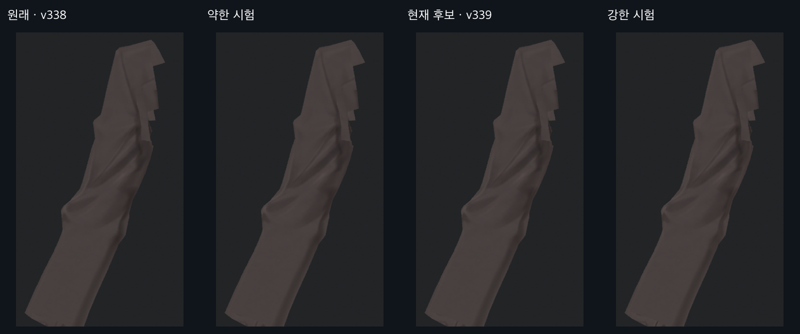
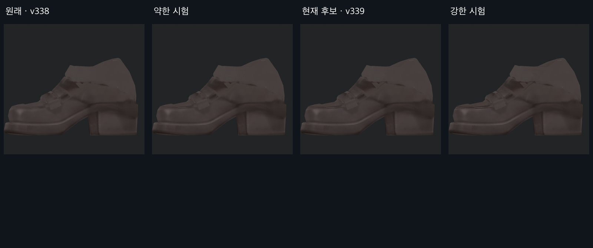
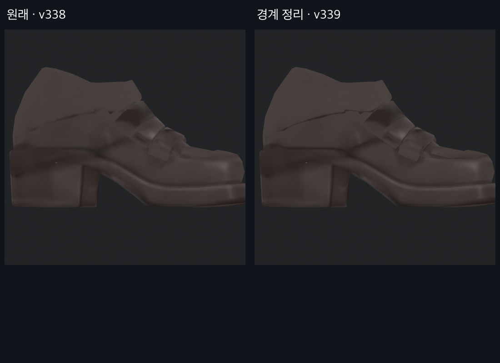

> **기록 시점 안내:** 아래는 해당 단계 당시의 보고서입니다. 후속 결정은 [최신 상태](../../STATUS.md)를 기준으로 읽어주세요. 모델·원본 텍스처·검증 원시 데이터는 이 문서 공유본에 포함하지 않습니다.

# v339 · 선명도 시험과 제외한 방법

2026-09-13. 로컬 전신 레퍼런스와 현재 모델을 직접 확인했다. 기존 채색의 선과 명암을 유지하도록 5개 UV 크롭을 편집하고, 실제 모델에 부분 적용해 비교했다. 검수 사진은 생성된 모델 사진이 아니라 Blender·Unity 렌더다.

| 시도 | 관찰 | 판정 |
|---|---|---|
| 셔츠 크롭의 경계 선명화 | 선명하지만 전체 적용 시 각진 종이 접힘 인상 | 생성 결과 전체 적용 제외; 원래 색과 혼합 |
| 약한·중간·강한 3강도 | 약한 안은 효과 미세, 강한 안은 작은 주름의 각짐 증가 | 중간 강도를 우선 검수 후보로 보존 |
| 소매의 선·단추·접힘 경계 | 뒤쪽 긴 선과 단추가 더 읽힘 | 패널 경계 여백 보존, 부분 적용 |
| 오른 신발 크롭 편집 | 원래 없던 둥근 장식 두 개 생성 | 해당 구역 마스크 제외; 원래 픽셀 유지 |
| 왼 신발의 긴 선 강화 | 기존 지그재그 선이 흠집처럼 두드러짐 | 아래 사진의 강화 구간 미채택; 갑피 위쪽만 남김 |
| UV 조각 전체 교체 | 바깥 조각과 이음선, 주변 색도 바뀔 위험 | 원래 패널 선택과 경계 여백으로 합성 범위 제한 |

## 신발에서 제외한 강화 구간

위 오른쪽은 **최종 전달본이 아닌 제외한 시험**이다. 옆면의 지그재그 선을 더 진하게 만드는 것은 자연스러움 개선이 아니었다. 이 구간은 원래 픽셀로 돌리고 다시 렌더했다.

최종 후보의 혼합 비율은 셔츠 38%, 소매 50%, 신발 55%를 기준으로 패널 경계에서 줄였다. 원래 색 대비 채널 변화는 셔츠 최대 14/255, 나머지 최대 10/255로 제한했다. 약한 시험은 이 값들의 0.6배, 강한 시험은 1.7배다. 이는 처리 강도이며 사용자 선호나 품질을 수치로 보장하지 않는다.

생성 결과 원본·적용 마스크·시험 아틀라스·실행 코드·검사 JSON은 작업 저장소에만 남겼다. [주 보고서](v339_CLARITY_REVIEW.md)의 현재 전달본과 미채택 파일을 구분한다.
