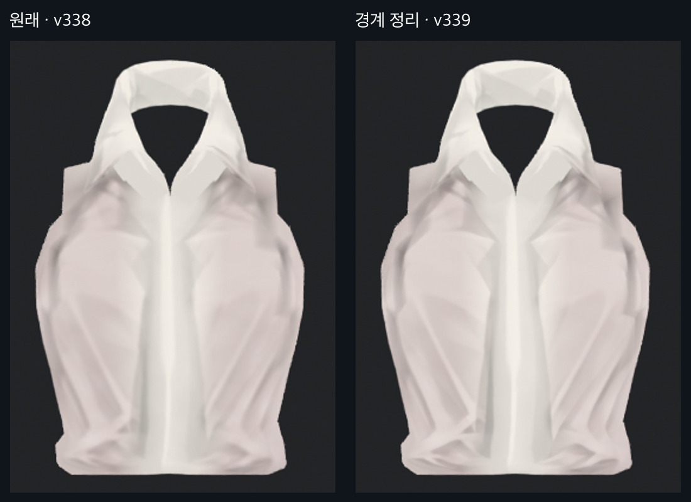
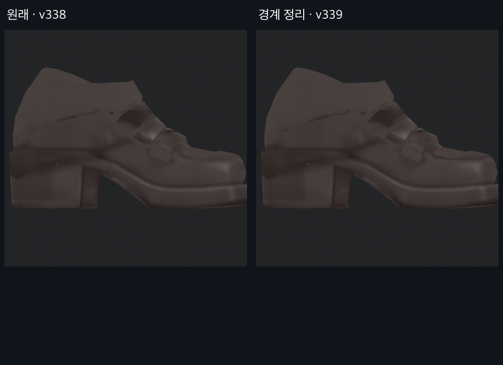
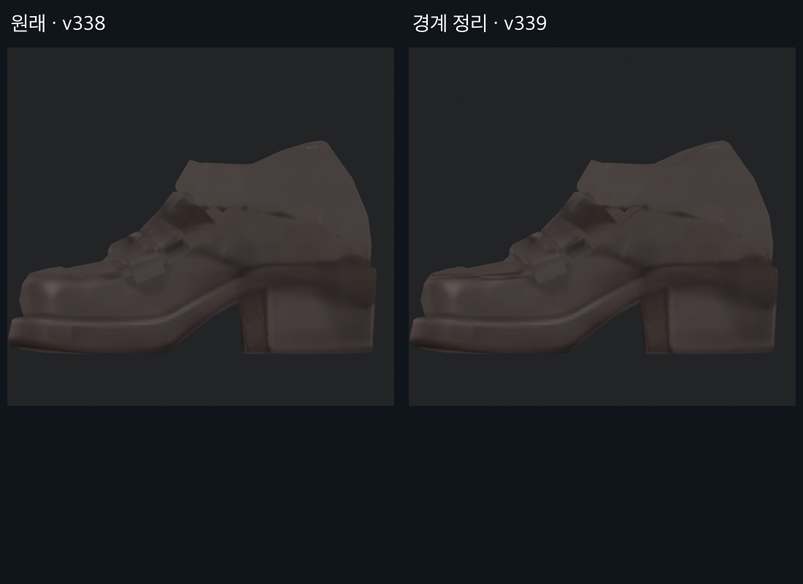
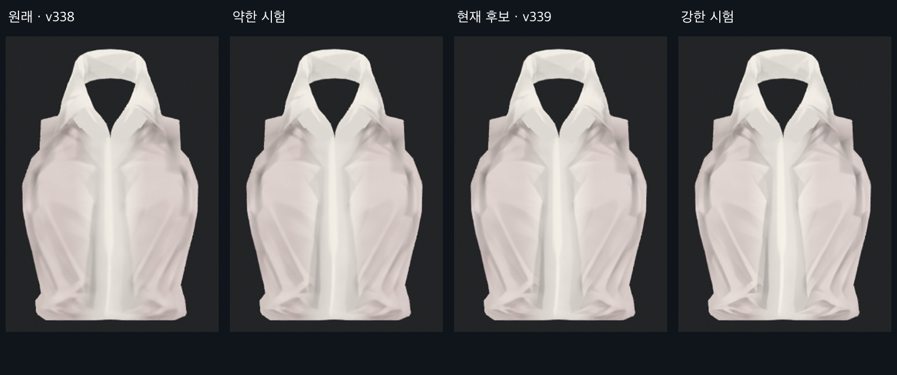

> **기록 시점 안내:** 아래는 해당 단계 당시의 보고서입니다. 후속 결정은 [최신 상태](../../STATUS.md)를 기준으로 읽어주세요. 모델·원본 텍스처·검증 원시 데이터는 이 문서 공유본에 포함하지 않습니다.

# v339 · 흐릿한 선과 명암 경계 정리

2026-09-13. 사용자 요청에 따라 v338 사본의 **셔츠 주름, 양 소매 뒤쪽 선·단추, 신발 갑피 일부**를 조금 더 또렷하게 다듬었다. 원래 UV와 모델 형상은 유지했다. 강도를 달리한 후보를 실제 모델에서 비교했으며, 아래 중간 강도를 우선 검수본으로 남겼다. 사용자 최종 채택 전이다.

## 셔츠

가슴 옆에서 허리로 내려가는 주름과 윗부분의 작은 접힘 경계를 정리했다. 새 채색을 전부 쓰면 종이처럼 각진 면으로 바뀌어서 부분 혼합과 색 변화 상한을 적용했다. 원래 넓은 명암은 남기면서 흐릿한 경계가 조금 더 읽히는 정도를 택했다. 모든 흐림을 제거하거나 주름을 새로 설계한 결과는 아니다.

## 소매

뒤쪽의 긴 봉제선과 단추 윤곽, 기존 접힘의 명암을 다듬었다. 앞쪽과 달리 뒤쪽에서 차이가 잘 보인다. 다만 단추의 실제 형상과 그림의 정렬을 충분히 확인하지 못했다. 이후 사용자가 어긋남을 지적했고, [v340에서 전용 UV와 단추 디테일을 수정했다](../v340_cuff_buttons/v340_BUTTON_REVIEW.md). 이 문서의 소매 사진은 수정 전 역사 기록이다. 검은 외곽선을 전신에 추가하지 않았다.

## 신발

갑피와 장식의 흐릿한 경계를 일부 정리했다. 신발 옆의 기존 지그재그 선은 강화하면 흠집처럼 보여 왼쪽 해당 구간을 제외했다. 새로 생긴 둥근 장식 두 개도 적용 마스크에서 제외했다. 신발 전체가 선명해졌다는 판정은 아니며, 끊긴 선의 구조와 나머지 흐린 명암은 잔여 문제다.

## 강도 선택

약한 안은 차이가 작고, 강한 안은 윗주름이 더 각져 보인다. 현재 후보는 그 사이로 정했다. 작업 중 실제 전후 사진을 공유하고 강도 피드백을 요청했다. 응답 전에는 사용자 승인으로 간주하지 않는다. [소매·신발 시험과 미채택 이유](v339_ATTEMPTS.md)도 함께 읽는다.

## 원인과 검사 범위

흐림은 원래 2D 텍스처 크롭과 조명 영향을 제거한 Blender 분리 사진에서도 보였다. 따라서 확인한 부위는 기본색에 이미 그려진 부드러운 경계를 우선 수정했다. 이는 모든 흐림의 원인을 규명했다는 의미는 아니다. 이번에는 밉맵·압축·해상도·셰이더를 별도 개선안으로 바꾸지 않았다.

| 확인 항목 | 결과 |
|---|---|
| Paint 변경 | 1,100,722픽셀, 4K 아틀라스의 6.5608%; 채널 최대 변화 14/255 |
| 적용 범위 | 소매 634,205 / 셔츠 266,288 / 신발 200,229픽셀 |
| 미수정 부위 | 바지·손·별도 장식 영역 변경 0, Head 텍스처 유지 |
| 이전 정리 보존 | v338 손 흔적 제거·신발 반점 마스크 안의 추가 변화 0 |
| UV 이음선 보호 | 선택한 5패널 안에서만 수정, 패널 경계 여백과 제외 구간 보존 |
| Blender | 기존 좌표·면·모든 UV·셰이프키·웨이트·본 계층/기본 변환 동일 |
| Unity | 동일 메시 자산·Head 재질·셰이더 사용, 동일 구도 13개 전후 렌더 |
| 가려진 표면 | 셔츠·소매·좌우 신발 4부위 × 6방향 전후 렌더와 직접 검수 |
| 원본·장면 | v338 전달 파일 Git 해시 동일, 사용자 Unity 장면 상태 동일 |

얼굴 구도에는 셔츠가, 손 구도에는 소매가 함께 들어가므로 해당 사진의 차이 픽셀을 얼굴·손 자체 변경으로 해석하지 않는다. 두 허벅지 구도는 전후 픽셀 변화 0이었다. 변경량 수치는 선명도 점수나 미적 합격 점수가 아니다.

## 전달 상태와 남은 부분

작업 저장소의 `bianca_v339_TEXTURE_CLARITY_REVIEW.blend`, `Bianca_v339_Paint.png`, `Bianca_v339_TextureClarityReview.unitypackage`가 현재 검수본이다. LOW/STRONG 및 SHOE_LINE_REJECTED 파일은 비교용이다. 이미지 편집은 내장 image_gen을 사용했고, 입력·원문 프롬프트는 같은 작업 폴더 `inputs/`, `v339_PROMPTS.json`에 보존했다.

코트 몸통·안쪽, 바지의 넓은 흐린 명암, 신발 나머지 선까지 일괄 수정한 것은 아니다. 머리·얼굴의 기존 디테일과 관절 중단 상태는 유지했다. 이번 선명도와 천의 부드러움 균형에 대한 피드백을 후속 부위에 반영한다.

[전후 사진 전체](v339_GALLERY.md) · [실험과 미채택 이유](v339_ATTEMPTS.md) · [이전 v338](../v338_local_texture/v338_TEXTURE_REVIEW.md)
