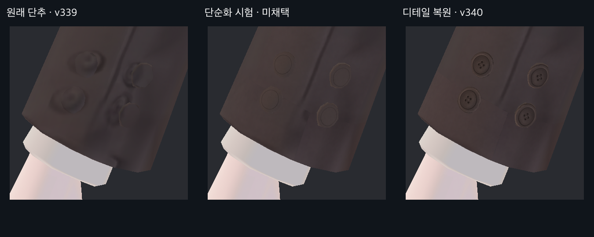
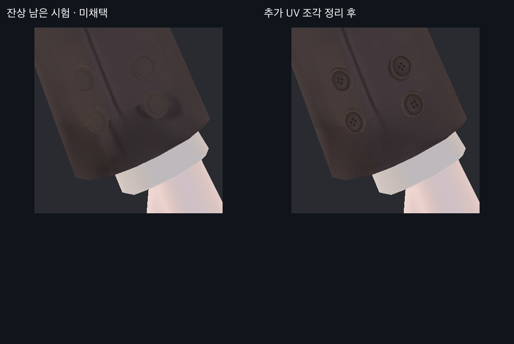

> **기록 시점 안내:** 아래는 해당 단계 당시의 보고서입니다. 후속 결정은 [최신 상태](../../STATUS.md)를 기준으로 읽어주세요. 모델·원본 텍스처·검증 원시 데이터는 이 문서 공유본에 포함하지 않습니다.

# v340 · 손목 소매 단추가 찌그러져 보이는 문제

사용자가 지적한 문제는 실제로 있었다. 원래 단추 형상은 거의 원형이지만, 천에 그려진 원과 실제 단추 표면의 그림이 어긋나 겹쳐 보였다. v339의 선명도 개선만으로는 해결되지 않았다. 이번에는 단추 전용 UV를 정렬하고 천의 잔상을 제거했다.

## 실제 모델의 전후

왼쪽은 v339, 가운데는 디테일이 부족해 제외한 단순화 시험, 오른쪽은 최종 검수 후보다. 모두 같은 Unity 카메라·원래 재질의 실제 모델 렌더다. 사진 자체를 재채색하지 않았다.

테두리의 높낮이, 안쪽 홈, 작은 봉제 구멍과 실의 표현을 남겼다. 원본의 작은 중앙 무늬는 흐려 구멍 수까지 정확히 판독할 수 없으므로, 현재 네 구멍 표현을 원본 픽셀의 완전 복원이라고 부르지는 않는다. 원래 무광 갈색 인상에 맞춘 국소 재작업이다.

## 원인과 수정 범위

- 원래 8개 단추는 자체 평면 기준 가로·세로 비율이 약 1.007~1.025였다. 큰 찌그러짐의 주원인은 형상보다 그림과 UV의 불일치였다.
- 기존 단추 UV는 약 28~38픽셀 폭이라 같은 자리에 정렬만 하면 테두리가 점선처럼 보였다. 4K 아틀라스의 비어 있는 곳에 단추별 128×128 타일을 두었다. 앞·뒤는 각 단추 자신의 타일을 공유한다.
- 양 소매의 큰 두 조각만 정리한 첫 시험에는 하단 잔상이 남았다. 화면의 UV를 추적해 추가 네 조각을 찾아 정리했다. 긴 봉제선은 보존했다.
- 원래 단추 위치·개수·메시·웨이트·본은 그대로다. Blender 798개 UV 루프, Unity 475개 UV 정점만 단추 범위에서 변경했다. 이전 UV 레이어도 남겼다.

위 비교의 오른쪽에는 잔상 정리뿐 아니라 최종 단추 디테일 복원도 포함된다. 형상에 의한 미세한 다각형 외곽과 소매의 원래 주름은 남아 있다.

## 검증과 전달

4K Paint에서 201,085픽셀을 변경했다. 이 중 70,013픽셀은 천 정리이고, 나머지는 새 단추 타일 8개다. 천 영역의 채널 변화는 최대 32/255다. 선택 밖 변경은 0이며 v338의 흔적 제거를 보존했다. 기존 좌표·면·키·웨이트·본·이전 UV는 재로드 비교에서 동일했다.

Unity 13구도 전후를 확인했고, 발·신발 좌우·손 구도의 픽셀은 동일했다. 실행 중 사용자 장면을 바꾸지 않았으며, 내보낸 패키지의 16개 의존 에셋이 현재 프로젝트와 일치했다. 손목 동작 전체나 VRChat 실기 시험을 새로 수행한 것은 아니다.

전달 파일은 `bianca_v340_CUFF_BUTTON_REVIEW.blend`, `Bianca_v340_Paint.png`, `Bianca_v340_CuffButtonReview.unitypackage`다. 원본 v339를 보존한 검수 후보이며 사용자 최종 채택 전이다. 후속 v341에는 이 결과가 포함된다.
