> **기록 시점 안내:** 아래는 해당 단계 당시의 보고서입니다. 후속 결정은 [최신 상태](../../STATUS.md)를 기준으로 읽어주세요. 모델·원본 텍스처·검증 원시 데이터는 이 문서 공유본에 포함하지 않습니다.

# v340 · 실제 모델 비교 사진

동일 카메라의 Unity 원래 재질 전후 비교다. 사진을 눌러 원본 크기로 확인할 수 있다.

## FULL_FRONT

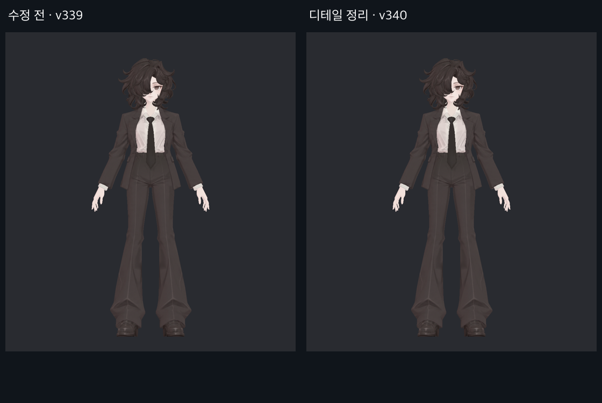

## FULL_SIDE

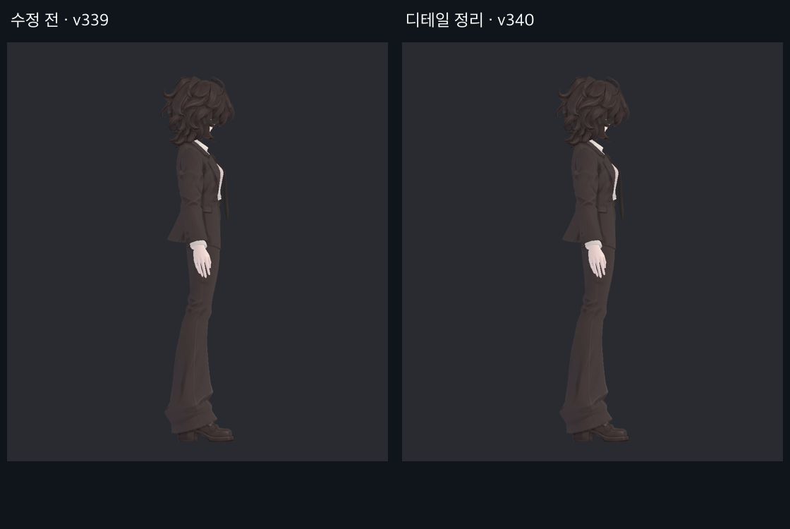

## FULL_BACK

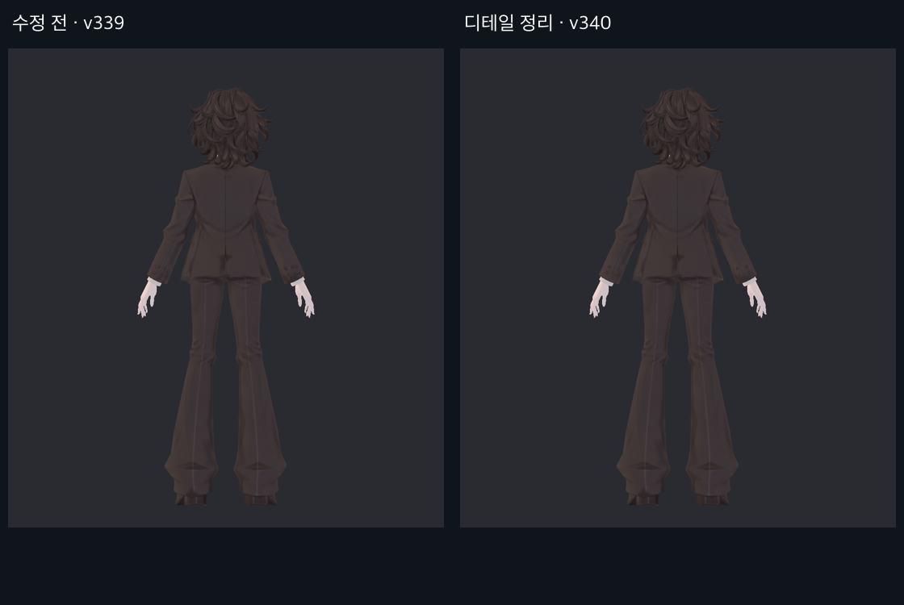

## FACE

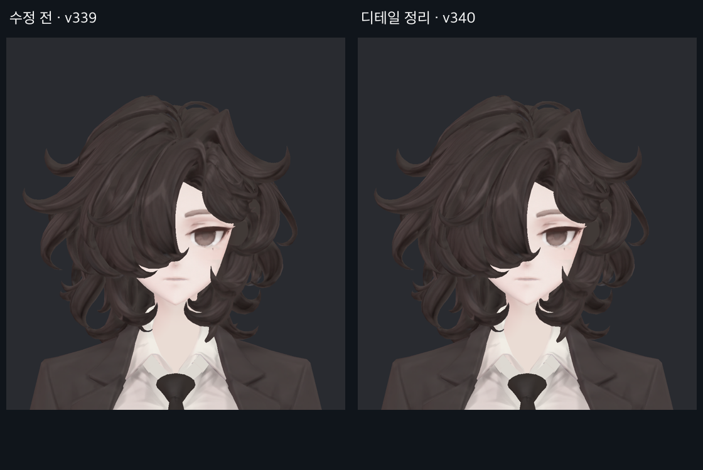

## TORSO

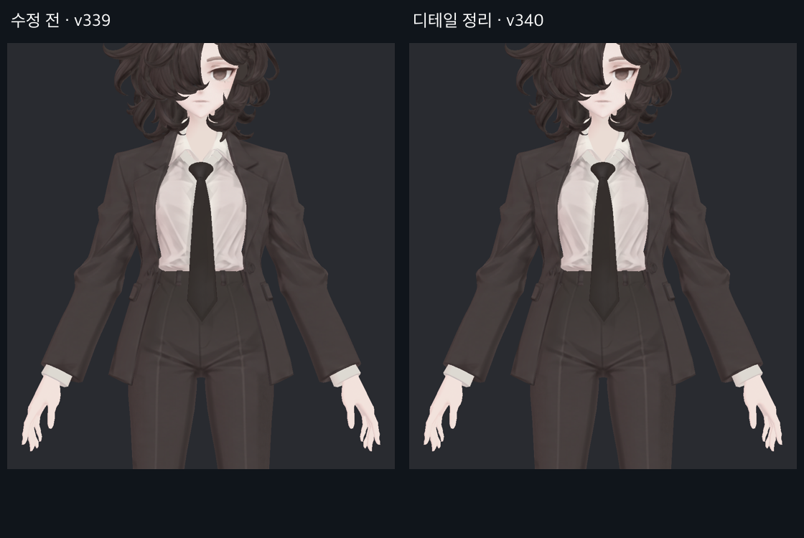

## FEET

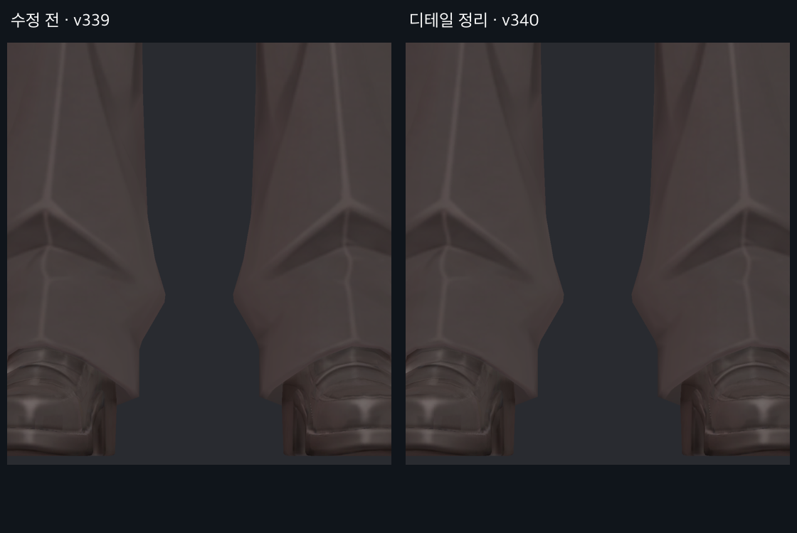

## HAND

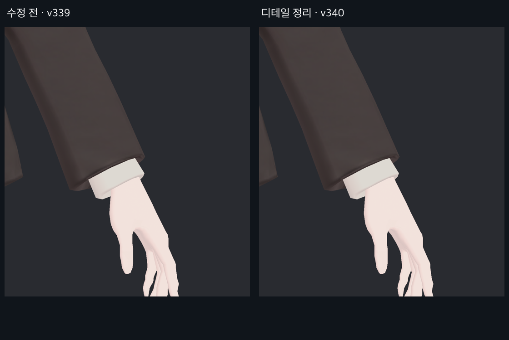

## SLEEVE_L

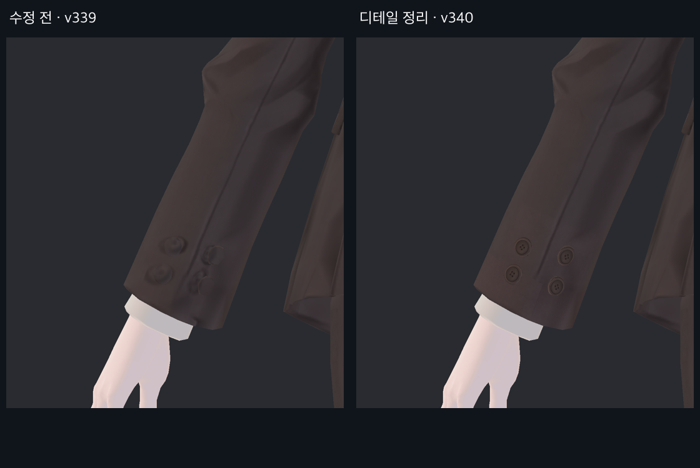

## SLEEVE_R

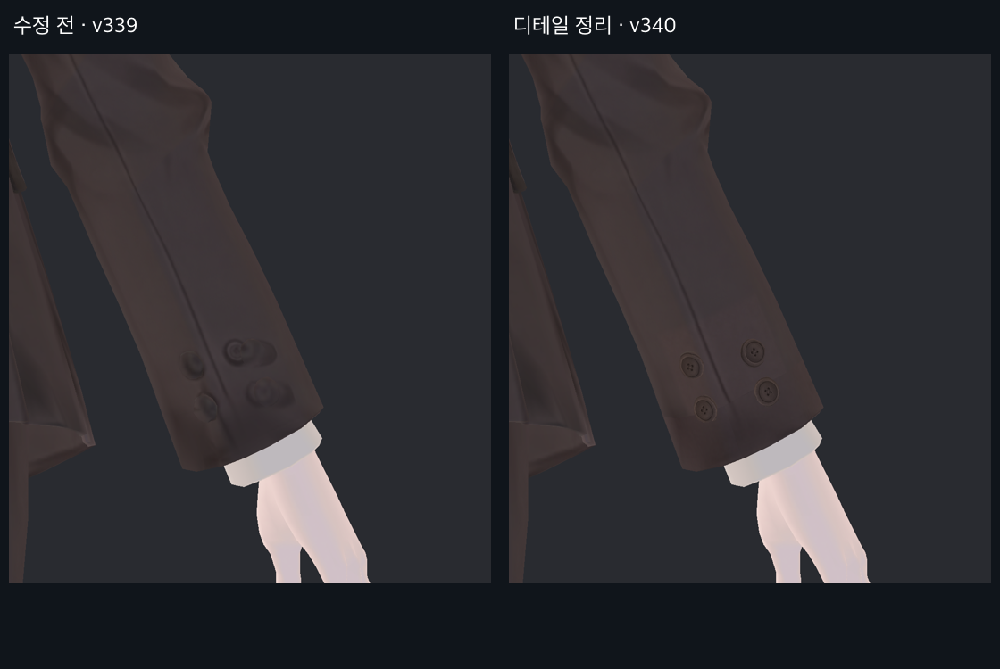

## THIGH_L

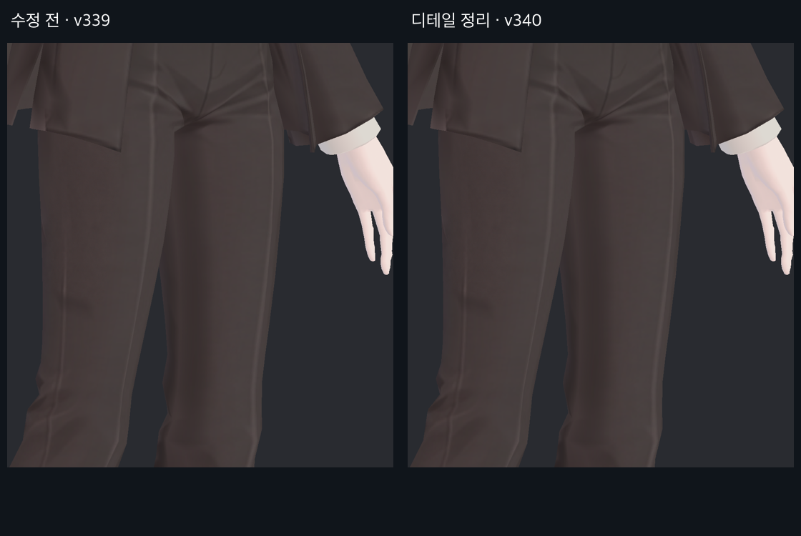

## THIGH_R

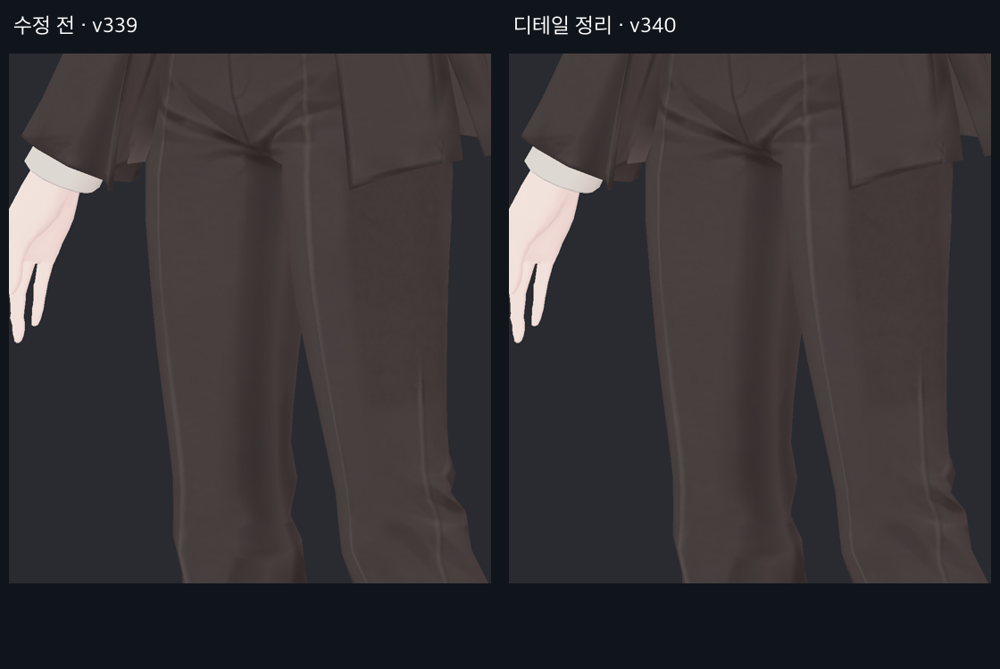

## SHOE_L_SIDE

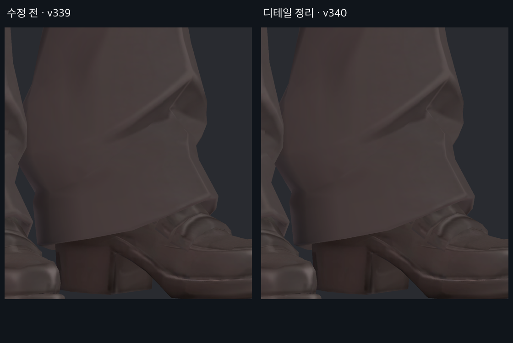

## SHOE_R_SIDE

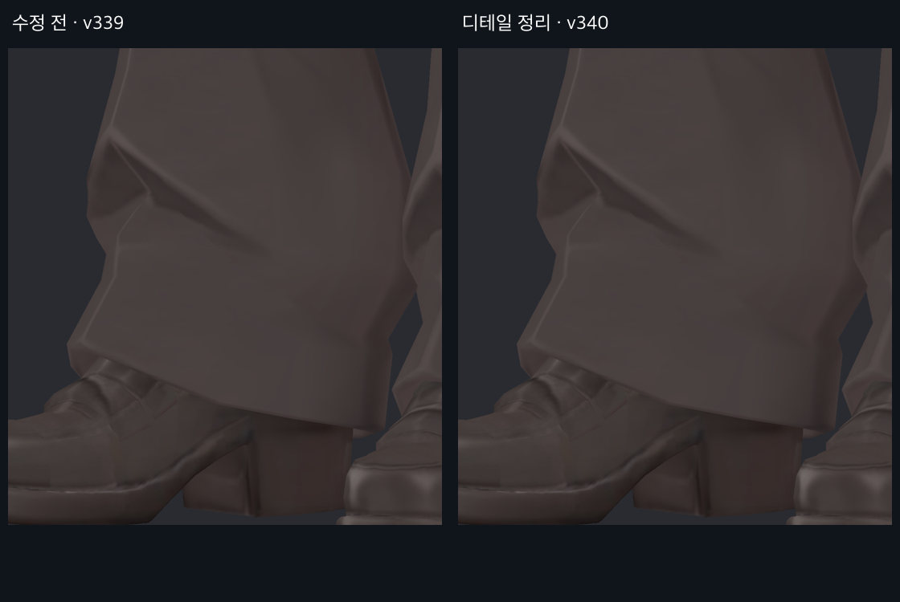
