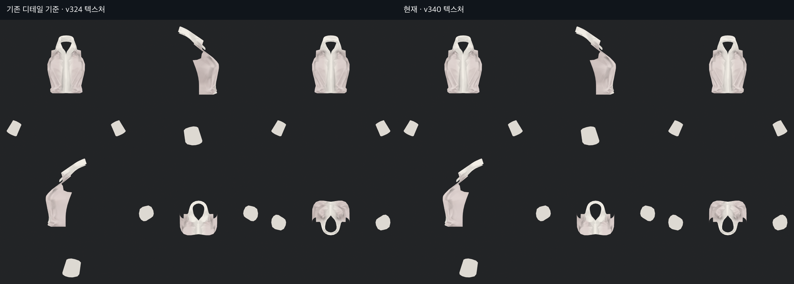
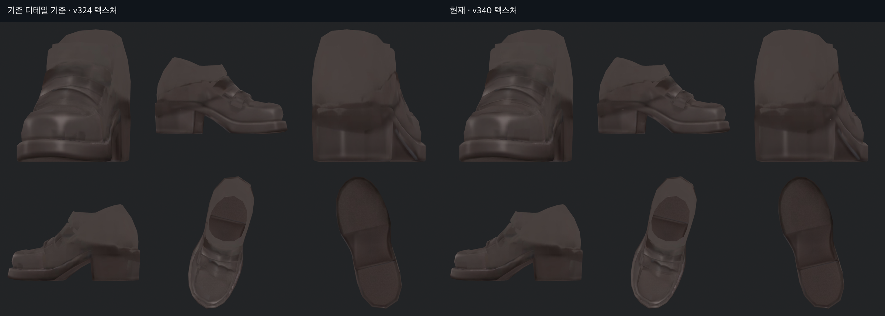
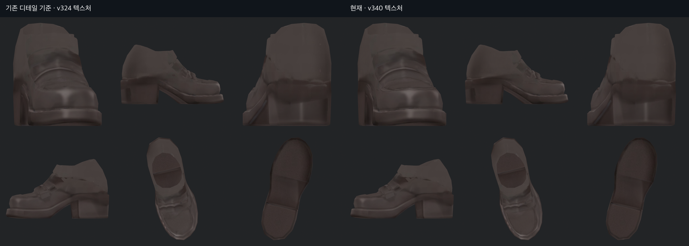

> **기록 시점 안내:** 아래는 해당 단계 당시의 보고서입니다. 후속 결정은 [최신 상태](../../STATUS.md)를 기준으로 읽어주세요. 모델·원본 텍스처·검증 원시 데이터는 이 문서 공유본에 포함하지 않습니다.

# v340 · 기존 텍스처 디테일과 비교

“선명하고 깔끔하지만 디테일은 챙겨 달라”는 요청에 따라 v324의 복원된 텍스처와 현재 v340을 같은 현재 형상에서 비교했다. 12개 표면 그룹을 앞·옆·뒤·반대쪽·위·아래로 분리해 확인했다. 아래는 조명에 의한 착시를 줄인 기본색 렌더이며, 단추의 최종 인상은 별도 Unity 보고에서 확인한다.

v339의 수정은 흐린 경계 일부에 제한했다. 신발의 갑피 장식·밑창 선, 셔츠의 접힘을 전체 평활화하지 않았다. 왼 신발은 v338의 작은 반점 제거가 함께 포함되므로 모든 차이를 선명도 변화로 해석하지 않는다.

얼굴·머리는 이 단계에서 텍스처가 바뀌지 않았다. 손은 이전 UV 전사의 미세한 차이를 제외하고 원래 깨끗한 명암을 보존했다. 바지와 코트의 넓은 명암도 일괄 다시 칠하지 않았다. 숨은 면을 렌더했다는 사실만으로 모든 분류가 정확하다고 판단한 것은 잘못이었다. 이후 사용자 지적으로 넥타이 띠가 셔츠로 잘못 분류된 것을 확인했고, [v341에서 분류와 색을 수정했다](../v341_full_texture_detail/v341_TIE_REVIEW.md).

의류 외 부위의 추가 국소 정리는 [v341 보고](../v341_full_texture_detail/v341_TEXTURE_REVIEW.md)를 따른다.
