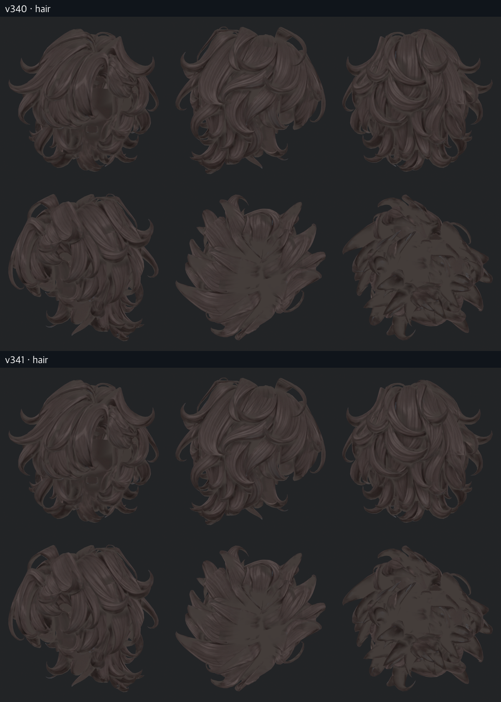
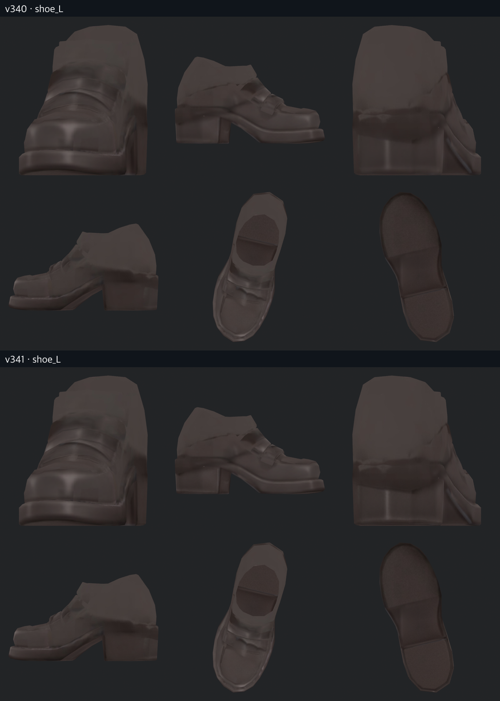
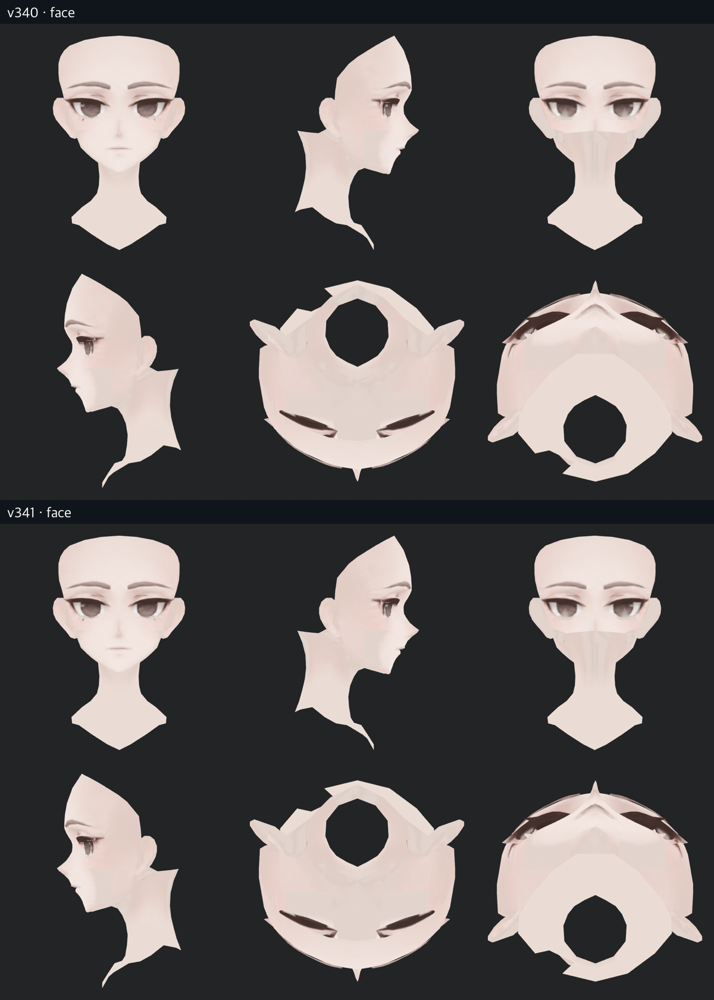

> **기록 시점 안내:** 아래는 해당 단계 당시의 보고서입니다. 후속 결정은 [최신 상태](../../STATUS.md)를 기준으로 읽어주세요. 모델·원본 텍스처·검증 원시 데이터는 이 문서 공유본에 포함하지 않습니다.

# v341 · 의류 외 텍스처와 관련 UV 정리

의류 외에도 머리·얼굴·눈·입·손·신발·작은 장식을 확인했다. 전체를 다시 칠해 디테일을 낮추지 않고, 흐림이 남는 머릿결 네 조각·입술 경계·신발 밑창 두 조각·작은 장식의 기존 홈만 국소 정리했다. 이어 사용자 지적에 따라 **카라 안쪽 넥타이 띠의 잘못된 색과 부위 분류**도 고쳤다.

최신 후보는 v341이며 v339의 선명도 조절과 v340의 단추 디테일 복원을 포함한다. 형상·관절·본·웨이트는 그대로이고, 관절 작업은 계속 중단 상태다.

## 가장 뚜렷한 수정: 넥타이 안쪽

밝은 두 띠는 원래 넥타이 부품인데 예전 작업에서 셔츠로 분류돼 있었다. 같은 오류가 되풀이되지 않도록 현재 부위 목록과 패널 목록을 함께 고쳤다. [원인·사선 사진·수정 범위](v341_TIE_REVIEW.md)에 상세 기록했다.

## 디테일을 남긴 국소 정리

| 부위 | 검토 및 적용 | 보존한 것 |
|---|---|---|
| 머리 | 큰 네 조각의 흐린 머릿결 경계 국소 조절 | 원래 가닥·큰 명암·실루엣, 나머지 머릿결 |
| 얼굴·입 | 기존 입술 경계 한 조각만 약하게 조절 | 얼굴 인상·피부 그라데이션·눈썹 |
| 눈 | 후보를 만들어 비교했으나 개선이 없어 제외 | 현재 눈 텍스처 그대로 |
| 양손·손가락 | 손바닥·손등·측면·가려진 면 확인 | 깨끗한 피부 명암, 새로운 주름·손톱 디자인 추가 없음 |
| 양 신발 | 밑창 경계 두 조각 조절 | 갑피 장식·봉제선·기존 밑창 형상과 선 |
| 작은 장식 | 기존 세로 홈의 일부만 조절 | 새로 생성된 사선은 제외, v340 단추 유지 |
| 코트·바지·셔츠 | 안쪽·뒤쪽 포함 재검수 | 넥타이 띠를 제외한 기존 채색 유지 |

부위 분리 사진은 실제 Blender 기본색 렌더다. 렌더용으로 다른 부위를 숨겼으며 전달 모델을 잘라내거나 새 메시로 교체하지 않았다. 정면·측면·뒤·반대쪽·위·아래의 여섯 방향이다. 넥타이 띠 재분류 후 셔츠와 장식은 같은 새 분류로 전후를 다시 렌더했다. 다른 10개 그룹의 v340 기준 사진은 이전 단계의 동일 설정 최종 렌더를 재사용했다.

## UV도 함께 검토

Head는 흩어진 1,855개 조각을 얼굴과 머리 앞/뒤/좌/우 영역으로 모았다. 4K 해상도와 조각 크기·방향·내부 픽셀을 그대로 유지했다. **조각을 합치거나 수를 줄인 작업은 아니다.** Paint의 배치는 밀도 보존 때문에 유지했다. [UV 그림과 판단 근거](v341_UV_GUIDE.md)에서 확인할 수 있다.

## 검증 범위

Head 원래 배치 기준 63,349픽셀, 최대 채널 차 6/255의 국소 수정이다. Paint는 307,842픽셀을 변경했다. 그중 252,510픽셀은 신발·장식의 미세 조절(최대 7), 55,332픽셀은 잘못 흰색이 된 넥타이 띠와 여백 수정(최대 188)이다. 두 종류를 같은 선명도 강도로 해석하지 않는다. 선택 영역 밖 변경은 0이다.

v338 흔적 제거, v340 소매·단추, 나머지 코트·셔츠·바지·손의 텍스처는 보존됐다. Blender 재로드에서 기존 좌표·면·키·웨이트·이전 UV·129본을 비교했고, Unity에서도 기하·노멀·삼각형·스킨·모든 표정 프레임이 같았다. 새 Head UV의 정수 이동과 조각 여백 복사를 확인했다.

Unity 원래 재질 13구도 전후와 넥타이 근접 3구도, Blender 12부위×6방향을 직접 확인했다. 밉맵·경계 샘플링 때문에 UV 이동 후 화면 픽셀 전체가 동일하지는 않다. 넥타이 여백 색 변경 뒤 신발 외곽의 극소수 밝은 픽셀에도 변화가 있어, 다른 부위의 화면 차이를 전부 채색 개선이라고 주장하지 않는다. 모델 형상 변화와는 구분했다.

내보낸 Unitypackage의 16개 에셋이 현재 프로젝트와 바이트 단위로 같았고, v338 전달 원본 3개는 Git 기준과 같았다. 사용자 Unity 장면은 경로·dirty 상태·루트 오브젝트가 유지됐다. VRChat 업로드·실기 및 새 동작 검수는 이번 범위가 아니다.

## 전달 및 남은 판단

전달은 `bianca_v341_FULL_TEXTURE_REVIEW.blend`, `Bianca_v341_Head.png`, `Bianca_v341_Paint.png`, `Bianca_v341_FullTextureReview.unitypackage`다. `V341_UV`가 현재 작업 레이어이며, Head만 배치가 바뀌었다. 원래 v338~v340 파일은 보존한다.

현재는 사용자 피드백을 받을 검수 후보다. 기존 다각형 외곽, 넓은 명암의 미세한 얼룩, 작은 조각의 수 자체까지 모두 해결했다고 보지 않는다. 원래 디테일을 지키기 위해 적용하지 않은 후보는 [시도 기록](v341_ATTEMPTS.md)에 남겼다. [전체 사진](v341_GALLERY.md)에서 수정하지 않은 부위도 확인할 수 있다.
