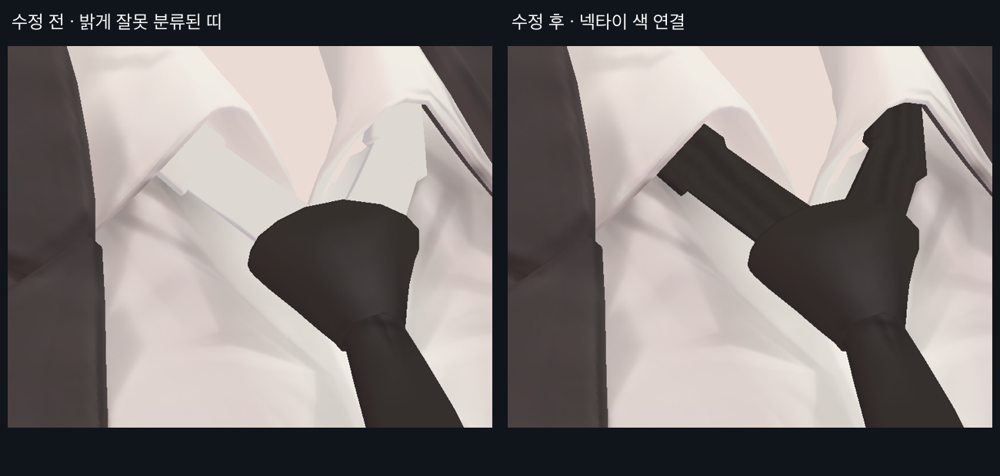
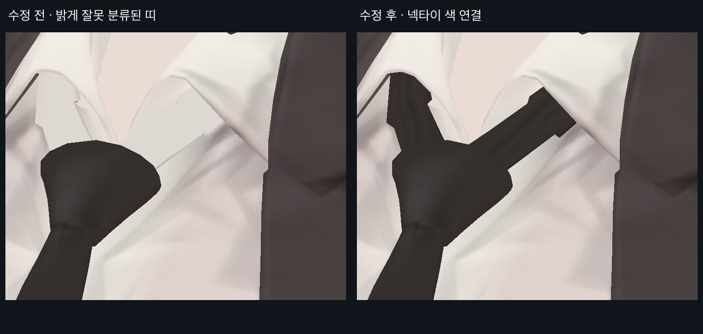

> **기록 시점 안내:** 아래는 해당 단계 당시의 보고서입니다. 후속 결정은 [최신 상태](../../STATUS.md)를 기준으로 읽어주세요. 모델·원본 텍스처·검증 원시 데이터는 이 문서 공유본에 포함하지 않습니다.

# v341 · 카라 안쪽 넥타이가 밝게 끊겨 보이는 문제

사용자 지적 후 확대 확인에서 실제 오류를 확인했다. 카라 아래에서 매듭으로 이어지는 띠 두 개가 셔츠처럼 밝았다. 레퍼런스의 해당 부분은 어두운 넥타이 색이다.

## 근본 원인

화면에서 UV 좌표를 읽고 원래 면까지 추적했다. 해당 면은 원래 넥타이 띠인 component 39/40인데, v323의 부위 분류에서는 shirt로 들어갔다. v324의 디테일 복원도 몸통 이외의 shirt 부품을 제외했기 때문에 밝은 잘못된 색이 후속 버전까지 유지됐다. 이번 Head UV 이동 때문에 생긴 문제는 아니다.

이 두 부위는 기존 60면, 120삼각형, Paint 패널 C417~C443의 27조각이다. 멀리 흩어진 배치가 찾기를 어렵게 했지만, 색 오류의 직접 원인은 분류였다. 최신 `SURFACE_INVENTORY.json`과 `PAINT_PANEL_INDEX.json`을 details / tie_strap_L·R로 고쳐 후속 처리의 기준도 수정했다.

## 수정과 확인

원래 v322 색을 복원한 임시 렌더에는 밝은 얼룩과 과한 그림자가 섞여 있었다. 그대로 되돌리는 방식은 제외했다. 기존 매듭의 어두운 무광 갈색을 기준으로 내장 image_gen에서 천 소스를 만들고 기존 띠 면에만 투영했다. 첫 후보는 촘촘한 무늬가 지저분해 보여 제외하고, 기존 매듭과 어울리는 부드러운 길이 방향 명암으로 다시 조절했다.

이미지 이름의 BACK_LEFT/RIGHT는 카메라 코드의 기존 키 이름이며, 실제 사진은 앞쪽 좌우 사선이다. 카라·기존 매듭·넥타이 아래쪽의 채색은 유지했다. 기존 띠 형상의 작은 계단형 외곽은 그대로이며, 이 사진을 메시 수정 결과라고 부르지 않는다.

55,332픽셀은 두 띠와 필요한 여백에 한정해 수정했다. 넥타이 수정으로 추가 UV 변경이나 형상 변경은 없다. 셔츠와 장식의 분리 검수도 새 분류로 다시 렌더했다. 색 오류 수정은 확인했으며, 띠의 디테일 강도와 전체 인상은 사용자 피드백 전이다.
