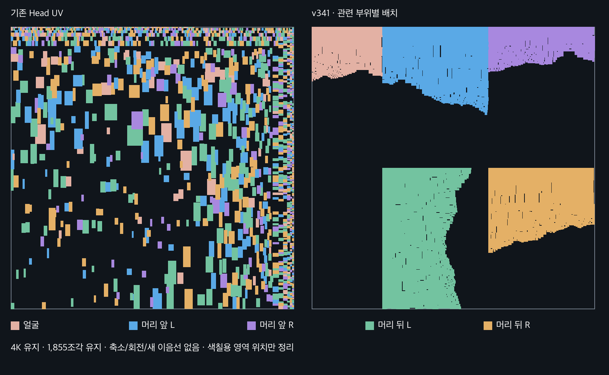

> **기록 시점 안내:** 아래는 해당 단계 당시의 보고서입니다. 후속 결정은 [최신 상태](../../STATUS.md)를 기준으로 읽어주세요. 모델·원본 텍스처·검증 원시 데이터는 이 문서 공유본에 포함하지 않습니다.

# v341 · 관련 UV 조각의 배치 정리

관련 조각이 멀리 있다는 것만으로 화면에 오류가 생기지는 않는다. 하지만 같은 부위를 찾고 함께 칠하기 어려워 누락 위험이 커진다. 이번에는 Head의 흩어진 조각을 얼굴·머리 앞 좌우·머리 뒤 좌우로 묶었다.

색 사각형은 **8픽셀 여백을 포함한 조각의 경계 상자**다. 실제 UV 면 모양이나 텍스처 점유율을 뜻하지 않는다. 같은 색끼리 붙어 보여도 서로 다른 조각이다.

| 항목 | 결과 |
|---|---|
| Head 해상도 | 4096×4096 유지 |
| 조각 수 | 1,855개 유지: 얼굴 288, 머리 1,567 |
| 변경 | 정수 픽셀 단위 위치 이동만 |
| 축소·회전·새 이음선 | 없음 |
| 원래 조각 내부 픽셀과 여백 | 원본에서 그대로 복사, 재보간 없음 |
| 기존 UV 레이어 | 모두 보존, 새 작업 레이어 V341_UV |
| 옷·손·신발·v340 단추 UV | 좌표 그대로 |

Blender Head 40,464개 루프, Unity 21,018개 UV 정점이 이동했다. 원래 메시 형상·노멀·인덱스·웨이트·모든 표정 프레임은 유지했다. 복사한 픽셀은 동일하지만 GPU의 밉맵과 경계 샘플링 때문에 UV 이동만 한 Unity 사진이 완전히 같은 픽셀은 아니다. 실제 정면·측면·뒤쪽·얼굴에서 새 색 누출이나 머릿결 손실이 보이지 않는지 확인했다.

Paint는 기존 조각의 경계 상자와 여백을 합하면 아틀라스 면적의 약 94.5%다. 같은 밀도로 여섯 부위를 큰 구역에 재배치할 여유가 적으므로 이번에는 유지했다. 이는 면적 추정에 따른 선택이며, 모든 배치 알고리즘이 실패했다고 주장하는 것은 아니다. 기존 v337의 541개 패널과 v340의 단추 타일을 사용한다.

넥타이 띠는 27개 조각에 나뉘어 있었다. 이번 색 오류의 직접 원인은 거리가 아니라 **셔츠로 잘못된 부위 분류**였다. 현재 `SURFACE_INVENTORY.json`과 `PAINT_PANEL_INDEX.json`에서는 두 띠를 details의 tie_strap_L/R로 고쳤다. 후속 작업은 이 최신 목록을 사용한다. 이전 v337 목록의 C417~C443을 셔츠라고 믿고 흰색으로 다시 칠하지 않는다.

작업 파일은 `Bianca_v341_Head.png`, `Bianca_v341_Paint.png`, `bianca_v341_FULL_TEXTURE_REVIEW.blend`다. Head 조각의 이전/현재 위치는 `HEAD_REPACK.json`, 현재 Paint 분류는 `PAINT_PANEL_INDEX.json`에 보존했다. 조각 수·왜곡까지 줄이는 새 펼치기는 이번에 하지 않았다.
