> **기록 시점 안내:** 아래는 해당 단계 당시의 보고서입니다. 후속 결정은 [최신 상태](../../STATUS.md)를 기준으로 읽어주세요. 모델·원본 텍스처·검증 원시 데이터는 이 문서 공유본에 포함하지 않습니다.

# v342 · 남아 있는 텍스처 번짐·아티팩트 목록

**v341에는 정리할 부분이 여전히 남아 있다. 수정 후보 14항목과 판정 보류 3항목으로 정리했다.** 같은 증상의 좌우 반복은 한 항목으로 묶었다. 14개는 고장난 픽셀의 개수가 아니라 부위별 작업 단위이며, 미적 품질 판단을 포함한다.

이번에는 조사와 목록 작성만 진행했다. 모델·UV·텍스처를 새로 수정하지 않았으며 현재 검수 후보는 v341이다. 앞선 디테일 보존·전사 검증은 잔여 얼룩까지 합격했다는 뜻이 아니었다.

[검사 범위와 제외한 현상](v342_COVERAGE.md) · [전체 검사 사진](v342_GALLERY.md) · [진단 방법과 한계](v342_DIAGNOSTIC_NOTES.md)

## 우선 확인할 항목

가장 먼저 볼 부분은 **T01 카라 밑, T06 단추 주변 천, T07 옆 허벅지, T09–T10 신발, T12 앞머리**다. 전체 일괄 선명화보다 각 항목의 잘못된 명암과 경계를 따로 정리해야 한다.

| ID | 위치 / 증상 | 우선순위 | 판정 |
|---|---|---|---|
| [T01](#t01) | 셔츠 · 카라 바로 아래 회색 번짐 | 높음 | 수정 후보 |
| [T02](#t02) | 셔츠 · 허리 끝의 뭉친 명암 | 중 | 수정 후보 |
| [T03](#t03) | 코트 · 목둘레와 라펠 안쪽 얼룩 | 중 | 수정 후보 |
| [T04](#t04) | 코트 · 주머니와 허리 단추의 흐린 선 | 높음 | 수정 후보 |
| [T05](#t05) | 소매 · 겨드랑이 아래의 어두운 뭉침 | 중 | 수정 후보 |
| [T06](#t06) | 소매 · 단추 주변의 사각 색 경계 | 높음 | 수정 후보 |
| [T07](#t07) | 바지 · 옆 허벅지의 잔여 얼룩 | 높음 | 수정 후보 |
| [T08](#t08) | 바지 · 중심선의 폭과 선명도 불균일 | 낮음 | 수정 후보 |
| [T09](#t09) | 신발 · 발등 장식과 앞코 명암 번짐 | 높음 | 수정 후보 |
| [T10](#t10) | 신발 · 옆선의 끊김과 뒤꿈치 얼룩 | 높음 | 수정 후보 |
| [T11](#t11) | 허리 장식 · 흐린 반점과 눌린 경계 | 중 | 수정 후보 |
| [T12](#t12) | 머리 · 앞머리 가닥 안의 뭉친 밝은 띠 | 높음 | 수정 후보 |
| [T13](#t13) | 머리 · 안쪽의 얼룩과 갑작스런 단색 전환 | 중 | 수정 후보 |
| [T14](#t14) | 얼굴 · 옆볼과 턱 아래 색 블록 | 중 | 수정 후보 |
| [R01](#r01) | 입술 · 주변 경계가 아직 부드러움 | 낮음 | 판정 보류 |
| [R02](#r02) | 넥타이 · 매듭 아래의 흐린 어두운 점 | 낮음 | 판정 보류 |
| [R03](#r03) | 소매 단추 · 외곽의 거친 테두리 | 낮음 | 판정 보류 |

## 사진을 읽는 방법

빨간 사각형이 문제를 지적하는 위치다. 오른쪽은 같은 부분을 확대했다. 사진은 실제 v341 모델이며 보정·생성 그림이 아니다. 확대는 근접 확인용으로, 전신 거리에서의 심각도를 그대로 뜻하지 않는다. Unity 사진은 이전 v341 최종 촬영분을 이번에 다시 열어 검수했고, 부위별 기본색/중성 재질 사진은 이번에 새로 촬영했다. 부위 분리 사진의 열린 끝과 잘린 면은 진단용 분리 경계이며 결함 목록에서 제외했다.

## T01 · 셔츠 · 카라 바로 아래 회색 번짐

**위치:** 양쪽 카라 밑, 넥타이 띠 뒤와 윗가슴.

**보이는 문제:** 회색 명암이 작은 삼각형과 연기 같은 띠로 뭉쳐 카라 경계를 흐린다.

**판정:** 조명 없는 기본색에서도 보인다. 카라 형상은 별개이며 색 경계 정리가 필요하다.

**수정할 때 지킬 점:** 카라 접힘과 레퍼런스의 큰 셔츠 주름은 살리고, 회색 번짐만 분리한다.

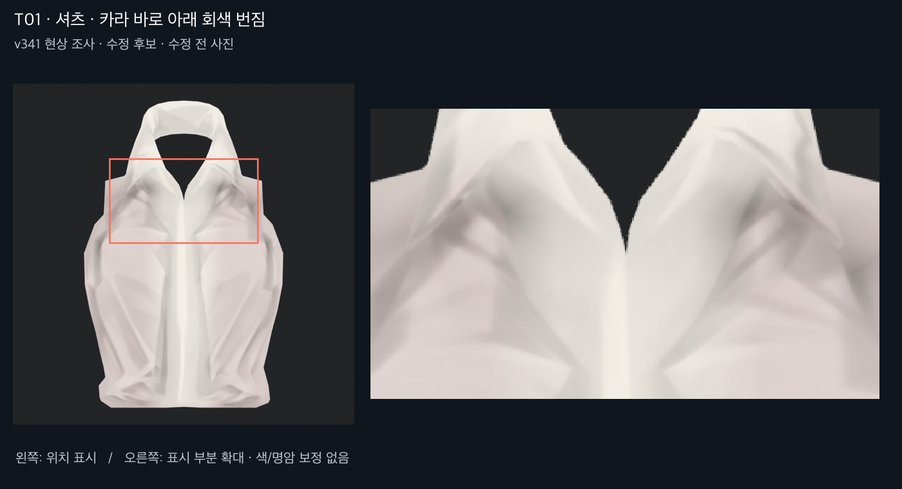

## T02 · 셔츠 · 허리 끝의 뭉친 명암

**위치:** 셔츠 아랫단 양쪽과 옆구리.

**보이는 문제:** 넓은 주름 끝이 작은 밝고 어두운 조각으로 모이며 경계가 겹쳐 보인다.

**판정:** 기본색에 이미 포함된 모양이다. 큰 주름의 존재 자체는 결함으로 보지 않는다.

**수정할 때 지킬 점:** 셔츠의 주름 수와 큰 방향, 중앙 여밈선은 유지한다.

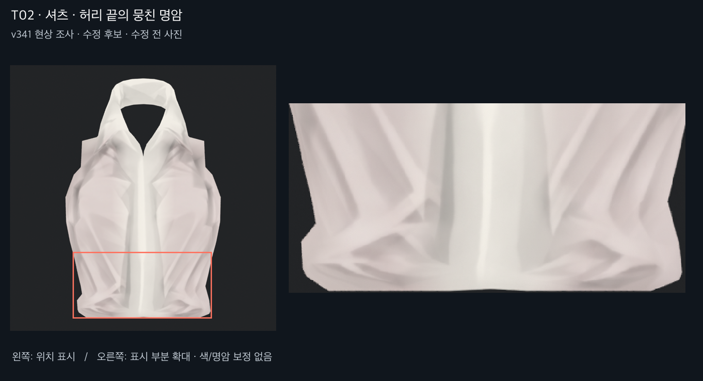

## T03 · 코트 · 목둘레와 라펠 안쪽 얼룩

**위치:** 뒷목 안쪽으로 보이는 면, 라펠 안쪽 상단.

**보이는 문제:** 넓은 갈색 면에 흐린 가로띠와 V자 명암이 겹쳐 붙어 있다.

**판정:** 기본색/중성 재질을 비교하면 일부 음영이 채색으로 고정돼 있다. 양면 표면을 따로 만든 안감으로 오인하면 안 된다.

**수정할 때 지킬 점:** 라펠 테두리, 봉제선과 목 접힘을 유지한다.

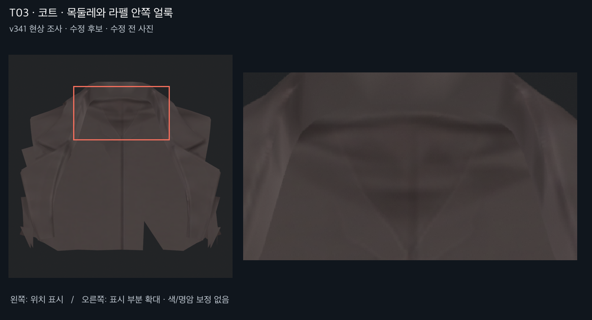

## T04 · 코트 · 주머니와 허리 단추의 흐린 선

**위치:** 양쪽 옆구리 주머니 덮개, 그 위 허리 단추.

**보이는 문제:** 주머니 직사각형 외곽과 단추 원이 두꺼운 흐린 선으로 녹아 있다.

**판정:** 실제 형상과 별개인 텍스처 디테일이다. 소매 단추를 복원한 작업 범위 밖의 장식도 정리가 남았다.

**수정할 때 지킬 점:** 주머니와 단추를 삭제하거나 단색으로 덮지 않는다.

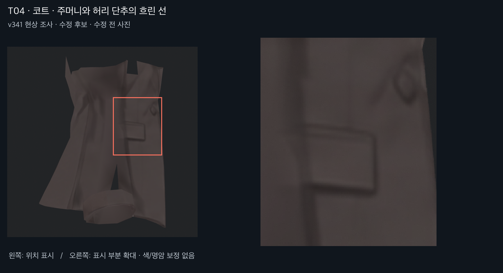

## T05 · 소매 · 겨드랑이 아래의 어두운 뭉침

**위치:** 양 소매 안쪽 윗팔, 겨드랑이 아래.

**보이는 문제:** 접힘 사이에 흐린 세로 얼룩과 짧은 검은 띠가 겹친다. 오른쪽이 더 눈에 띈다.

**판정:** 큰 굴곡은 중성 재질에도 있으나 어두운 얼룩은 기본색에도 남는다. 주름 형상과 채색을 함께 없애면 안 된다.

**수정할 때 지킬 점:** 기존 소매 주름과 팔꿈치 형상은 유지한다.

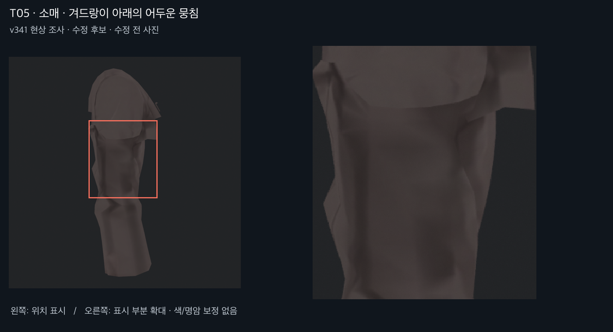

## T06 · 소매 · 단추 주변의 사각 색 경계

**위치:** 양 손목 단추 사이와 아래 천.

**보이는 문제:** 단추 주변 천에 각진 색 블록 경계가 보인다. 왼쪽 사진에서 쉽게 확인된다.

**판정:** 현재 Unity 사진과 기본색에서 경계를 확인했다. UV 패널 연결과 이전 잔상 제거 마스크 경계 중 어디서 생겼는지 추가 추적이 필요하다.

**수정할 때 지킬 점:** 복원한 단추의 구멍·실·테두리를 보호하고 천만 분리한다.

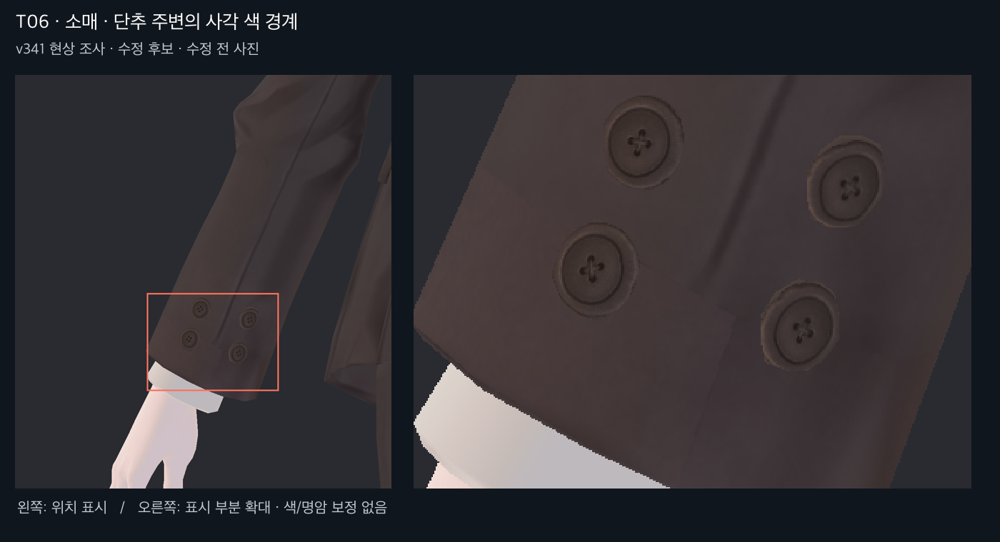

## T07 · 바지 · 옆 허벅지의 잔여 얼룩

**위치:** 양 바깥 허벅지, 코트 자락 아래에서 무릎 위까지.

**보이는 문제:** 손 모양 흔적은 약해졌지만 세로 방향의 흐린 회갈색 얼룩이 아직 남아 있다.

**판정:** 좌우 사선 사진과 부위 기본색에서 재현된다. 앞의 선명한 다림질선과 분리해야 한다.

**수정할 때 지킬 점:** 바지 중심선·실루엣·원래 큰 음영은 보존한다.

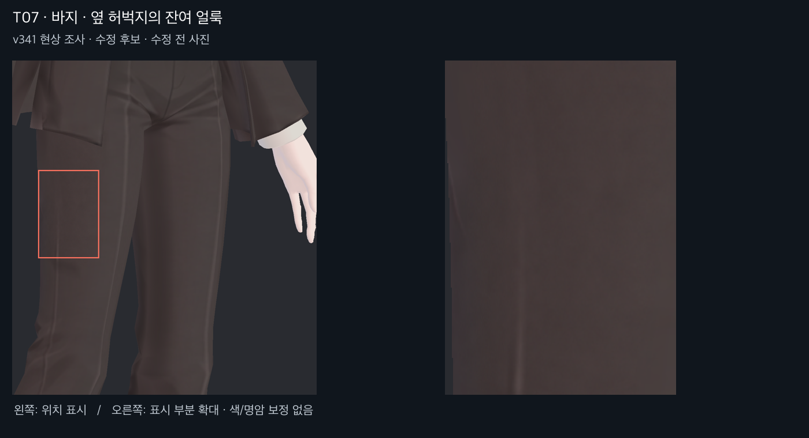

## T08 · 바지 · 중심선의 폭과 선명도 불균일

**위치:** 양 무릎 위아래의 밝은 세로선, 발목까지 이어지는 선.

**보이는 문제:** 세로선이 중간에 두꺼워지거나 옅어져 접힘 주변에서 흐릿하게 보인다.

**판정:** 선 자체는 의도된 디자인이다. 텍스처의 선 폭/농도 정리 후보이며 무릎의 각짐을 이 항목에 포함하지 않는다.

**수정할 때 지킬 점:** 다림질선과 바지 주름을 없애지 않는다.

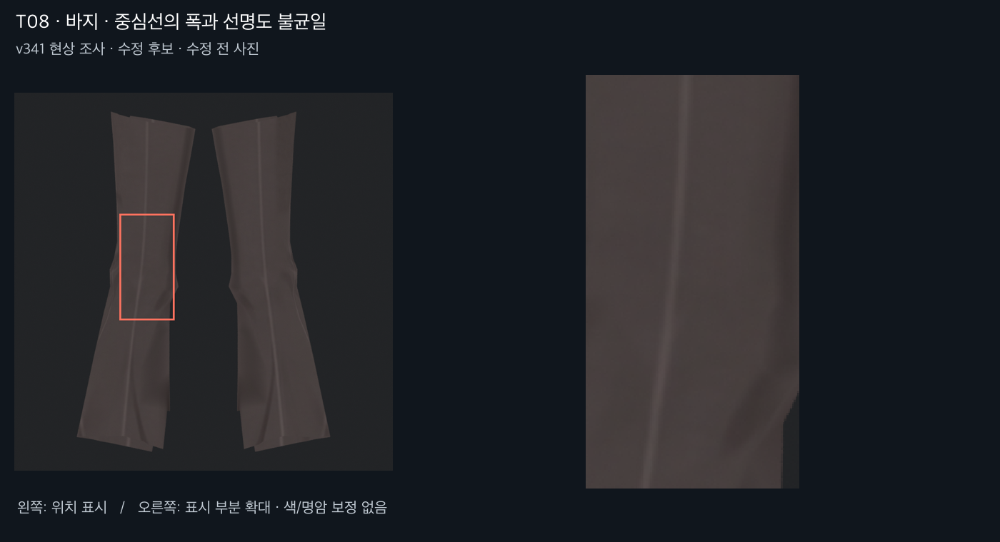

## T09 · 신발 · 발등 장식과 앞코 명암 번짐

**위치:** 양 신발 발등의 가로 장식, 앞코 위.

**보이는 문제:** 가로 장식 가장자리와 밝은 반사가 두껍게 번져 여러 층이 녹아 붙은 듯하다.

**판정:** 텍스처 원본과 기본색 사진에도 존재한다. 가까이서 보이는 중요한 디테일이라 재정리가 필요하다.

**수정할 때 지킬 점:** 발등 장식의 개수·층·앞코 패널과 봉제선은 살린다.

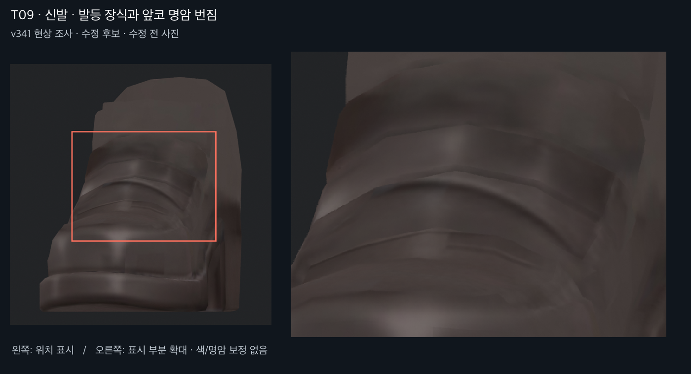

## T10 · 신발 · 옆선의 끊김과 뒤꿈치 얼룩

**위치:** 양 신발 옆면 상단, 뒤꿈치 띠와 굽.

**보이는 문제:** 발목 아래 선이 지그재그로 끊기고, 굽 위 검은 띠와 밝은 세로 반사가 뭉친다.

**판정:** 기본색에 그려진 선/명암 문제가 포함돼 있다. 실루엣 굴곡과 밑창의 의도된 반사는 별도다.

**수정할 때 지킬 점:** 신발 옆 봉제선·밑창 경계·굽의 입체감을 유지한다.

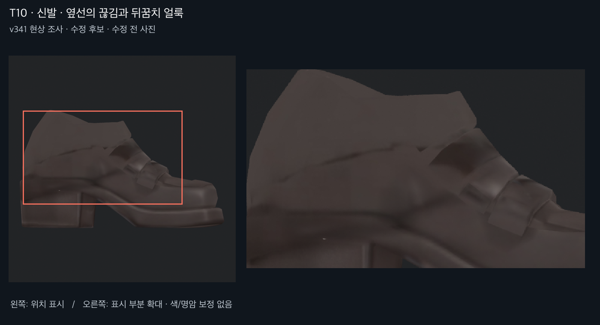

## T11 · 허리 장식 · 흐린 반점과 눌린 경계

**위치:** 양쪽 허리 장식의 앞뒤, 작은 루프와 둥근 장식.

**보이는 문제:** 평평한 장식 위에 불규칙한 어두운 반점과 흐린 홈처럼 보이는 채색이 있다.

**판정:** 중성 재질에서는 비교적 단순한 면이다. 소매 단추와 달리 기존 흐린 장식 채색이 남았다.

**수정할 때 지킬 점:** 장식 자체를 삭제하거나 새 모양으로 바꾸지 않는다.

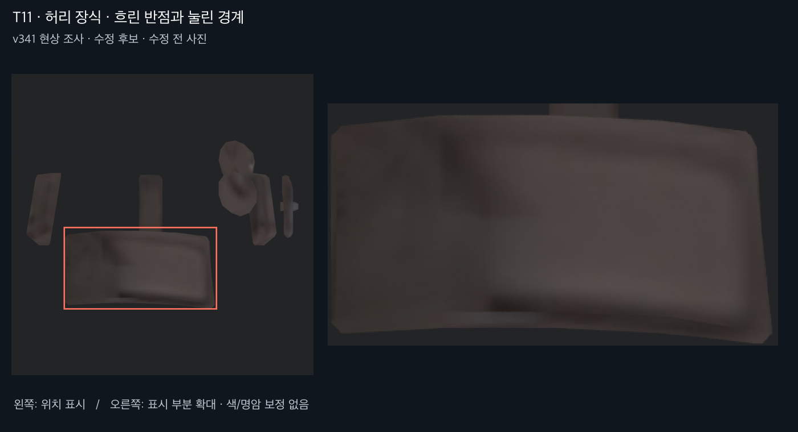

## T12 · 머리 · 앞머리 가닥 안의 뭉친 밝은 띠

**위치:** 큰 앞머리 가닥 중앙과 옆머리 겹침 부분.

**보이는 문제:** 머릿결 선의 굵기와 선명도가 고르지 않고, 가닥 중간에 넓은 밝은 얼룩이 끼어 있다.

**판정:** 기본색과 원본 아틀라스에 머릿결과 함께 포함돼 있다. 전체 블러/샤픈으로는 세부 선까지 손상될 수 있다.

**수정할 때 지킬 점:** 머릿결 개수와 가닥 흐름, 머리 실루엣을 유지하며 뭉친 띠만 재정리한다.

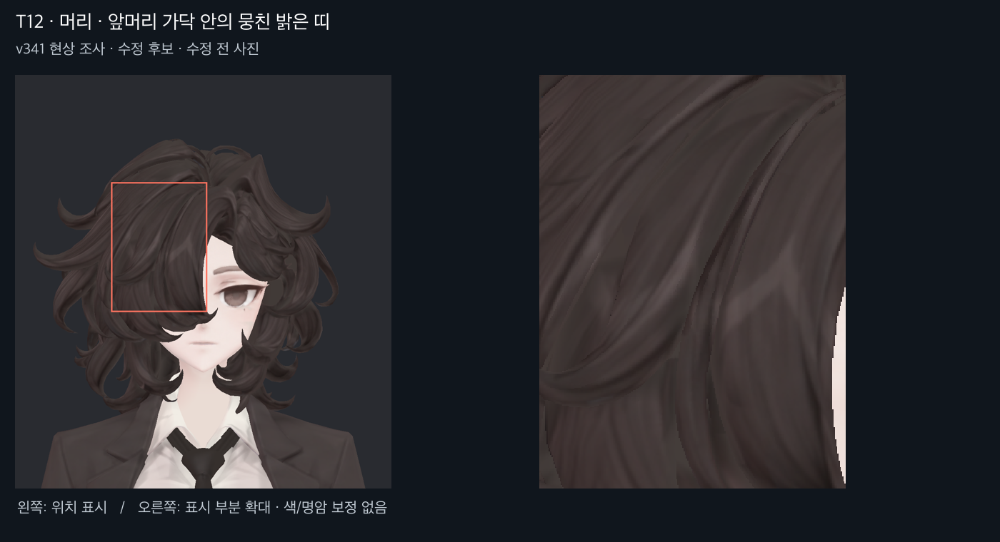

## T13 · 머리 · 안쪽의 얼룩과 갑작스런 단색 전환

**위치:** 목덜미 머리 안쪽과 아래에서 보이는 말린 가닥의 뒷면.

**보이는 문제:** 외부의 머릿결에 비해 안쪽은 흐린 갈색 반점 또는 거의 단색으로 급변한다.

**판정:** 숨은 면 기본색에서 확인했다. 잘라낸 경계나 빈 공간은 제외하고 실제 표면의 채색 차이만 지적한다.

**수정할 때 지킬 점:** 보이는 바깥 머릿결은 유지하고 안쪽의 명암 연결을 맞춘다.

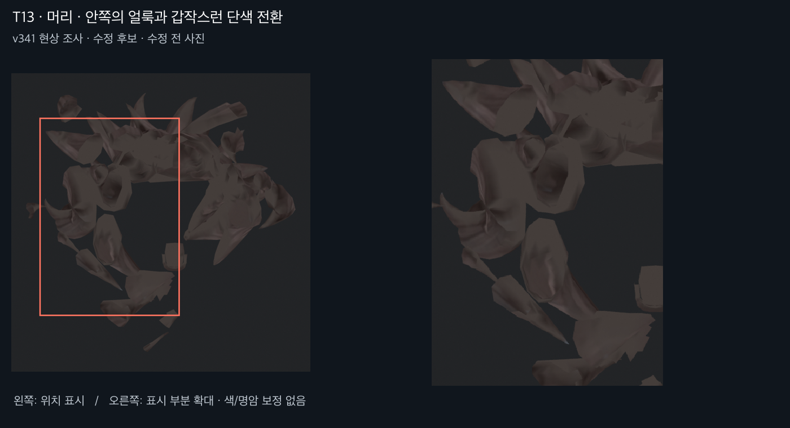

## T14 · 얼굴 · 옆볼과 턱 아래 색 블록

**위치:** 양 옆볼, 귀 앞, 턱 아래와 목의 연결.

**보이는 문제:** 부드러운 피부색 사이에 삼각형/다각형 경계가 드러나는 색 조각이 있다.

**판정:** 기본색에서도 보이므로 실시간 조명만의 문제가 아니다. 옆 얼굴의 평면적인 형상 자체와 구분해야 한다.

**수정할 때 지킬 점:** 얼굴 인상·눈·입·피부 기본색을 유지하며 조각 경계만 완화한다.

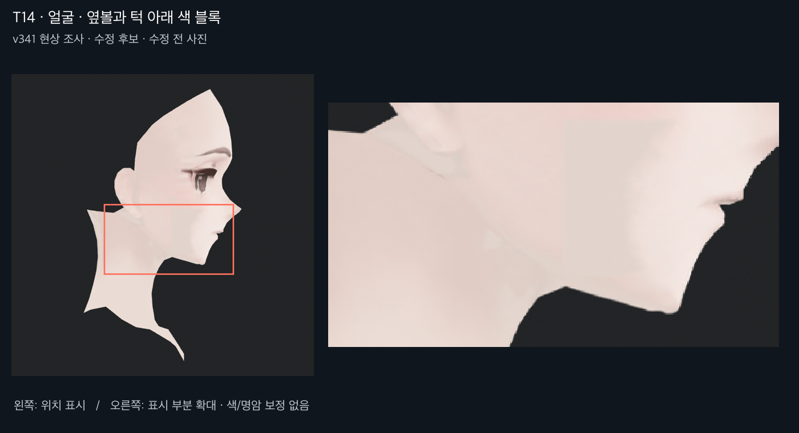

## R01 · 입술 · 주변 경계가 아직 부드러움

**위치:** 입술 중앙과 좌우 끝.

**보이는 문제:** 입선 주변이 확대 시 흐리다. 이전 개선 후에도 경계가 약한 편이다.

**판정:** 스타일상 의도한 부드러움과 결함의 경계가 있어 확정 삭제 대상으로 잡지 않는다.

**수정할 때 지킬 점:** 입술 모양과 얼굴 인상을 바꾸지 않는다.

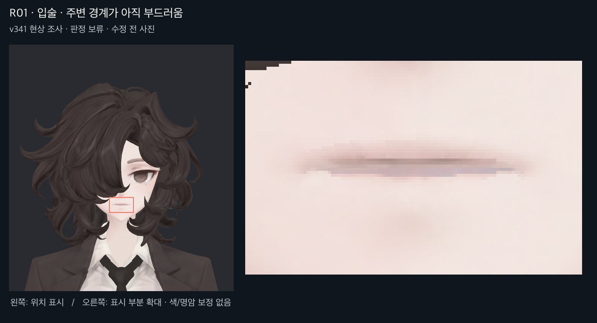

## R02 · 넥타이 · 매듭 아래의 흐린 어두운 점

**위치:** 매듭 아래와 긴 넥타이가 만나는 부위.

**보이는 문제:** 작은 어두운 명암이 점처럼 뭉쳐 보인다.

**판정:** 기본색에도 있으나 매듭 접촉 음영의 의도 여부와 강도 판단이 필요하다. 흰 띠로 잘못 칠해졌던 이전 문제는 현재 사진에서 해소돼 있다.

**수정할 때 지킬 점:** 접촉 음영을 무조건 지우지 않는다.

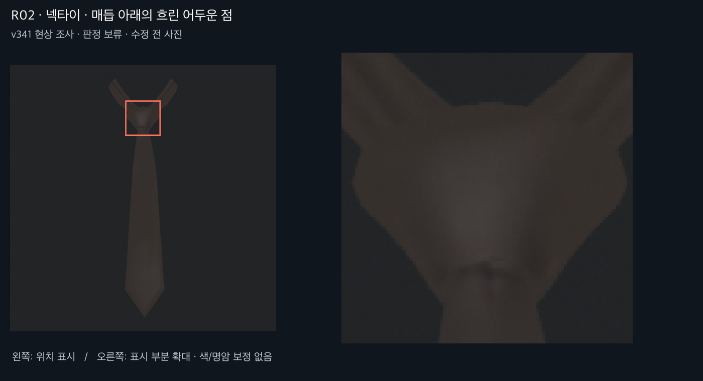

## R03 · 소매 단추 · 외곽의 거친 테두리

**위치:** 양 소매 단추의 바깥 테두리.

**보이는 문제:** 확대하면 테두리 일부가 울퉁불퉁하게 보인다.

**판정:** 원래 낮은 면 수의 외곽과 텍스처 테두리, 필터링이 섞인다. 전부 텍스처 오류로 확정하지 않는다.

**수정할 때 지킬 점:** 안쪽 홈·구멍·실을 유지하고 외곽 원인부터 분리한다.

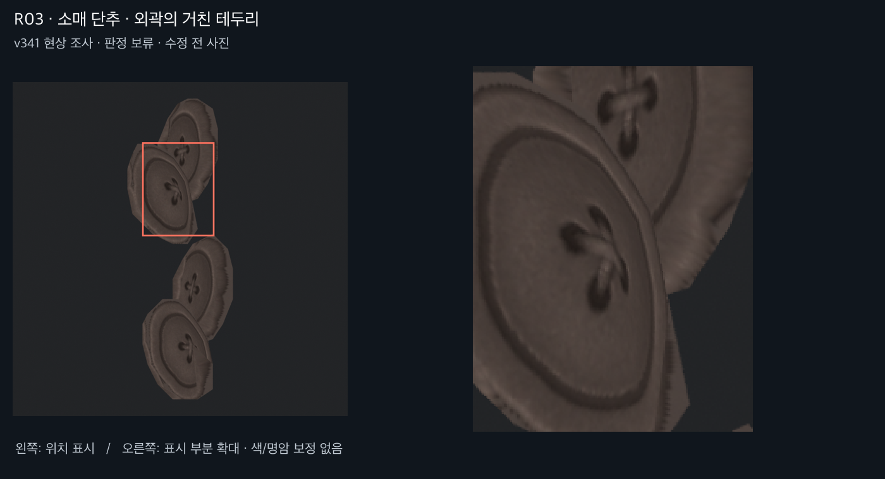

## 다음 작업을 위한 구분

- 기본색에 남은 번짐·뭉친 명암: 채색 내용을 수정해야 한다. 단순 UV 재배치만으로 없어지지 않는다.
- T06 같은 각진 경계: 채색 마스크와 UV 패널 경계를 먼저 추적하고, 원인이 확인된 쪽만 고친다. 이번에는 UV 오류로 확정하지 않았다.
- R01–R03: 의도한 표현·형상·필터링과 섞여 있어 보류했다. 원인 분리 없이 디테일을 지우지 않는다.
- 원래 셔츠/소매/바지의 큰 주름, 단추 구멍과 실, 머릿결, 신발 장식을 보호한다.

모든 항목은 아직 미수정이다. 관절 작업 중단과 기존 v341 보존을 유지한다.
