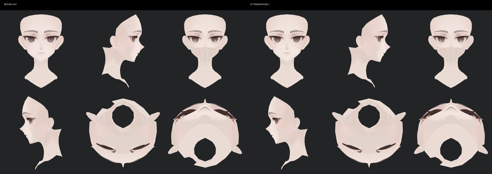
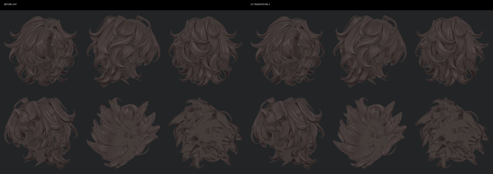

> **기록 시점 안내:** 아래는 해당 단계 당시의 보고서입니다. 후속 결정은 [최신 상태](../../STATUS.md)를 기준으로 읽어주세요. 모델·원본 텍스처·검증 원시 데이터는 이 문서 공유본에 포함하지 않습니다.

# v343 UV 변경과 원형 보존

Head는 새로 전개했고, 의상·신발의 Paint UV는 v341을 유지했다. 새 UV가 항상 더 좋다는 가정으로 전체를 교체하지 않았다. 기존 소매 단추의 128px 전용 섬과 의상 패널 배치는 보존하고 채색 연결을 수정했다.

| 항목 | 결과 |
|---|---|
| Head 초기 섬 | 1,855개 |
| 큰 차트 재전개 시험 | 240개 |
| 늘어짐으로 원래 경계 복귀 | 큰 차트 28개, 전개 해석 실패 1건도 채택하지 않음 |
| 최종 Head 차트 | 1,473개 |
| 해상도 | Head/Paint 모두 4,096² |
| 최소 방향별 텍셀 밀도 비율 | 비퇴화 원래 UV 삼각형 대비 1.727 이상 |
| Head UV 면적 합 | 약 0.369 |
| 패킹 여유 | UV 0.002, 4K 기준 약 8px |
| 원래 UV 보존 | `V341_UV` 유지, Head `V343_UV` 추가 |

작은 섬이 아직 많은 이유는 가닥 안쪽·복잡한 귀/얼굴 면을 무리하게 합쳤을 때 늘어짐이 커졌기 때문이다. 이번에는 섬 수보다 실제 픽셀 밀도와 연결된 채색을 우선했다. 최소 밀도 검사는 면적이 0인 원래 UV 삼각형에 의미 있는 비율을 정의할 수 없어 이를 제외한다. 수치를 전체 텍셀의 시각 합격으로 해석하지 않는다.

UV만 바꾸고 원래 텍스처를 전사한 단계도 별도 저장했다. 얼굴·헤어 6방향 실제 Blender 비교에서 배경을 제외한 렌더 마스크의 평균 절대 RGB 차이는 각각 약 **0.073 / 0.081 (0–255 단위)**다. p99 차이는 1 / 0.667이다. 이 검사는 보이는 렌더 영역에 대한 값이며 전체 UV의 모든 픽셀 검사와 다르다.

정점·면·웨이트·본·shape key·기존 UV 보존은 최종 Blender 파일을 다시 열어서 확인했다. Unity UV 매핑은 미대응 0, 모호한 대응 0이며 UV 오차는 최대 약 4.15e-8이다. 기존 31,976개 BodyHair 런타임 정점이 UV 경계 분리로 32,740개가 됐고 Coat는 3,894개 그대로다. 원래 Blender 메시 정점 수와 Unity 분리 정점 수를 혼동하지 않는다.

근거는 작업 폴더의 `PACK_CHECK.json`, `UV_TRANSFER_RENDER_CHECK.json`, `BLENDER_PRESERVATION.json`, `UNITY_UV_TRANSFER.json`, `UNITY_DELIVERY_CHECK.json`, `RUNTIME_IDENTITY.json`에 저장했다.
