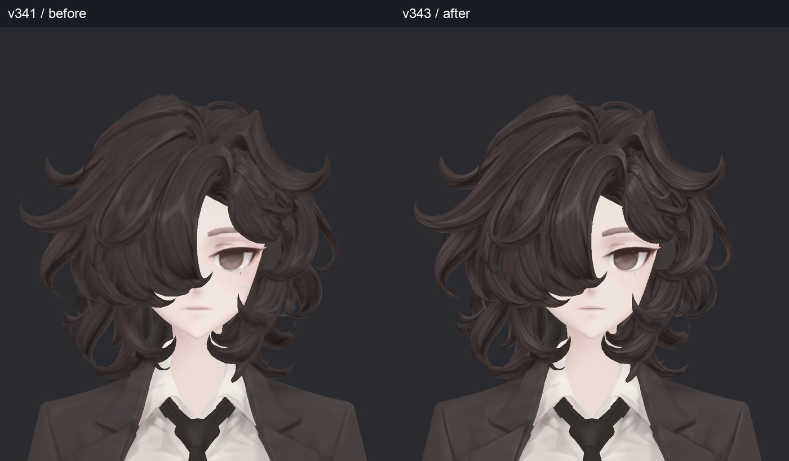
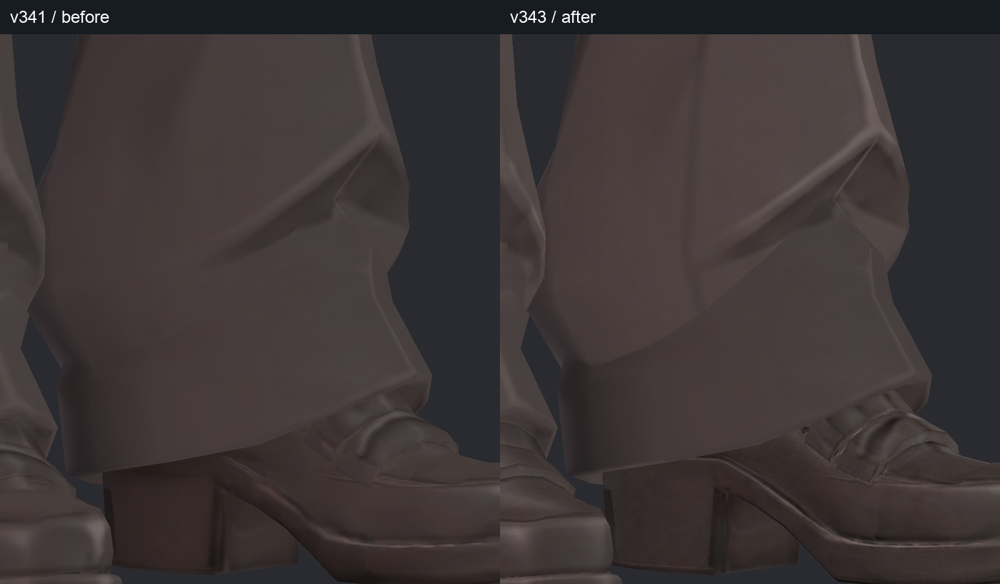
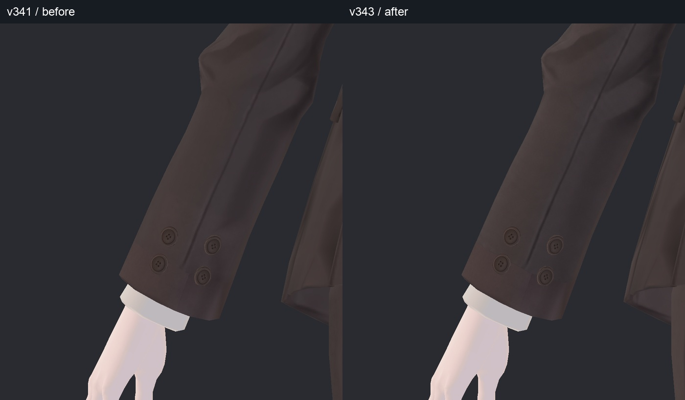
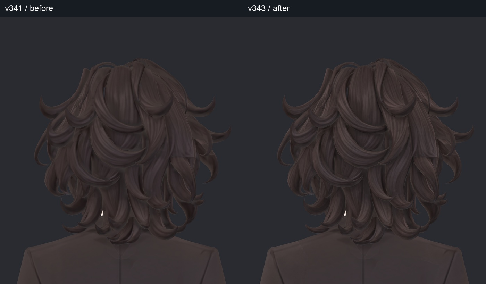
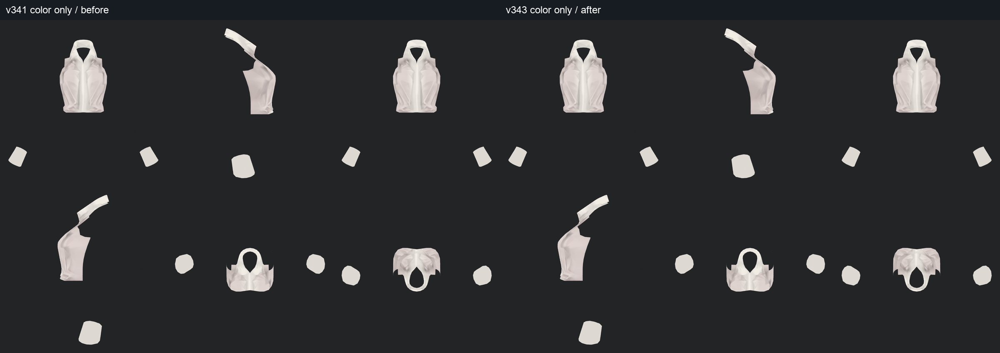
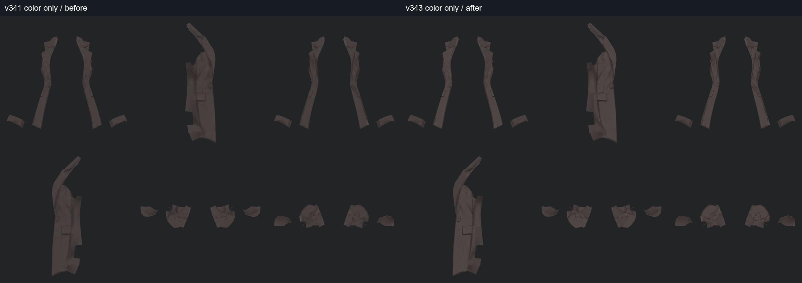
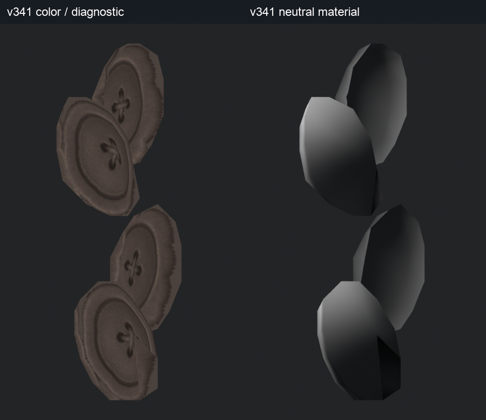

> **기록 시점 안내:** 아래는 해당 단계 당시의 보고서입니다. 후속 결정은 [최신 상태](../../STATUS.md)를 기준으로 읽어주세요. 모델·원본 텍스처·검증 원시 데이터는 이 문서 공유본에 포함하지 않습니다.

# v343 텍스처·UV 재작업 보고

2026-09-13. 기준은 v341, v342의 T01–T14/R01–R03 목록을 따라 수정·재판정했다. **이 보고서의 사진은 실제 Blender/Unity 모델 렌더**다. 생성 이미지는 채색 재료로만 사용했다. 사용자의 최종 외형 채택을 대신하지 않는다.

의상·신발의 불규칙한 색 얼룩과 끊긴 선을 정리했고, 헤어와 얼굴은 새 Head UV에 다방향 표면 투영을 적용했다. 단추 구멍·실, 주머니·봉제선, 바지 중심선, 머릿결, 눈·입의 모양을 보존했다. 넓은 명암을 전부 지우는 방식은 채택하지 않았다. **새 메시 생성·리메시·형상·본·웨이트 수정은 없다.**

- [전후 전체 사진](v343_GALLERY.md)
- [UV 변경과 보존 검사](v343_UV_REVIEW.md)
- [겪은 문제·시도·미채택 이유](v343_ATTEMPTS.md)
- [별도 2D 셰이더·고정 명암 대안](../../avatar_shader/v004_texture_shadow_comparison/v004_WORK_REVIEW.md)
- [후속 전체 관절·본 검사와 GIF](../v344_texture_rig_retest/v344_WORK_REVIEW.md)

## 먼저 볼 사진

각 사진은 **왼쪽 v341 / 오른쪽 v343**. Unity 비교는 카메라·기존 재질·조명을 고정했다. 아래 색 변화에는 새 셰이더가 섞이지 않는다.

## 항목별 판단·처리

| 항목 | 판단과 이번 처리 | 보존한 요소 / 한계 |
|---|---|---|
| T01 카라 아래 회색 삼각형 | 레퍼런스의 카라 겹침과 접촉 명암에 대응. 의도된 명암으로 유지 | 기본색에 그린 명암이라는 사실만으로 결함으로 분류하지 않음 |
| T02 셔츠 밑단의 삼각 주름 | 레퍼런스에 큰 접힘이 존재. 유지 | 셔츠를 평평한 단색으로 바꾸지 않음 |
| T03 코트 목·라펠 안쪽 | 실제 접힘과 고정 그림자가 섞임. 접힘은 유지하고 주변 불규칙한 채색은 코트 패널 정리 범위에서 완화 | 레퍼런스에서 가려진 안쪽의 모든 검은 부분이 의도됐다고 단정할 수 없음 |
| T04 주머니·허리 단추 주변 | 코트 앞 패널의 흐린 경계와 불규칙한 명암을 정리 | 주머니 덮개·선·단추 위치 보존 |
| T05 겨드랑이·소매 얼룩 | 패널 정리 후 양 소매 뒷면 투영으로 색 연결 보완 | 실제 소매 접힘과 관절 형상 보존 |
| T06 손목 단추 주변 사각 색 경계 | 천 패널 및 끝단 4개 패널의 잔상을 정리. 단추와 분리해 작업 | 단추 구멍·실·홈 보존. 전체 샤픈 미사용 |
| T07 옆 허벅지 얼룩 | 앞뒤 바지 8개 패널의 회갈색 얼룩과 어색한 연결 정리 | 원래 큰 형태 명암 유지 |
| T08 바지 중심선 | 폭·농도가 불규칙한 구간을 정리 | 다림질선과 굽힘 주름 유지 |
| T09–10 신발 전체 | 발등·앞코·옆선·뒤꿈치·밑창 패널 정리 후 6방향 투영. 오른발도 실제 적용 렌더로 확인 | 장식 층·봉제선·굽·밑창 보존. 앞코와 굽의 넓은 반사 채색 일부는 남아 있음 |
| T11 허리 장식 | 작은 루프와 장식 4개 대상 패널의 얼룩·눌린 경계 정리 | 장식 개수·외형 유지 |
| T12 앞·옆 헤어 | 새 Head UV에 앞/뒤/좌/우/위/아래 투영. 큰 뭉친 띠를 정리하고 가닥 내부 선을 보완 | 머리 실루엣·컬·가닥 흐름 유지 |
| T13 헤어 안쪽 | 아래·뒤 투영을 포함해 갑자기 단색으로 바뀌는 표면 연결 보완 | 모든 깊은 가림 면의 모든 텍셀을 카메라로 확인한 것은 아님 |
| T14 얼굴, R01 입 | 정면·양 측면·아래 방향 투영으로 볼·턱 아래 색 블록과 입 주변 연결 정리. 독립 패널 채색은 폐기 | 눈매·입술 모양·피부색 유지. 목 뒤 일부 미세한 경계와 확대 시 부드러운 입선은 남음 |
| R02 넥타이 매듭 아래 | 레퍼런스의 매듭 접촉 명암과 대응. 유지 | 이전 카라 안쪽 흰 띠 문제와 구분 |
| R03 소매 단추 테두리 | 기본색/중성 재질 비교에서 낮은 면 수의 외곽 각짐 확인. 이번에는 텍스처를 추가로 뭉개지 않고 유지 | 테두리의 미세한 거침에는 채색·필터링도 섞임. 완전한 원형으로 바꾸려면 형상 작업이 필요 |

## 가려진 부분까지 확인한 방법

전체 표면 분류 17,659면을 기준으로 얼굴, 헤어, 손, 신발, 바지, 셔츠, 장식, 코트를 추적했다. 좌우 손·신발, 코트 앞/뒤, 소매를 나눠 **12개 그룹 × 6방향 × 전후 = 144개 기본색 시점**을 렌더했다. 코트에 가려지는 허벅지, 코트 안, 머리 아래, 신발 바닥도 포함한다. 분리 사진의 잘린 가장자리와 빈 공간은 검사 시 표면을 가리던 부위를 제외한 결과이며 모델에 구멍을 새로 낸 것이 아니다.

Unity에서는 전신·얼굴·입·양 신발 앞/뒤/옆·손·소매·허벅지 등 **21개 시점 × 전후 = 42장**을 추가 확인했다. 분리 기본색 검사는 동적 조명으로 숨겨지는 얼룩을 확인하기 위한 것이며 실제 재질의 최종 외형은 Unity 사진에서 판단한다.

### 의도된 주름·그림자

셔츠의 카라 아래와 밑단은 레퍼런스와 대응하는 주름을 유지했다. 코트 안쪽은 참고 이미지에서 가려져 있는 구간이 있으므로, 접힘 형상과 연결되는 명암을 보존하고 주변 얼룩만 정리했다.

### 단추 테두리 원인 분리

아래는 v342 조사 때 촬영한 **동일 v341 단추**의 기본색/중성 재질 확대다. 중성 재질에서도 바깥 실루엣이 각지므로 텍스처 흐림만의 문제는 아니다. 안쪽 구멍·실은 살리고, 이번 수정은 주변 천의 사각 잔상에 집중했다.

## 검증 결과와 전달본

Blender의 기존 정점 좌표·면 연결·원래 UV·웨이트·본 휴지 자세·shape key 좌표·정점 노멀은 v341과 정확히 일치한다. Unity에서도 원래 정점에 대응시킨 좌표·노멀·웨이트·shape key 차이는 0이다. 새 Head UV 경계 때문에 Unity BodyHair 정점이 764개 분리됐지만 같은 위치·변형 값을 복제한 것이며 형상 추가가 아니다. 전체 계층·컴포넌트의 비교 대상 24,155개 직렬화 속성이 일치한다. 변경 대상으로 제외한 메시·재질은 별도 검사를 했다.

작업 저장소 전달 파일:

- Blender 검수본 (공유본 미포함: `bianca_v343_TEXTURE_REVIEW.blend`)
- Unity 검수 패키지 (공유본 미포함: `Bianca_v343_TextureResolutionReview.unitypackage`)
- 파일·해시·검증 목록 (공유본 미포함: `DELIVERY.json`)

주 후보는 **v343 텍스처 + 기존 셰이더**다. v004 B/C 셰이더 사본은 별도 비교용이며 자동 채택하지 않는다. 앞코의 넓은 반사, 가려진 목 뒤의 미세한 색 경계, 입선의 부드러움까지 모두 사라졌다는 의미로 “완전 무결”이라고 표현하지 않는다. 이 부분은 확대 비교에서 남는 특성으로 명시했다. 전신 관절의 극단 자세 접촉과 VRChat 클라이언트 검증은 후속 보고서의 제한을 따른다.
