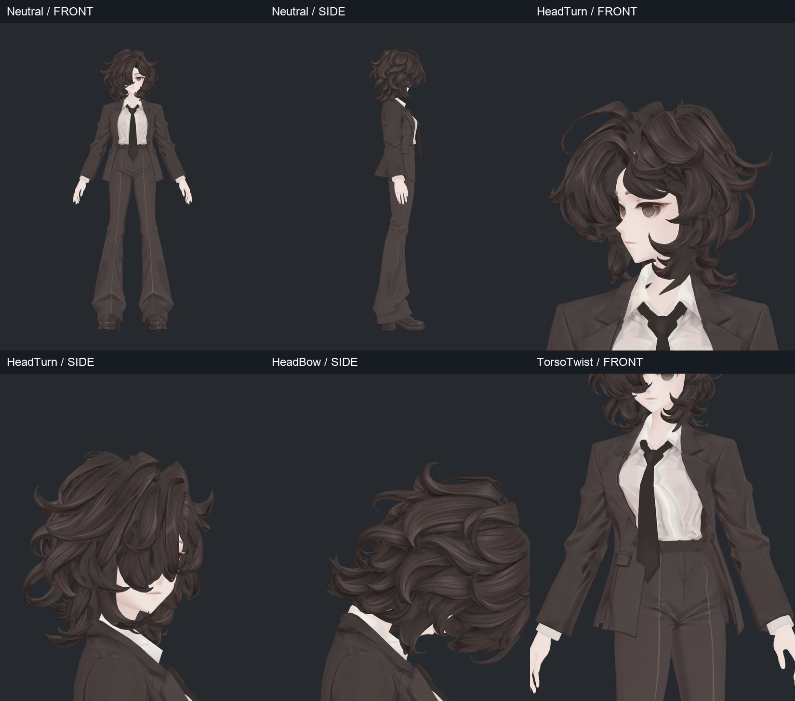
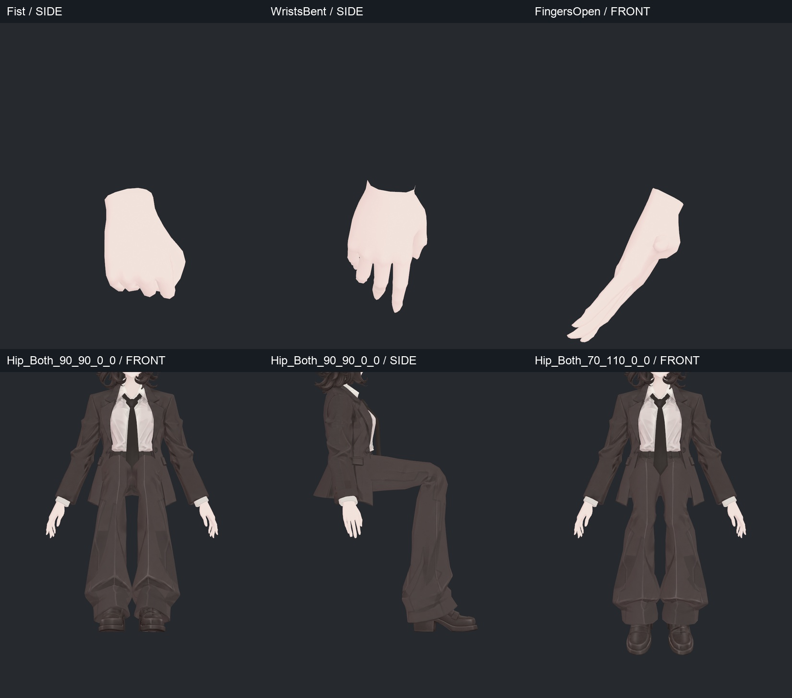
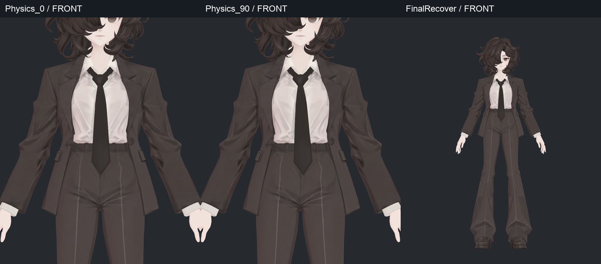

> **기록 시점 안내:** 아래는 해당 단계 당시의 보고서입니다. 후속 결정은 [최신 상태](../../STATUS.md)를 기준으로 읽어주세요. 모델·원본 텍스처·검증 원시 데이터는 이 문서 공유본에 포함하지 않습니다.

# v344 실제 자세 사진

[검사 보고서](v344_WORK_REVIEW.md) · [129본 점검표](v344_BONE_TABLE.md). 사진은 최종 v343 텍스처를 실제 Unity 변형 스냅샷에 적용했다. 이름은 테스트 자세 이름이며 권장 포즈가 아니다.

## 사진 묶음 1

## 사진 묶음 2

## 사진 묶음 3

## 사진 묶음 4

## 사진 묶음 5

## 사진 묶음 6

## 사진 묶음 7

