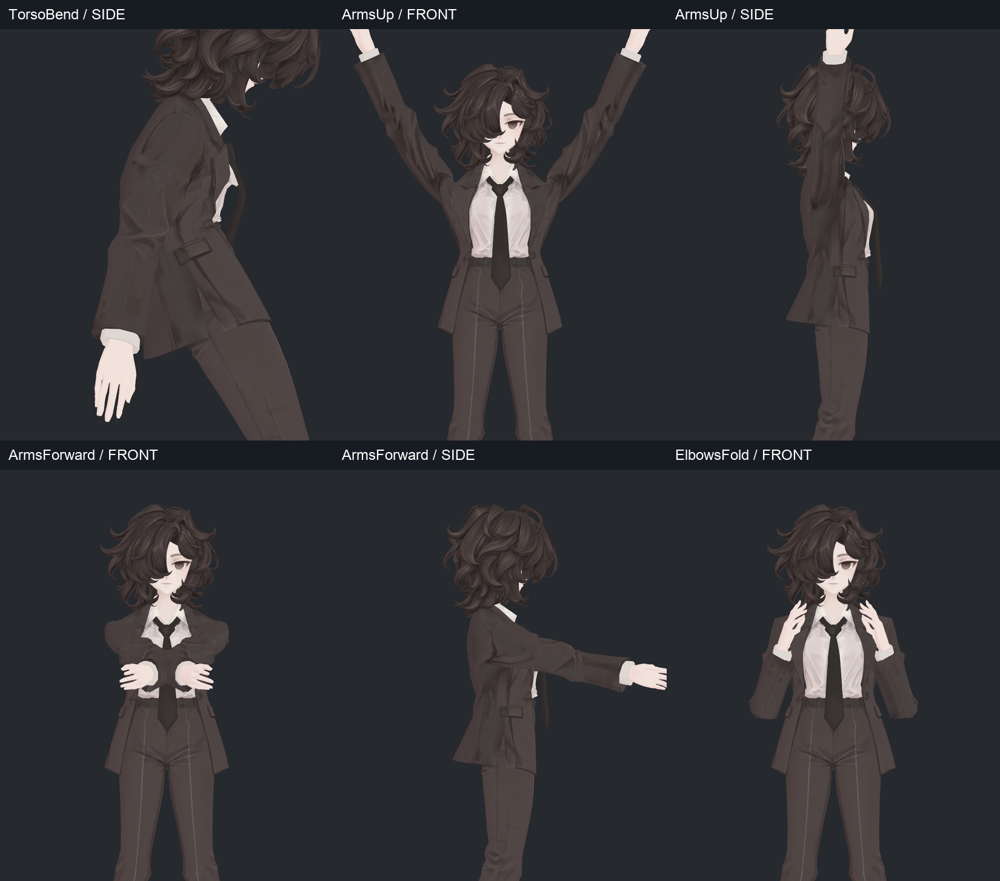
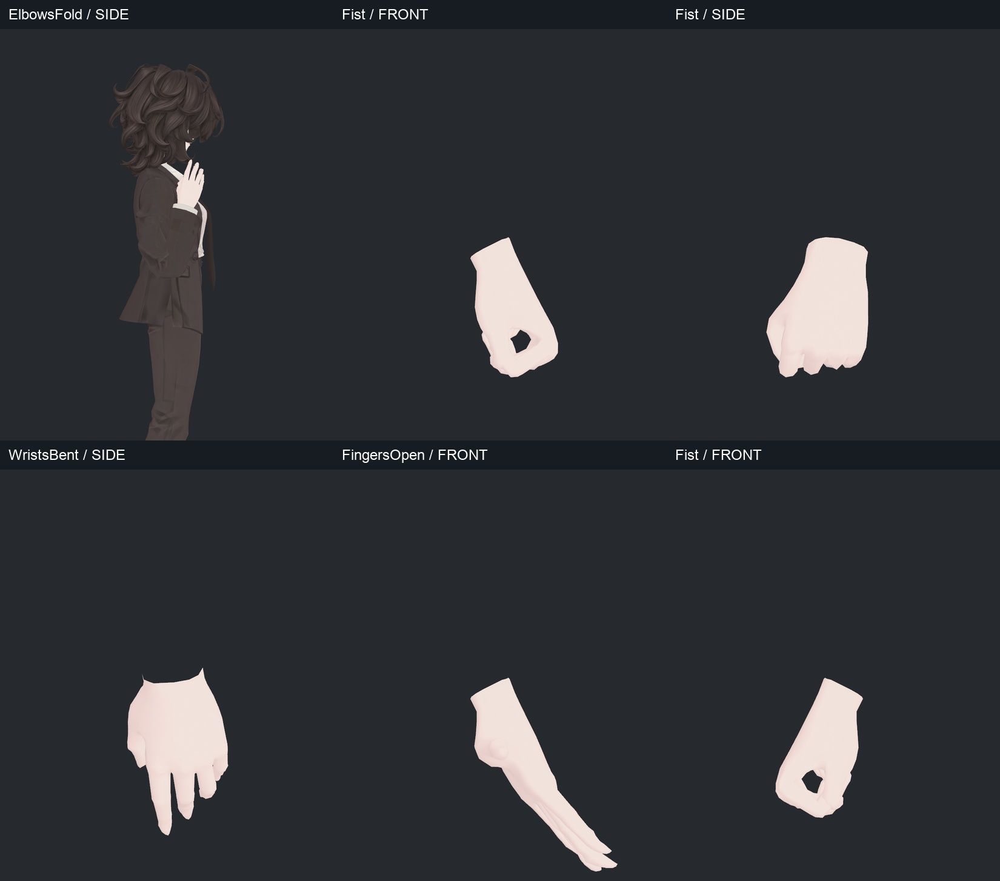
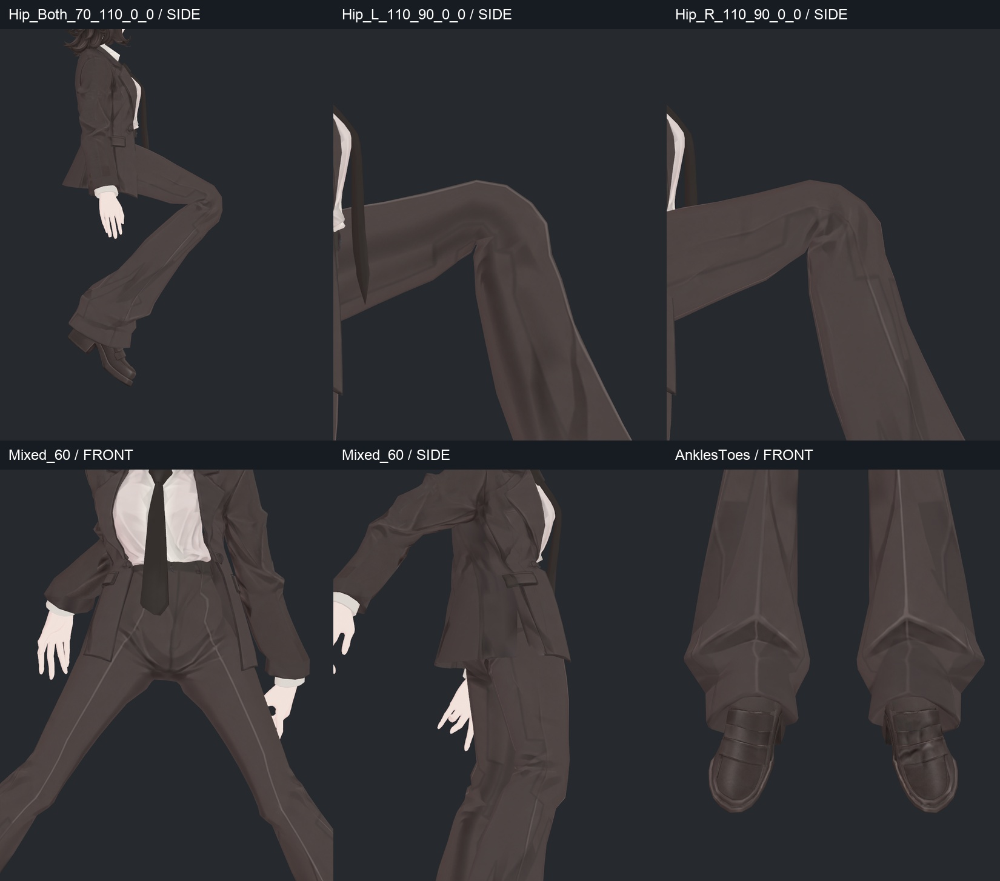
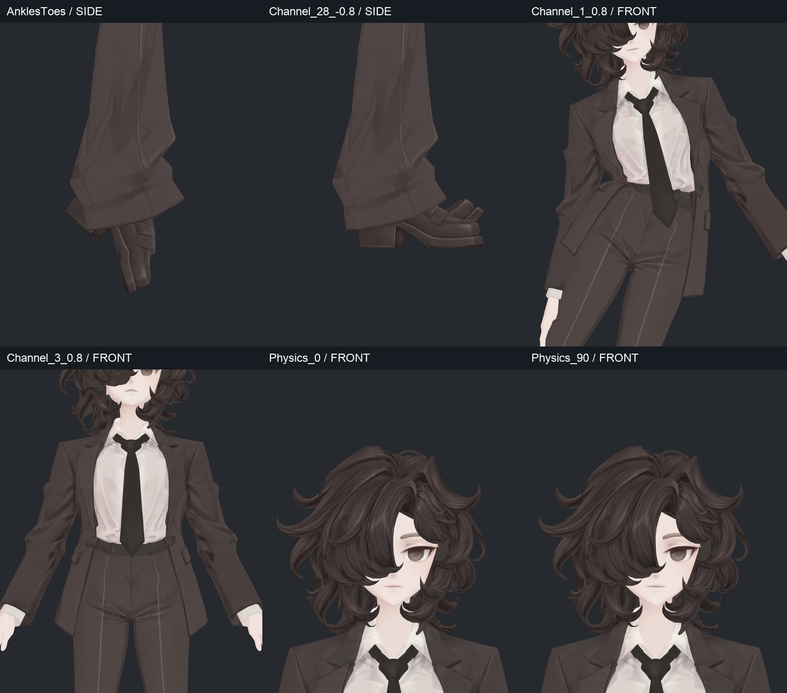
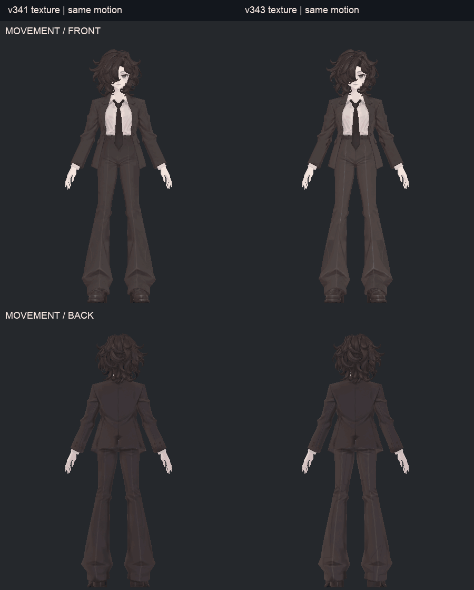
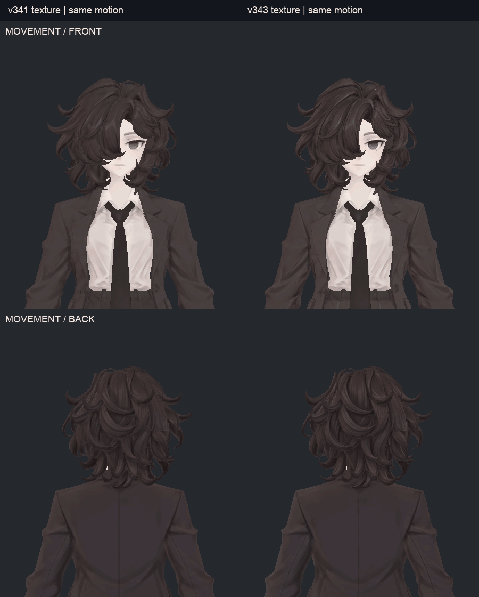
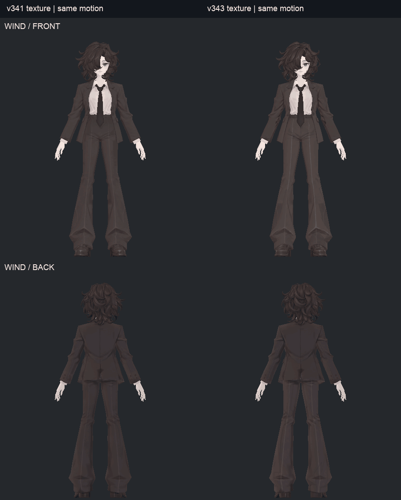
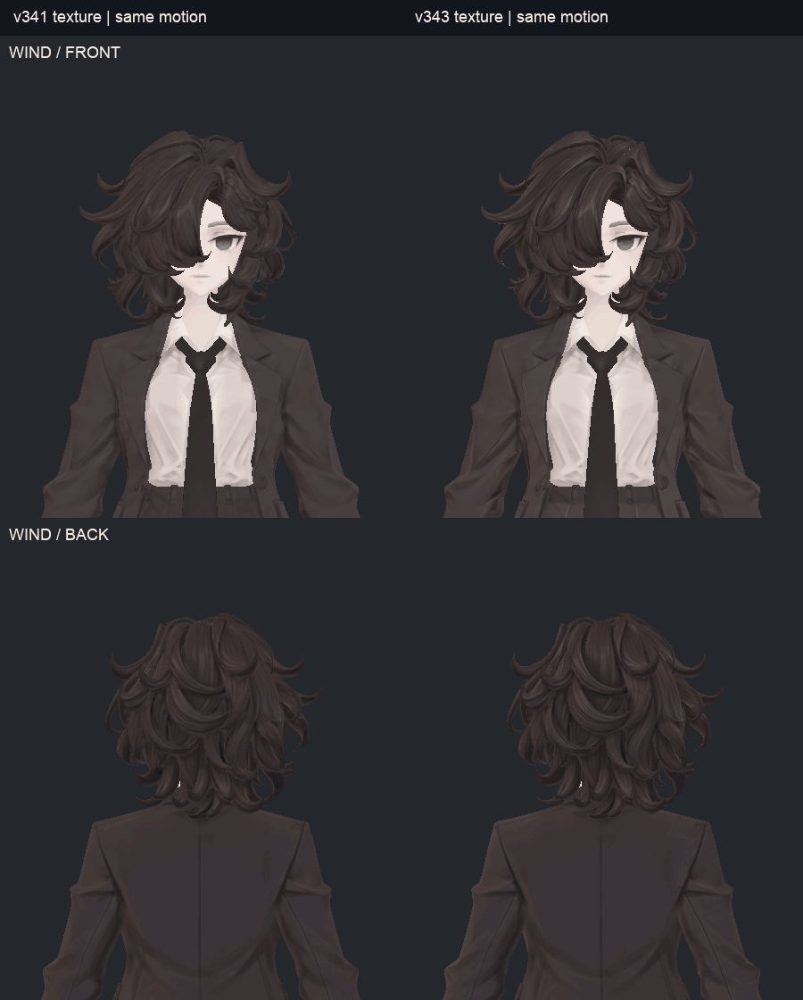

> **기록 시점 안내:** 아래는 해당 단계 당시의 보고서입니다. 후속 결정은 [최신 상태](../../STATUS.md)를 기준으로 읽어주세요. 모델·원본 텍스처·검증 원시 데이터는 이 문서 공유본에 포함하지 않습니다.

# v344 텍스처 갱신 후 전체 관절·본 검사

2026-09-13. **v343 텍스처·새 Head UV를 적용한 전달본**에서 전체 본 구조와 관절·보조 동작을 다시 검사했다. 텍스처 수정으로 리그가 바뀌지 않았음을 확인했고, 기존 극단 자세의 접촉·국소 압축은 남아 있다. 검사 실행 완료를 모든 자세의 외형 합격으로 표현하지 않는다.

- [129본 전체 점검표](v344_BONE_TABLE.md)
- [39장 자세 사진](v344_GALLERY.md)
- [텍스처 전후 보고서](../v343_texture_resolution/v343_WORK_REVIEW.md)

## 검사 범위와 결과

| 검사 | 실행 결과 | 해석 |
|---|---|---|
| Blender/Unity 전체 129본 | 이름 일치, 부모 누락·순환·길이 0·유효하지 않은 Blender 드라이버 없음 | 구조 검사. 129개를 모두 독립 Humanoid 채널처럼 돌렸다는 뜻 아님 |
| Humanoid | 51개 매핑, 86개 회전 채널 양방향 포함 | ±0.8 채널, 주요 자세, 다리 조합 및 무작위 혼합 |
| 정적 자세 | 299개 | 목·몸통·팔·손·고관절·무릎·발 포함 |
| 연속 관절 동작 | 121개 표본 | 팔 앞으로/팔꿈치/몸통 회전 연속값 |
| PhysBone | 11개 컴포넌트 | 헤어 6체인, 코트 자락 4체인, 넥타이 1체인 |
| 물리·바람 | 준비 90프레임 + 실제 360프레임, 3프레임마다 저장 | 이동 180 / 바람 파라미터 180, 총 120개 실제 변형 스냅샷 |
| 정점 유효성 | 검사한 542개 기록 모두 유한값 | NaN/Infinity 없음. 겹침이 없다는 의미 아님 |
| 웨이트 | 무웨이트·유효하지 않은 인덱스·빈 본 참조 0, 최대 4영향 | Unity 가중치 합 약 0.9999998–1.00000024 |
| 원본과 런타임 일치 | 정점·노멀·웨이트·shape key, 본·물리·애니메이터 속성 유지 | UV 경계 분리는 같은 변형 데이터를 복제 |

검사는 **Unity 2022.3.22f1 + VRChat SDK Play Mode**에서 실제 실행했다. VRChat PC 클라이언트 업로드/월드/네트워크 테스트는 아니다. 사용자가 승인했던 무릎과 손가락 국소 압축을 이번 텍스처 작업에서 다시 바꾸지 않았다.

## 자세를 직접 보고 남긴 판단

### 팔·팔꿈치

강한 앞으로 모으기는 손과 팔이 겹치는 극단 시험이다. 일상용 손 모으기 포즈가 아니다. 팔꿈치 최대 굽힘의 기존 실루엣은 유지된다. 어깨/소매 일부 작은 면에는 강한 압축이 남는다.

### 무릎·고관절·발목

기존 무릎 접힘은 유지됐다. 큰 고관절 굽힘·비틀기에서는 코트와 바지의 접촉이 있고, 발목을 많이 굽히면 바짓단·신발 접촉이 남는다. 해당 자세를 텍스처 오류로 분류하지 않았다.

### 면적·접촉 수치를 읽는 법

중립 대비 삼각형 면적 비율 0.2 미만 또는 3 초과를 경고로 잡았다. 소매·바지·손 등에서 경고가 나온다. 예를 들어 강한 앞모으기의 왼 소매 앞 5개, 주먹의 손 9개, Mixed_60의 바지 20개 삼각형이 해당한다. 이 수치는 확대 검수 위치를 찾는 도구이며 자동 결함 판정이 아니다.

선별한 46자세의 실제 삼각형 교차도 검사했다. 공유 정점과 모든 헤어 표면은 제외하고, 0.05mm 초과 비공면 교차 선분을 세었다. 중립부터 의상 겹침 등을 포함한 **2,194개 삼각형 쌍**이 있다. 앞모으기 2,904쌍(중립에 없던 쌍 801), 팔꿈치 최대 굽힘 2,984쌍(791)이다. **교차 쌍 수는 눈에 보이는 결함 개수나 침투 깊이가 아니다.** `new_vs_neutral`은 자세와 중립의 차이이며 v343에서 새로 생긴 회귀를 뜻하지 않는다. 원래 v341과 리그 데이터가 동일하다는 별도 검사를 함께 제시한다.

부피는 닫힌 상완·허벅지 단면 7개를 선별 자세에서 확인했다. 상완 최소 단면적 비율은 약 0.968, 허벅지는 약 0.992였다. 이는 해당 단면의 보존 정도이며 **팔꿈치/무릎 중심의 전체 부피나 모든 연속 자세가 합격했다는 검사로 확대하지 않는다.**

## 이동·바람 GIF 비교

왼쪽은 v341 UV/재질, 오른쪽은 v343 UV/재질이며 **같은 실제 BakeMesh 동작 프레임**을 사용했다. 위는 정면, 아래는 뒤다. 리그를 수정하지 않았으므로 동작 자체 개선 비교가 아니라 텍스처가 움직일 때의 전후 비교다. 프레임 보간이나 생성 동영상은 쓰지 않았다.

각 GIF는 실제 60프레임, 20fps, 3초 반복이다. 반복 경계는 시험 구간의 끝에서 처음으로 돌아가므로 자연스러운 무한 주기 애니메이션을 의미하지 않는다. 확대 GIF도 같은 실제 프레임을 다른 카메라로 렌더한 것이다.

### 이동에 따른 흔들림

루트를 좌우 약 3cm 사인 이동시키고 바람 파라미터는 0으로 뒀다. 머리·넥타이·자락이 따라 움직인다. 큰 몸통 이동 때문에 세부 흔들림은 확대본이 더 잘 보인다.

### 바람 파라미터

루트를 고정하고 **BiancaWind = 0.7**로 실행했다. 이는 아바타의 FX 파라미터로 구동하는 바람 보조 동작이며 월드의 실제 바람을 자동 감지한 것이 아니다. 기본 전달 에셋의 값은 0.35이고 관절 시험 중에는 0으로 분리했다.

움직임은 절제된 편이다. 이 시험에서 헤어 체인의 물리 구간 최대 로컬 회전 변화는 약 6.83°, 넥타이 첫 본 약 2.47°, 코트 자락 첫 본 약 1.06–1.52°였다. 바람 보조 본은 헤어 최대 약 3°, 코트 약 1.42–2.04°다. 이는 물리 준비 직후 기준의 최대 변화이며 최대 허용 각도가 아니다.

바람을 0으로 돌리고 240프레임 안정화도 기록했다. 마지막 `FinalRecover`는 PhysBone을 끄고 보조 본 회전을 초기화한 뒤 120프레임 기다린 별도 리셋 검사다. 이때 정점 차이는 BodyHair 약 0.0000105mm, Coat 0mm, shape key 가중치 모두 0이었다. 이를 물리가 스스로 정확히 원점으로 돌아왔다는 근거로 쓰지 않는다.

## 전달·남은 범위

별도 새 리그를 만들지 않았으므로 모델 전달은 v343 패키지를 사용한다. 이 폴더는 검사 코드·본 목록·요약 결과·실제 사진·GIF를 담는다. Blender와 Unity 파일을 읽어 검사했으며 원형을 변경하지 않았다. 테스트와 렌더 전후 사용자의 Unity 씬 경로·dirty 상태를 보존했다.

기존 극단 자세 접촉, 손가락 국소 압축, 무릎의 작은 각짐은 남아 있다. 헤어 표면 전체의 자기 교차는 수치 검사에서 제외했으므로 GIF가 정상적으로 보이는 것을 전체 헤어 무교차 증명으로 쓰지 않는다. VRChat 클라이언트의 월드별 조명·실제 이동·네트워크·성능은 이번 검증 밖이다.
