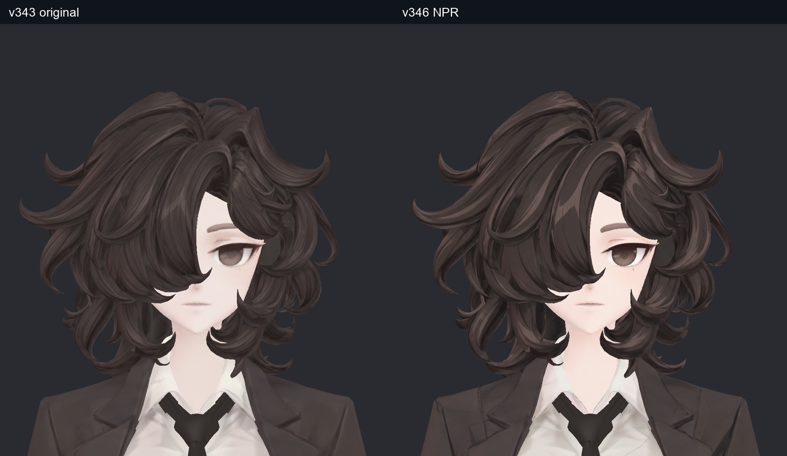
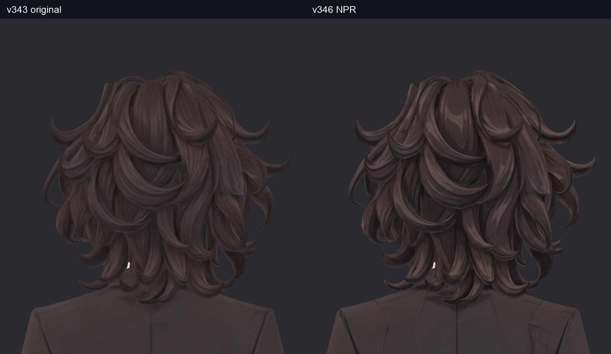
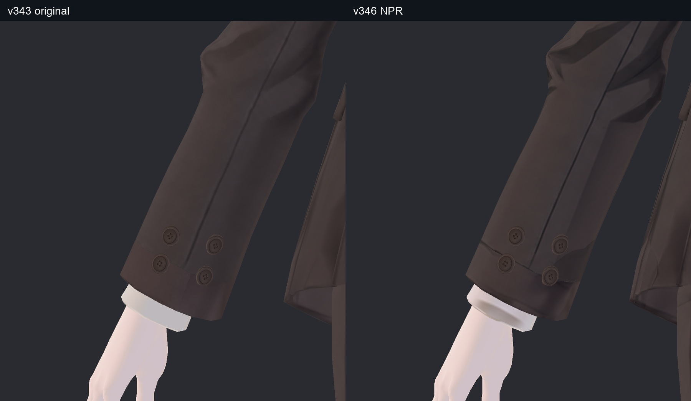
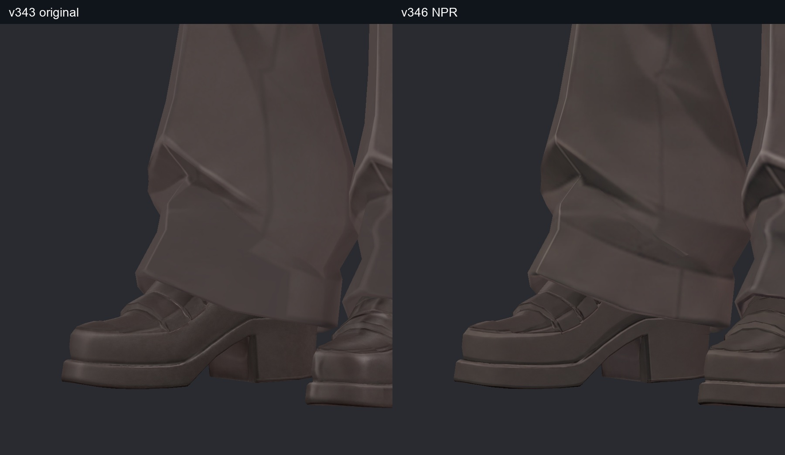
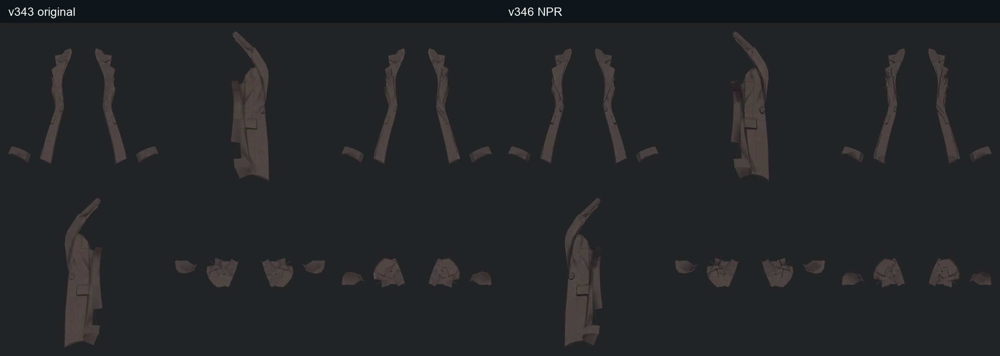
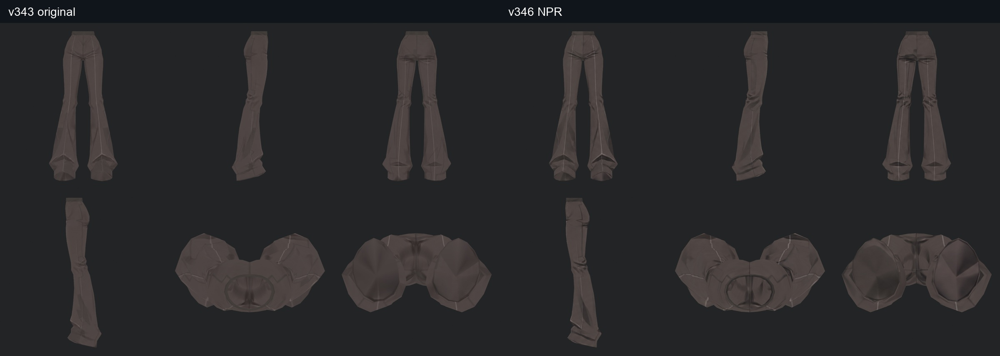
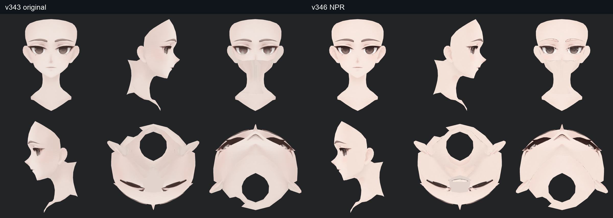
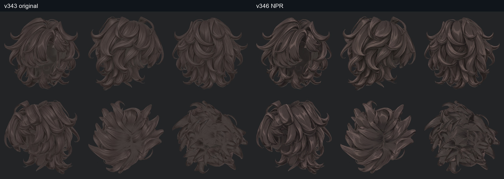

> **기록 시점 안내:** 아래는 해당 단계 당시의 보고서입니다. 후속 결정은 [최신 상태](../../STATUS.md)를 기준으로 읽어주세요. 모델·원본 텍스처·검증 원시 데이터는 이 문서 공유본에 포함하지 않습니다.

# v346 NPR 텍스처 재작업

v345 계획에 따라 실제 제작을 재개했다. 기준 v343을 보존하고 얼굴·헤어, 팔/코트/다리 안쪽, 양 신발의 채색을 다시 정리했다. 목표는 일러스트처럼 읽히는 선과 색면이다. 원래 머리 길이·얼굴 인상·체형·관절 형상은 변경하지 않았다. 사진은 모두 실제 모델 렌더이며 생성 채색 시트를 완성 모델 사진으로 대체하지 않았다.

## 수정한 부분과 보존한 디테일

| 부위 / 이전 항목 | 처리와 판단 |
|---|---|
| 얼굴 전체·T14·R01 | 눈꺼풀 중복과 강한 턱 선이 생긴 첫 시도를 폐기하고 다시 채색했다. 눈·입·귀·볼·턱·목의 색면을 정리하고 실제 앞/옆/아래/가림 면을 재검토했다. |
| 헤어·T12–13 | 앞/옆/뒤/위/아래에 이어 안쪽을 별도로 채색했다. 컬의 묶음과 가닥 내부 선·하이라이트를 남겼다. 전체를 흐리게 만드는 평활화는 채택하지 않았다. |
| 코트·T04–05 | 주머니·옆 패널·겨드랑이·안쪽의 불규칙한 얼룩을 정리했다. 허리 V자 접힘과 라펠/소매의 큰 주름은 유지했다. |
| 소매·T06·R03 | 천의 번진 명암을 정리하고 단추 구멍·실·테두리를 보존했다. 단추 아래 사각 톤 변화는 v343에도 있으며 커프스 겹침과 대응한다. 이를 없애기 위해 단추를 흐리게 하지 않았다. |
| 바지·T07–08 | 좌우 허벅지 아래·안쪽·무릎 뒤·종아리·밑단을 포함했다. 중심선과 큰 접힘은 유지하고 반복 점선/빗살 전사 오류를 수정했다. |
| 신발·T09–10 | 양쪽 앞코·스트랩·옆·뒤꿈치·굽·바닥을 재작업했다. 오른 신발의 넓고 흐린 반사가 남은 시도는 다시 그렸다. 봉제선·밑창 층을 유지했다. |
| 손·T11 장식 | 전 방향으로 다시 확인했다. 기존 정리된 피부와 허리/소매 장식은 재생성하지 않고 유지했다. |
| T01·T02·R02 | 카라 접촉, 셔츠 밑단 접힘, 넥타이 매듭 아래 명암은 레퍼런스 및 실제 겹침과 대응하므로 유지했다. |
| T03 | 라펠 안의 접힘 명암은 유지하고 주변 오염을 정리했다. 레퍼런스에서 가려진 부분의 모든 검은 색이 의도됐다고 가정하지 않았다. |

## 가려지는 면 검수

12개 표면 그룹을 각각 6방향으로 격리해 기본색을 비교했다. 팔·코트·다리 안쪽, 신발 바닥, 머리 안쪽과 얼굴 셸을 포함한다. 격리 사진의 구멍/잘린 경계는 가리던 표면을 임시로 제외한 검사 화면이다. 실제 모델에 그 구멍을 만든 것이 아니다. Unity 전후 42장과 후속 실제 관절 자세·광원 비교도 사용했다.

## UV와 전사 오류의 근본 원인

이번 반복 점선은 UV를 새로 펼치지 않아 생긴 단순 해상도 문제가 아니었다. 화면 픽셀의 삼각형 ID로 가림을 판단하던 전사 과정이 연속 좌표에서 다른 카메라를 고르면서 경계와 내부에 빗살을 만들었다. 경계 빈 픽셀만 메우는 첫 보완으로는 해결되지 않았다.

모든 투영 삼각형을 화면 타일에 등록하고 실제 연속 좌표에서 깊이를 계산하도록 교체했다. 픽셀 중심을 덮지 않는 얇은 가림면도 포함한다. 매우 퇴화한 삼각형의 수치 오류는 중심 좌표·조건수 검사·정점 깊이 보간으로 수정했다. 독립 기술 검토의 17,925개 가림 판정이 별도 교차 계산과 일치했다. 동일 UV 차트의 미전사 경계는 최대 4픽셀만 보완하며 이미 채색된 픽셀은 건드리지 않았다.

기존 v343 UV를 유지했다. Blender 좌표·면·UV·노멀·웨이트·본·shape key·제약/드라이버 등 비교 항목은 v343과 모두 일치한다. 새 메시·리메시·본 수정은 이 단계에 없다. 4K 파일은 전사 대상 해상도이며 생성 채색 자체가 모두 네이티브 4K라는 의미는 아니다.

## 독립 검토와 잔여

시각/기술 검토자가 첫 판단을 독립적으로 작성한 뒤 수정본을 재검토했다. 최신 Unity에서 반복 빗살(VIS026)은 제거됐고, 외부 귀·턱·목의 넓은 번짐 재발은 발견하지 않았다. 단추·신발 층·헤어 묶음의 의미 있는 디테일도 유지됐다.

- 얼굴 셸 내부의 겹친 면 경계에 미세 점상 표시(VIS027)가 일부 남는다. 외부 피부 번짐과 구분하며 완전 제거로 기록하지 않는다.
- 바짓단의 낮은 대비 삼각 하이라이트 하나는 남는다. 반복 점선과 다르며 현재 사진만으로 불필요한 오염이라고 확정하지 않았다.
- 가림 영역까지 실제 표면을 확인했지만 모든 텍셀이 새 채색으로 교체된 것은 아니다. 경계 보완 전 Head의 직접 전사는 헤어 약 86.54%, 얼굴 약 90.54%다. 나머지는 원본/경계 보완이 남으며 숫자만으로 완성 판정을 하지 않았다.

작업 사본은 `bianca_v346_NPR_REVIEW.blend`다. 최종 머리 웨이트·재질·물리 통합 전달은 [v348 보고](../v348_final_npr_review/v348_WORK_REVIEW.md), 그림자/노멀 대안은 [셰이더 v005](../../avatar_shader/v005_npr_roles/v005_WORK_REVIEW.md)에서 확인한다. [시도와 미채택 사유](v346_PROCESS_AND_REJECTIONS.md)도 함께 보존했다. 사용자 최종 외형 승인을 대신하지 않는다.
