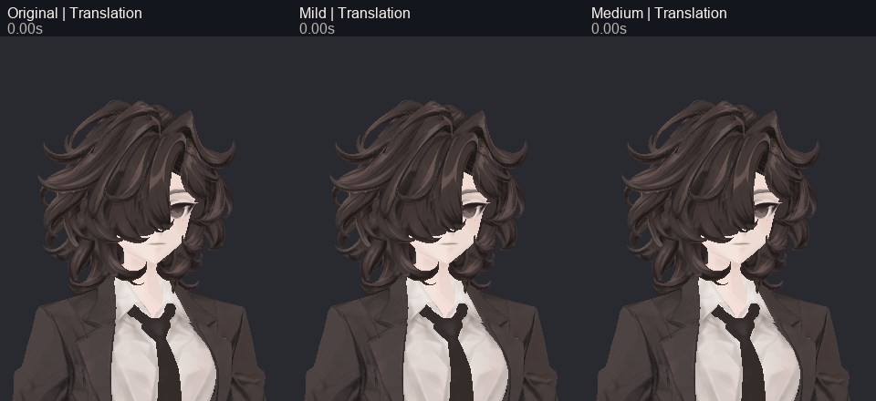
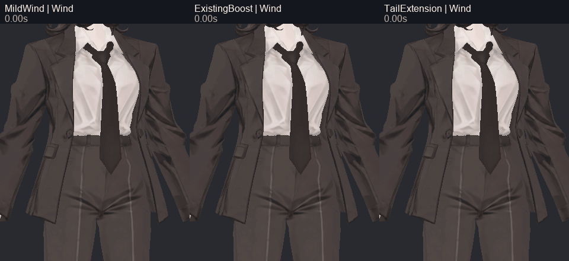
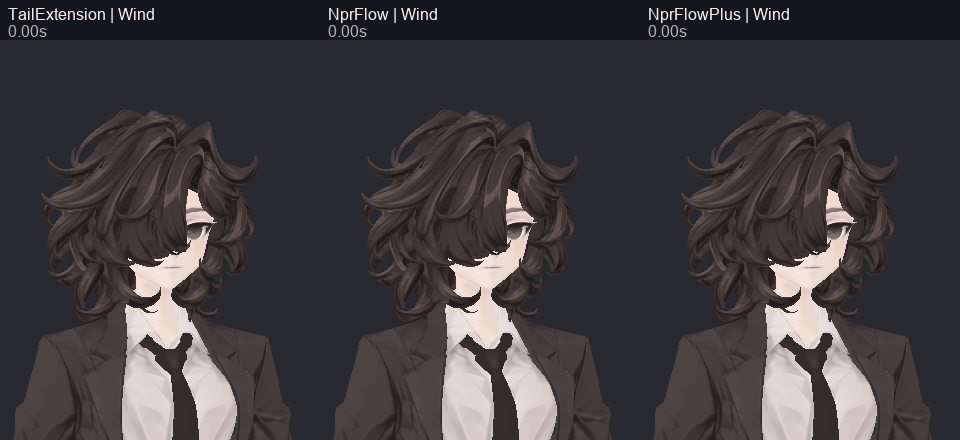

> **기록 시점 안내:** 아래는 해당 단계 당시의 보고서입니다. 후속 결정은 [최신 상태](../../STATUS.md)를 기준으로 읽어주세요. 모델·원본 텍스처·검증 원시 데이터는 이 문서 공유본에 포함하지 않습니다.

# v347 헤어·넥타이 움직임 개선 비교

넥타이 본은 이미 있었지만 바람 입력이 없었다. 헤어는 물리 반응도 작고 표면의 본 분담도 낮아, 본이 움직여도 머리카락이 거의 고정되어 보였다. 물리 설정, 기존 웨이트 강화, 가닥 추가 분담, 바람 입력을 분리해 실제 Unity SDK에서 비교했다. 최종 접촉 보완과 전달은 [v348](../v348_final_npr_review/v348_WORK_REVIEW.md)에 이어진다.

## 같은 입력으로 비교

사진을 나란히 놓은 것과 달리, 실제 계산은 같은 월드 원점에서 후보 하나씩 새로 생성했다. 60Hz로 본 좌표를 기록했고 GIF는 매 10번째 실제 프레임인 6Hz다. 이동 입력 4초 뒤 6초 복귀, 바람 입력 10초 뒤 10초 복귀를 포함한다. 중간 구간을 정지 사진으로 채우지 않았다.

## 원인과 변경 범위

- 기존 헤어 정점 중 약 48.89%만 헤어 본 영향을 받았고 면적 기준 평균 분담은 약 7.33%였다. 연결된 작은 가닥 12개는 머리 본에 고정되어 있었다. 모두 흔들지 않고 뒤/옆의 긴 두 가닥을 추가 비교했다.
- 기존 양의 헤어 웨이트를 1.8배, 합계 상한 0.70으로 조정하고 두 가닥은 뿌리 첫 20%를 고정한 채 끝 최대 0.60을 기존 본에 분담했다. 좌표·UV·노멀·shape key·본 계층을 바꾸지 않았다.
- 넥타이 `tie_anchor → tie_01 → tie_02 → tie_03 → tie_tip`를 유지했다. 중복 본은 추가하지 않았다. 물리 복원/관성 설정과 기존 anchor 바람 입력을 비교했다.
- PhysBone의 복원력·스프링·고정 강도·관성 반응과 충돌/각도 제한은 서로 다른 역할이다. 큰 진폭만 목표로 하지 않고 형태와 복귀를 함께 검사했다. [VRChat PhysBone 공식 문서](https://creators.vrchat.com/common-components/physbones/).

위 색은 대상 가닥을 보여주는 진단 표시이며 최종 헤어색이 아니다. 기존 129본과 몸 관절은 유지한다. TailExtension은 Blender 9,509정점, Unity UV 분리 정점까지 9,925개에 대응한다. 위치·UV·본 이름으로 대응했고 정점 번호를 그대로 복사하지 않았다.

## 후보별 선택·미채택

| 후보 | 판단 |
|---|---|
| Original | 원래 동작 기준 |
| Mild / Medium | 설정만 조정. 이동 반응은 커졌으나 첫 시각 검토에서 충분히 읽히지 않음 |
| MildWind | 없던 넥타이 바람 반응을 추가했지만 표현이 작음 |
| ExistingBoost / TailExtension | 기존 웨이트 강화와 두 가닥 분담을 분리해 비교. 형상 재생성 없이 표면 반응 증가 |
| NprFlow | Medium 물리 + TailExtension + 헤어/넥타이 바람. 다음 검수 후보로 선택 |
| NprFlowPlus | 웨이트 2.8배/상한0.80. 가독성의 추가 이득이 뚜렷하지 않아 미채택 |
| NprFlowSafe 첫 통합 | chain01 바람을 2.25→1.9로 줄였으나 미세 Head 콜라이더 접촉은 완전 제거되지 않음. 실제 표면 검사에서 뒤목 카라와 넥타이 시작부의 새 교차를 발견해 그대로 전달하지 않음 |
| 후속 TailClearance | 새 chain00 가닥 분담을 0.4배(끝0.24)로 낮추고 넥타이 앞뒤 anchor 바람을 제거. [최종 실제 재검사](../v348_final_npr_review/v348_WORK_REVIEW.md)에서 판정 |

NprFlow 바람의 최대 팁 이동은 헤어 약16.84mm/넥타이16.58mm였다. 최종 보완 후 값과 표면 접촉은 v348 기록을 기준으로 한다. 첫 HeadYaw에는 반복 약0.9mm 수준의 재현 차이가 있어 이를 웨이트 효과로 해석하지 않았다. NprFlow/Plus의 본 궤적이 같아도 표면 웨이트는 다를 수 있다.

## 검토에서 고친 검사 문제

첫 월드 위치별 나란한 실행은 회전과 위치가 섞이는 오류가 있어 미채택했다. SDK 후처리 전 캡처 문제도 `OnFrameCompleteLate` 이후 기록으로 교체했다. 바람 마스크는 정확히 Gentle wind만 바꾸고 관절 측정·보정 레이어는 유지했다. 원형 보존 검사에서 Unity 재정규화의 약1e-7 차이는 허용오차로 기록했으며 완전 동일이라고 과장하지 않았다.

상세 시도는 [과정·미채택 기록](v347_PROCESS_AND_REJECTIONS.md)에 있다. 물리가 정상 복귀하거나 큰 관통이 눈에 보이지 않는다는 사실만으로 표면 무교차를 선언하지 않았다. 최종 30fps 영상, 뒤목/넥타이 교차 보완, 본·관절 전체 결과와 실제 전달 파일은 v348에서 함께 제공한다.

전체 실험 GIF 캐시는 로컬에 보존하고 작업 저장소에는 위 대표 GIF, 모든 비교 정지/시간대 그림과 원시 본 기록·재현 코드를 수록한다. 최종 v348은 7동작×4시야 GIF와 30fps MP4를 별도로 전달한다.
