> **기록 시점 안내:** 아래는 해당 단계 당시의 보고서입니다. 후속 결정은 [최신 상태](../../STATUS.md)를 기준으로 읽어주세요. 모델·원본 텍스처·검증 원시 데이터는 이 문서 공유본에 포함하지 않습니다.

# v348 상세 작업 보고 — 무엇을 바꾸었고, 무엇이 남았는가

이 문서는 v345 계획을 실행한 **v346 텍스처 / v347 움직임 / 셰이더 v005 / v348 통합 검수**를 한곳에서 읽을 수 있도록 보강한 보고서다. 짧은 완료 안내에서 빠졌던 부위별 작업, 실패한 시도, 선택 근거, 실제 검사 범위와 남은 일을 정리한다. v345의 실행 보류 문구는 계획 당시 기록이며, 이후 사용자의 제작 승인에 따라 v346부터 실행했다. 이번 문서 보강에서 모델을 새로 수정한 것은 아니다.

핵심 결과는 세 가지다. 첫째, 기존 캐릭터 형상을 유지하면서 얼굴·헤어·의상 안쪽·신발의 채색을 NPR 방향으로 정리했다. 둘째, UV를 다시 펼치는 대신 실제 전사 과정의 가림 판정 오류를 고쳐 반복 점선과 빗살을 제거했다. 셋째, 헤어·넥타이의 움직임을 개선하고 최종 검수에서 발견한 두 셔츠 교차까지 수정했다. **전 부위의 모든 텍셀을 새로 그렸거나, 기존 접촉까지 전부 없앤 결과는 아니다.**

읽는 순서: [계획과 실제 범위](#scope) → [부위별 전후](#textures) → [UV와 전사 실패](#uv) → [그림자·노멀 비교](#shader) → [본·움직임 개선](#motion) → [전체 검수](#validation) → [남은 이슈](#remaining) → [전달 파일](#delivery).

## 1. 사용자 요청과 실제 수행 범위

| 요청 | 실제 수행 | 현재 판정 |
|---|---|---|
| 고품질 애니메이션·일러스트 같은 NPR | 선·색면·큰 접힘을 우선하고 흐린 반사와 불규칙한 얼룩을 줄임. 같은 텍스처에서 재질 A/B/C/D 비교 | D를 검수 후보로 선택. 사용자 최종 미감 승인 전 |
| 헤드 전체 재작업 | 얼굴·헤어 기본 6방향, 정면 얼굴 보완, 얼굴/헤어 안쪽 및 잔여 채색 | 전 범위를 대상으로 검사하고 재채색·보완. 모든 텍셀이 교체된 것은 아님 |
| 팔·코트·다리의 안쪽까지 | 전체 삼각형 분류를 사용해 소매, 코트 앞/뒤, 바지 안쪽을 격리하고 기본색과 실제 자세로 확인 | 주요 번짐·반복 전사 오류 수정. 구조를 따르는 짙은 주름은 유지 |
| 신발 선·텍스처 정리 | 양 신발 앞·옆·뒤·위·바닥, 스트랩·굽·밑창을 다시 채색 | 넓은 흐린 반사 감소. 봉제선·층 구분 보존 |
| 단추처럼 선명하되 디테일 유지 | 단추 구멍·실·테두리는 기존 결과 유지, 주변 소매 천 재채색 | 단추 새 제작 없음. 커프스 아래 사각 명암 경계는 남음 |
| UV도 필요하면 재작업 | v343 UV·재질별 연결과 전사 오류를 진단 | 이번에는 새 전개·재배치 없음. 기존 UV에서 전사 계산을 수정 |
| 그림자를 텍스처/노멀 중 어디에 둘지 비교 | 고정 명암 중심 A, 대비 감소+툰 B, bevel normal C, 혼합 D를 실제 생성·렌더 | D 채택 후보. 색의 밝기를 그대로 높이로 바꾸는 방식은 미채택 |
| SiuSiu 참고 | 실제 SiuSiu 프리팹을 같은 조명/카메라 조건으로 비교 | 얼굴·머리 표현 참고. 동일 코트나 동일 체형 비교는 아님 |
| 헤어·넥타이가 뻣뻣한 문제 | 기존 본 유무·물리·웨이트·바람 입력을 분리해 후보 비교 | 새 본 없이 개선. 뒤목 가닥과 넥타이 시작부의 교차를 추가 보완 |
| 모든 관절·본 재검사 | 129본 구조, Humanoid 51개 매핑·86채널, 299 정적 자세·121 연속 입력 표본·복귀 | 검사 실행 완료. 기존 극단 자세 압축/접촉은 남음 |
| 사진 외 움직임 자료 | 7동작×4시야 GIF 28개, Head/Tie 이동·바람의 30fps MP4 4개 | 실제 SDK 결과를 촬영. 모든 영상 프레임의 육안 전수검사까지 한 것은 아님 |
| 별도 검토 에이전트 | 시각과 기술 첫 판단 분리, 수정 후 재검토 | 시각에서 놓친 숨은 교차를 기술 검토가 찾아 수정한 사례 포함 |
| 원형·승인 무릎·손가락 유지 | 원본/후보 분리, 좌표·면·UV·노멀·본·키 비교 | 최종 Blender에서 의도한 헤어 웨이트 외 비교 항목 동일 |
| 작업 문서·main 공유 | 각 단계 원문, 전후 그림·실패 이유·원시 근거를 작업 저장소에 보존. 문서 저장소에는 선별 보고·렌더·GIF | 두 저장소 main에 게시. 아래는 실제 파일을 기준으로 설명 |

### 실제 작업이 들어간 네 폴더

| 폴더 | 들어 있는 작업 | 최종 연결 |
|---|---|---|
| `v346_npr_texture` | 채색 지시·결과 21항목, 다방향/가림 면 전사, 경계 오류 수정, Blender 텍스처 사본, 실제 전후 사진 | 최종 기본색 공급 |
| `v347_secondary_motion` | 물리/웨이트/바람 후보, 같은 원점의 실행 기록, 강한 후보·실패한 검사 보존 | TailClearance 웨이트와 보완된 바람으로 연결 |
| 셰이더 `v005_npr_roles` | A/B/C/D 재질, bevel normal·선택 마스크, SiuSiu 포함 186장 렌더 | D 재질 사용 |
| `v348_final_npr_review` | 통합 프리팹/Blender, 실제 관절·본·물리 재검사, 새 교차 수정, GIF/MP4, 전달 패키지 | 현재 검수 후보 |

파일 개수나 채색 지시 수를 완성도 점수로 사용하지 않는다. 원본 보존, 반복 실험, 검사 오류 수정도 파일에 포함되므로 모든 파일을 서로 다른 완성 후보로 세지 않는다.

## 2. 얼굴 — 눈·입·귀·턱·목 (T14·R01)

문제는 형상 자체의 교체가 아니라 눈꺼풀·입선·볼/턱의 채색이 부드럽게 번지고 작은 색 블록이 남는 것이었다. 기존 눈 위치·졸린 눈매·작은 입과 얼굴 비례를 유지하면서 정면과 양 측면, 아래쪽, 가림 면을 다시 채색했다.

첫 얼굴 결과에는 눈꺼풀이 중복되거나 턱 윤곽이 너무 강해지는 문제가 있었다. 이를 최종 얼굴로 사용하지 않고 정면 보완과 깨끗한 얼굴 시트, 내부·잔여 시트를 거쳐 실제 모델에 다시 적용했다. 생성 시트가 그럴듯해 보이는 것만으로 끝내지 않고 모델 렌더에서 눈·입 위치와 목 연결을 확인했다.

**이 사진에서 볼 부분:** 눈 주변과 입 주변의 흐림, 머리 묶음 내부의 선/색면, 턱 아래 목의 넓은 색 변화다. 비교는 같은 기존 재질·고정 카메라로 촬영했으므로 이 차이를 최종 D 셰이더의 효과와 섞지 않는다. 모든 미세 명암을 지운 완전한 단색 피부는 아니다.

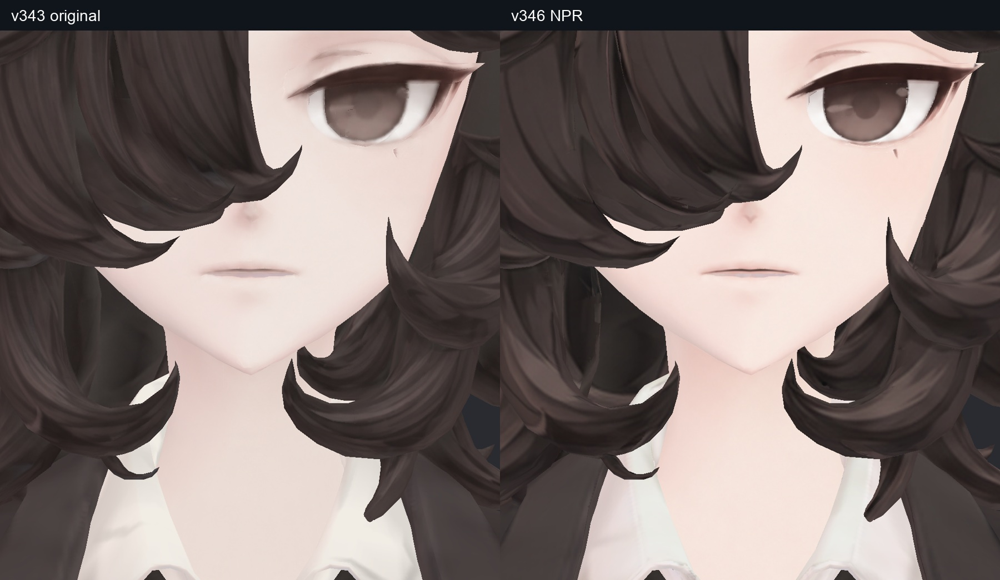

외부 귀·턱·목의 넓은 얼룩 재발은 최종 검수에서 발견하지 않았다. 다만 얼굴 셸 내부에서 겹친 면 경계를 따라 미세 점상 표시가 일부 남는다. 내부 겹침과 외부 피부 번짐을 구분하며, 이 잔여까지 완전히 제거했다고 표기하지 않는다.

위의 구멍·뒤집혀 보이는 눈·잘린 외곽은 가리는 표면을 제외하고 열린 셸을 안쪽에서 본 검사 화면이다. 새 얼굴 형상을 만들거나 모델에 구멍을 뚫은 결과가 아니다.

## 3. 헤어 — 앞·옆·뒤·정수리·끝·안쪽 (T12–13)

원래 컬의 길이와 실루엣을 유지했다. 가닥마다 흐릿한 평행 붓자국을 늘리는 대신 큰 묶음을 읽을 수 있는 어두운 선과 제한된 하이라이트 면을 사용했다. 기존 미세 명암선의 수는 일부 줄었지만, 컬의 경계·흐름·겹침을 설명하는 디테일을 우선했다.

기본 시트 뒤에도 내부 표면과 일부 잔여에 채색이 닿지 않아, 헤어 안쪽 격리 시트와 잔여 시트를 추가했다. 헤어를 숨긴 채 얼굴만 보거나 겉면 한 장만 보는 검사로 대체하지 않았다.

**보존한 요소:** 원래 말린 끝, 가닥 묶음, 앞머리로 가려지는 범위, 머리 길이와 전체 부피다. 추가 레퍼런스의 더 긴 머리를 그대로 이식하지 않았다. 뿌리 근처 작은 흰 점은 이전 v344에도 같은 위치에 있었고, 이번 신규 회귀로 세지 않았다. 헤어–얼굴/코트의 기존 겹침은 별도 잔여다.

## 4. 코트·팔 안쪽 — 어두운 주름과 얼룩을 구분

사용자가 표시한 코트 옆 패널, 겨드랑이, 소매 안쪽과 팔을 들 때 보이는 부분을 별도 표면으로 분리했다. v343의 일부 몸통/바지 작업은 패널 채색에 의존했으므로, 이번에는 전체 삼각형을 전사 대상으로 추적했다.

코트는 앞·뒤/안쪽을 나눠 주머니 덮개, 라펠 경계, 허리 접힘과 주변 색면을 정리했다. 코트 뒤 허리의 V자 주름과 소매 안쪽의 큰 대각 접힘은 형상/기존 주름과 연결되어 있어 유지했다. 참고 이미지에 안쪽이 가려져 있다는 이유로 모든 검은 부분이 의도됐다고 가정하지는 않았다.

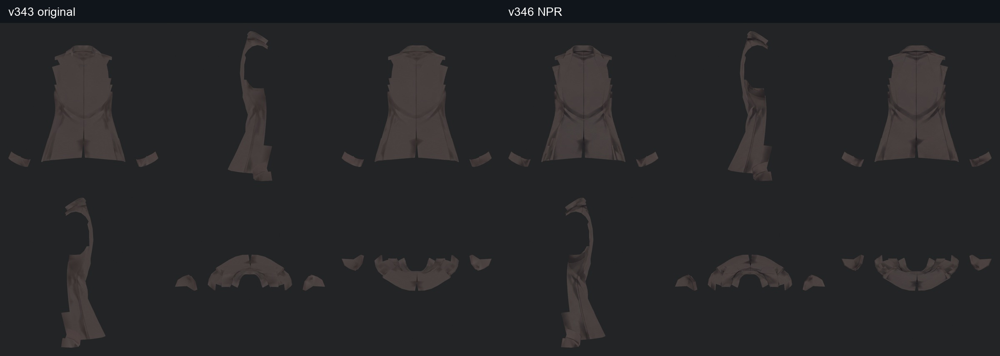

**사진의 읽는 법:** 기본색 격리 사진에서도 남는 넓은 명암은 채색 기여가 있다. 그것이 실제 접힘을 설명하는지, 형태와 무관하게 흩어진 얼룩인지 구분했다. 큰 접힘을 남겼으므로 수정 후에도 검은 색면은 존재한다. ‘안쪽을 전부 밝고 평평하게 만들었다’는 작업은 하지 않았다.

최종 팔 올리기/앞모으기/숙임에서도 별도로 확인했다. 정지 상태에서만 숨기는 방식으로 완료 처리하지 않았다. 실제 자세는 아래 최종 관절 갤러리에서 연결된다.

## 5. 소매 단추·카라·넥타이 접경·셔츠·작은 장식

단추 구멍·실·홈·개수는 기존에 정리된 결과를 보존했다. 소매 천의 흐린 명암은 다시 정리했지만 단추를 단순한 원으로 재생성하지 않았다. 아래 사진처럼 단추 밑 천의 사각/대각 톤 경계가 여전히 보이며 새 채색에서 더 뚜렷해 보이는 구간도 있다. 독립 검토는 기존 커프스 겹침과 대응한다고 보아 삭제를 권하지 않았으나, 경계가 사라졌다는 뜻은 아니다.

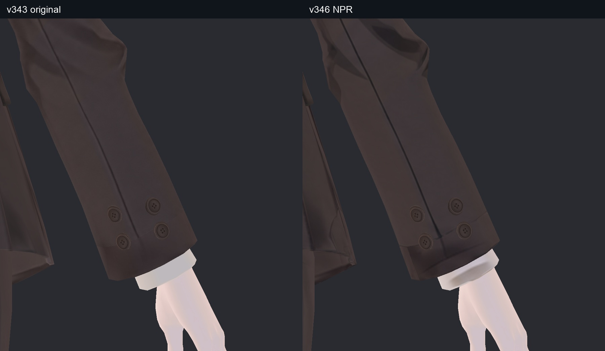

| 이전 항목 | 이번 판단 | 실제 조치 |
|---|---|---|
| T01 카라 아래 회색 삼각형 | 카라의 겹침/접촉 명암과 대응 | 유지, 주변 셔츠 색면 정리 |
| T02 셔츠 밑단 삼각 주름 | 레퍼런스의 큰 접힘에 대응 | 유지, 셔츠 전체를 단색화하지 않음 |
| T03 라펠 안쪽 | 실제 접힘과 고정 명암이 함께 존재 | 접힘 유지, 주변 불규칙 채색 정리 |
| T04 주머니/허리 단추 주변 | 천의 흐린 경계 정리 대상 | 코트 재채색, 주머니·단추 구조 유지 |
| T05 겨드랑이·소매 | 얼룩과 깊은 주름이 섞임 | 불규칙한 번짐 정리, 큰 주름 유지 |
| T06 손목 단추 주변 | 천 색과 겹침 경계가 섞임 | 주변 천 재채색, 단추 자체 보존 |
| T11 허리 장식 | 이전 정리된 장식의 상태 재확인 | v343 결과 유지. 이번에 모두 새로 그린 항목이 아님 |
| R02 매듭 아래 | 매듭 접촉 명암 | 유지. 과거 카라 안쪽 흰 띠 이슈와 구분 |
| R03 단추 외곽 | 낮은 면 수의 형상과 채색/필터링 영향이 함께 있음 | 형상 변경 없이 유지. 텍스처만으로 완전한 원으로 만들지 않음 |

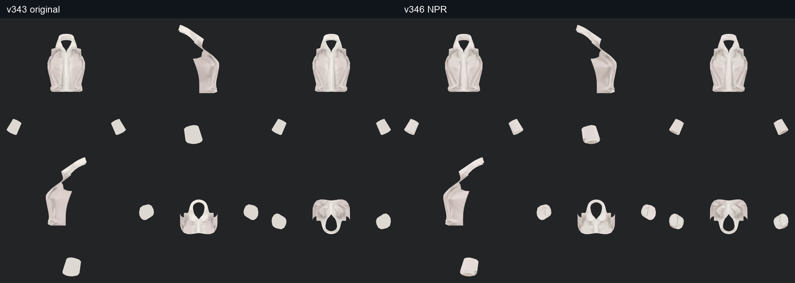

손도 좌우/여러 방향으로 다시 확인했지만 v346에서 새 채색을 덮지는 않았다. 손과 작은 장식의 직접 전사율이 0인 것은 누락 수치를 숨긴 것이 아니라 **검수 후 기존 텍스처를 유지한 범위**다. 소매 단추 선명도를 다른 모든 부위에 무조건 강한 외곽선으로 복제하지 않았다.

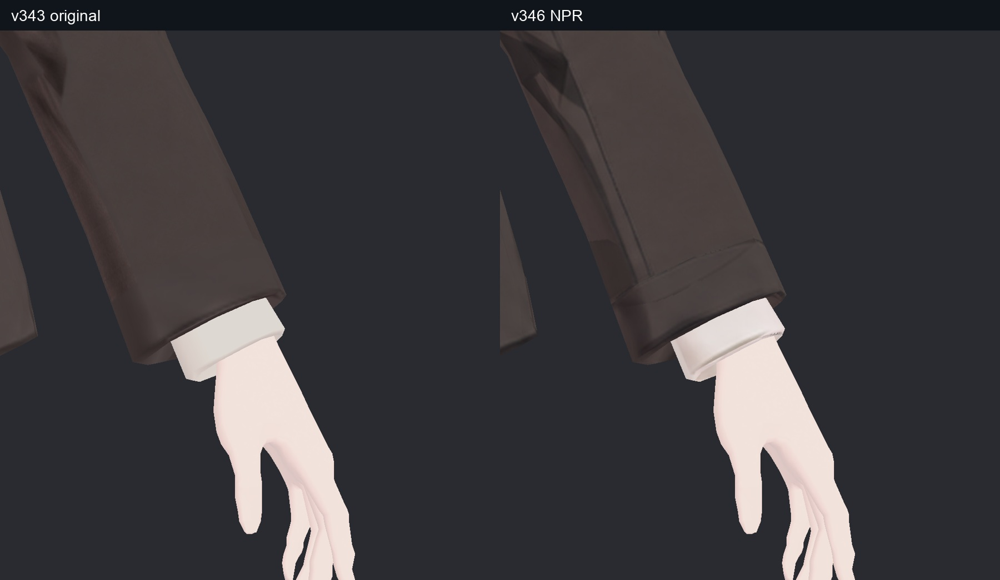

## 6. 바지·다리 안쪽 — 허벅지 아래부터 밑단까지 (T07–08)

좌우 바지의 중심선, 허벅지 옆/아래, 무릎 뒤, 종아리와 밑단을 작업했다. 평상시 코트에 가려지는 부분도 격리했고, 고관절을 굽힌 실제 자세로 다시 확인했다. 중심 다림질선과 접힘을 남긴 채 주변의 흐린 얼룩을 정리했다.

큰 수정 중 하나는 바짓단에 새로 생긴 반복 점선/빗살의 제거다. 처음에는 빈 경계 픽셀에 이전 색이 남아 생긴 것으로 보았으나, 이미 채색된 픽셀 안에도 같은 현상이 있어 가림 판정 자체를 다시 구현했다. 처리 과정은 8절에 적었다.

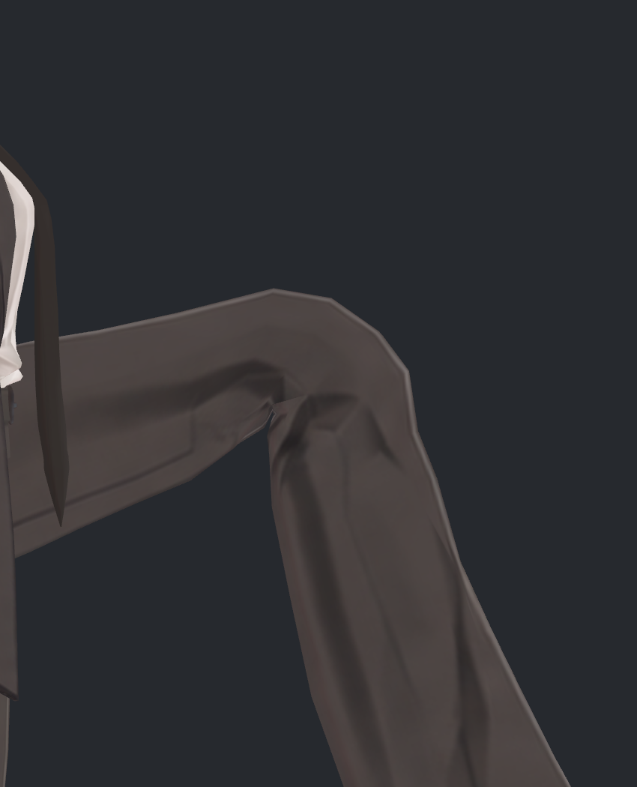

**남아 있는 것:** 무릎 뒤와 종아리의 긴 짙은 명암은 기존 접힘을 따라 남는다. 새 NPR 채색에서 주름 대비가 더 강해 보일 수 있다. 반복 오염과는 구분했으며, 이를 모두 제거하거나 이미 승인된 무릎 형상을 다시 둥글게 만드는 작업은 하지 않았다.

## 7. 신발 — 앞코·스트랩·옆선·굽·밑창 (T09–10)

처음 작업한 오른 신발은 앞코/뒤꿈치에 넓고 흐린 반사가 남아 추가로 다시 그렸다. 이후 양쪽 신발의 안쪽·바닥까지 별도 시트로 보완했다. 목표는 현실적인 가죽 얼룩을 늘리는 것이 아니라 신발의 층과 재단 구조가 명확하게 읽히는 것이다.

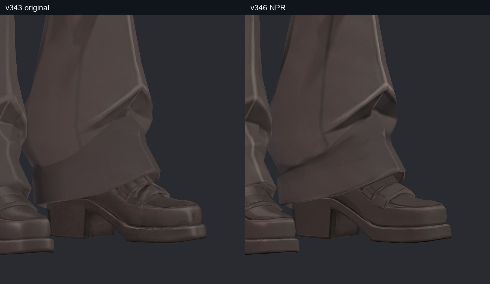

**바꾼 것:** 넓은 흐린 밝은 띠, 불규칙한 얼룩과 흐릿한 경계를 줄였다. **남긴 것:** 앞코 형태, 스트랩, 봉제선, 굽과 밑창의 층이다. 사진적인 미세 얼룩과 반사까지 모두 원본처럼 남기는 방향은 선택하지 않았다. 선의 수가 줄었다는 사실만으로 디테일을 보존했다고 주장하지 않고, 어떤 구조를 설명하는 선이 남았는지 위 사진에서 판단해야 한다.

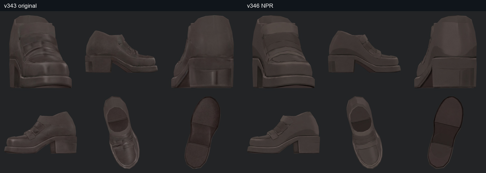

## 8. UV를 다시 펴지 않은 이유와 전사 과정의 근본 수정

### 사용한 UV

이번 출발점은 v343이다. Head는 `V343_UV`, Paint 재질은 `V341_UV`를 사용한다. Paint가 실제 사용하는 면에서는 V343/V341 좌표 차이가 0이어서 노멀 베이크/전사에 V343 좌표를 참조해도 해당 면의 위치 불일치는 없었다. 기존 UV 전체·활성 UV·렌더 UV를 보존 검사했다.

새 전개를 한 뒤 이전 것으로 되돌린 것이 아니라, **v346에서 새 전개를 하지 않았다.** 이번 반복 오류는 잘못된 가림 계산과 경계 처리에서 재현됐다. UV를 새로 펼쳐도 그 계산을 그대로 쓰면 같은 종류의 오류가 다시 생길 수 있어 원인 계산부터 수정했다. 모든 향후 UV 개선이 불필요하다는 결론은 아니다.

### 실제 제작 경로

1. 기존 삼각형·UV·표면 부위를 추출하고 부위별 6방향 가이드를 만들었다.
2. 모델 형상·카메라 위치를 유지하는 채색 지시를 작성했다. 원래 레퍼런스와 추가 일러스트는 선/색면의 참고로 사용했다.
3. 생성 채색을 기존 UV에 전사하고, 실제 모델에 적용해 다시 렌더했다.
4. 가림 때문에 닿지 않은 헤어·얼굴·코트·신발·셔츠는 격리 시트를 추가했다.
5. 전사 경계, 가림 판정, 배경 혼입을 고친 뒤 같은 부위와 인접 면을 재검사했다.

기록에는 기본 face/hair/coat/좌우 sleeve·pants·shoes/shirt, 정면 얼굴, 내부 시트와 잔여 시트, 얼굴/오른 신발 재시도 등 **21개 채색 지시·결과 항목**이 있다. 21개 완성 아바타를 만든 것은 아니다. 현재 생성 폴더의 19장과 거부된 얼굴/신발 2장을 구분해 보존했다. 생성 6방향 시트는 1536×1024로 한 칸이 약 512×512이며, 최종 4096×4096 아틀라스 2장에 전사했다. 따라서 네이티브 4K 재채색은 아니다.

### 시도와 미채택 이유

| 순서 | 시도 | 발견한 문제 | 후속 판단 |
|---|---|---|---|
| 1 | 픽셀의 삼각형 ID/깊이를 참조 | 삼각형 경계에서 일부 픽셀이 전사되지 않고 이전 색이 남음 | 바지 24,276픽셀의 잔류와 경계 집중 확인 |
| 2 | 같은 UV 차트의 빈 픽셀만 보완 | 이미 채색된 영역에도 빗살이 남음 | 이것만으로 해결했다고 보지 않음 |
| 3 | 연결 인접면과 깊이 기울기 허용 | 카메라 선택 불연속이 충분히 제거되지 않음 | 미채택 |
| 4 | 주변 3×3 픽셀 ID로 연속 깊이 계산 | 픽셀 중심을 덮지 않는 얇은 가림면 누락 | 독립 검토 반례로 미채택 |
| 5 | 모든 투영 삼각형의 화면 범위를 8픽셀 타일에 등록 | 후보 누락은 해결했으나 극도로 얇은 헤어 삼각형에서 수치 오류 | 불안정 계산 사본 미채택 |
| 6 | 중심 좌표의 역행렬, 퇴화/조건수 검사, 정점 깊이 보간 | 선택 표본에서 실제 앞면 깊이와 일치 | 최종 채택 계산 |
| 7 | 같은 차트의 미전사 픽셀 최대 4px 보완 + 바깥 여백 6px | 빈 경계 보완. 기존 채색 픽셀은 그대로 유지 | 실제 모델에서 반복 빗살 재검토 |

회색/검은 NPR 선을 배경으로 오인하는 조건도 고쳤다. 내부 시트의 배경이 헤어 외곽으로 섞이는 문제는 시트 가장자리 사용 조건을 조정했다. 임의로 전체 이미지를 흐리게 만들어 경계를 숨기는 방법은 사용하지 않았다.

독립 기술 검토의 **5,975개 광선×앞/동일/뒤 깊이 = 17,925개 판정**이 별도 교차 계산과 일치했다. 이는 선택한 광선의 산술 검사이지 모든 텍셀의 미감 합격률이 아니다. 전체 전사 108시야에서는 앞면을 찾지 못한 질의 2,584건을 거부했다. 선택 표본의 일치를 전체 질의의 누락 0으로 확대하지 않는다. 최종 Unity에서 반복 빗살이 제거됐는지는 실제 사진으로 다시 확인했다.

### 실제 새 색이 닿은 범위

아래는 경계 보완 **전**, 아틀라스에서 각 부위가 차지하는 픽셀 대비 직접 전사된 픽셀 비율이다. 물리 표면 면적 비율이나 사용자 요구 완료율이 아니다.

| 아틀라스 / 부위 | 해당 픽셀 | 직접 전사 픽셀 | 직접 전사율 |
|---|---:|---:|---:|
| Head / 헤어 | 5,469,245 | 4,733,175 | 86.54% |
| Head / 얼굴 | 713,604 | 646,122 | 90.54% |
| Paint / 왼 바지 | 1,750,716 | 1,749,420 | 99.93% |
| Paint / 왼 신발 | 465,797 | 465,199 | 99.87% |
| Paint / 손 | 174,331 | 0 | 0% · 기존 유지 |
| Paint / 셔츠 | 512,636 | 507,328 | 98.96% |
| Paint / 작은 장식 | 241,919 | 0 | 0% · 기존 유지 |
| Paint / 오른 신발 | 557,817 | 556,896 | 99.83% |
| Paint / 오른 바지 | 1,687,336 | 1,685,873 | 99.91% |
| Paint / 코트 | 1,660,791 | 1,649,765 | 99.34% |
| Paint / 왼 소매 | 532,318 | 530,844 | 99.72% |
| Paint / 오른 소매 | 595,888 | 595,068 | 99.86% |

Head에서 경계 보완으로 추가 채운 픽셀은 헤어 162,219개·얼굴 10,972개다. Paint도 같은 차트 안의 미전사 경계를 보완했다. 그 뒤에도 일부 가림 텍셀에는 원본이 남는다. Head 헤어는 직접 전사+경계 보완 89.51%로 기존 색 573,851픽셀, 얼굴은 92.08%로 기존 색 56,510픽셀이 남는다. 여기서 원본은 초기 제작 전 이미지가 아니라 이번 출발점 v343이다. 따라서 ‘헤드의 모든 픽셀을 새로 그렸다’는 표현은 쓰지 않는다. 전 범위 점검과 전 텍셀 교체는 서로 다른 작업이다.

## 9. 그림자를 텍스처에 그리는 방법과 노멀 대안

사용자의 질문은 단순히 샤픈을 적용하는 문제가 아니라, 어느 명암을 채색에 남기고 어느 변화를 광원에 맡길지에 관한 것이었다. 아래 비교를 실제로 만들었다. 당시 공식 자료 조사와 셰이더 코드 확인 근거는 [v005 원문](../../avatar_shader/v005_npr_roles/v005_WORK_REVIEW.md)에 있다. 이번 문서 보강에서는 외부 자료를 새로 조사한 것으로 표기하지 않는다.

| 후보 | 색/명암 처리 | 노멀 | 시각 판정 |
|---|---|---|---|
| A | v346 채색과 기존 재질 | 추가 없음 | 기본 디테일 비교 기준. 어두운 조명에서 묻히는 구간 |
| B | 의복·헤어·신발의 고정 대비 감소, 툰 그림자 강화 | 추가 없음 | 일부 가닥이 덜 읽히고 상단 광원 얼굴에 띠가 나타나 미채택 |
| C | B와 같은 색/명암 | Paint 슬롯에만 기존 형상 bevel tangent normal, 강도 0.35. Head 제외 | B의 단점을 해결하지 못하고 독립 이득이 작아 미채택 |
| D | 고정 명암은 약하게만 조절, 의미 있는 선/접촉 명암 유지, 광원 변화 완화 | 신발에만 제한된 normal0.15 | A의 디테일을 비교적 유지하고 어두운 환경이 안정적이라 통합 후보 |

### 설정은 무엇이 다른가

| 설정 | A | B/C | D |
|---|---:|---:|---:|
| 색조 연산의 감마 | 기존 유지 | 0.65 | 0.90 |
| 조명 영향을 줄이는 AsUnlit | 0.10 | 0.12 | 0.45 |
| 최소 밝기 LightMin | 0.20 | 0.30 | 0.45 |
| 그림자 강도 | 0.50 | 0.55 | 0.32 |
| 그림자 경계 흐림 | 0.55 | 0.04 | 0.06 |

D는 새 셰이더 코드를 작성하거나 고정 그림자를 물리적으로 분해한 결과가 아니라, 기존 lilToon의 마스크·감마·밝기 보정·툰 그림자 설정을 조합한 재질이다.

마스크가 적용되는 색조/대비 연산에서는 얼굴·셔츠·손·작은 장식을 제외했다. 다만 각 후보의 **조명/그림자 설정은 얼굴에도 영향을 주므로**, 얼굴 렌더가 모든 후보에서 완전히 같다는 의미는 아니다. 아틀라스별 중앙값 보정도 적용해 감마 변경만으로 전체 색이 무작정 밝아지는 것을 제한했다.

### 노멀을 추가하면 다 해결되는가

이번 C는 **기존 형상의 얕은 모서리**를 베이크한 것이다. 텍스처에 그려진 주름을 하나하나 3D 요철로 재구성한 작업은 아니다. 어두운 색을 그대로 높이로 바꾸면 갈색 염색, 그려진 그림자, 접촉 명암까지 같은 홈으로 잘못 해석할 수 있어 그 방식은 채택하지 않았다.

D에는 신발만 선택한 노멀을 사용했다. 원시 베이크에서 비정상적으로 기운 438텍셀(역방향 365개·양수지만 과도하게 기운 73개)을 중립화하고 맵 기울기를 8도로 제한했다. 이 맵 한계와 최종 D의 적용 강도 0.15는 별도 설정이다. 실제 사진에서 노멀 자체의 이득은 크다고 입증되지 않았다. D 선택의 핵심은 **낮은 조명에서도 색층과 선이 덜 묻히는 것**이다. ‘노멀을 넣어서 고품질이 됐다’고 정리하면 이번 비교를 잘못 설명하게 된다.

### SiuSiu와 무엇을 비교했는가

실제 SiuSiu 프리팹의 얼굴/헤어 명암 단계와 선 가독성을 참고했다. 당시 프리팹은 기본 탱크톱/반바지 상태여서 Bianca와 같은 코트 주름을 비교한 사진은 아니다. 이번 셰이더 비교에 Lapwing을 새로 실행해 포함한 것은 아니며, 과거 두 모델의 UV 비교와 구분한다. 원래 캐릭터의 디자인을 SiuSiu로 바꾸지 않았다.

186장은 A/B/C/D 각 28장(112장), 기본색/중성 진단 56장, SiuSiu18장이다. 186개 서로 다른 셰이더나 모든 월드 조명 검사를 의미하지 않는다. 첫 Editor 포즈 적용이 중립으로 남은 잘못된 비교는 폐기하고 실제 SDK 굽힘 표면을 재현해 촬영했다.

## 10. 머리카락·넥타이는 왜 거의 움직이지 않았는가

넥타이 본이 없었던 것이 아니다. `tie_anchor → tie_01 → tie_02 → tie_03 → tie_tip`와 PhysBone이 있었고, 기존 바람 클립에 넥타이 입력이 없었다. 머리카락은 물리 설정뿐 아니라 본이 표면에 미치는 비중이 낮았다.

기존 헤어 정점 약 48.89%만 헤어 본 영향을 받았고, 면적 기준 평균 분담은 약 7.33%였다. 작은 연결 가닥 12개는 머리 본에 고정되어 있었다. 모든 뿌리를 흔들도록 바꾸지 않고 뒤/옆의 긴 두 가닥을 추가 비교했다.

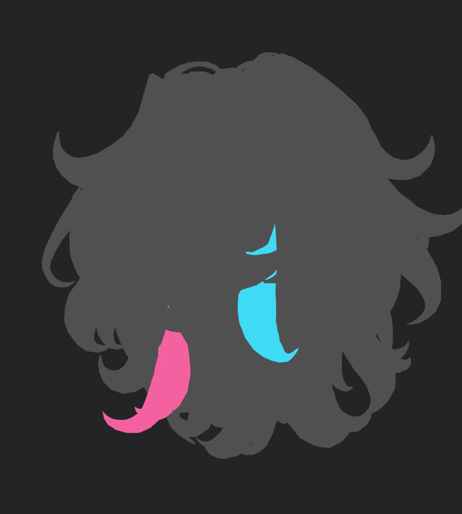

위 분홍/청록은 대상 가닥을 표시한 진단 색이며 최종 헤어 텍스처가 아니다. 새 가닥 형상을 만든 것도 아니다.

## 11. 실제로 시도한 움직임 후보와 설정

| 후보 | 변경 | 판단 |
|---|---|---|
| Original | 원래 물리·웨이트·바람 | 기준 |
| Mild | 약한 물리 조정 | 수치 반응 증가, 가독성은 작음 |
| Medium | 더 부드러운 물리 | 더 반응하지만 설정만으로 충분하다고 판단하지 않음 |
| MildWind | Mild + 넥타이 anchor 바람 | 원래 없던 바람 반응 확인 |
| ExistingBoost | 기존 헤어 본 비중 1.8배, 합계상한 0.70 | 표면이 본을 더 따라가도록 비교 |
| TailExtension | ExistingBoost + 뒤/옆 두 연결 가닥, 뿌리 첫 20% 고정·끝 0.60 | 기존 본만 사용해 추가 분담 |
| NprFlow | Medium + TailExtension + 더 큰 바람 입력 | 움직임이 더 읽혀 후속 후보 |
| NprFlowPlus | 헤어 비중 2.8배·상한 0.80, 추가 가닥 끝 0.80 | 더 강한 웨이트의 뚜렷한 미감 이득이 없어 미채택 |
| NprFlowSafe 첫 통합 | chain01 바람 2.25→1.9 | 작은 Head 콜라이더 여유 보완. 숨은 셔츠 교차가 발견돼 그대로 전달하지 않음 |
| NprFlowSafe 최종 | TailClearance 웨이트·넥타이 x0/z8 바람 | 실제 표면 교차 수정 후 재검토한 최종 후보 |

이름이 다른 후보와 동일 후보 재실행을 구분한다. OriginalRepeat는 초기 실행 변동을 측정하는 반복이고, 새 디자인 후보가 아니다. Safe라는 이름도 무충돌 보증이 아니라 내부 후보명이다.

| 물리 계수 | 기존 헤어 | 최종 헤어 | 기존 넥타이 | 최종 넥타이 |
|---|---:|---:|---:|---:|
| pull | 0.40 | 0.25 | 0.65 | 0.38 |
| spring | 0.18 | 0.28 | 0.10 | 0.22 |
| stiffness | 0.50 | 0.30 | 0.80 | 0.50 |
| immobile | 0.30 | 0.10 | 0.20 | 0.05 |

최종 헤어 바람은 기존 클립 회전을 2.25배, chain01만 1.9배로 조절했다. 넥타이 바람은 anchor 앞뒤 x0°·좌우 z8°이고 실제 입력은 바람 파라미터로 혼합된다. 표의 계수는 함께 시험한 설정이며 특정 계수 하나만의 효과를 독립 입증한 실험으로 해석하지 않는다. 기존 콜라이더·각도 제한은 보존했다.

Blender에서 헤어 9,509정점의 웨이트를 바꾸고, Unity의 UV 분리 정점을 포함해 9,925개에 대응했다. 모든 좌표·UV·본 이름으로 대응했으며 같은 정점 번호라고 가정하지 않았다. 최종 TailClearance는 새 chain00 연결 가닥의 추가 비중만 0.4배, 끝 상한 0.24로 낮췄다. 다른 추가 가닥은 끝 0.60을 유지했다. 새 본 없이 129본 구조를 유지했다. Unity의 9,925개는 변화량 1e-6 이상 기준이다. 비대상 171개의 미세한 정규화 차이를 포함하면 1e-7 기준은 10,096개이므로 다른 기준의 개수를 혼합하지 않는다.

## 12. 보기에는 괜찮았지만 다시 고친 두 교차

첫 통합 영상에서 큰 관통을 식별하지 못했지만 기술 검토가 실제 표면 교차를 찾았다. 따라서 ‘영상상 이상 없음’을 그대로 완료 판정으로 확대하지 않았다.

| 위치 | 원인과 기존 상태 | 첫 통합 문제 | 최종 수정 |
|---|---|---|---|
| 넥타이 매듭 아래 시작부 / 셔츠 | 원래 면 간격 약 0.475mm. 시작부는 tie_01 비중이 거의 100% | anchor의 앞뒤 바람이 셔츠 쪽으로 밀어 넣음. 끝 PhysBone 콜라이더 검사만으로 놓침 | 앞뒤 바람 4°→0°, 옆 바람 8° 유지 |
| 뒤목 가닥 / 카라 안쪽 | 원래 head100% 고정. 가닥의 새 본 분담이 약 0.48~0.52로 커짐 | 기존 접촉선과 떨어진 셔츠 면에 새 교차 | 해당 연결 가닥의 새 분담 0.4배, 뿌리 고정과 부드러운 분포 유지 |

첫 헤어–얼굴의 큰 교차선 일부는 기존 접촉 경계에서 약 0.42mm 떨어진 삼각형으로 이동한 사례였다. 이런 ‘접촉 상대 삼각형의 변경’과 별도 위치에 새로 발생한 셔츠 교차를 구별했다. 교차선 길이를 관통 깊이로 표기하지 않았다.

수정 후 같은 입력으로 Final을 실제 재실행했다. Original은 같은 재질/입력의 기존 기준 기록을 유지했다. 이동 20·회전 20·바람 40의 **80개 같은 시각×두 후보**에서 새 넥타이–셔츠 교차 0, 새 헤어–셔츠 교차 0을 재확인했다. 기존 헤어–얼굴/코트 경계의 교차는 남아 있으며 전체 무교차 판정은 아니다.

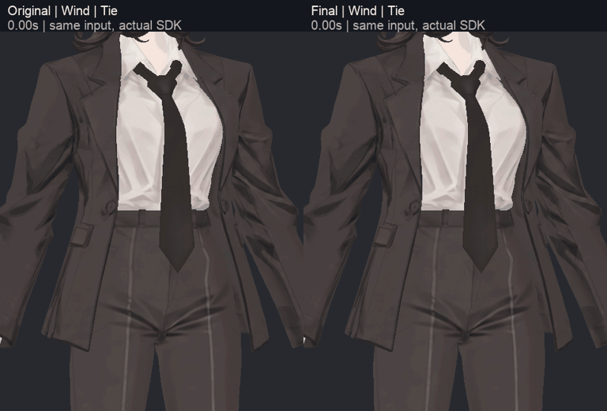

**볼 시각:** 바람 2.5~3초의 매듭 아래와 뒤목 부근, 10초 바람 종료, 이후 복귀다. 왼쪽은 Original, 오른쪽은 보완된 Final이다. 위 GIF는 최종 전후이며, 교차가 있던 첫 통합과 최종의 3열 비교 사진은 아니다. 첫 통합 MP4·원시 검사는 작업 저장소의 실험 기록에 보존했다.

## 13. 움직임 영상의 조건과 실제 차이

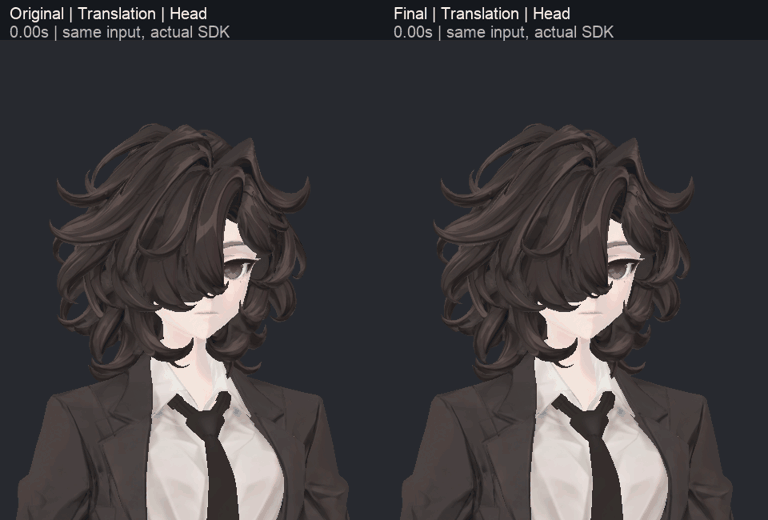

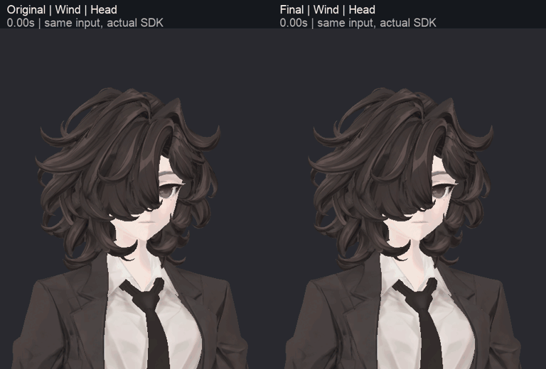

| 항목 | 촬영·계산 조건 |
|---|---|
| 후보 배치 | 같은 월드 원점에서 하나씩 새로 생성 |
| 본 계산 | SDK `OnFrameCompleteLate` 이후60Hz, 후보당4,800프레임 |
| 시작 안정화 | 90프레임 |
| HeadYaw·HeadNod·Translation·StartStop·Turn·Bend | 각각 4초 입력·6초 복귀 |
| Wind | 10초 입력·10초 복귀, `BiancaWind=0.7` |
| GIF | 실제 매 10번째 프레임,6Hz. 중간을 정지 사진으로 채우지 않음 |
| MP4 | 이동/바람의 Head·Tie 네 영상,30fps,960×650 비교 화면 |
| 카메라 | 원본/수정 동일 조건, 전신 및 근접. 같은 최종 D 재질 사용 |

최종 바람 팁 최대 이동은 헤어 16.827mm·넥타이 15.865mm다. 이는 각 구간 첫 기록 대비 최대 이동이며 미감 점수가 아니다. 실제 PhysBone 최대 본각은 헤어 5.250°/제한 25°, 넥타이 4.170°/제한 12°였다. 바람 종료 후 최종 위치의 ±0.1mm 범위에 약 0.417초/0.517초로 안정됐고 마지막 1초 기록 흔들림 0, 초기 안정 위치 대비 최종 차이 0이었다. 자연 복귀 중 강제 리셋은 없었다.

처음 후보를 서로 다른 월드 위치에 놓고 동시에 계산했던 검사는 회전/위치 효과가 섞여 폐기했다. 같은 원점 순차 검사와 Original 반복으로 교체했다. 초기 HeadYaw의 약 0.9mm 반복 차이는 원인 미분리 상태이므로 웨이트 효과로 단정하지 않았다.

검토자는 최신 MP4를 직접 디코딩해 이동 1.5~2.467초, 바람 2.5~3.467초의 30fps 연속 구간과 뒤목/매듭 아래·복귀를 확인했다. 최종은 근접에서 차이가 읽히고 전신에서는 은은한 반응이다. 매우 큰 만화식 펄럭임으로 바꾼 것은 아니다.

[7동작×4시야 전체 GIF](v348_MOTION_GALLERY.md)에서 머리 회전/끄덕임·이동·출발정지·방향 전환·숙임·바람을 각각 볼 수 있다. 코트 자락은 이번에 설정을 다시 조정하지 않고 기존 동작을 함께 관찰했다. 바람 파라미터 시험과 월드의 실제 바람 자동 감지는 다르다.

## 14. 129본·관절 검사는 어디까지 했는가

| 검사 | 범위/결과 | 의미하지 않는 것 |
|---|---|---|
| 본 구조 | 129본·51 Humanoid 매핑·86 회전 채널, 부모 누락/순환/길이 0 없음 | 129본을 각각 같은 방법으로 직접 회전한 것은 아님. 제어/앵커/끝 본 포함 |
| 웨이트 구조 | 무웨이트 정점/잘못된 본 인덱스 없음, 최대영향 4개 | 모든 표면의 변형 미감 합격을 보장하지 않음 |
| 정적 자세 | PhysBone OFF 관절 감사 299자세, 각 자세 안정화 뒤 실제 SDK 표면 기록 | 모든 가능한 자세의 전수검사가 아님 |
| 연속 입력 | 121표본, 실제 표본 사이 2 Unity 프레임 | 60Hz 연속 관절 영상 121프레임으로 표기하지 않음 |
| 전체 기록 | 정적 299+연속 121+마지막복귀 1=421, 비유한 좌표 없음 | 면적 압축/관통/텍스처 얼룩이 모두 0이라는 뜻이 아님 |
| 실제 관절 사진 | 대표·집중 35시점 | 299자세 모두를 35장 사진으로 보여주는 것은 아님 |
| 물리 표면 | 이동/회전/바람 80시각×원본/최종 | 공면·표본 사이 연속 충돌·헤어 자체 모든 교차는 제외 |
| 실제 클라이언트 | Unity SDK PlayMode/렌더 | PC VRChat 업로드·거울·스테레오 실사용은 미검증 |

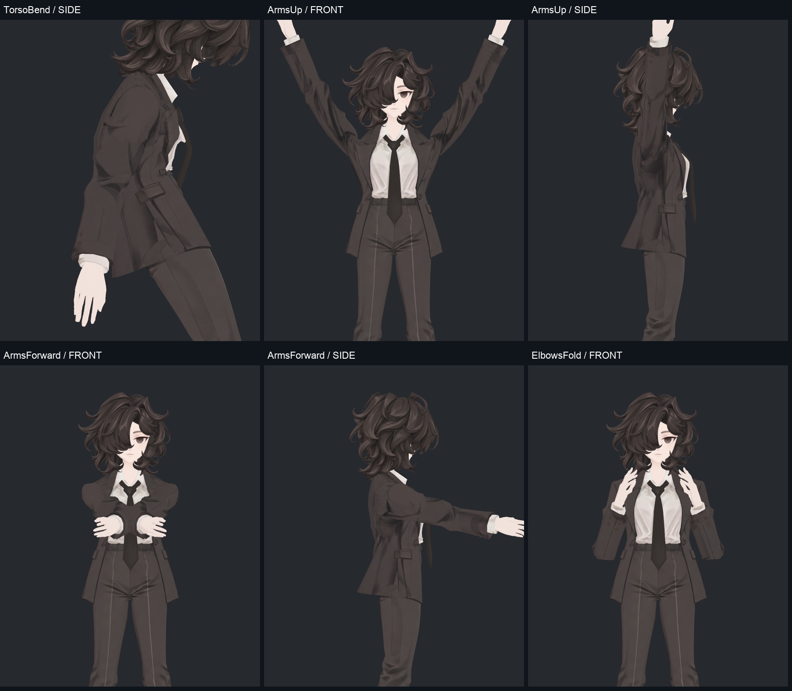

정적 검사에는 채널별 양방향, 머리/몸통 회전·숙임, 팔 올리기/앞뒤 이동, 팔꿈치/손목/주먹, 발목/발가락, 고관절·무릎 조합과 혼합 자세가 들어 있다. 관절 좌표 저장은 정적 299+연속 중간 13+복귀 1의 313기록이며, 421기록 모두를 좌표 파일로 저장한 것은 아니다. 헤어 제외 정적 회귀 비교는 300자세×2메시, 관절 접촉 후속은 선택한 43기록이다. 물리 체인은 별도 이동·바람 검사에서 확인했다. 표면 검사와 본 구조 검사를 혼합해 ‘모든 관절을 새로 수정했다’고 설명하지 않는다.

### 형상·부피는 보존됐는가

기존 Blender 메시 2개는 BodyHair 31,037점·Coat 1,736점이며, Unity에서는 UV 분리 등을 포함해 각각 32,740점·3,894점이다. BodyHair 26개·Coat 32개 shape key와 129본을 유지했다. 정점 수 차이는 엔진별 표현 차이이며 새 메시 생성 수가 아니다.

최종 Blender와 v343을 비교하면 BodyHair의 의도된 헤어 웨이트만 다르고, 코트 및 기존 좌표·면·UV·노멀·shape key·본/제약 등 비교 항목은 동일하다. Unity에서 같은 정적 자세의 헤어를 제외한 표면은 v344 대비 최대 약 0.000362mm 차이로, 설정한 0.01mm 회귀 기준을 넘지 않았다.

중심 단면은 팔/허벅지 7단면을 별도 계산했다. 대표 팔 자세의 상완 최소 폭 비율은 중립 대비 약 0.968~0.979, 고관절 대표 자세의 허벅지는 약 0.992~1.000이었다. 이 수치는 중심 폭 확인이며 무릎 접촉부의 모든 두께나 체적을 완전히 측정한 것은 아니다. 승인된 무릎과 손가락 압축을 바꾸지 않았다.

측정 도중 Blender/Unity 가져오기 배율 때문에 `BakeMesh(true)`와 좌표 변환이 중복되는지 의심했다. 실제 크기를 비교하니 이 모델에서는 현재 경로가 약1m의 정상 크기였고, 임의로 false로 바꾸면 약100m로 잘못 확대됐다. 의심을 결함으로 확정하지 않고 실제 probe로 기각한 기록도 남겼다.

본 점검표의 회전 열은 PhysBone을 끈 관절 감사 값이다. 헤어 본에 0°가 표시되어도 물리 검사에서 움직이지 않았다는 뜻은 아니다. 실제 물리 움직임은 13절의 60Hz 기록과 영상을 사용한다.

[35장 관절 사진](v348_GALLERY.md) · [129본별 부모·영향 정점·움직임 표](v348_BONE_TABLE.md).

## 15. 독립 검토에서 무엇을 지적했고 어떻게 처리했는가

| 지적 | 검토 관찰 | 조치/최종 상태 |
|---|---|---|
| 얼굴 눈꺼풀 중복·강한 턱 선 | 첫 채색의 인상 변화 | 첫 시도 제외, 얼굴 재채색·모델 재검수 |
| 신발의 넓은 흐린 반사 | 특히 오른 신발 잔여 | 깨끗한 시트로 재시도·안쪽 전사 |
| VIS026 반복 점선·빗살 | 최종처럼 보이던 전사에도 남음 | 가림 판정 산술 수정, 실제 Unity에서 제거 확인 |
| VIS027 셸 내부 점선 | 외부 피부와 내부 겹침 구분 필요 | 크게 완화, 내부 미세 경계 잔여 기록 |
| VIS008 단추 밑 톤 경계 | v343에도 있고 겹침과 대응 | 무조건 삭제하지 않음, 디테일 보존 |
| B/C 조명별 얼굴 띠·헤어 가독성 | 상단/낮은 광원에서 불리 | 미채택, D 선택 |
| 잘못된 중립 자세 비교 | 팔/다리 굽힘이 실제 반영되지 않음 | 비교 폐기, 실제 SDK 표면으로 촬영 |
| 후보 월드 위치 혼입 | 회전 반응과 위치가 섞임 | 검사 폐기, 같은 원점 순차 실행 |
| 가림면 누락/퇴화 삼각형 | 3×3 후보와 불안정 깊이 계산 반례 | 두 방식 미채택, 연속 좌표 계산 재구현 |
| 뒤목·넥타이의 새 셔츠 교차 | 육안 첫 판정으로 놓친 숨은 표면 회귀 | 특정 가닥/바람 수정, 실제 80시각에서 각각 0 재확인 |
| 콜라이더 미세 겹침 | 본 끝점 재구성에서 작은 음수 간격 | 표면 무교차와 혼동하지 않고 잔여로 기록 |

시각 검토자는 모델 외형·디테일·움직임을, 기술 검토자는 구조·UV·실제 표면·산술과 완료 주장의 범위를 확인했다. 첫 판단은 서로의 결론으로 유도하지 않았고 작업 담당이 수정한 뒤 재검토했다. 원문은 [독립 기술 검토](v348_TECHNICAL_REVIEW.md), [최종 시각 재검토](v348_VISUAL_REVIEW.md)에서 볼 수 있다.

## 16. 아직 남았거나 이번에 실행하지 않은 일

| 항목 | 현재 상태 | 후속 판단에 필요한 것 |
|---|---|---|
| 얼굴 셸 내부 미세 경계 | 일부 잔여. 외부의 넓은 피부 얼룩과는 구분 | 노출되는 각도/거리에서 실제로 거슬리는지 확인 |
| 바짓단 작은 밝은 삼각 면 | 반복 빗살은 제거, 낮은 대비 하이라이트는 남음 | 원래 접힘 표현과 불필요한 채색 중 판단 |
| 소매 단추 밑 사각 톤 전환 | 겹침 경계와 대응해 유지. 대비가 더 뚜렷한 부분 | 경계가 디자인상 과하게 느껴지는지 피드백 |
| 무릎 뒤/종아리 짙은 명암 | 기존 접힘을 따라 유지 | 주름을 남기면서 명암 강도를 더 줄일지 미감 판단 |
| 기존 헤어–얼굴/코트 접촉 | 남아 있음. 삼각형 접촉 상대의 이동 포함 | 노출 결함과 의도된 겹침을 위치별 분리 |
| Head/Neck 콜라이더 잔여 | 재구성 최소 간격 약−0.025/−0.219mm. Neck 실행 차이 원인 미분리 | 실제 표면/실행 변동과 함께 해석. 무충돌 판정 불가 |
| 모든 헤드 텍셀의 재채색 | 직접 전사되지 않은 픽셀 일부에 원본/경계 보완 존재 | 현재 시점에서 보이지 않은 면의 추가 필요 여부 |
| 전체 의상의 주름 노멀 재구축 | 미실행. 기존 bevel 보조만 비교 | 채색을 요철로 바꾸는 이득이 있는 부위별 새 실험 |
| 새 UV 재전개 | 이번에는 미실행 | 현재 좌표에서 해결되지 않는 구체적 왜곡/밀도 문제를 확인한 뒤 판단 |
| 월드 바람 감지 | 미실행. 파라미터 입력 시험 | 실제 사용 환경의 바람 입력 방식 결정 |
| PC VRChat 실사용 | 미검증 | 클라이언트·거울·스테레오·실제 이동에서 확인 |
| 사용자 최종 채택 | 아직 검수 후보 | 레퍼런스 대비 얼굴·머릿결·옷 명암·움직임 강도 피드백 |

수정 결과와 유지한 표현, 미검증 항목을 나누어 기록했다. 최종 외형 채택은 이 사진과 영상에 대한 사용자 피드백 이후 판단한다.

## 17. 실제 전달 파일과 열어볼 문서

| 목적 | 파일/문서 | 포함 범위 |
|---|---|---|
| Blender 검수 | `bianca_v348_NPR_MOTION_REVIEW.blend` | 최종 기본색·기존 형상·TailClearance 헤어 웨이트 |
| Unity 통합 전달 | `Bianca_v348_FinalReview.unitypackage` | 최종 프리팹과 필요한 Assets 의존성. lilToon/VRChat 패키지 별도 |
| Unity 직접 작업 | `Assets/BiancaNprFinal/Bianca_v348_FinalReview.prefab` | D 재질·PhysBone·보완된 바람 controller |
| 텍스처만 비교 | [v346 작업 보고](../v346_npr_texture/v346_WORK_REVIEW.md) | 같은 기존 재질에서의 전후와 가림 면 |
| 셰이더만 비교 | [v005 명암/노멀 보고](../../avatar_shader/v005_npr_roles/v005_WORK_REVIEW.md) | A/B/C/D·광원·SiuSiu |
| 움직임 후보 | [v347 작업 보고](../v347_secondary_motion/v347_WORK_REVIEW.md) | 설정·웨이트·바람을 나눈 후보와 미채택 |
| 최종 움직임 | [전체 GIF 갤러리](v348_MOTION_GALLERY.md) | 7동작×4시야 |
| 최종 관절 | [관절 갤러리](v348_GALLERY.md) / [본 점검표](v348_BONE_TABLE.md) | 35사진·129본별 정보 |
| 재현 근거 | `DELIVERY.json`, `COMPARISON_RUN.json`, `EVIDENCE_ARCHIVES.json` | 파일 해시, 어느 실행의 원본/수정인지, 압축 증거 복원 |

Blender에서 Unity의 lilToon·PhysBone과 같은 최종 화면/물리가 자동 재생되는 것은 아니다. Blender는 형상·색·웨이트 작업 사본이고 최종 재질·물리 구동은 Unity 프리팹에 있다. SiuSiu 원본을 전달 패키지에 넣지 않았다.

원시 본 JSON은 gzip, 실제 관절 베이크 입력과 물리 표면 표본은 분할 압축으로 보존했다. 해시를 확인하며 복원할 수 있는 스크립트도 포함한다. 모든 PNG 프레임 캐시는 로컬에 남기고 작업 저장소에는 대표 실험 자료와 최종 GIF/MP4를 전달했다. 문서 저장소에는 모델·원본 텍스처·생성 채색 시트·코드·원시 JSON을 올리지 않고 실제 검수 렌더와 설명만 공유한다.

### 피드백할 때 위치를 찾기 쉽게

얼굴은 2절의 눈/입/턱, 머릿결은 3절의 정면/뒤/안쪽, 의상은 4~7절의 부위별 사진, 움직임은 12~13절의 동작명·시각을 기준으로 확인하면 된다. 예를 들어 ‘오른 신발 옆면의 앞코 선’, ‘Wind 3초 매듭 아래’, ‘왼 무릎 측면의 안쪽 명암’처럼 위치를 지정하면 원래 구조·채색·재질·물리 중 어느 원인인지 이어서 확인할 수 있다.
