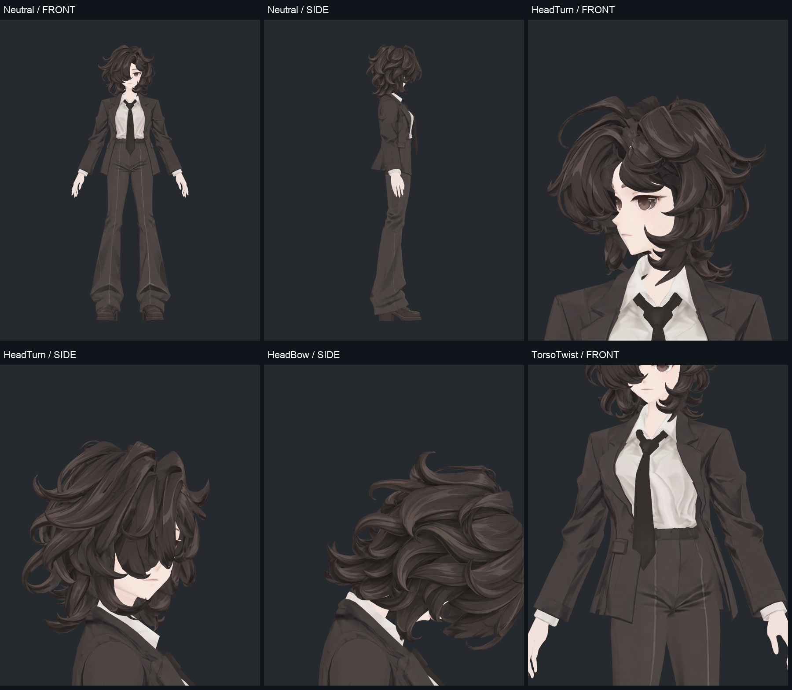
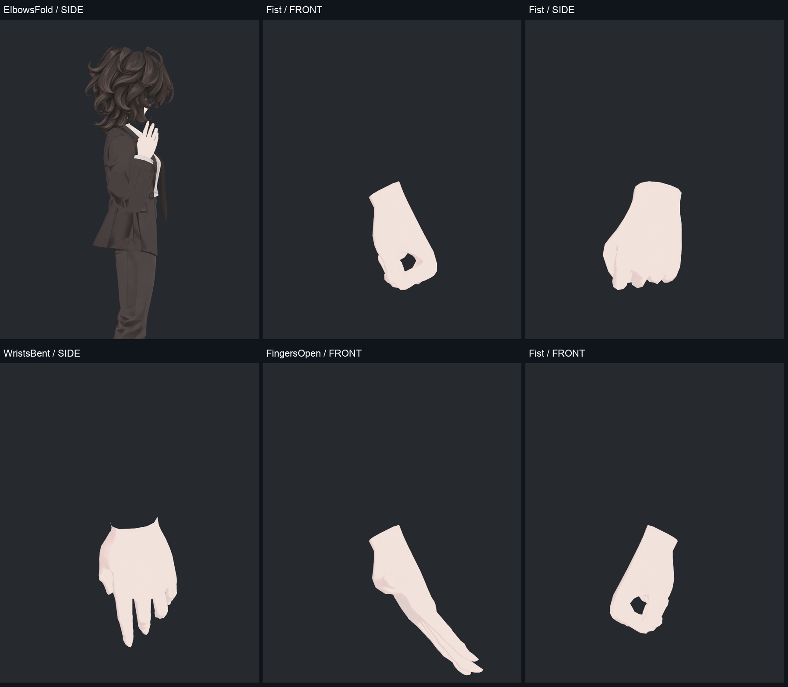
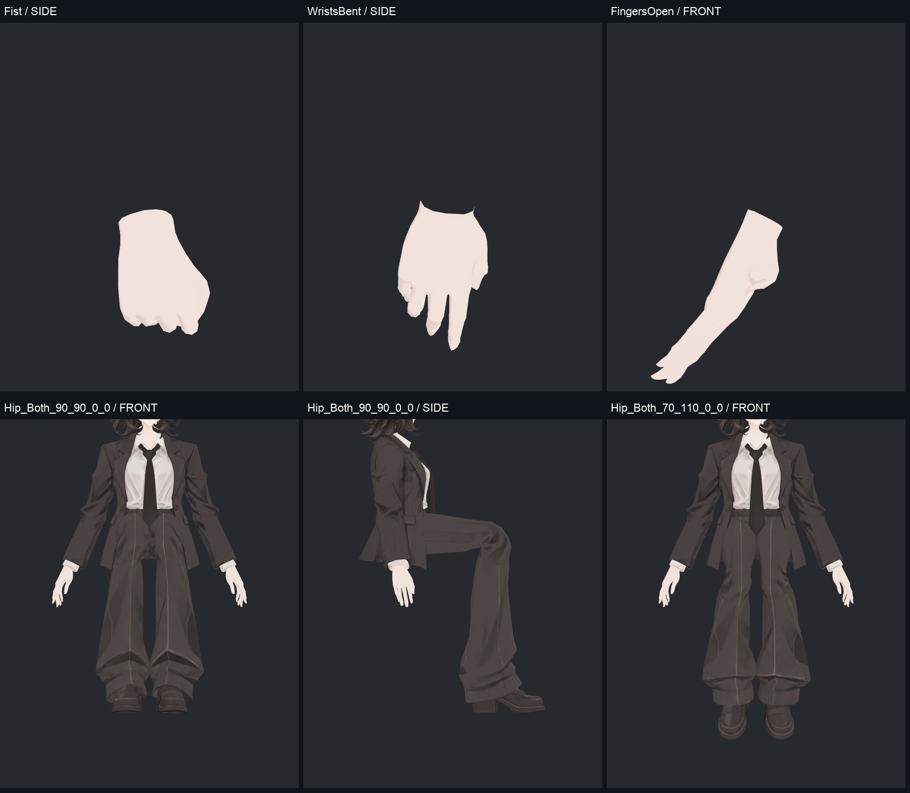
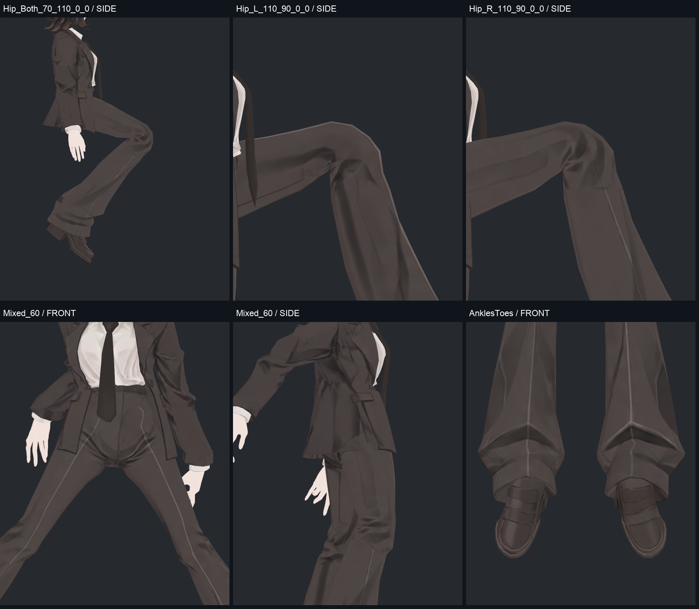
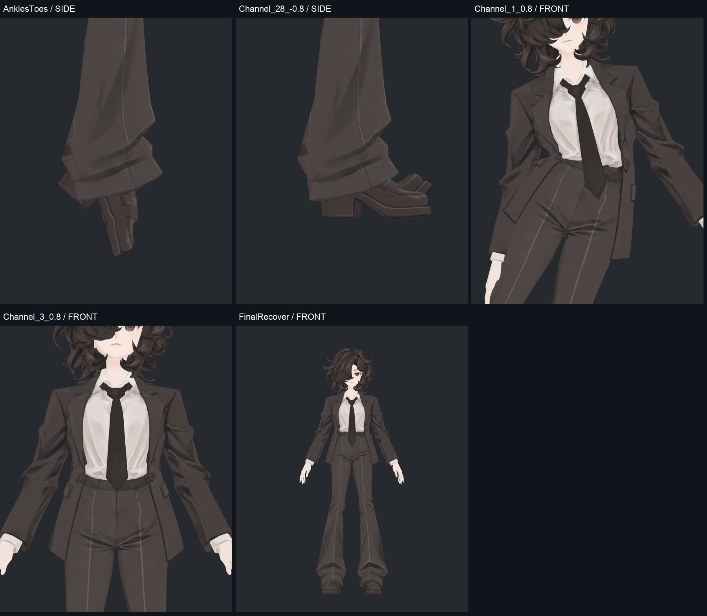

> **기록 시점 안내:** 아래는 해당 단계 당시의 보고서입니다. 후속 결정은 [최신 상태](../../STATUS.md)를 기준으로 읽어주세요. 모델·원본 텍스처·검증 원시 데이터는 이 문서 공유본에 포함하지 않습니다.

# v348 최종 관절·본 사진 갤러리

[전체 보고](v348_WORK_REVIEW.md) · [129본 점검표](v348_BONE_TABLE.md)

최종 Unity 프리팹의 실제 SDK 계산 뒤 베이크한 표면이다. 299 정적 자세 중 대표/집중 35시점을 보여준다. 면적 경고 수와 보이는 결함은 구분하며 승인된 무릎·손가락 국소 압축은 유지했다.

