> **기록 시점 안내:** 아래는 해당 단계 당시의 보고서입니다. 후속 결정은 [최신 상태](../../STATUS.md)를 기준으로 읽어주세요. 모델·원본 텍스처·검증 원시 데이터는 이 문서 공유본에 포함하지 않습니다.

# v348 움직임 비교 갤러리

[전체 보고](v348_WORK_REVIEW.md) · [정적 관절 사진](v348_GALLERY.md)

왼쪽 Original / 오른쪽 Final. 같은 입력·재질·월드 원점, 실제 SDK60Hz 중6Hz를 GIF로 표시한다. 이동계열은4초 입력+6초 자연복귀, 바람은10초 입력+10초 자연복귀다. Head/Tie의 Translation/Wind는 작업 저장소에30fps MP4도 제공한다. 코트 자락의 원래 설정은 유지하며 함께 관찰한다.

## 머리 좌우 회전

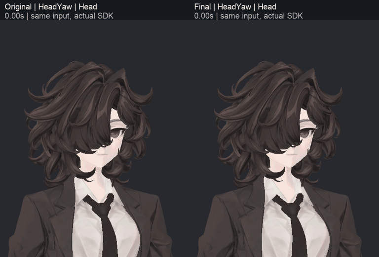

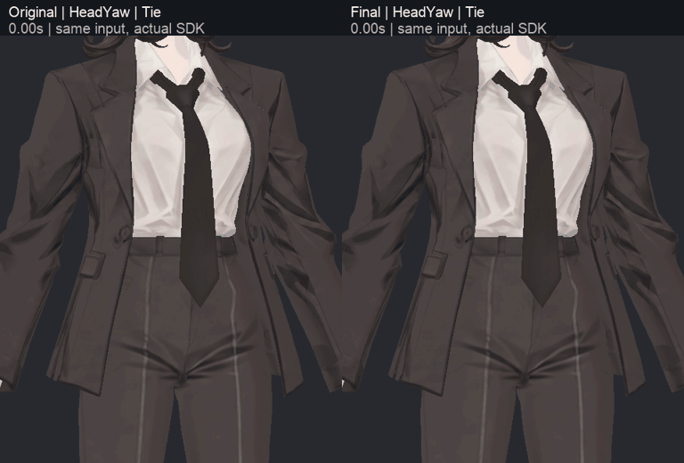

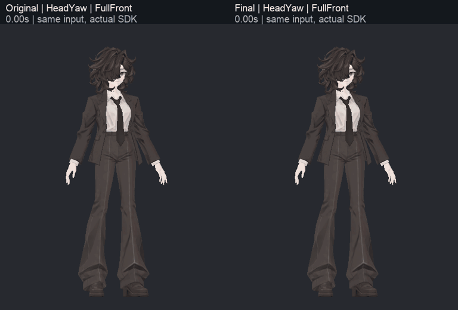

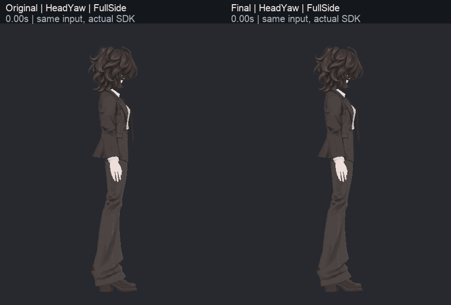

## 머리 끄덕임

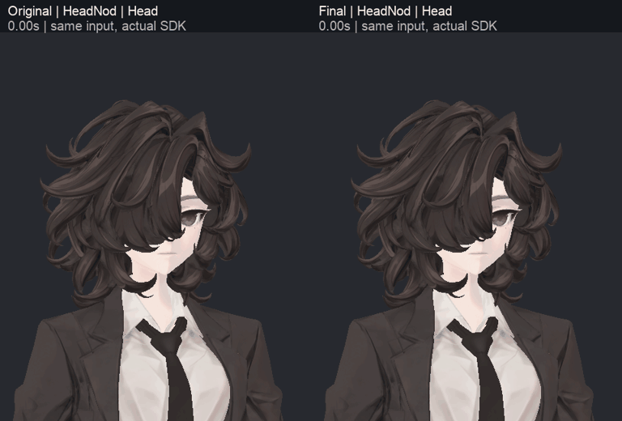

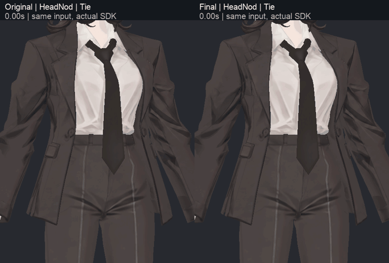

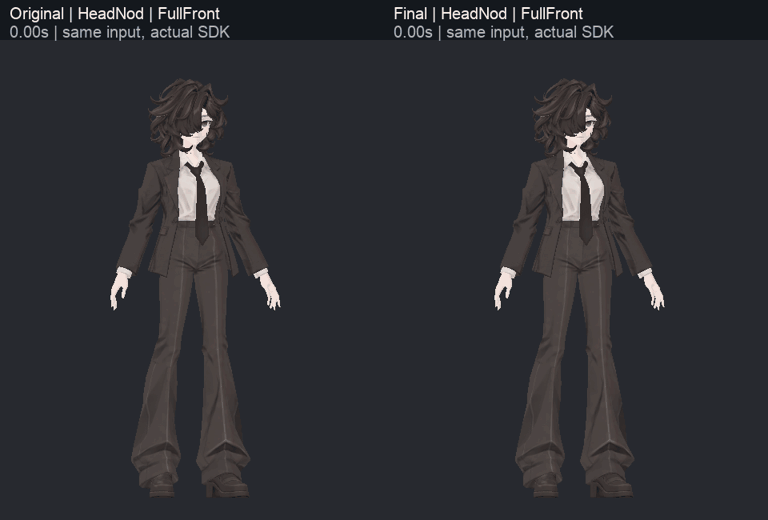

## 좌우 이동

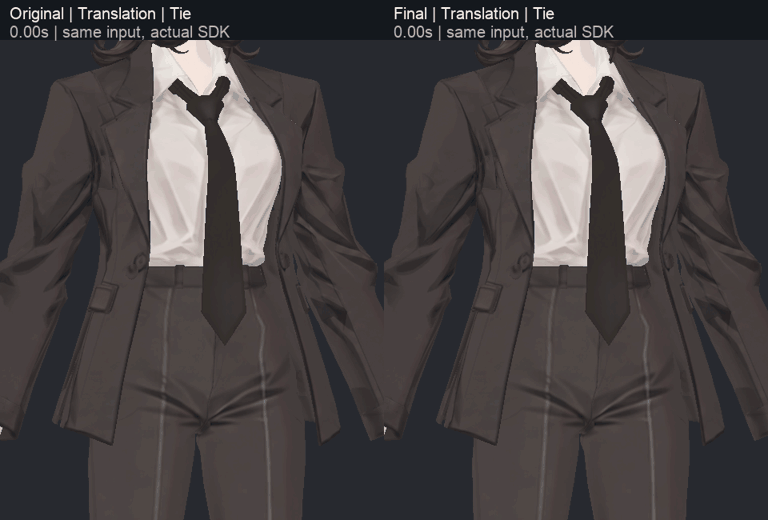

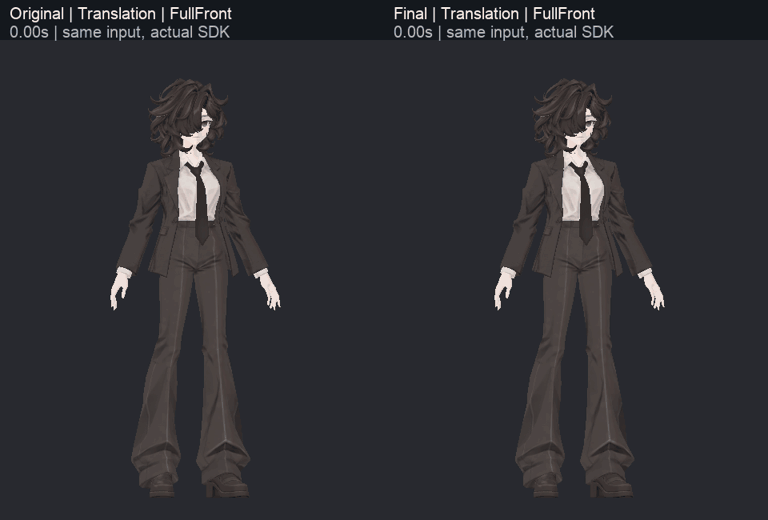

## 출발·정지

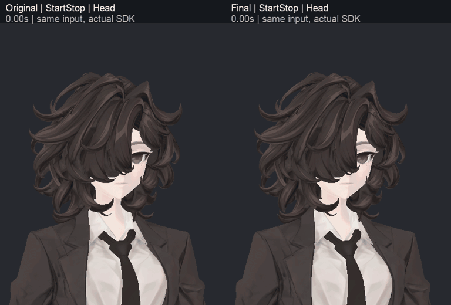

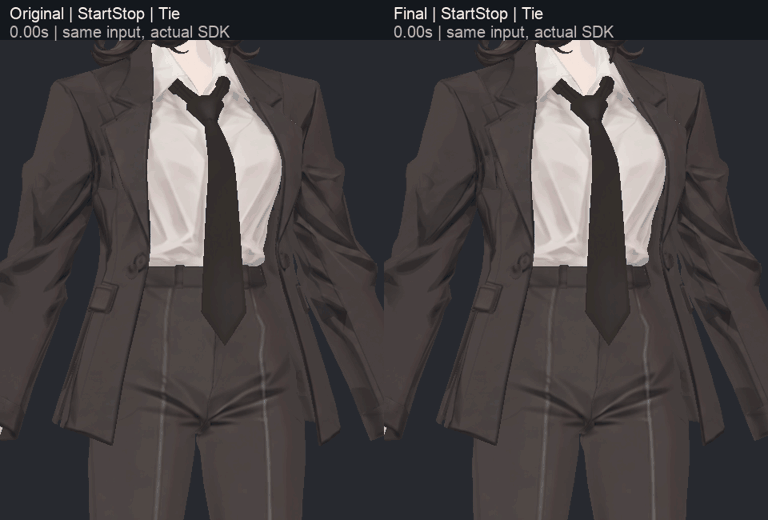

## 방향 전환

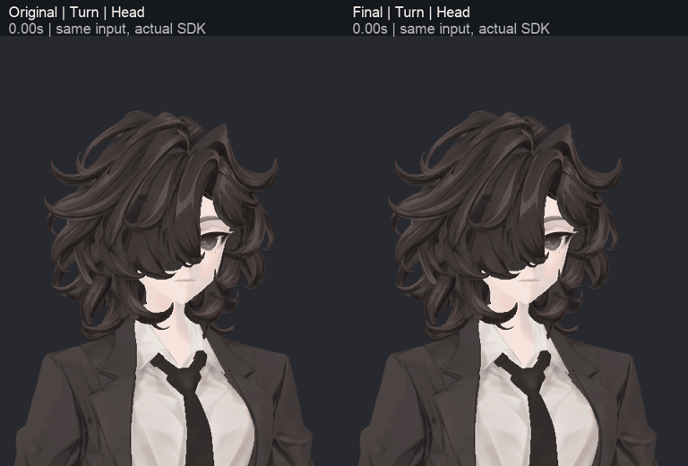

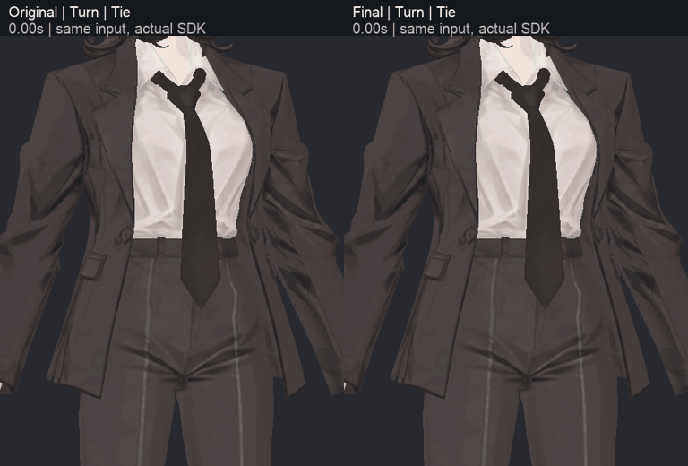

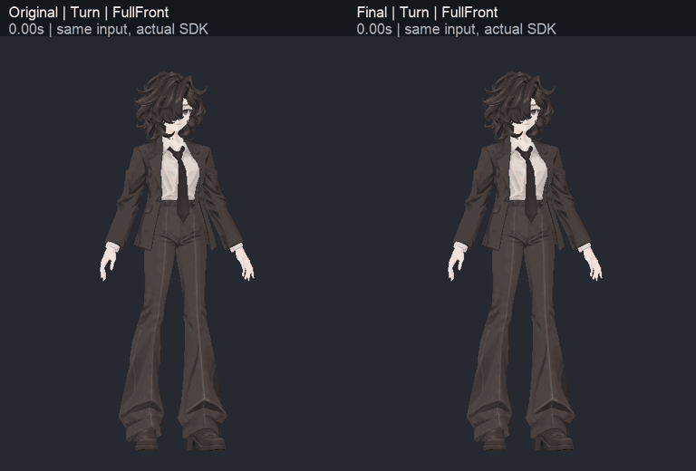

## 몸 숙임

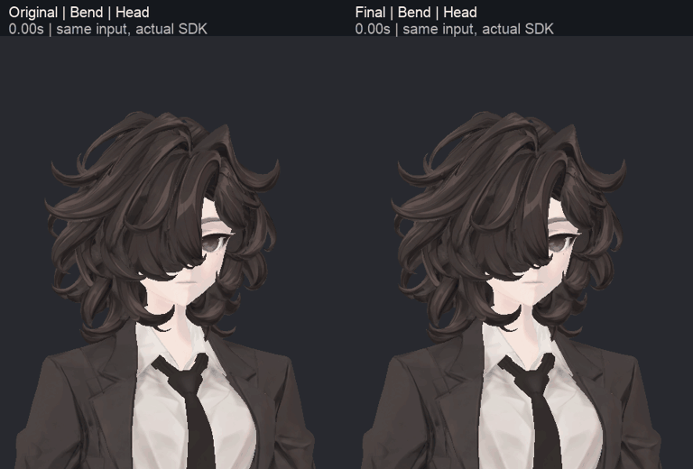

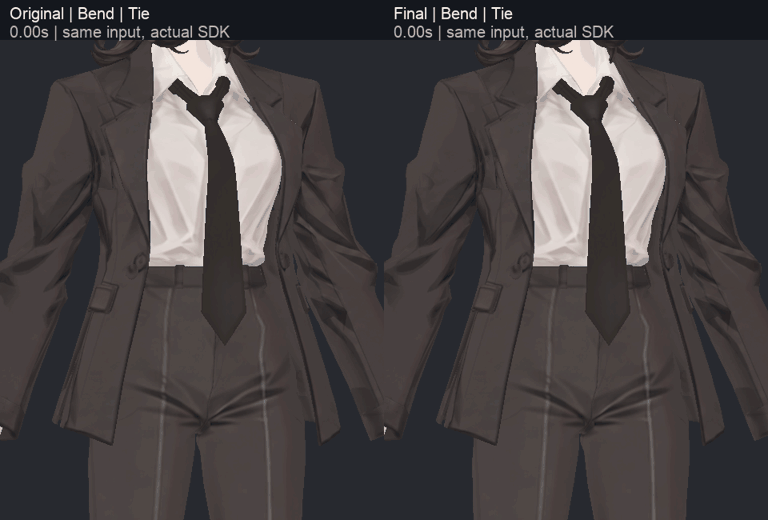

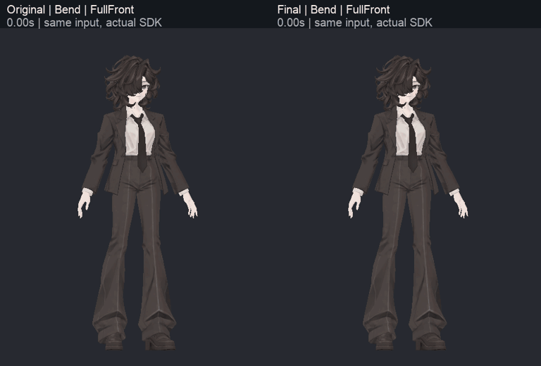

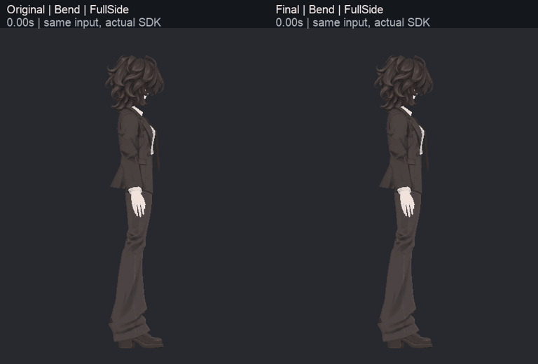

## 바람 입력·종료

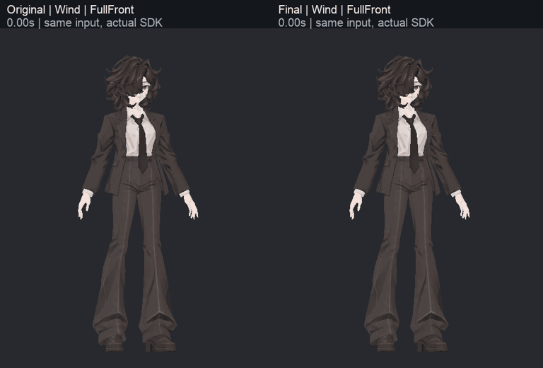

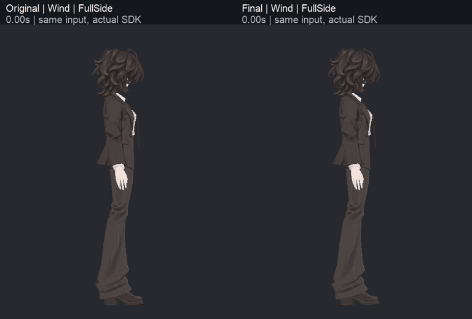
