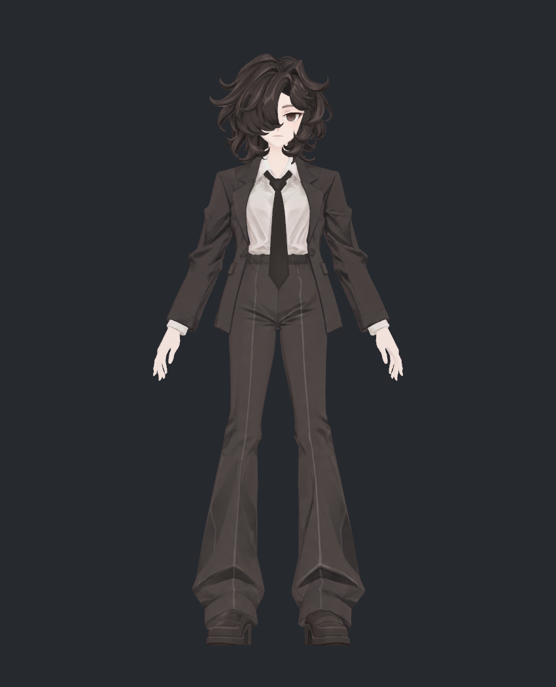
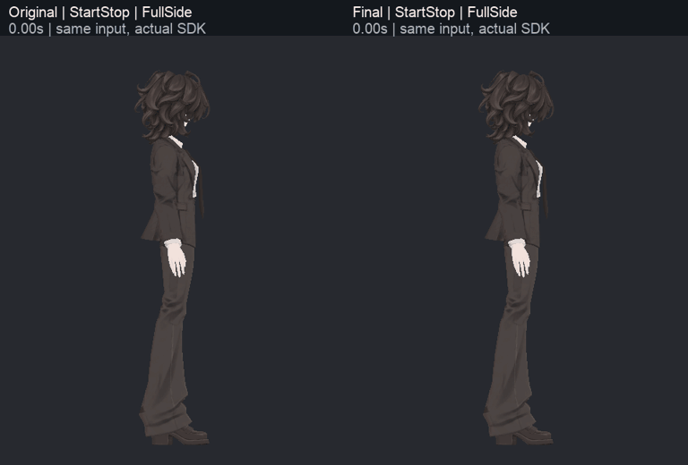

> **기록 시점 안내:** 아래는 해당 단계 당시의 보고서입니다. 후속 결정은 [최신 상태](../../STATUS.md)를 기준으로 읽어주세요. 모델·원본 텍스처·검증 원시 데이터는 이 문서 공유본에 포함하지 않습니다.

# v348 NPR 통합·전체 관절·본 검수

v345 계획의 제작·비교·독립 검토를 실행해 **v346 텍스처 + 셰이더 D + 접촉을 보완한 헤어/넥타이 움직임**을 통합했다. 아래는 사용자가 직접 검토할 전달 후보이며, 기존 캐릭터의 형태·승인된 무릎·손가락 압축을 유지한다. 새 메시·리메시·새 본은 없다.

## 이번에 한 작업

| 계획 | 실행 결과 |
|---|---|
| 헤드·가림 면·의상·신발 | [v346 전후 보고](../v346_npr_texture/v346_WORK_REVIEW.md). 눈·입·턱·귀·헤어 안쪽, 팔/코트/다리 안쪽과 신발을 재작업·검수했다. 단추·봉제·가닥 디테일 유지 |
| 의도된 주름/명암 판정 | T01–03/R02와 소매 깊은 주름·무릎 뒤 명암을 레퍼런스/실제 접힘과 대조해 유지 또는 주변만 정리 |
| UV·전사 | v343 UV 유지. 반복 점선의 원인이었던 가림 판정과 퇴화 삼각형 수치 오류를 수정하고 실제 표면에서 재확인 |
| 그림자·노멀·SiuSiu | [셰이더 v005](../../avatar_shader/v005_npr_roles/v005_WORK_REVIEW.md). 실제 A/B/C/D·광원·자세 비교 후 D 선택. 노멀의 이득은 작았음 |
| 헤어·넥타이 실제 개선 | [v347 후보·미채택 기록](../v347_secondary_motion/v347_WORK_REVIEW.md). 물리/웨이트/바람을 분리 비교한 뒤 아래 두 새 교차까지 수정 |
| 관절·본 전체 | 129본 구조, 51 Humanoid 매핑·86채널, 정적 299자세·연속 입력 121표본·최종 복귀 검사 |
| 움직임 공유 | 같은 입력의 원본/수정 30fps MP4 4개, 6Hz GIF 28개. 전신·근접과 자연 복귀 포함 |
| 독립 검토 | 시각/기술 첫 판단을 분리하고 지적 사항을 수정 후 재검토. 실제 증거와 잔여를 함께 기록 |

[7동작·4시야 전체 GIF 갤러리](v348_MOTION_GALLERY.md)

## 움직임 전후

모든 비교는 **왼쪽 Original / 오른쪽 Final**, 같은 최종 재질·같은 입력·같은 월드 원점이다. 후보를 하나씩 새로 생성해 60Hz로 실제 SDK 결과를 기록했다. GIF는 6Hz이며 영상은 Translation/Wind의 Head/Tie를 30fps로 촬영했다. 바람은 `BiancaWind=0.7` 파라미터 시험이며 월드 바람의 자동 감지가 아니다.

30fps 원본 영상은 작업 저장소의 `images/v348_Wind_Head.mp4`, `v348_Wind_Tie.mp4`, `v348_Translation_Head.mp4`, `v348_Translation_Tie.mp4`에 있다. 인코딩 후 첫/중간/끝 프레임을 다시 디코딩해 방향·색 오차·길이를 검사했다. 시각 검토자는 6Hz 전 구간 및 주요 동작 구간과 MP4의 30fps 연속 구간을 직접 확인했다. 모든 영상 프레임을 사람이 전수 검사한 것은 아니다.

최종 바람 팁 이동은 헤어 최대 약16.827mm, 넥타이15.865mm다. 실제 PhysBone 회전 최대는 헤어5.250°/제한25°, 넥타이4.170°/제한12°이며 제한 근접·초과는 없었다. 바람 종료 후 약0.417초/0.517초에 마지막 위치의 ±0.1mm 범위로 안정됐고, 마지막 1초 흔들림과 초기 안정 위치 대비 최종 차이는 기록 정밀도에서 0이었다. 자연 복귀 중 강제 리셋은 하지 않았다.

## 최종 검수에서 발견하고 다시 고친 부분

첫 통합 영상에서 큰 새 관통은 눈에 띄지 않았지만, 기술 검토가 실제 표면을 검사해 두 회귀를 찾았다. 이를 그대로 완료 처리하지 않았다.

| 문제 | 확인한 원인 | 수정·재검사 |
|---|---|---|
| 넥타이 시작부가 셔츠를 통과 | 끝 PhysBone 콜라이더가 보호하지 못하는 anchor 앞뒤 회전. 원래 두 면 간격 약0.475mm였던 매듭 아래에 새 교차 | 앞뒤 바람 x4°→0°, 좌우 z8° 유지. 같은 실제 입력 재실행에서 새 넥타이–셔츠 교차0 |
| 뒤목 가닥이 카라 안쪽 통과 | 원래 head100%였던 가닥에 새 chain00 분담을 너무 많이 부여 | 해당 연결 가닥만 추가 분담0.4배, 끝 상한0.60→0.24. 뿌리 고정/부드러운 분포와 다른 가닥은 유지. 실제 새 헤어–셔츠 교차0 |

Translation 20시각, Turn 20시각, Wind 40시각, **같은 80시각×원본/수정**의 실제 베이크 표면에서 재확인했다. 검사 기준은 비공면 삼각형 교차선 길이0.05mm 초과다. 교차선 길이는 관통 깊이가 아니며 쌍 개수도 결함 개수가 아니다. 기존에 겹쳐 있던 헤어–얼굴/코트 접촉 경계가 움직이며 삼각형 쌍이 바뀌는 사례는 새 분리된 교차와 구별했다.

## 관절·본·부피 검토

[35장 관절 갤러리](v348_GALLERY.md) · [129본 전체 점검표](v348_BONE_TABLE.md)

최종 SDK 계산 뒤 421개 기록(정적299 + 연속입력121 + 마지막복귀1)의 표면 좌표가 모두 유한했다. 연속 입력 표본 간 간격은 실제 2 Unity 프레임이며 이를 60Hz 연속 표면 영상으로 표기하지 않는다. 헤어/넥타이 물리의 60Hz 본 기록은 별도다.

본 이름·부모 구조·유효 드라이버를 검사했고 부모 누락/순환/길이0/무웨이트 정점/잘못된 인덱스가 없었다. Blender 원형 비교에서 BodyHair의 의도된 헤어 웨이트만 달랐고, 코트와 기존 좌표·면·UV·노멀·shape key·본/제약 구조는 유지됐다. Unity의 같은 정적 자세에서 헤어를 제외한 v344 대비 최대 표면 차이는 약0.00037mm 이내로 0.01mm 회귀 기준을 넘지 않았다.

부피는 중심 단면을 따로 검사했다. 대표 팔 자세에서 상완 단면 최소 폭 비율은 중립 대비 약0.968~0.979, 고관절 대표 자세의 허벅지는 약0.992~1.000이었다. 단면 선택은 팔/다리 중심 7단면이며 전체 관절의 모든 부피를 완전히 보장하는 검사는 아니다. 기존 승인 무릎과 손가락 국소 압축을 다시 평탄하게 만들지 않았다.

면적 압축/늘어남 경고와 기존 극단 앞모으기의 접촉은 남아 있다. 이를 이번 텍스처 작업에서 모두 해결했다고 주장하지 않는다. 시각 검토에서 동일 v344의 팔꿈치·좌우 무릎·주먹과 비교해 뚜렷한 새 형상 회귀는 발견하지 않았다. 왼 무릎 뒤와 종아리의 긴 짙은 접힘 명암은 보존됐으며, 안쪽 명암을 전부 지웠다는 의미가 아니다.

## 남은 경계와 검증 범위

- 얼굴 셸 안쪽 겹침 경계의 미세 점상 표시, 바짓단의 작은 낮은 대비 밝은 면은 v346 잔여 기록에 남긴다. 외부 피부의 넓은 번짐과 반복 빗살은 최신 검수에서 해소됐다.
- 기존 헤어–얼굴/코트 접촉이 남는다. 머리 뿌리의 작은 흰 점도 v344부터 같은 위치에 있었다. 새 메시로 덮지 않았다.
- 본 끝점 기반 콜라이더 재구성에는 Head 최소−0.025mm, Neck 최소−0.219mm의 작은 겹침이 기록된다. Neck는 실행 간 차이가 있어 원인을 단정하지 않는다. 실제 표면 검사와 동일한 의미가 아니며 무충돌이라고 표기하지 않는다.
- 표면 교차 검사는 지정80시각이고 공면/표본 사이 연속 충돌/헤어 자체 모든 교차는 제외된다. 자연 복귀와 주요 연속 영상 검토는 수행했다.
- Unity 2022.3.22f1의 실제 SDK PlayMode와 렌더를 검증했다. PC VRChat 클라이언트 업로드·거울·스테레오 실행은 미검증이다.

## 전달·재현 자료

작업 사본은 `bianca_v348_NPR_MOTION_REVIEW.blend`, Unity 통합 전달은 `Bianca_v348_FinalReview.unitypackage`다. Blender에는 최종 기본색·기존 형상·헤어 웨이트가 들어 있고 lilToon/PhysBone/바람 controller는 Unity 프리팹에 있다. Unity 패키지는 필요한 Assets 의존성을 포함하며 프로젝트의 VRChat SDK/lilToon 패키지는 별도 설치 의존성이다. SiuSiu 원본은 전달 패키지에 넣지 않았다.

비교 기준 v343과 미채택 실험을 보존했다. 대용량 본 JSON은 gzip, 실제 관절 베이크 입력과 물리 표면 표본은 분할 압축으로 작업 저장소에 보존하며 `EVIDENCE_ARCHIVES.json`의 해시와 `restore_evidence.py`로 복원할 수 있다. 원본 PNG 프레임 캐시는 로컬에 유지하고 공유 가능한 GIF/MP4와 재현 코드를 전달한다. 독립 검토 원문은 `v348_TECHNICAL_REVIEW.md`·`v348_VISUAL_REVIEW.md`에 포함한다.
