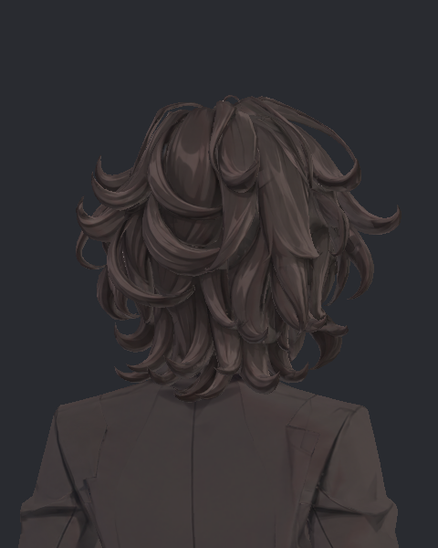
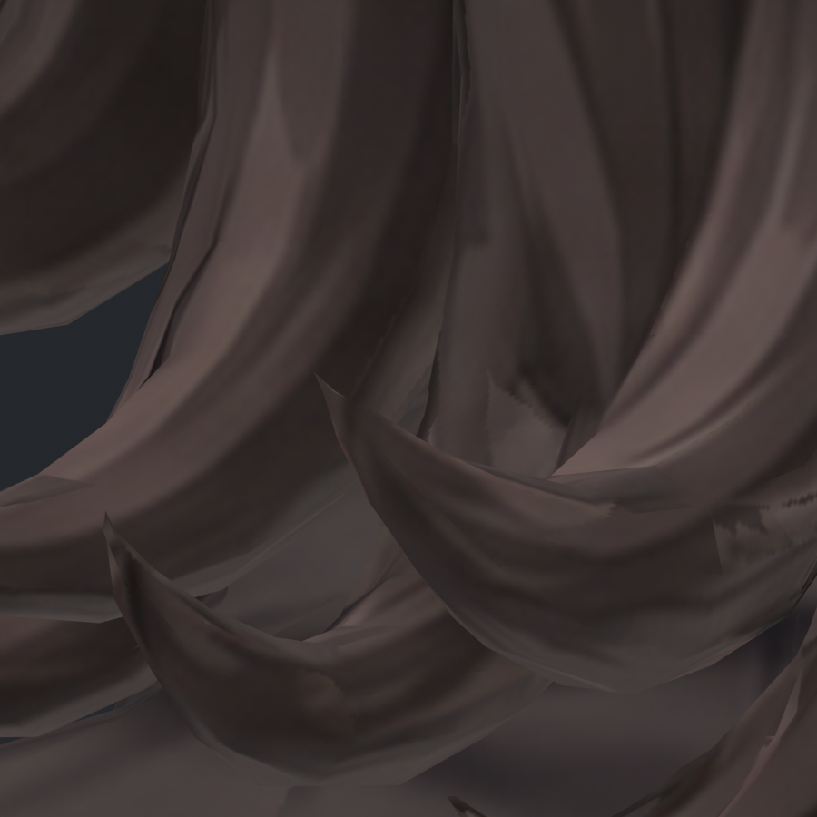
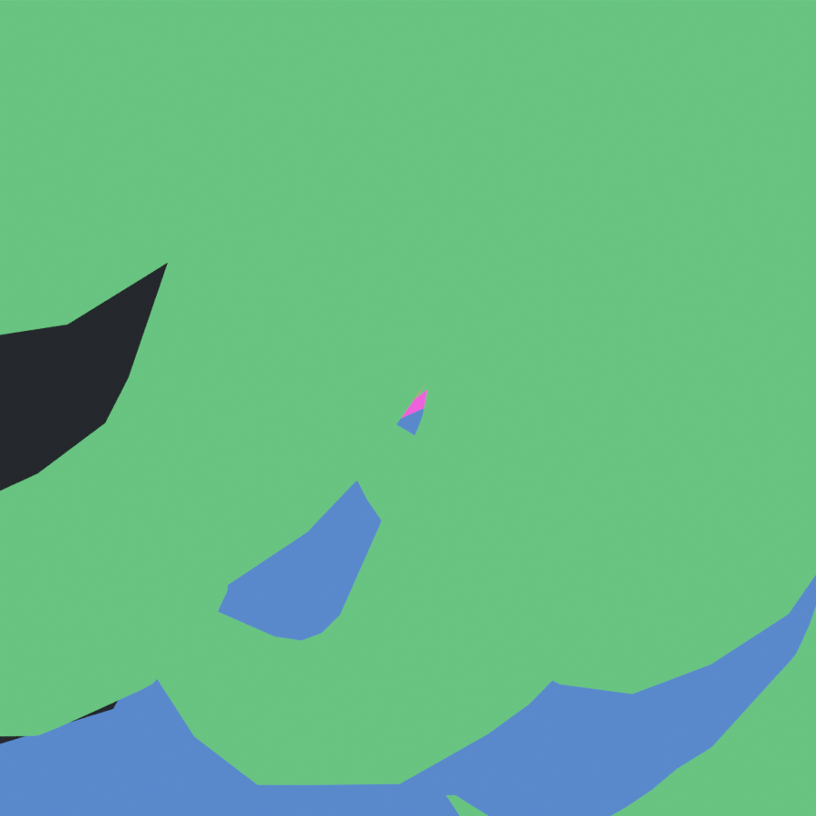
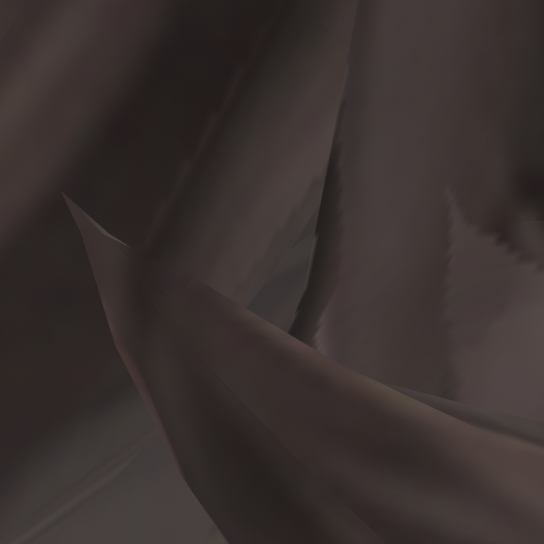
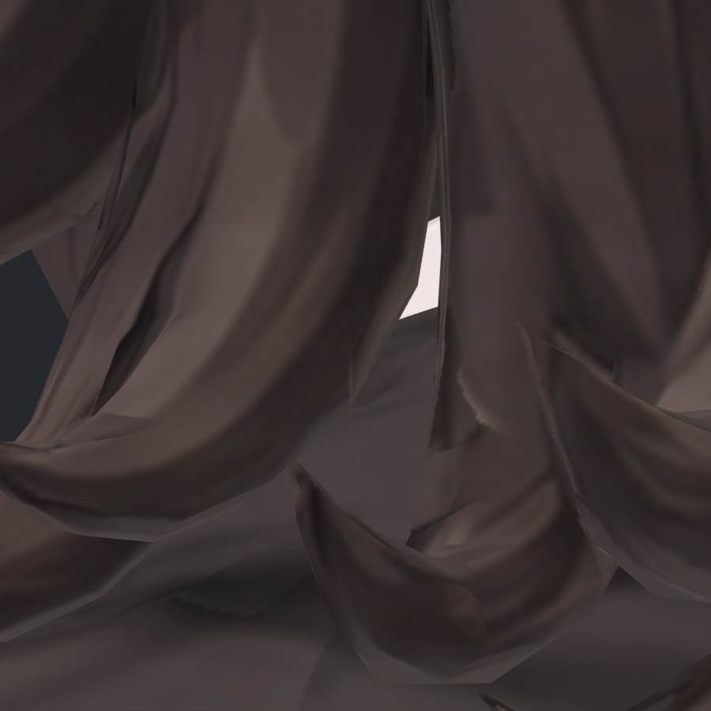

> **기록 시점 안내:** 아래는 해당 단계 당시의 보고서입니다. 후속 결정은 [최신 상태](../../../STATUS.md)를 기준으로 읽어주세요. 모델·원본 텍스처·검증 원시 데이터는 이 문서 공유본에 포함하지 않습니다.

# v349 헤어–코트 접촉의 외부 노출 독립 검토

검토 대상은 Wind 2.0초(phase frame 120)의 BodyHair 삼각형 15703 / polygon 13931 / component 10과 Coat 삼각형 3296 / polygon 1870 / body_R_back이다. 제작 자산·Unity 장면은 수정하지 않았다. 임시 재현 코드와 사진은 `../images/contact/`에만 저장했다.

## 판정

**완전히 가려진 교차로 분류할 수 없다.** 뒤 오른쪽 외부 시점에서 교차 선분 끝쪽 일부가 실제로 노출되며, 코트 면이 머리카락 사이에서 작은 삼각형으로 보인다. 다만 **현재 일반 Unity 뒷머리 사진에서 눈에 띄는 큰 관통 결함으로 읽히지는 않는다.** 주변 갈색 명암과 섞여 있고, 정확한 위치를 모르면 가닥 사이의 어두운 부분으로 보인다. 따라서 “교차 없음”도, “3.19mm 깊이로 튀어나와 심각하게 보임”도 부정확하다.

v349 Original과 Final 확대 사진의 외관은 사실상 같다. 목/머리 콜라이더 패딩 후보가 이 접촉을 해결했다고 판단할 근거가 없다. 유지해야 할 잔여 항목이며, 이를 수정한다면 이 가닥의 접촉 구간만 최소 수정하고 현재 헤어 실루엣·컬 끝·움직임을 보존하는 방향을 권한다. 넓은 헤어 부피 변경이나 전체 물리 약화는 이 사진의 결함 강도에 비해 과하다.

## 기록 출처와 수치 해석

직접 확인한 `/tmp/v349_exposed_contacts.py`는 **v348 Final** 저장 정점과 `/tmp/v348_surface_contact_review.json`을 사용한다. 따라서 파일 이름만 보고 v349 후보의 새 접촉이라고 읽으면 안 된다.

`MacRemainingNprBuildViews.cs`에서 v349 Original/Final/Pad50은 모두 v348 FinalReview 사본이며 목/머리 콜라이더 패딩이 각각 0/0.3/0.5mm다. `/tmp/v349_padding_surface_review.json`의 해당 Wind frame 120 쌍은 다음과 같다.

| 비교 | 교차 선분 길이 |
|---|---:|
| v349 Original | 3.188819mm |
| v349 Final | 3.195655mm |

이는 **교차 선분 길이이며 침투 깊이가 아니다.** 같은 기록에서 이 시점 전체 비교는 Original/Final 각 1181쌍, added/removed 0, 0.05mm 초과 증가 0이다. 해당 쌍을 새 회귀로 분류하지 않는다. 전체 1181쌍을 모두 시각 검토했다는 뜻도 아니다.

## 실제 포즈 재현 방법

`MacRemainingSecondaryAudit.cs`의 `Capture()`는 `VRCDynamicsScheduler.OnFrameCompleteLate` 이후 저장하며, `Bake()`는 `BakeMesh(mesh,true)` 후 `sk.transform.TransformPoint`한 월드 정점을 기록한다. `physics/RUN.json`은 Original/Final/Pad50 정상 완료, 60Hz SDK 기록을 명시한다. 저장 정점 수는 원본 Unity SOURCE의 BodyHair 32740 / Coat 3894와 일치한다.

본 회전 추정이나 원래 중립 포즈를 사용하지 않았다. `physics/mesh_samples/{Original,Final}_Wind_0120_{Bianca_BodyHair,Bianca_Coat}.bin`의 **실제 SDK 변형 정점을 그대로** 임시 Blender 메시로 재생했다. 원본 Unity triangles/UV와 v343 polygon material 대응을 사용했다. Unity 좌표를 Blender `(-x,-z,y)`로 변환해 원래 Unity 사진과 같은 좌우 방향으로 재현했다. 초기 좌우 반전 진단 이미지는 최종 파일로 교체했다.

사진은 v346 기본색 emission이며 **최종 Unity lilToon/D 셰이더 렌더가 아니다.** 실제 변형 형상·면 가림 증거와 색상 근접 참고로 사용한다. 새 채색이나 새 제작 메시가 아니다. 재현 스크립트는 `/tmp/v349_contact_render.py`, 면 번호 진단은 `/tmp/v349_target_render.py`다.

## 직접 본 사진과 위치

### 기존 실제 Unity 화면

Original Wind 2.0s HeadBack (공유본 미포함: `Original_Wind_HeadBack_0120.png`)

원본 480×600 화면의 대략 **(186,391) 근처**, 확인 crop **(165,372)–(213,420)**를 원본과 확대 모두 직접 보았다. 표시 가닥은 뒷목 중앙에서 약간 화면 왼쪽, 아래로 늘어졌다가 말리는 컬 안쪽이다. 이 해상도에서는 작은 갈색 면이 주변 머리카락 명암과 섞이며 분명한 구멍/코트 돌출로 읽히지 않는다. 사진의 다른 헤어 가닥 사이 틈을 전부 교차로 표시하지 않는다.

### 같은 SDK 형상의 4cm 폭 확대

두 사진 모두 900×900, 시야 폭 4cm. **(437,428)–(473,482)** 부근에 작은 삼각 톤이 보인다. 이 부위가 컬의 뒤쪽 코트 노출 부분이다. 컬 앞쪽 윤곽은 이어지고, 색만으로는 자연스러운 가닥 사이 틈과 구분이 어렵다. 아래의 더 넓은 코트 노출 면이나 왼쪽 배경 틈 전체가 지정 교차가 아니다.

초록=헤어, 파랑=코트, 분홍=지정 Coat 3296. 작은 중앙 삼각형 위쪽 분홍 부분이 실제 해당 코트 면이다. 이 색은 위치 구분을 위한 임시 진단색이며 모델의 실제 얼룩이 아니다.

1.2cm 폭 확대에서도 작은 삼각 톤과 인접 가닥 경계는 보이지만, 커다란 코트 돌출이나 머리카락이 갑자기 잘린 실루엣은 보이지 않는다. 확대 시 보이는 다른 톱니 모양 채색 경계의 원인·전체 UV 품질은 이 접촉 검토 범위에서 판정하지 않았다.

### 정후면

정후면에서는 가닥 사이로 더 넓게 코트와 밝은 셔츠 일부가 보인다. **셔츠의 밝은 면은 지정 Coat 3296 교차 자체가 아니다.** 가려짐이 달라지므로 정후면의 넓은 틈을 모두 지정 교차 크기로 세지 않는다.

## 노출 재계산 보조

`/tmp/v349_contact_rays.py`에서 같은 실제 정점으로 선분 내부 19점(5~95%)의 뒤 오른쪽 광선 검사를 독립 재실행했다. 결과 `../images/contact/RAYS.json`.

- Original/Final 모두 선분 5~70% 지점은 다른 헤어 삼각형 15983이 약 3.45~5.14mm 앞에서 가린다.
- 75~95% 지점은 지정 15703/3296 면이 광선 앞쪽에 도달한다. 선분과 앞쪽 교차점 차이는 약 0.00045mm 이내의 부동소수 오차 수준이다.
- 따라서 “3.19mm 선분 전체 노출”이 아니라 **끝쪽 일부 노출**로 기록한다. 19개 점을 검사한 것이므로 정확한 노출 길이나 면적의 연속 적분 수치는 제시하지 않는다.

## 후속과 미검증 범위

- 권고 강도: 낮은 대비의 기존 국소 접촉 잔여. 손댄다면 헤어 component 10의 해당 표면이 코트와 교차하는 범위만 최소한으로 조정하고 동일 포즈 사진과 움직임에서 비교할 것.
- 0.3mm 목/머리 패딩은 이 접촉에 시각 개선이 없으므로 이 문제 해결책으로 채택 근거가 되지 않는다.
- 이번 검토는 Wind 2.0초의 두 외부 방향과 두 후보 비교다. 다른 시간·모든 카메라·헤어 자체 교차·VRChat 실제 클라이언트는 검토하지 않았다.
- 저장된 실제 Unity 보통 거리 화면은 확인했으나 새 고해상도 Unity 근접 카메라를 실행하지 않았다. 새 확대의 최종 셰이더 광택/그림자/알파 효과는 미검증이다.
- 교차를 고쳤다는 결과가 아니라, 실제 노출의 크기와 시각 심각도를 구분한 읽기 전용 검토다.
