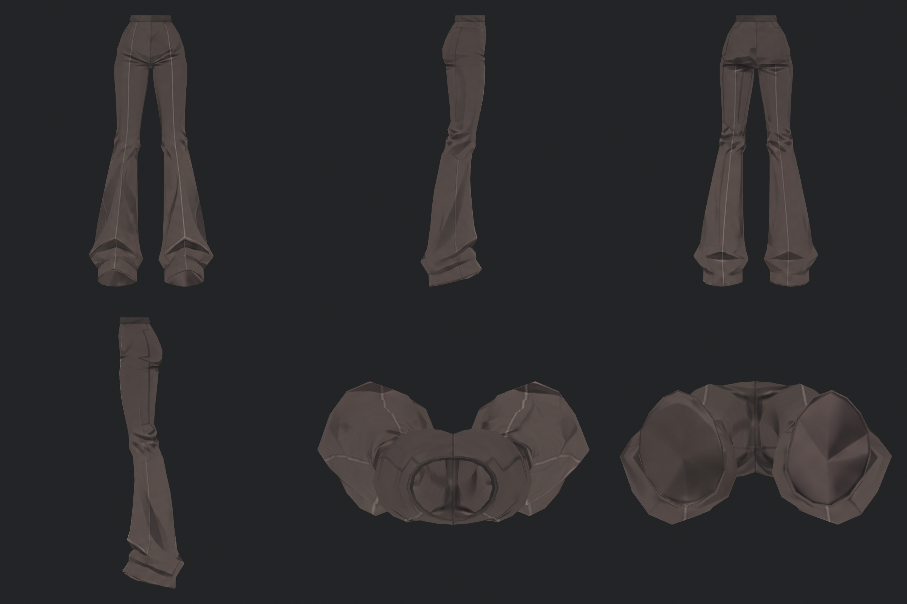
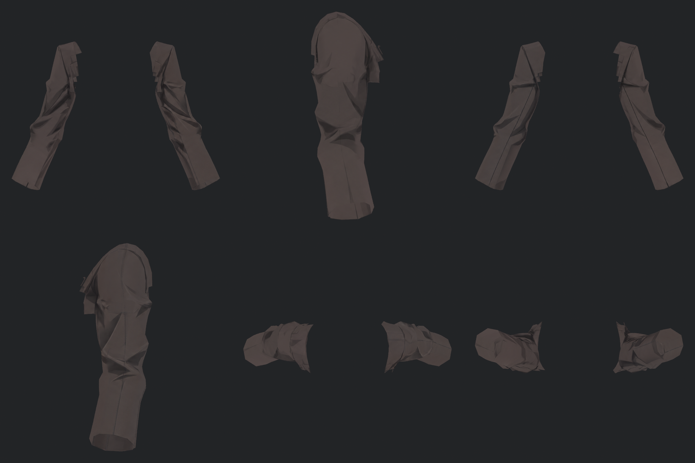
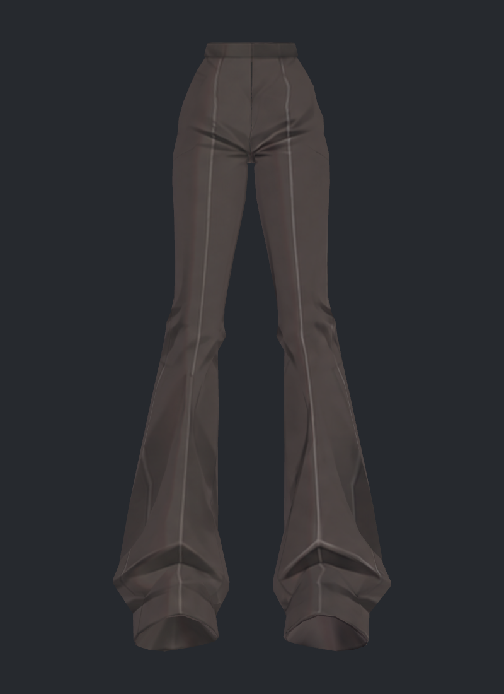
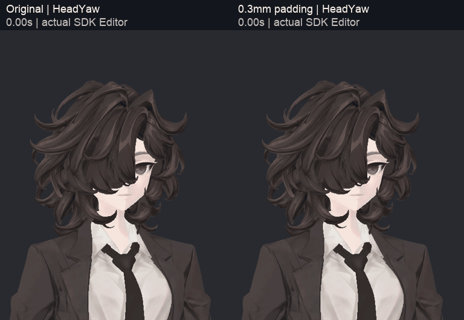
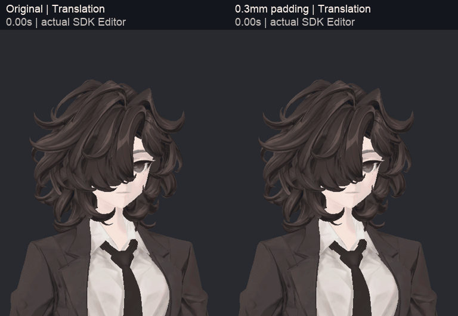
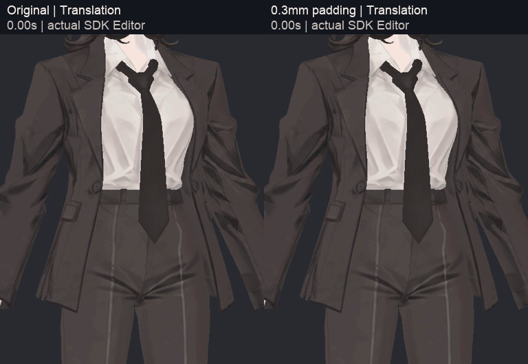
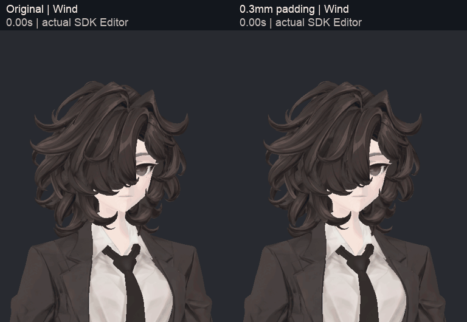
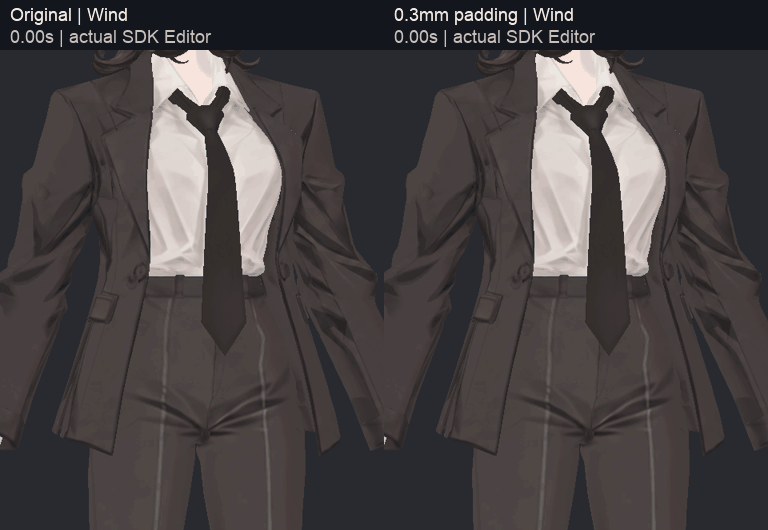
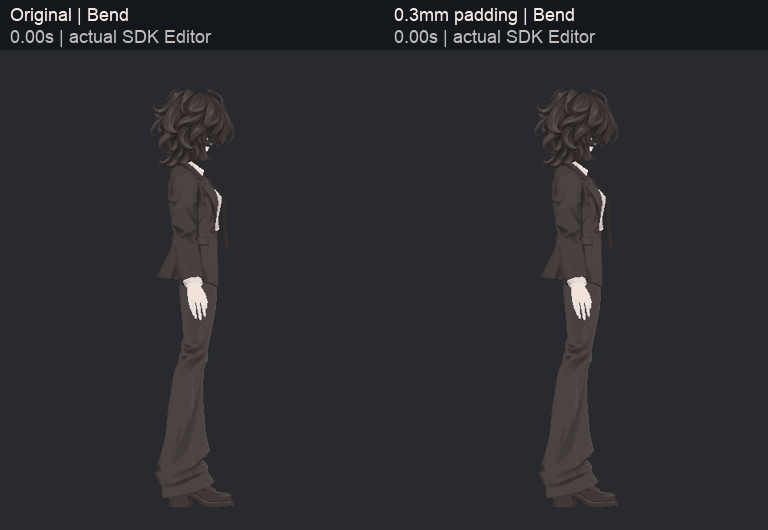
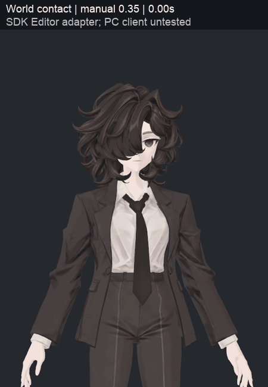

> **기록 시점 안내:** 아래는 해당 단계 당시의 보고서입니다. 후속 결정은 [최신 상태](../../STATUS.md)를 기준으로 읽어주세요. 모델·원본 텍스처·검증 원시 데이터는 이 문서 공유본에 포함하지 않습니다.

# v349 — NPR 잔여 작업과 실제 물리·바람 재검토

v348의 NPR 스타일을 유지하면서 바지·소매의 국소 톤, 주름 노멀 대안, 헤어 보호 콜라이더, 외부 바람 입력을 별도 사본에서 검토했다. 이 문서는 **완료한 실험의 결과와 남은 문제를 함께 기록한 검수 보고**다. 모든 잔여 이슈를 해결한 최종 아바타라는 뜻은 아니다. 연결 UV 제작과 iPhone 표정 준비는 [v351 보고](../v351_conventional_uv/v351_WORK_REVIEW.md)로 이어진다.

## 1. 바지·소매 국소 채색

원래 주름 선과 장식을 보존하면서 바짓단의 넓은 밝은 면과 소매 일부 사각 톤만 약하게 조정했다. 기존 참조에서 만든 국소 후보를 원래 UV에 투영하고 가림/부위 마스크로 제한했다. 새 무늬를 전신에 덮거나 원래 선을 흐리게 만드는 필터를 사용하지 않았다.

6방향 실제 분리 렌더에서 긴 봉제선·깊은 접힘·V자 주름의 큰 손실은 확인되지 않았다. 수정 강도는 낮으며 큰 재디자인으로 설명하지 않는다. 이 후보는 v351 최종 직접 전사의 Paint 원본으로 연결했다. 헤드·손·신발·단추의 원래 색은 이 국소 단계에서 바꾸지 않았다.

## 2. 주름을 노멀로 옮기는 추가 시도

기존 [NPR 역할 비교](../../avatar_shader/v005_npr_roles/v005_WORK_REVIEW.md)에 더해, 왼쪽 바지 주름용 높이 가이드 후보를 원래 표면에 옮겨 tangent normal을 베이크했다. 가이드에는 넓은 조명 명암도 포함돼 있어 정확한 실제 높이 복원으로 취급하지 않는다. 원래 색상 텍스처의 밝기를 곧바로 높이로 변환한 것은 아니다.

Unity에서 광원 방향 −65°/0°/+65°, 노멀 강도 0/0.15/0.35의 9개 사진을 비교했다. 아래는 −65°의 양 끝이다.

이번 0.5mm 높이 거리의 약한 후보는 화면 최대 차이가 약 1~2/255로 작았고 고정된 채색 그림자를 제거하지 못했다. 원래 색·주름을 대체할 개선 근거가 부족해 채택하지 않는다. 일부 퇴화 면의 노멀 이상치도 있어 이 베이크를 그대로 최종 자산으로 사용하지 않는다. 이 결과는 **이 가이드·강도·현재 NPR 설정의 결과**이며 모든 노멀 기법이 효과 없다는 결론이 아니다.

현재 방향은 애니메이션/일러스트의 형태를 읽게 하는 주요 선·색은 텍스처, 광원에 따라 움직이는 넓은 명암은 NPR 셰이더, 노멀은 신발처럼 필요한 미세 형상 보조다. 노멀을 추가하면 텍스처에 그려진 그림자가 자동으로 지워지는 것은 아니다.

## 3. 헤어 보호 콜라이더 0 / 0.3 / 0.5mm 비교

v348 FinalReview 사본을 기준으로 Head/Neck capsule에 작은 보호 여유를 더했다. 반경만 늘리지 않고 높이도 양쪽으로 늘려 원래 보호면을 포함하도록 했다. 원래 본·웨이트·헤어 모양은 유지했다.

후보당 실제 SDK 60Hz 4,800프레임, 고개 좌우/끄덕임·이동·급정지·회전·숙임·바람의 7구간을 실행했다. 첫 실행만으로 판정하지 않고 원래 구성 2회와 0.3mm 후보 3회를 대조했다. 공정한 사진 비교는 입력 회전/위치가 일치하는 **OriginalRepeat와 FinalRepeat**를 사용한다. 사진의 Original은 초창기 아바타가 아니라 **v348 최종 물리 + 패딩 0mm**다.

| 같은 입력 공정쌍 | 원래 Head 보호면 최소 여유 | 원래 Neck 보호면 최소 여유 |
|---|---:|---:|
| 패딩 0mm | −0.025182mm | −0.156529mm |
| 패딩 0.3mm | +0.229315mm | +0.135373mm |

후보 3회에서 원래 Neck 보호면 최소 여유는 +0.072~+0.135mm 범위였다. 헤어 12끝점과 2capsule의 거리 표본은 실행당 115,200개다. **전신 면 교차 검사 수가 아니다.** 패딩 capsule 자체의 작은 침범은 여전히 있을 수 있으며 원래 보호면 여유를 확보한 결과로 표현한다.

0.5mm는 추가 여유를 만들지만 필요한 수정량보다 커서 우선 후보로 고르지 않았다. 0.3mm도 모든 FPS·속도·클라이언트에서 충돌을 보장하는 값은 아니다.

## 4. 실제 움직임 전후 GIF

60Hz 기록에서 매 10번째 실제 사진을 사용한 6fps 비교다. 중간 프레임 생성이나 정지 사진 보간이 아니다. 변화가 미세한 만큼 크게 바뀐 것처럼 표현하지 않는다.

공정쌍의 넥타이 위치·회전은 전 프레임 동일했다. 5개 반복 실행 모두 강제 리셋 없는 최종 tip 복귀 오차와 마지막 1초 변동은 0이었다. 다만 서로 다른 반복 실행 사이 헤어 최대 1.54~1.85mm 등의 비결정적 편차는 있어 모든 실행이 비트 단위로 같다는 주장은 하지 않는다. 입력 회전의 작은 차이와 초기화 시점 차이를 분리해 기록했다.

## 5. 남아 있는 뒷머리–코트 접촉

실제 저장 스킨 정점 80시점 비교에서 0.3mm 후보의 새 교차 쌍은 없었고 일부 기존 접촉은 줄었지만, 모든 기존 접촉이 사라지지는 않았다. Wind 2초의 헤어–코트 한 쌍을 독립 시각 검토했다.

초록은 헤어, 파랑은 코트, 분홍은 지정 코트 삼각형이다. 이 색은 식별색이다. 확대는 실제 SDK 정점을 Blender emission으로 재현한 것이며 최종 Unity 셰이더의 고해상도 사진으로 표시하지 않는다.

지정 교차 선분 끝 일부는 외부에서 보인다. 보통 사진에서는 갈색 명암과 섞여 큰 관통으로 읽히지 않지만 완전히 가려진 문제라고 할 수 없다. 선분 길이는 원래 3.188819→후보 3.195655mm이며 **침투 깊이가 아니다.** 패딩이 이 문제를 해결했다는 근거는 없다. 후속은 해당 가닥의 접촉 구간을 국소적으로 다루며 넓은 헤어 부피 축소나 전체 물리 약화로 덮지 않는다.

## 6. 월드 바람 입력 — 실제 SDK 접촉 경로

아바타가 임의의 월드 풍향·풍속을 자동으로 읽는 기능은 아니다. 호환 월드가 `BiancaWorldWind` 태그의 ContactSender를 두면 아바타 Receiver가 `WorldWind`를 켜고, 기존 수동 바람과 조합하는 방식을 구현했다. 제작 프리팹에 사용자 C# 런타임 스크립트를 넣지 않았다.

수동 바람 M이 0/0.35이면 접촉 중 0.7 기여도로 올리고, 이미 0.7/1이면 더 낮추지 않는다. 태그가 없는 월드에서는 수동 설정을 유지한다. 방향은 기존 바람 애니메이션에 저작된 방향이다.

| 상대 프레임 | 입력 상황 | Receiver / Animator |
|---|---|---|
| 0~119 | 송신자 없음 | 0 / 0 |
| 120~359 | 맞는 태그 1개 | 1 / 1 |
| 360~479 | 맞는 태그 2개 | 1 / 1 |
| 480~539 | 첫 송신자 이탈, 둘째 잔류 | 1 / 1 |
| 540~599 | 둘째도 이탈 | 0 / 0 |
| 600~719 | 틀린 태그만 진입 | 0 / 0 |
| 720~1199 | 송신자 없음 | 0 / 0 |

4개 수동 설정 × 1,200프레임을 실제 SDK로 실행했다. 최종 재실행은 송신자 3개 모두 World Usage, Receiver Avatar Usage였고 28구간의 예상값 불일치·수동값 오차·Receiver/Animator 값 차이는 0이었다. 실제 wind anchor 회전은 접촉 계수 변경의 다음 프레임에 반영돼 약 16.7ms 지연이 있다.

GIF는 수동 0.35 시나리오다. 접촉이 끝나도 완전 정지가 아니라 수동 0.35로 돌아간다. Editor에서 실제 SDK Receiver 값을 Animator로 전달하는 어댑터와 World context 설정을 사용했다. VRChat 클라이언트·실제 월드·네트워크/다른 사용자 검증과 구분한다.

## 7. 발견한 검수 오류와 수정

첫 World Usage 시험의 수신 기록은 정상이었지만 원본 사진 120장이 모두 배경색뿐이었다. GIF 프레임 수/인코딩 검사가 통과해도 유효한 모델 영상이 아니었다. 독립 시각 검토가 이를 잡았고 해당 영상을 전달 후보에서 제외했다.

추적 본은 초기 평가 뒤 약 61.4cm 아래로 이동하여 고정 카메라 범위 밖에 있었다. 저장 프리팹 root는 정상이며 기존 기록만으로 Animator의 root/body 재구성 단계를 정확히 나눌 수는 없다. 정상 물리 하네스처럼 초기 HumanPose를 보존·복원하고 실제 head/chest를 기준으로 촬영하도록 수정했다. 다시 4,800프레임을 실행하여 head.y 약 0.845m, 정상 캐릭터 표시, 120장 모두 비단색임을 확인했다. 이전 실패 기록은 별도 폴더에 보존했다.

또한 첫 World 태그 시험은 활성화 과정에서 Usage가 Avatar로 돌아갔다. 이 실행을 World 성공으로 쓰지 않고, SDK가 읽는 실제 Usage를 매 프레임 확인하는 재실행으로 분리했다. 단순 라벨 출력과 실제 SDK 동작 경로를 구분한다.

## 8. 남은 것과 전달 경계

- v349 국소 채색은 v351의 새 UV로 전사했다. 연결 UV·재질·전사 품질은 v351 보고에서 별도 검수한다.
- 원래 헤어–코트의 작은 접촉, 아주 얇은 얼굴/헤어 내부 구조, 코트 새 UV 노멀 지원은 미완료다.
- 0.3mm 보호 여유와 호환 월드 접촉은 Editor SDK 검증 후보이며 PC VRChat 전체 합격이 아니다.
- 얼굴 트래킹용 실제 표정 제작·조합·입력 연결은 별도 후속 필수 단계다.
- 원래 v348 및 승인한 무릎·손가락 상태는 보존했다. 새 모델 생성/대체나 원래 실루엣 변경으로 문제를 숨기지 않았다.

원본 데이터는 `physics/`, `world_wind/`에 있으며 큰 JSON은 무손실 gzip과 해시 검사 기록을 작업 저장소에 함께 보존한다. 공개 문서 저장소에는 보고와 선별 사진/GIF만 포함한다.
