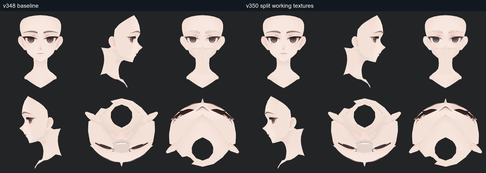
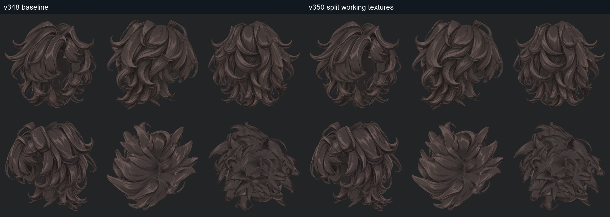

> **기록 시점 안내:** 아래는 해당 단계 당시의 보고서입니다. 후속 결정은 [최신 상태](../../STATUS.md)를 기준으로 읽어주세요. 모델·원본 텍스처·검증 원시 데이터는 이 문서 공유본에 포함하지 않습니다.

# v350 — 기존 조각 재배치 실험, 미채택

텍스처를 여러 이미지로 나누는 첫 시도였다. 기존 색을 정수 픽셀 단위로 옮겨 왕복 배열의 동일성을 확인했지만 얼굴 161조각·헤어 1,313조각 등 원래 파편 구조를 유지했다. 사용자가 요청한 일반적인 캐릭터 UV의 작업성과 다르므로 채택하지 않는다.

사진이 비슷하다는 것은 새 전개가 편집하기 좋다는 증거가 아니다. 배열 왕복 동일과 실제 렌더 미세 차이(최대2/255), 사람의 채색 작업성을 나누어 평가했다.

후속 [v351](../v351_conventional_uv/v351_WORK_REVIEW.md)은 기존 실제 표면의 연결과 의미 있는 이음선을 기준으로 다시 전개한다. 이 실험의 원래 파편화는 후속 기준으로 사용하지 않는다. 기존 파일은 실패 시도와 비교 근거로 보존한다.
