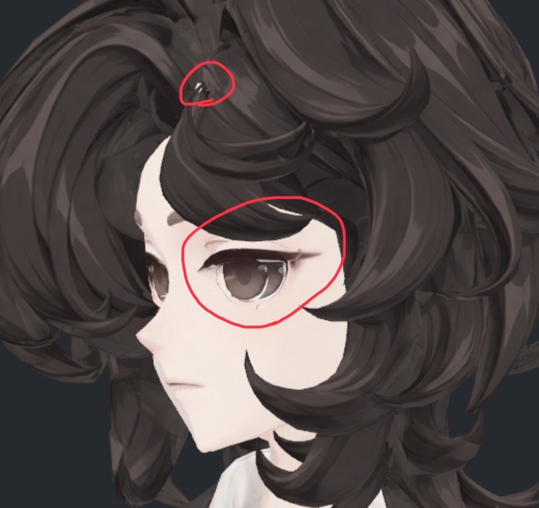

> **기록 시점 안내:** 아래는 해당 단계 당시의 보고서입니다. 후속 결정은 [최신 상태](../../STATUS.md)를 기준으로 읽어주세요. 모델·원본 텍스처·검증 원시 데이터는 이 문서 공유본에 포함하지 않습니다.

# v351 — 눈 토폴로지·텍스처·UV 우선 점검 목록

사용자가 첨부한 사진에서 눈동자·흰자위 표현과 흐릿한 눈꺼풀을 지적했다. 기존 잔여 작업 **1번: 텍스처·UV 국소 정리의 최우선 세부 항목**으로 등록한다. 이번 갱신은 사진 확인과 작업 목록 추가이며, 실제 메시 진단·UV 검증·수정 결과는 아직 아니다. 다른 잔여 작업은 유지한다.

사진에서는 눈동자 아래/옆 경계의 불규칙한 밝은 테두리와 눈꺼풀 끝의 흐릿한 번짐이 보인다. 위쪽 작은 원의 밝은 흔적도 따로 추적한다. 이 사진만으로 UV 오류, 면 겹침, 원래 채색, 노멀/셰이더 중 어느 원인인지 확정하지 않는다.

이전 v351의 “전사로 인한 뚜렷한 새 디테일 손실 없음”은 기존 대비 회귀 검사였다. 원래 눈의 구조·채색 품질까지 합격했다는 뜻이 아니며, 이번 사용자 지적은 별도 미해결 항목으로 취급한다.

## 점검 작업

| ID | 대상 | 확인할 내용 | 상태 |
|---|---|---|---|
| E01 | 양쪽 눈동자·흰자위의 토폴로지 | 홍채/동공/흰자위/눈꺼풀의 실제 면과 역할을 식별하고 면 ID·정점·재질을 대응. 면 겹침·교차·불필요한 중복·퇴화 면·법선 방향·연결 경계·깊이 관계 확인. 단순 `eye_detail` 차트 이름으로 실제 안구 구조를 가정하지 않음 | 미실행 |
| E02 | 눈동자·흰자위 텍스처 | 레퍼런스 및 기존 버전과 비교하여 홍채/동공 윤곽, 흰자위 폭·색, 하이라이트, 아래/옆의 밝은 테두리와 얼룩 확인. 기본색과 실제 NPR 셰이더를 나눠 채색 문제인지 먼저 분리 | 미실행 |
| E03 | 눈 주변 UV | 실제 면→기존/새 UV→텍셀 대응 확인. 겹침·뒤집힘·늘어짐·밀도·이음선·여백·차트 내부의 좁은 경계 간격과 다른 면 색 혼입 검사. 겹침 0만으로 통과시키지 않고 압축·필터·밉·거리별 실제 표시 확인 | 미실행 |
| E04 | 위/아래 눈꺼풀·눈꼬리 | 흐릿한 선과 속눈썹 끝을 구조/텍스처/UV/셰이더 기여로 분리. 눈꺼풀 두께·겹침·주변 피부 경계 확인. 일괄 샤프닝이나 굵은 선 덧칠로 원인을 가리지 않음 | 미실행 |
| E05 | 위쪽 작은 원의 밝은 흔적 | 현재 사진의 해당 위치를 실제 표면까지 추적. 머리카락 텍스처 누락/UV 혼입/틈으로 보이는 다른 면/재질 효과 중 출처 확인. 이전 다른 위치의 밝은 흔적 진단을 그대로 적용하지 않음 | 미실행 |
| E06 | 향후 눈 표정·시선 호환 | 눈 감기·시선 이동에 필요한 현재 구조와 원래 정점 대응 확인. 추후 표정을 만든 뒤 깜빡임·상하좌우 시선·웃음 조합에서 흰자 노출, 관통, 눈꺼풀 선 끊김·UV 늘어짐 검사 | 구조 진단 미실행 / 동작 검수는 표정 제작 후 |

사진에 잘 보이는 눈뿐 아니라 머리카락에 가린 반대쪽 눈과 눈꺼풀 안쪽도 확인한다. 현재 모델에는 얼굴 표정 세트가 없으므로 중립 사진을 눈 감기·시선 이동 검증으로 계산하지 않는다.

## 진행 순서와 완료 기준

1. 실제 눈 부품·면 대응부터 확인한 뒤, 중성 재질/기본색/최종 NPR 표시를 같은 카메라에서 비교한다.
2. 기존 UV와 새 UV, 원래 텍스처와 새 전사의 차이를 대조해 원인을 분리한다. JPG 확대의 압축 흔적과 원본 렌더의 현상도 구분한다.
3. 확인된 원인에 맞는 국소 수정 후보를 별도 사본으로 비교한다. 기존 얼굴 인상·눈매·홍채 디테일과 NPR 방향을 유지하고 새 생성/대체 메시·자동 리메시는 하지 않는다.
4. 정면·양 측면·사선·근접/일반 거리·가림 해제 사진과 UV 도면으로 전후를 남긴다. 작업자 직접 확인과 별도 기술/시각 검토를 거치며, 이번 목록 등록을 실제 검토 완료로 표시하지 않는다.
5. 원인·수정/유지 판단·미채택 시도·남은 문제를 사진 포함 보고로 정리한다. 표정 제작 이후의 동작 확인은 별도 완료 항목으로 유지한다.

[기존 잔여 작업 목록](../v349_remaining_npr/v349_WORK_PLAN.md) · [iPhone 얼굴 표정 준비](v351_IPHONE_FACE_TRACKING_PREPARATION.md)
