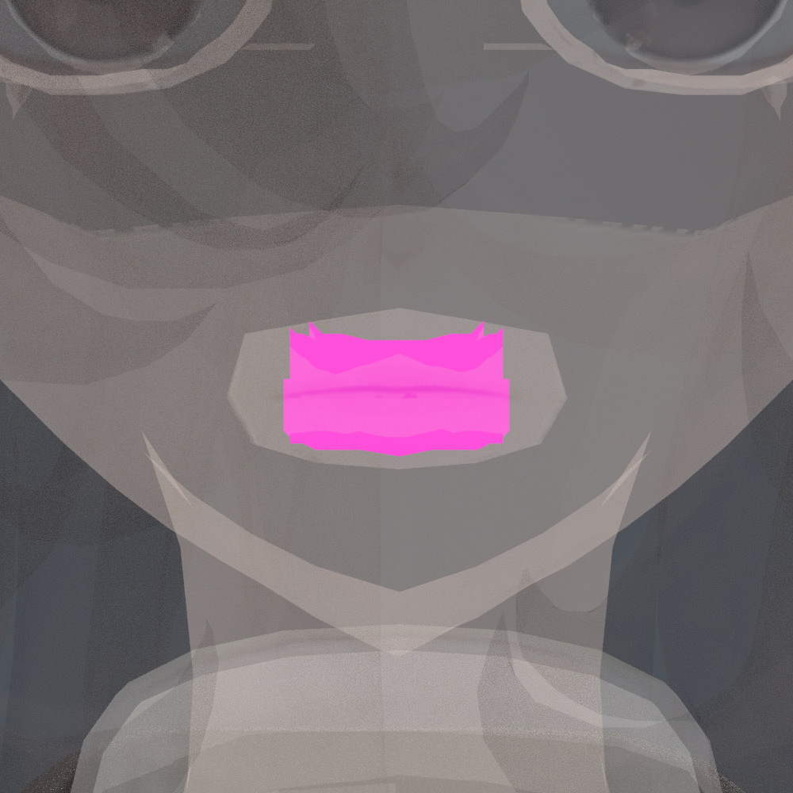

> **기록 시점 안내:** 아래는 해당 단계 당시의 보고서입니다. 후속 결정은 [최신 상태](../../STATUS.md)를 기준으로 읽어주세요. 모델·원본 텍스처·검증 원시 데이터는 이 문서 공유본에 포함하지 않습니다.

# v351 — iPhone 얼굴 트래킹을 고려한 UV·표정 준비

추가 사용자 피드백: [눈동자·흰자위 토폴로지/텍스처/UV 및 눈꺼풀 우선 점검 목록](v351_EYE_REVIEW_TASKS.md). 현재는 목록 등록이며 원인 확정·수정 완료가 아니다.

사용자는 향후 iPhone으로 얼굴 트래킹할 계획이라고 밝혔다. 현재 UV와 텍스처가 그 작업을 방해하지 않도록 제작 기준에 반영한다. 새 UV는 필터 경계와 최종 전사 검수 중인 후보이며 아직 완성·채택 상태가 아니다.

## 실제 현재 상태

v348 기준 파일과 새 연결 UV 사본을 Blender에서 재로드했다. BodyHair의 Basis 제외 26키와 Coat의 Basis 제외 32키는 관절 보정용이며, 눈 감기·입 벌리기·미소 등 얼굴 표정 세트가 없다. 눈·턱·입 전용 본도 현재 목록에 없다. 두 파일의 정점/면/loop 수, 모든 기존 셰이프키 좌표 해시 및 129본 목록은 동일하다. 따라서 기존 키를 보존한 것만으로 얼굴 트래킹 준비 완료라고 할 수 없다.

이전 진행 메시지의 “기존 표정용 셰이프키 보존 후 눈감기/입벌리기 비교”는 실제 표정 키가 있다고 오해할 수 있어 정정한다. 해당 표정 회귀 시험은 아직 미실행이다.

## 이번 UV 제작에 적용하는 기준

1. 얼굴 피부는 눈·코·입 위치를 한 장에서 찾을 수 있는 큰 연속 전개로 유지한다. 눈꺼풀/입술을 가로지르는 불필요한 이음선은 만들지 않는다.
2. 피부와 접한 구강·눈 부속을 같은 위치라는 이유로 강제 접착하지 않는다. 가상 UV solver에서만 분리하며 원래 모델의 실제 기하·정점 순서는 유지한다.
3. 눈 주변/입 주변에 충분한 픽셀 면적을 배정하고, 부속의 면 대응표를 보존한다. 미사용 공간을 채우기 위해 눈·입 디테일을 축소하지 않는다.
4. 고정된 입 벌림이나 찡그림의 그림자를 중립 텍스처에 새로 그리지 않는다. 표정에 따라 달라져야 할 형태/그림자는 후속 표정·NPR 셰이더 검토에서 분리한다.
5. 입 안쪽·눈꺼풀 뒷면처럼 표정에 필요한 구조가 실제로 존재하는지 먼저 확인하고, 존재하는 면은 표정 중 노출까지 검수한다. 현재 중립 외관 확인을 표정 검수로 대체하지 않는다. UV 차트의 `mouth`·`eye_detail`은 자동 분류 이름이므로 실제 구강·안구·눈꺼풀 기능이 갖춰졌다는 증거가 아니다.

## 후속 필수 단계 — 아직 구현하지 않음

| 단계 | 확인할 내용 |
|---|---|
| 얼굴 구조·표정 설계 | 현재 눈꺼풀/입술/구강 및 눈 움직임 구조 확인. 원래 인상을 유지할 수 있는 기존 정점 기반 변형 범위 설계 |
| 기본 표정 제작 | 좌우 독립 눈 감기, 눈/눈썹 움직임, 턱/입 벌림과 닫힘, 입꼬리/입술 움직임 |
| ARKit 채널 대응 | 좌우를 캐릭터 기준으로 맞추고 각 계수에 실제 변형을 연결. 이름만 존재하는 빈 키를 지원으로 계산하지 않음 |
| 조합 검수 | 눈 감기+웃음, 턱 벌림+입술 닫기, 시선+눈꺼풀 등 복합 입력에서 관통/UV 늘어짐/선 끊김 검사 |
| 입력 연결·실기 | 사용할 iPhone 앱/PC 수신 경로를 정하고 실제 휴대폰 입력·중립 복귀·좌우·지연·보정 검증 |

ARKit은 얼굴 움직임을 개별 blend shape 계수로 제공한다. 예를 들어 `jawOpen`과 `mouthClose`는 서로 다른 의미이며, 좌우는 얼굴 본인 기준이다. 따라서 단일 입 벌림이나 좌우가 합쳐진 눈 감기만으로 전체 트래킹 표정을 대신하지 않는다. [Apple blend shape 계수](https://developer.apple.com/documentation/arkit/arfaceanchor/blendshapes), [Apple 계수 정의와 좌우 기준](https://developer.apple.com/documentation/arkit/arfaceanchor/blendshapelocation).

현재 결과는 UV 제작에서의 호환 준비와 실제 보유 기능 조사이다. ARKit 전체 표정 구현, iPhone 연결, VRChat 얼굴 트래킹 실기 완료가 아니다.

## PC VRChat 연결 설계에 반영할 사항

2026-09-13 공식 문서를 확인했다. 후속 연결 경로의 우선 검토안은 **iPhone의 iFacialMocap → PC의 VRCFaceTracking 모듈 → OSC/아바타 파라미터 → 실제 얼굴 변형**이다. iPhone과 PC의 연결 및 모듈 수신부터 검증하고, 입력이 들어오는 것과 아바타가 올바르게 움직이는 것을 따로 확인한다. [VRCFT iPhone 연결 안내](https://docs.vrcft.io/docs/hardware/desktop/iphone/ifacialmocap-iphone).

ARKit 이름 52개를 파일에 만드는 것만으로 VRChat 지원이 끝나지는 않는다. ARKit 의미를 VRCFT Unified Expressions에 대응하고, 눈 감기·눈 크게 뜨기·시선 및 턱 벌림·입술 닫힘을 구분한다. 입력이 없는 확장 표정까지 iPhone에서 직접 추적된다고 표시하지 않는다. [ARKit 대응표](https://docs.vrcft.io/docs/tutorial-avatars/tutorial-avatars-extras/compatibility/arkit).

아바타에는 해당 파라미터와 실제 셰이프키를 연결하는 제어 구성이 필요하다. 기존 바람·관절 제어와 이름/예산/동작이 충돌하지 않도록 만든다. 기본 eye-look, 자동 깜빡임, 음성 viseme/lip-sync, 손 제스처 표정의 실제 설정 유무를 먼저 확인하고, 같은 눈·입을 중복 구동하지 않도록 우선순위와 전환을 검수한다. 또한  트래킹이 끊기거나 꺼졌을 때 기본 표정으로 돌아가는 경로도 검증한다. [VRCFT 아바타 파라미터와 비활성 복귀 안내](https://docs.vrcft.io/docs/tutorial-avatars/tutorial-avatars-extras/parameters).

우선 사용 조건은 iPhone 카메라에 얼굴 전체가 보이는 PC 데스크톱 환경으로 잡는다. VR 헤드셋으로 상반부 얼굴을 가린 채 iPhone만으로 동일한 전체 얼굴 트래킹을 하는 사용 조건은 별도이며, 현재 준비 완료 범위에 포함하지 않는다. [VRCFT iPhone 사용 조건](https://docs.vrcft.io/docs/hardware/desktop/iphone).

## 독립 검토 반영

별도 시각 검토 에이전트가 중립 얼굴 전후 렌더, 얼굴 UV와 분류 로직을 확인했다. 큰 피부 전개와 중립 인상 유지 방향은 타당하지만, 실제 표정이 없는 상태에서 눈·입 변형에 문제가 없다고 판정할 수는 없다. 후속 작업은 각 부품의 실제 역할·면 ID·좌우·가시성을 먼저 확정하고, 개별·복합 표정을 만든 뒤 UV 늘어짐과 선 끊김을 검사한다. 원래 인상을 보존하는 범위와 실제 제작 가능한 변형 범위도 이때 함께 검토한다.

기술 검토에서는 기존 분류에서 `hair / protected`로 기록된 component19의 **88면**이 실제로 입술 뒤 입 내부 구조임을 확인했다. 이 면들은 원래 `REGION_face=1`, `head=1` 가중치를 가지며 헤어 본 영향이 없다. 새 UV 사본에서는 얼굴 텍스처로 옮기고 입 내부 부속으로 따로 식별한다. 기존 어두운 색과 형상은 보존한다. 이 구조가 존재한다는 사실은 입 벌림이나 발음 표정이 구현됐다는 뜻이 아니다.

위 이미지는 원래 모델의 가림을 해제한 위치 확인이다. 최종 재질·입 색을 바꾸는 제안이나 표정 시연이 아니다. [입 내부 분류 독립 검토](v351_MOUTH_CLASSIFICATION_REVIEW.md)를 함께 참고한다.
