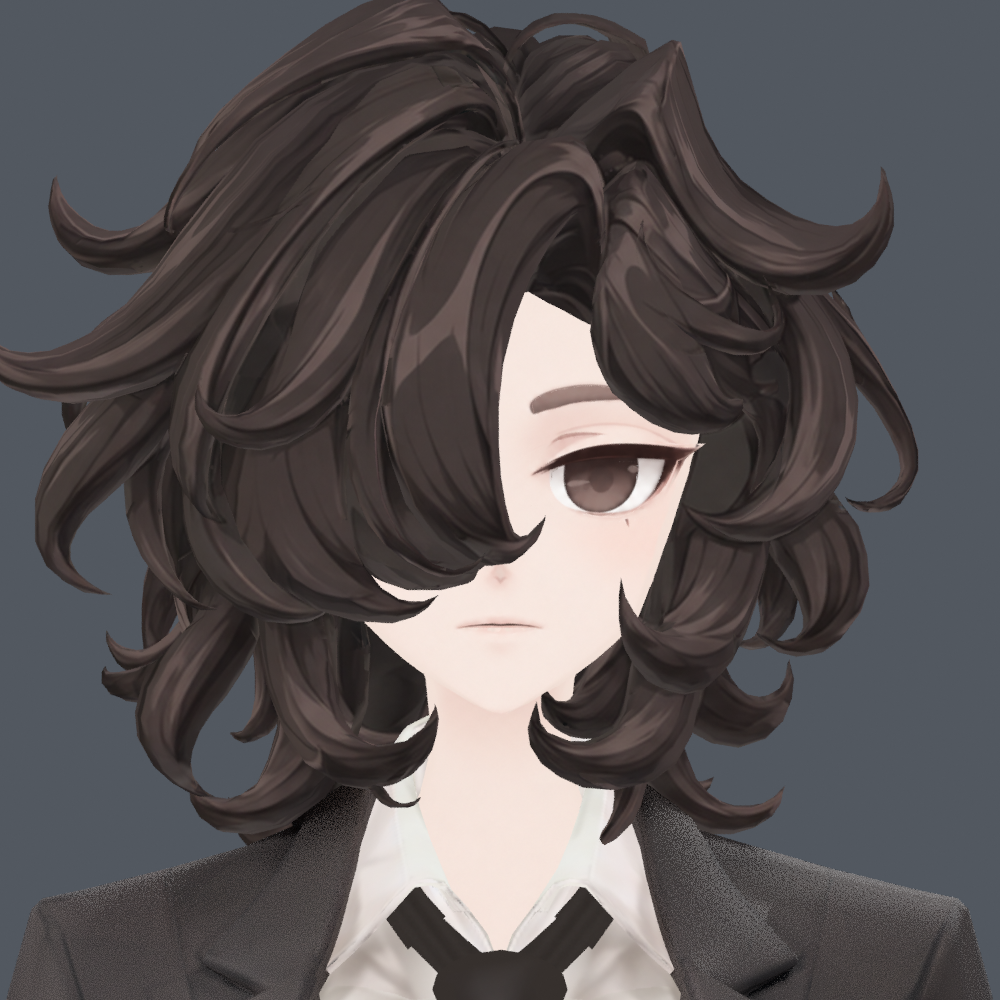
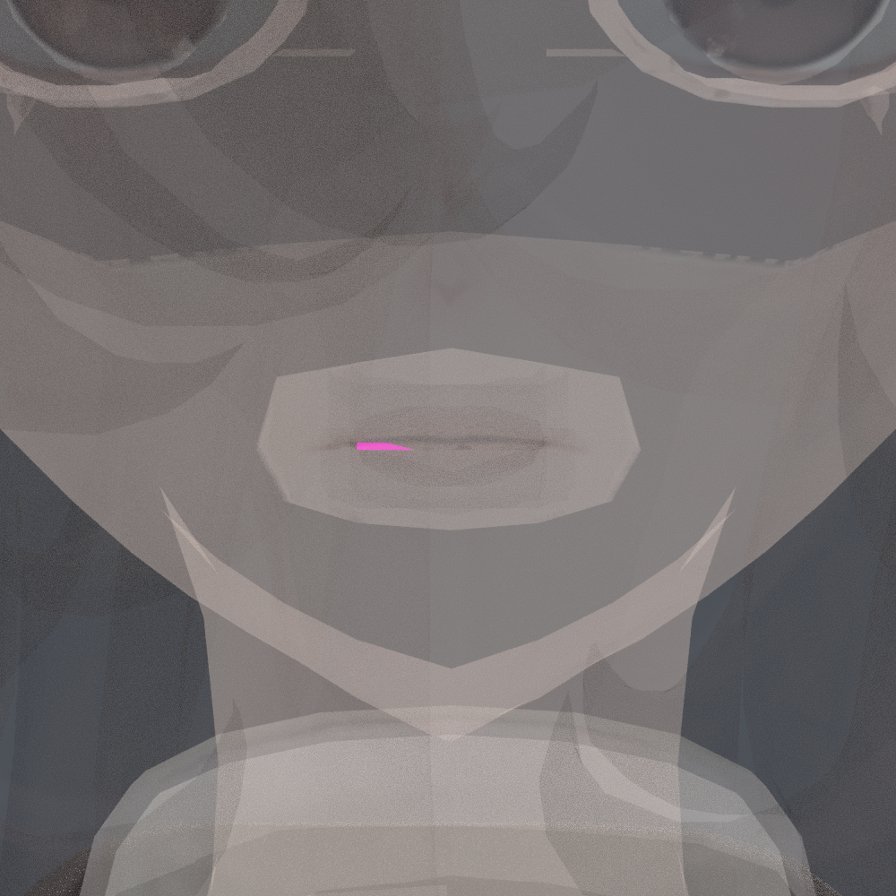
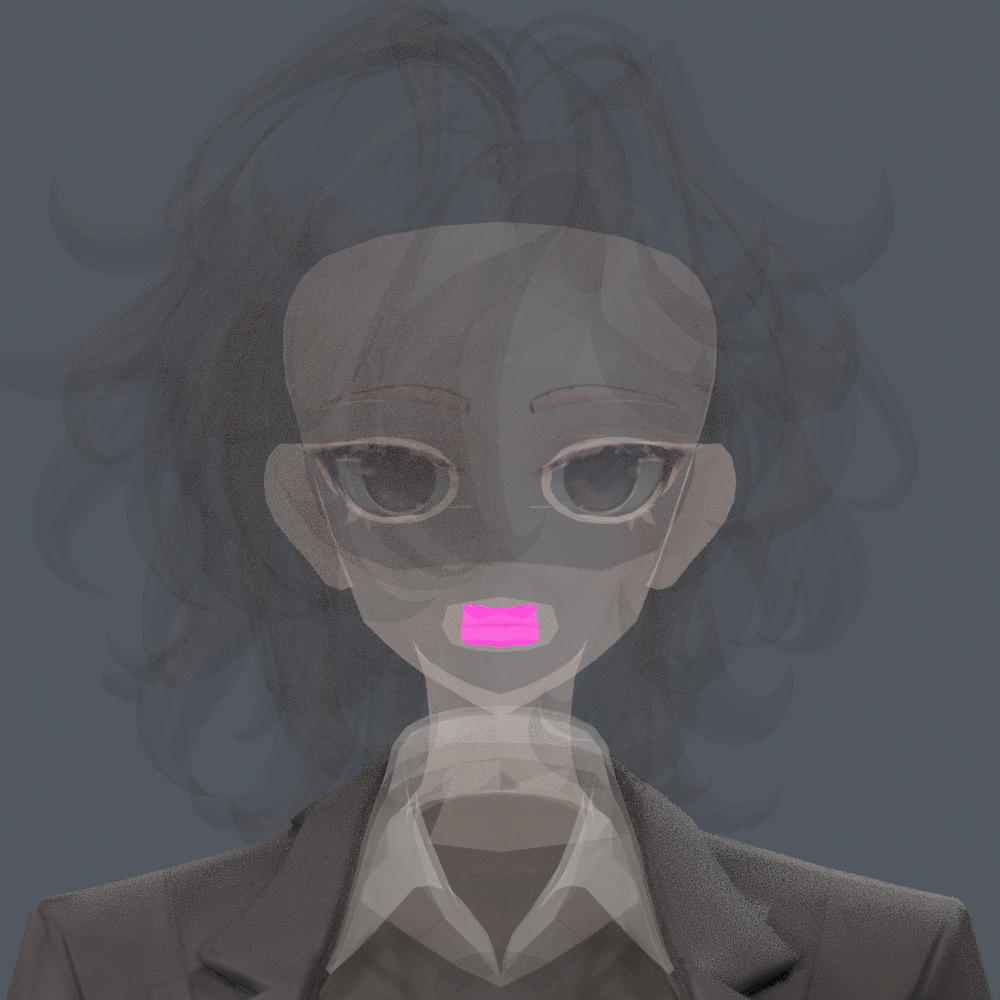

> **기록 시점 안내:** 아래는 해당 단계 당시의 보고서입니다. 후속 결정은 [최신 상태](../../STATUS.md)를 기준으로 읽어주세요. 모델·원본 텍스처·검증 원시 데이터는 이 문서 공유본에 포함하지 않습니다.

# v351 C61 및 입 내부 88면 분류 확인

**C61의 3면은 머리카락이 아니라 입선 왼쪽 안쪽에 있는 어두운 내부 구조다.** 원래 inventory component19 전체 88면이 같은 입 내부에 있으므로 세 면만 재분류하기보다 이 전체를 `face / mouth_inner_detail (protected)`로 관리하는 것이 적절하다. `lip_detail`만 쓰면 겉 입술 피부와 혼동할 수 있다.

이 판정은 단순 좌표 추정에 머무르지 않고 원래 v348 모델을 열어 원래 3면 또는 전체 88면에만 식별색을 배정한 읽기 전용 진단 렌더를 직접 확인했다. 일반 불투명 정면에서 해당 3면은 다른 표면에 가려졌다. 아래 가림해제 그림은 다른 표면을 반투명하게 만든 **위치 진단 전용**이며 최종 아바타의 투명도·색을 바꾼 결과가 아니다.

- C61 원래 polygon: 524 / 529 / 5660.
- 원래 component19 전체 88면, 233 raw정점. 공간 범위 x±0.008545, y−0.038330…−0.026123, z0.855469…0.865723m.
- v351 의미 차트 C59(40면), C60(40), C61(3), C62(3), C67(1), C69(1)에 분산됐다.
- 원래 vertex group은 REGION_face, head, CONNECTED_19_99에 속하며 헤어 본 영향은 없다. 27개 기존 shape key에서는 해당 정점 변화가 없다.
- sourceHead의 해당 세 면은 v343에서도 어두운 회갈색이다. v343 Head_TRANSFER 표본 중앙값은 polygon524 RGB60/53/51, polygon5660 RGB56.5/49.5/47.5이다. v346에서도 어두운 색을 유지한다. **분류를 얼굴로 바꾼다는 이유로 이 내부 면을 피부색으로 밝히면 안 된다.**
- 주변 실제 공유 edge/정점의 면들도 component19의 같은 내부 구조다. C61의 mixed winding은 원래 물리 면 방향에서 왔으며 이번 UV 작업에서 원래 방향을 보존한다.

정확한 88면 ID와 정점 그룹: `v351_lip_shape_probe.json`.

세 면의 원래 UV/재질/좌표: `v351_lip_probe.json`.

원래 edge/vertex 인접 면과 텍스처 표본: `v351_lip_neighbors.json`.

진단은 background Blender의 메모리상 임시 재질만 사용했고 저장하지 않았다. 검토 시 모델을 수정하지 않았다. 이후 제작 담당이 근거 PNG·JSON을 이 버전 폴더에 복사했다.
