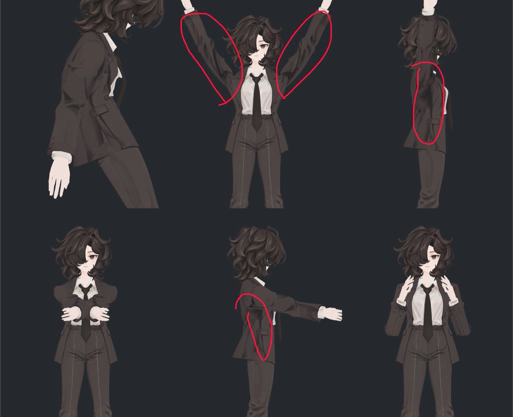

> **기록 시점 안내:** 아래는 해당 단계 당시의 보고서입니다. 후속 결정은 [최신 상태](../../STATUS.md)를 기준으로 읽어주세요. 모델·원본 텍스처·검증 원시 데이터는 이 문서 공유본에 포함하지 않습니다.

# v351 — 과한 페인팅 명암 비교·개선 작업 목록

기존 잔여 **1번 텍스처·UV 정리**에 추가한다. 눈 우선 점검(E01~E06)과 다른 잔여 작업을 유지한다. 기존 주름 노멀 대안 비교와 연결하되, 아래 표시 부위의 개선·검증을 별도 완료 항목으로 추적한다. **이번은 사진과 작업 목록 등록이며, 실제 원인 진단·참고 모델 비교·수정은 미실행이다.**

사진에서 팔을 들거나 앞으로 뻗었을 때 소매 안쪽과 겨드랑이, 코트 옆면의 짙은 명암 덩어리가 두드러진다. 과하게 그려진 그림자로 보일 수 있으나 사진만으로 기본색 채색, AO, 실제 형상/노멀, 재질·광원 효과의 기여를 확정하지 않는다. 기존의 의도된 주름이라는 판단이 있더라도 이번 사진과 실제 표면에 다시 대응하여 평가한다.

## 작업 항목

| ID | 작업 | 비교·완료 기준 | 상태 |
|---|---|---|---|
| S01 | 표시 부위와 가린 면 전수 대응 | 양쪽 소매 안쪽·겨드랑이·코트 옆/안쪽을 실제 면·재질·UV·텍셀에 대응. 유사 현상은 다리 안쪽/뒤쪽 등도 확인하고 위치별 목록화 | 미실행 |
| S02 | 명암 원인 분리 | 기본색만, 중성 재질, AO·노멀·셰이더 음영을 각각 분리한 동일 카메라 비교. UV 늘어짐·이음선 색 혼입이나 변형된 면/노멀 영향도 확인. 실제로 텍스처에 고정된 그림자인지 검증 | 미실행 |
| S03 | siusiu·lapwing 참고 비교 | 접근 가능한 원본 모델의 기본색·음영 관련 맵·재질을 확인하고 유사 부위/자세에서 비교. 고정 그림자의 면적·농도·경계, 주름선과 큰 음영 분담, 조명/자세 변화 시 읽힘을 기록. 이미지로만 확인한 부분은 내부 구현 확인과 구분 | 미실행 |
| S04 | 별도 사본 개선 후보 | A 현재본, B 과도한 고정 명암만 국소 정리, C 정리한 기본색+필요한 셰이더/노멀 분담을 비교. C가 필요 없으면 근거를 남김. 큰 명암을 전부 노멀로 치환하거나 밝기를 자동 요철로 변환하지 않음 | 미실행 |
| S05 | 디테일·NPR 보존 검수 | 소매 주름·봉제선·단추·포켓 경계·천의 부피와 기존 인상을 유지. 일괄 블러/평탄화로 얼룩만 없애지 않음. UV 수정은 실제 오류나 편집성 문제가 확인된 부위에 근거를 두고 시행 | 미실행 |
| S06 | 자세·조명별 비교 보고 | 중립/팔 들기/앞으로 뻗기/팔꿈치 접기/몸 숙이기를 정면·측면에서 비교. 광원 방향·밝기 변경, 근접·일반 거리에서 원본/후보/참고 모델을 확인. 작업자 및 별도 기술·시각 검토 후 원인·채택/미채택 이유·잔여 문제를 사진과 함께 보고 | 미실행 |

## 판단 기준

- NPR에서는 어떤 명암을 채색으로 유지할지 자체가 비교 대상이다. 그림자가 그려져 있다는 이유만으로 모두 지우지 않는다.
- 소매 안쪽과 코트 옆면이 자세와 무관하게 검은 얼룩처럼 읽히는지, 실제 주름의 깊이와 형태를 설명하는지 구분한다.
- 사용자 선호인 선명하고 정돈된 애니메이션/일러스트 인상과 디테일을 함께 유지한다. 참고 모델의 디자인을 그대로 복제하거나 원래 실루엣·얼굴 인상을 바꾸지 않는다.
- 현재 v351 코트 탄젠트 효과 OFF 상태를 출발 기록에 명시하고, 새 UV에 맞춘 노멀 검증 전에는 효과를 켰다는 사실만으로 개선 완료로 보지 않는다.
- 수정은 원본을 보존한 별도 사본에서 진행하며 새 메시 생성·대체·자동 리메시를 하지 않는다. 향후 최종 관절/본 통합 검수 목록도 유지한다.

[기존 잔여 작업 목록](../v349_remaining_npr/v349_WORK_PLAN.md) · [눈 우선 점검 목록](v351_EYE_REVIEW_TASKS.md) · [현재 작업 보고](v351_WORK_REVIEW.md)
