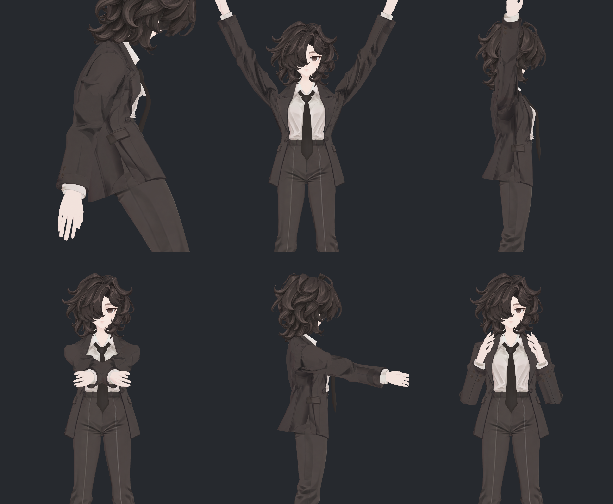
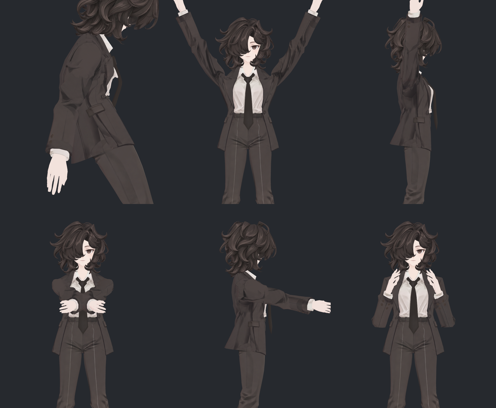
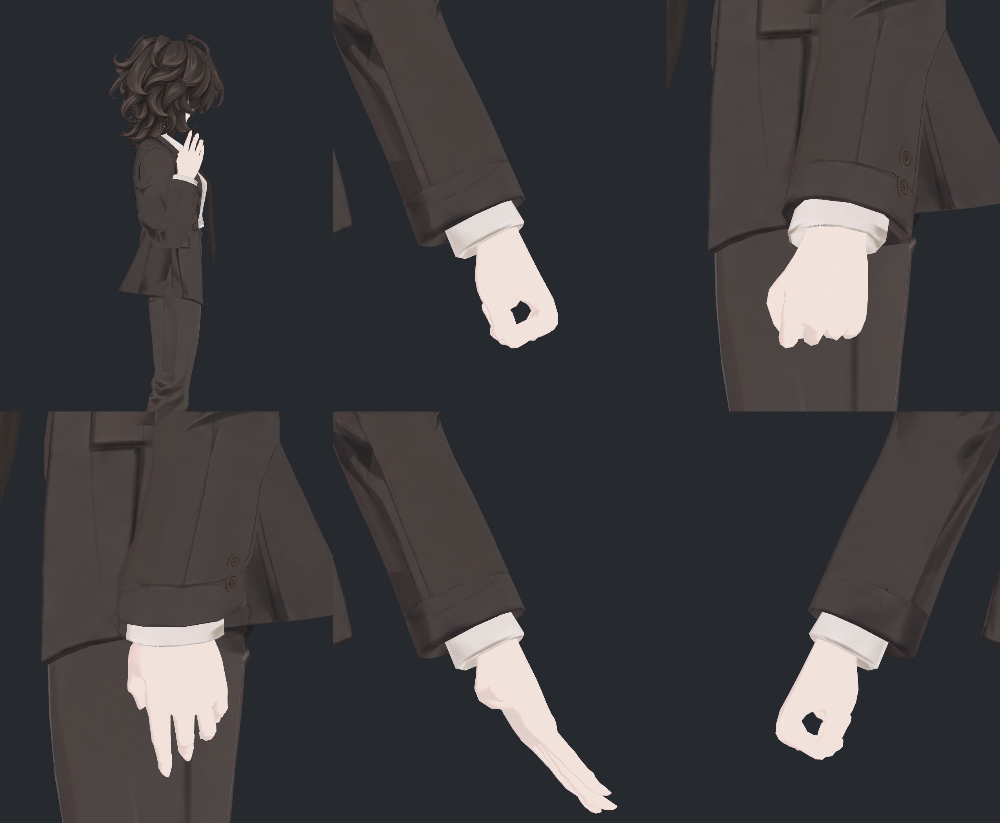
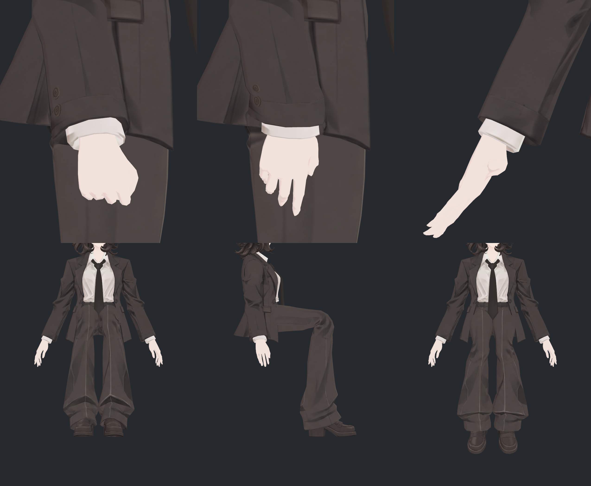
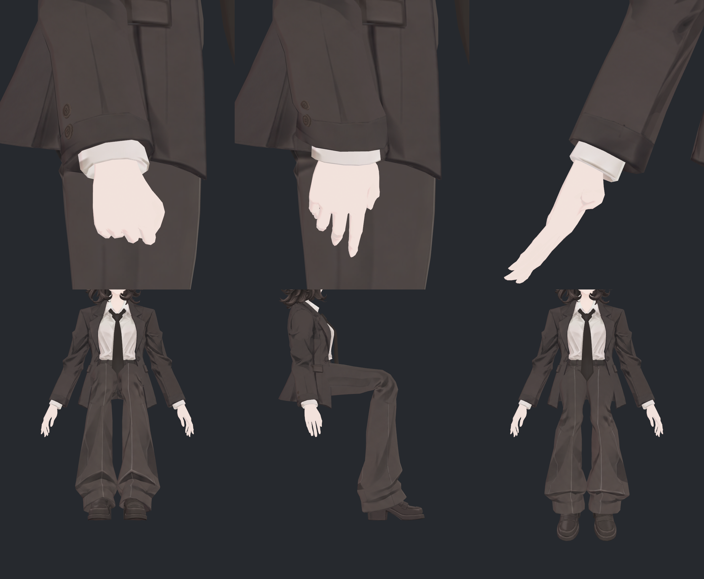
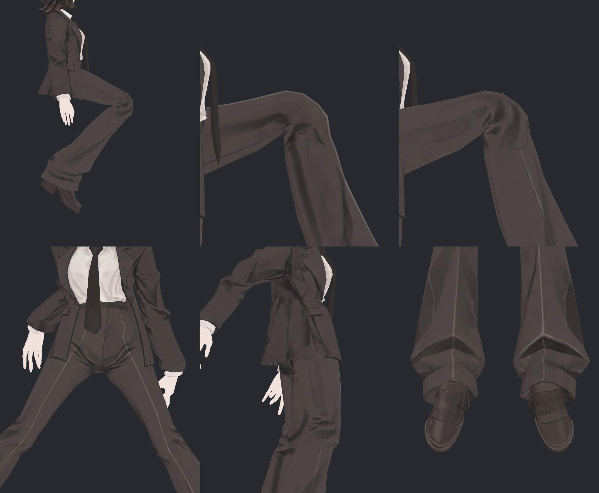
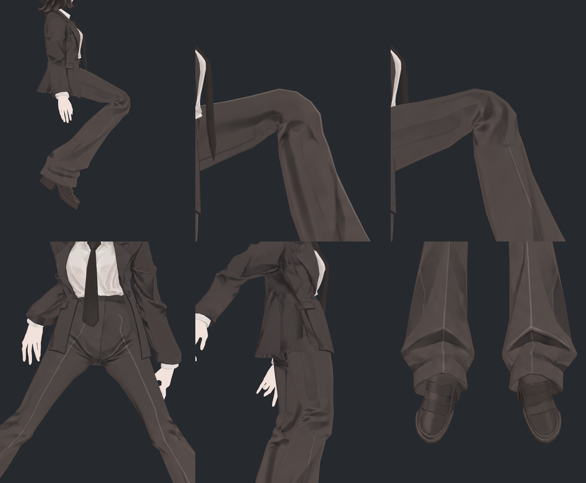
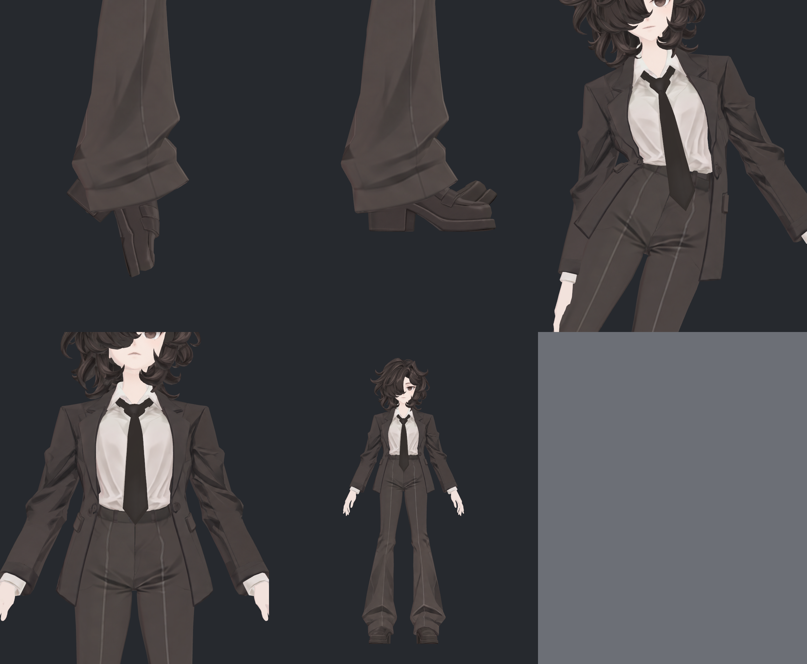

> **기록 시점 안내:** 아래는 해당 단계 당시의 보고서입니다. 후속 결정은 [최신 상태](../../STATUS.md)를 기준으로 읽어주세요. 모델·원본 텍스처·검증 원시 데이터는 이 문서 공유본에 포함하지 않습니다.

# v351 — 실제 포즈 전후 전체 사진

같은 v348 SDK 변형 정점·노멀에 기존/새 UV 재질을 적용한 35구도 비교다. 각 시트는 앞에서부터 6구도이며 마지막은 5구도다. 얼굴 표정 시연이나 새 SDK 동작 재시험이 아니다.

## 시트 1

## 시트 2

## 시트 3

## 시트 4

## 시트 5

## 시트 6

