> **기록 시점 안내:** 아래는 해당 단계 당시의 보고서입니다. 후속 결정은 [최신 상태](../../STATUS.md)를 기준으로 읽어주세요. 모델·원본 텍스처·검증 원시 데이터는 이 문서 공유본에 포함하지 않습니다.

# v351 — 가림 해제 12부위 전후

각 그림은 정면·측면·뒤·반대 측면·위·아래 방향이다. 다른 부위를 임시로 숨긴 검사이므로 눈/입 내부나 열린 경계가 보이는 사진을 일반 외관과 구분한다. 기존 구조/얼룩이 남은 부분도 전후 함께 표시한다.

## face

## hair

## coat_front_open

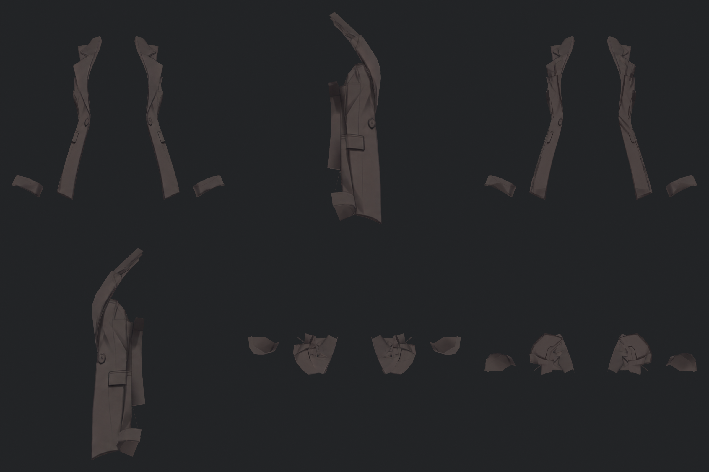

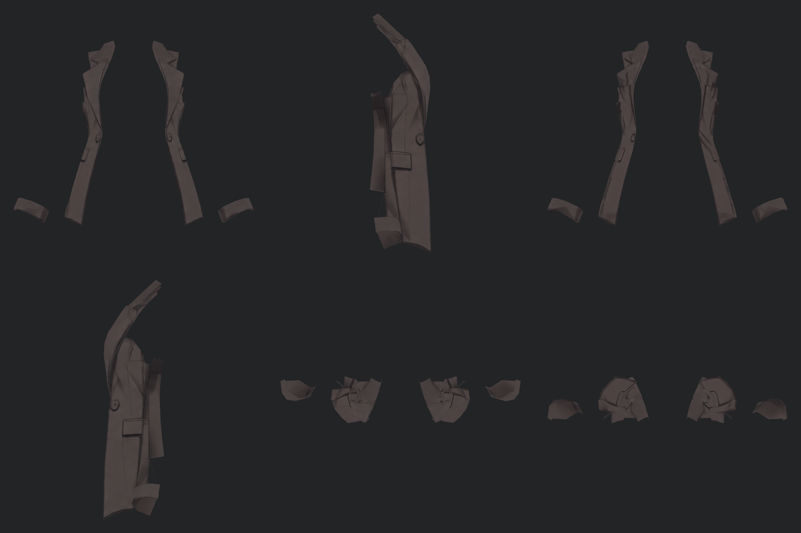

## coat_back_open

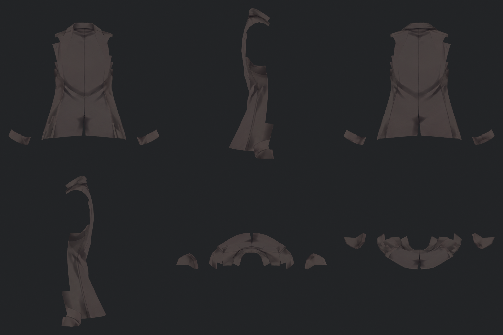

## sleeves

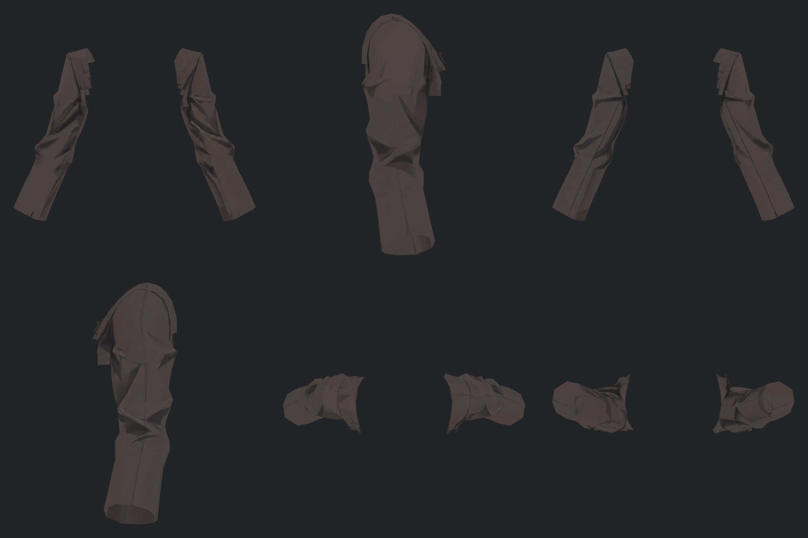

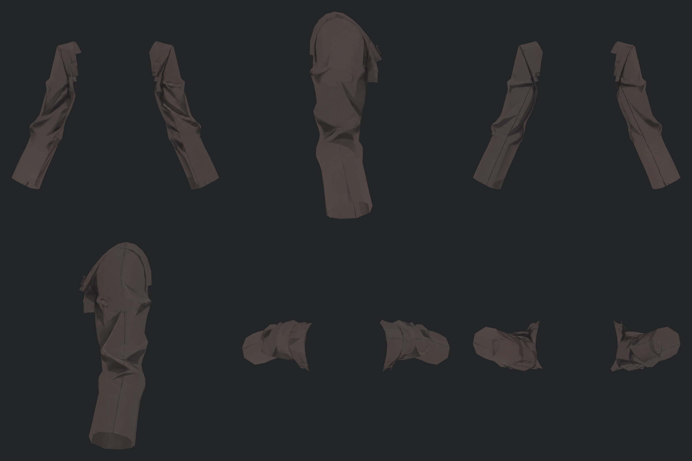

## pants

## shirt

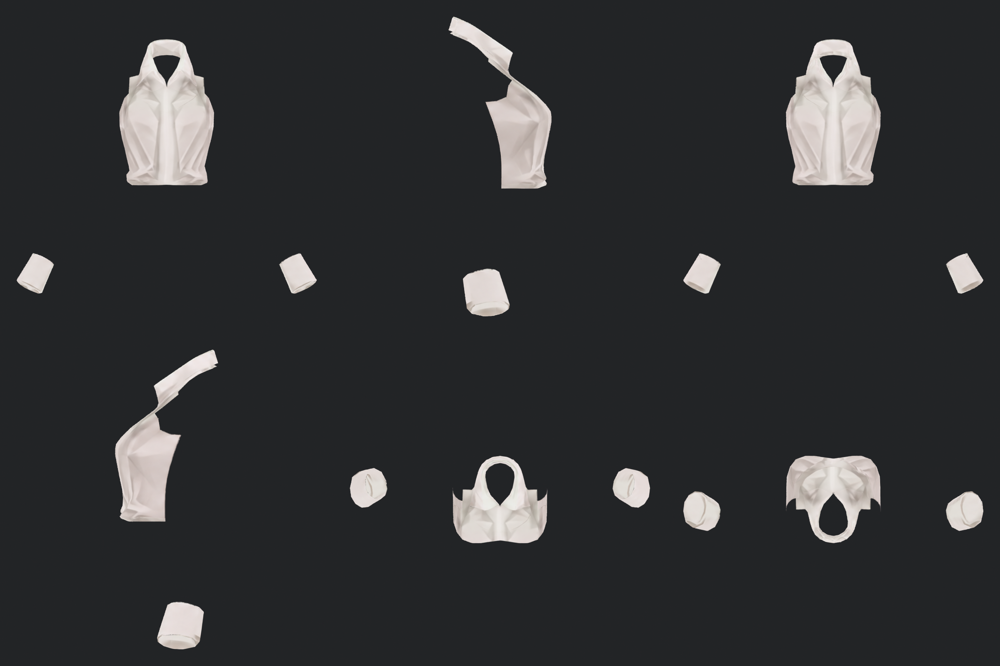

## hand_L

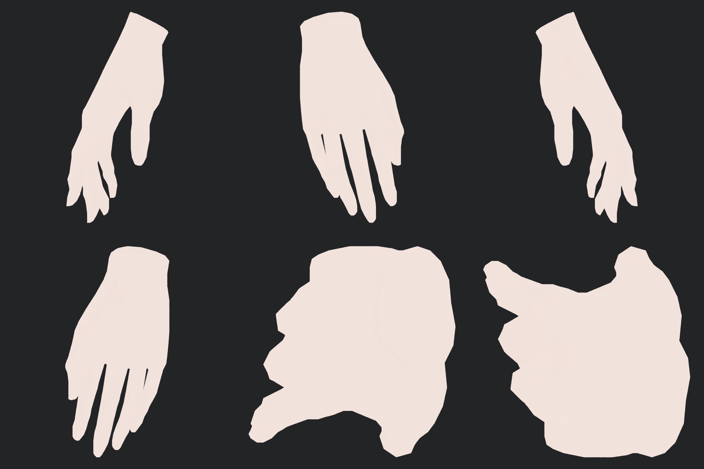

## hand_R

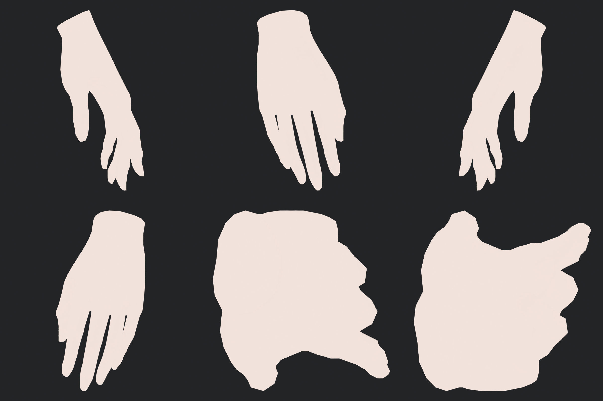

## shoe_L

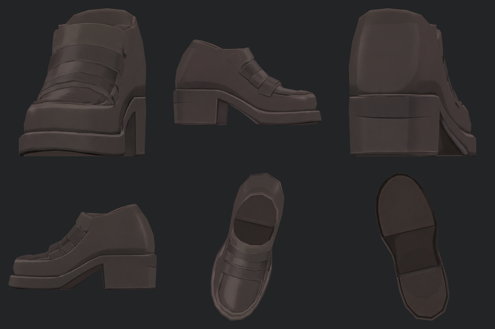

## shoe_R

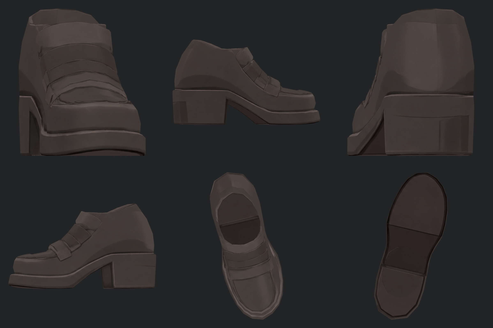

## details

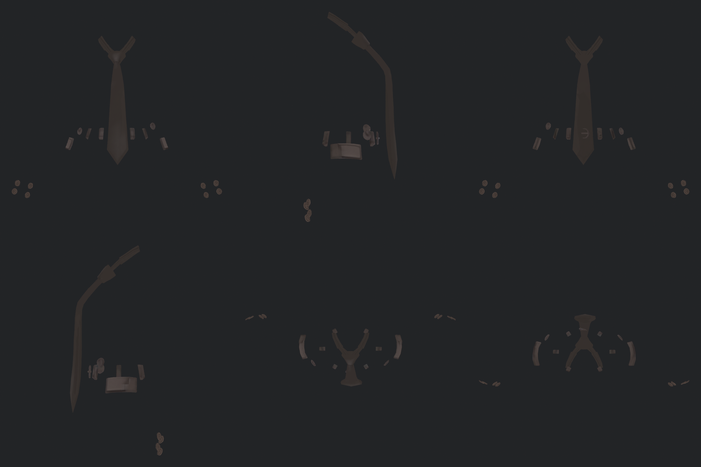

