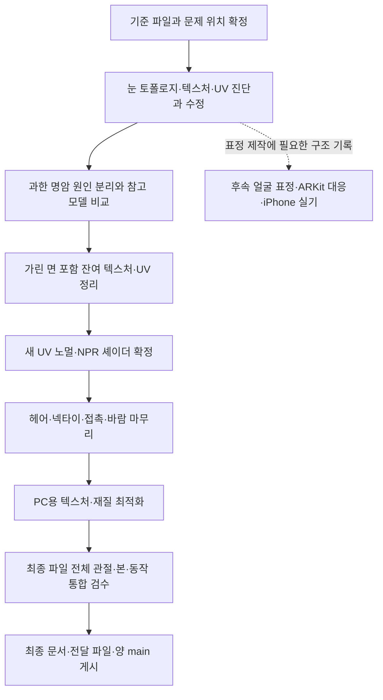

# v351 — NPR 잔여 작업 플로우

## 2026-09-14 최종 기준 보완

**최종 목적은 Unity 게임·PC VRChat에서 실제로 정상 동작하고 2D 레퍼런스의 NPR 캐릭터로 보기 좋게 보이는 결과다.** Blender 결과는 중간 제작 검수이며 실제 Unity 임포트/재로드·실행용 재질/셰이더·다양한 조명·연속 애니메이션/물리·접촉·실사용 비용까지 확인한다. Blender 전용/Editor 전용 재현을 실제 런타임 기능으로 계산하지 않는다.

**Unity 콜라이더·물리 사용 허용:** 사용자는 Unity에서 제공·지원하는 콜라이더와 물리 기능을 작업에 활용해도 된다고 명시했다. 자켓·넥타이·헤어의 중력 처짐, 흔들림, 몸/의복과의 충돌 대응에 사용할 수 있다. 기능을 켰다는 사실만으로 완료하지 않고 실제 대상 환경에서 지원되는 조합인지, 물리ON 상태의 처짐·접촉·관통·떨림·복귀·비용이 적절한지 검수한다. 일반 Unity 게임에서 동작하는 기능이 PC VRChat에서도 그대로 지원된다고 가정하지 않는다. 이 허용은 향후 구현 수단에 관한 것이며 현재 문서 갱신을 실제 적용/업로드 실행으로 해석하지 않는다.

[최신 작업 목록과 공통 최종 완료 기준](../v352_eye_shadow_research/v352_REMAINING.md)을 우선한다. Blender 검수, Unity Editor/SDK 실행, 실제 게임 빌드/PC VRChat 클라이언트 검수를 구분하고 미검증 조건을 적는다. 아래의 “PC VRChat 클라이언트 이전”은 당시 중간 전달 범위이며 전체 최종 완료 조건이 아니다. 실제 대상 환경에서 정상 동작과 시각 품질을 확인해야 최종 완료를 판단할 수 있다.

최신 텍스처 제작 방향은 기존 채색의 부분 보수가 아닌 N01-R의 2D 레퍼런스 기반 신규 NPR 텍스처·필요한 UV/노멀/재질/셰이더 재작업이다. 현재는 사용자 요청에 따라 작업 목록과 기준을 등록한 상태이며 이 갱신으로 제작·실행을 시작하지 않았다.

## 기존 절차 기록 — 2026-09-13

작성 기준: 2026-09-13. 현재 연결 UV 후보와 최신 눈·명암 피드백부터 PC VRChat 클라이언트 검증 전까지의 실행 흐름이다. 이번 갱신은 절차 문서 작성이며 모델·텍스처·본을 새로 수정하거나 검토 에이전트를 실행한 결과가 아니다.

[작업 목록](../v349_remaining_npr/v349_WORK_PLAN.md)은 무엇이 남았는지, 이 문서는 어떤 순서와 근거로 진행하고 완료를 판단하는지 설명한다. 과거 [v345 제작·독립 검토 절차](../v345_npr_work_plan/v345_WORK_PLAN.md)는 당시 기록으로 보존한다. 그 문서의 당시 실행 보류 상태를 현재 작업 전체의 보류로 해석하지 않는다. 다음 제작은 현재 사용자 지시와 이 흐름을 함께 따른다.

## 출발 상태와 범위

- 출발 후보는 v351 연결 UV 사본이다. v348 원본과 직전 검수본을 비교 기준으로 보존한다. v350 조각 재배치 후보를 자동 채택하지 않는다.
- 연결 UV·8개 텍스처 분리와 일부 경계 수정은 실행 기록이 있다. 눈 E01~E06과 과한 명암 S01~S06은 목록에만 등록됐으며 실제 진단·수정은 아직이다.
- 목표는 선명한 고품질 애니메이션/일러스트 같은 NPR이다. 얼굴 인상·실루엣·부피·의미 있는 선과 장식을 보존한다. 새 메시 생성·부분 대체·자동 리메시는 하지 않는다.
- 승인된 무릎과 손가락 압축 상태를 유지한다. 필요한 원인 관련 UV·기존 구조 수정은 별도 사본에서 비교하고 변경 범위를 기록한다.
- PC VRChat 클라이언트 업로드·월드·네트워크 실사용은 다음 단계다. iPhone 표정은 현재 구조/UV 준비와 후속 실제 제작·실기를 구분한다.

## 전체 흐름

각 제작 단계 안에서는 **원인 진단 → 비교 사본 → 작업자 직접 확인 → 사용자 중간 공유·독립 검토 → 지적 수정 → 재검토**를 반복한다. 원인이 UV·노멀·셰이더로 확인되면 필요한 관련 단계를 앞당긴다. 명암 후보 비교를 위해 셰이더 실험을 할 수 있지만 최종 설정 확정은 관련 텍스처/UV 수정 후에 한다.

## 단계별 입력·결과·완료 기준

| 단계 | 실행 내용 | 남길 결과와 다음 단계 조건 |
|---|---|---|
| 0. 기준 고정 | 실제 출발 파일·버전·UV·재질·본/키 목록 확인. 사용자 사진을 실제 부위/면에 대응. 중립·문제 자세·가림 해제 비교 기준 촬영 | 파일 식별값, 부위 목록, 같은 카메라/광원/자세 조건. 원래 있던 문제와 새 회귀를 구분할 수 있어야 함 |
| 1. 눈 우선 | E01~E06: 양쪽 홍채/동공/흰자위/눈꺼풀 실제 구조, 면 겹침·노멀, 채색, UV/필터 원인 분리. 위쪽 밝은 흔적 추적. 원인별 국소 후보 비교 | 정면·양 측면·사선·가림 해제·근접/일반 거리 전후와 UV 대응. 눈매/디테일 유지 및 지적 부위 재검토. 실제 표정 검사는 표정 제작 후로 표시 |
| 2. 과한 명암 | S01~S06: 소매 안쪽·겨드랑이·코트 옆/안쪽 등 기본색/AO/노멀/형상/셰이더 기여 분리. siusiu·lapwing 실제 자료 비교 | 현재본/국소 명암 정리/필요시 셰이더·노멀 분담 후보. 자세·광원 변화에서 주름선·부피를 살리는 근거와 미채택 이유 |
| 3. 잔여 표면 | 얼굴·헤어 얇은 면/안쪽 경계, 커프 끝, 단추 아래 사각 톤, 바짓단·무릎 뒤와 가린 팔/다리/신발 면 확인. 필요한 UV 수정·재전사 | 부위별 완료/유지/미해결 표. 왜곡·여백·색 혼입 및 실제 노출 비교. UV 겹침 수치만으로 시각 품질을 통과시키지 않음 |
| 4. 노멀·셰이더 확정 | 새 UV 코트 탄젠트/노멀 대안 검증, 신발 포함 적용 재확인. 채색·큰 툰 명암·작은 요철의 역할 선택 | 최종 UV에 맞는 맵/설정과 동일 광원 전후. 현재 코트 효과 OFF에서 무엇을 바꿨는지 기록. 효과가 불필요하면 유지 근거로 결론 |
| 5. 물리 마무리 | 남은 뒷머리–코트 접촉 원인 수정. 헤어·넥타이의 실제 본/웨이트/물리/제어 구동 확인. 이동·회전·정지·바람·숙임 비교 | 같은 입력/시간의 기존·후보 GIF/영상. 관통·과도한 진폭·떨림·자연 감쇠/복귀 확인. 바람 파라미터/Editor 검증과 실제 월드 감지는 구분 |
| 6. PC 비용 조정 | 고해상도 편집 원본 보존. 실행용 해상도·압축·밉·재질 비용 후보 비교 | 얼굴/머리/단추/신발 근접·거리·동작 디테일 비교와 비용 기록. 블록 데이터 추정·Editor 측정·클라이언트 실측을 구분 |
| 7. 통합 검수 | 실제 최종 파일을 재로드하여 모든 관절·본·보정·물리를 정적/연속 입력/복합 자세/복귀에서 검사. Blender와 Unity 가져오기 결과 연결 확인 | 최종 버전에서 생성한 전신/확대 사진·영상과 검사 범위. 현재 129본 기준에서 변경이 있으면 목록/이유 기록. 이전 캐시 형상에 새 재질만 씌운 사진으로 대체하지 않음 |
| 8. 전달 | 독립 검토 지적 정리, 선택한 모델/맵/설정/문서의 버전 일치 확인. 버전 폴더에 보고 작성하고 작업·문서 main 게시 | 원인·시도·미채택 이유·전후·남은 문제·미검증 범위, 재현 방법, 전달 파일 목록. 양 원격 SHA 및 게시 파일 일치 확인 |

완료 조건을 충족하지 못한 단계는 진행 중 또는 미해결로 남긴다. 그 단계에 의존하지 않는 작업은 계속할 수 있으나, 미해결 후보를 최종본에 자동 합치지 않는다. 검토 합격과 사용자 최종 채택은 별개다.

## 참고 자료를 비교하는 방법

1. 사용자 레퍼런스의 색면·선·명암과 기존 모델의 형태를 각각 기준으로 잡는다. 참고 이미지의 머리 길이·체형·얼굴 인상을 자동 이식하지 않는다.
2. siusiu·lapwing은 접근 가능한 실제 모델의 유사 부위·자세·기본색·맵·재질을 확인한다. 참고 모델 고유 표현과 공통 조명 비교를 함께 기록하고 노출/카메라 차이를 설명한다. 화면만 봤다면 내부 구현을 확인했다고 쓰지 않는다.
3. 해결이 막히면 가설·실험 조건·관찰·미채택 이유를 남기고 다른 원인을 조사한다. 공식 자료/원본 자료를 우선 참고하고 사용한 링크·적용 한계를 기록한다.
4. 단순 일괄 샤프닝·블러·밝기 조정으로 원인을 가리지 않는다. 색의 명암을 그대로 노멀 높이로 가정하지 않고 필요한 형상 근거를 확인한다.

## 중간 공유와 독립 검토

| 시점 | 사용자에게 공유 | 독립 검토 |
|---|---|---|
| 기준 진단 후 | 문제 위치 사진, 확인된 원인/추정, 수정 범위 | 기술·시각 검토자가 누락 부위와 근거를 각각 확인 |
| 부위 첫 후보 | 원본/후보 같은 구도, 확대와 전신, 디테일·부피 변화 | 각자 첫 판단을 작성한 뒤 작업자 설명·다른 검토 결과와 대조 |
| 방법 선택 | 후보 차이와 선택 이유, 실패/미채택 시도 | 시각적 개선과 기술적 근거가 맞는지 확인 |
| 지적 수정 후 | 같은 위치/자세 재촬영 및 인접·반대편 회귀 | 지적한 검토자가 다시 확인. 대체 검토 시 담당 변경 기록 |
| 통합·전달 전 | 최종 사진/GIF/영상, 남은 문제, 완료/미검증 경계 | 실제 파일과 자료 버전, 전체 동작, 문서 주장 대조 |

작업 담당만 사본을 편집·통합한다. 시각 검토자는 인상·디테일·부피·번짐·움직임을, 기술 검토자는 구조·UV·노멀·본/웨이트·검사 범위를 읽기 전용으로 확인한다. 첫 판단 전에 개선됐다는 자기평가로 유도하지 않는다. 이미지나 동작 자료를 보지 못한 경우는 미검증이다.

사용자 피드백을 받을 수 있도록 부위별 첫 후보부터 공유한다. 기존 승인 범위의 가역적 작업과 독립적인 후속 작업은 계속하고, 명시적으로 의견을 기다려야 하는 범위 변경만 별도 설명한다. 침묵을 채택으로 취급하지 않으며 사용자의 수정 요청은 다음 통합에 반영한다.

## 기록 형식과 파일 배치

후속 제작은 `avatar_modeling/v..._주제/` 형식의 새 버전 폴더에 남기고, 기존 v351 사본을 덮어쓰지 않는다. 보고서도 `v..._WORK_REVIEW.md`처럼 버전 접두어를 쓴다. 기존 스크립트/모델 파일명은 불필요하게 변경하지 않는다.

각 이슈는 **ID / 부위·사진·자세 / 관찰 / 원인 확정·추정 / 시도와 변경 범위 / 결과·미채택 이유 / 독립 지적 / 재검토 / 남은 일**을 기록한다. E/S 식별자를 유지하고 새 문제는 별도 ID로 추가한다. 상태는 미실행, 진단 중, 후보 제작, 재검토 필요, 해소 확인, 유지 근거 기록, 미해결, 미검증으로 구분한다.

주요 단계마다 보고서에 실제 사진을 넣고 움직임은 GIF/영상으로 남긴다. 작업자도 직접 보고 확인한 범위를 적는다. 작업 저장소에는 모델·텍스처·코드·검증 자료, 문서 저장소에는 선별 보고·사진·영상만 게시한다. 인계에는 최신 출발 파일·결정·미완료·게시 결과를 남긴다.

## iPhone 표정 후속 연결

현재 얼굴 표정 세트와 눈·턱 전용 본은 없다. 기존 관절 보정 키 보존을 표정 지원으로 계산하지 않는다. 1~3단계에서 눈꺼풀/입술/구강 구조와 연속 UV·정점 대응을 고려한다. 실제 표정 제작은 [iPhone 준비 문서](v351_IPHONE_FACE_TRACKING_PREPARATION.md)의 별도 후속 단계다.

얼굴 구조·표정 설계 → 좌우 눈 감기/눈썹/시선·입/턱 변형 제작 → ARKit 의미 대응 → 개별·복합 표정과 UV 검수 → 기존 눈·음성·제스처와 중복 제어 정리 → iPhone 입력 연결·중립 복귀·실기 검증 순서로 이어진다. 표정 제작 시 1~4단계의 관련 눈/입·UV·명암 검사를 다시 수행한다. 현재 PC 클라이언트 이전 전달을 이 후속 전체 완료로 표현하지 않는다.

## 현재 확인할 문서

- [잔여 작업 목록](../v349_remaining_npr/v349_WORK_PLAN.md)
- [눈 E01~E06 상세](v351_EYE_REVIEW_TASKS.md)
- [과한 명암 S01~S06 상세](v351_PAINTED_SHADOW_TASKS.md)
- [v351 실제 작업·검수 결과](v351_WORK_REVIEW.md)
- [v349 물리·바람 및 잔여 결과](../v349_remaining_npr/v349_WORK_REVIEW.md)
- [iPhone 표정 준비와 미구현 범위](v351_IPHONE_FACE_TRACKING_PREPARATION.md)
