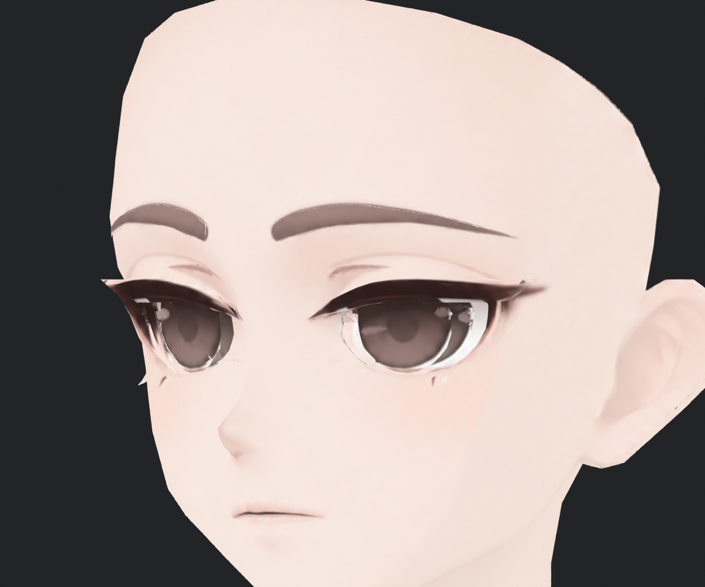
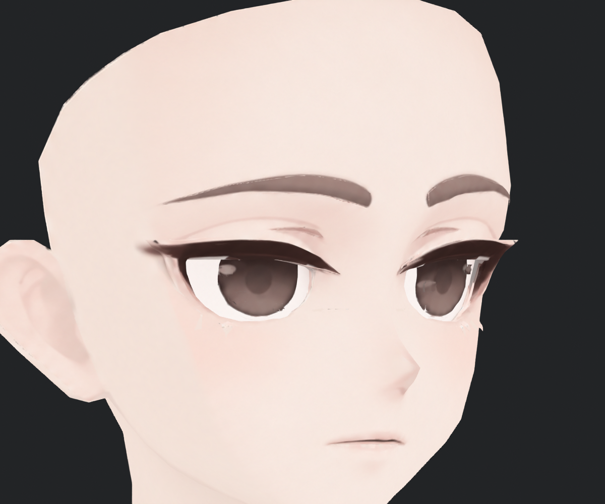
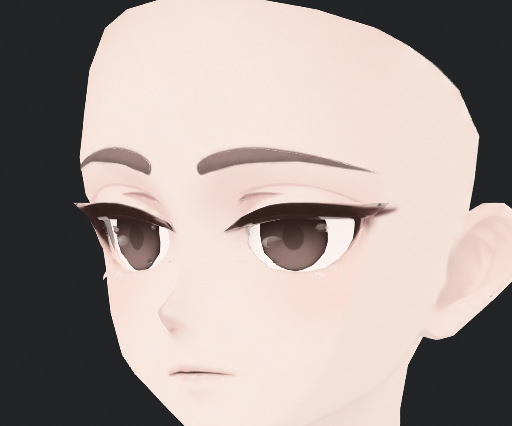

> **기록 시점 안내:** 아래는 해당 단계 당시의 보고서입니다. 후속 결정은 [최신 상태](../../STATUS.md)를 기준으로 읽어주세요. 모델·원본 텍스처·검증 원시 데이터는 이 문서 공유본에 포함하지 않습니다.

# v352 — 눈의 중복 채색·하단 테두리·눈꺼풀 경계 수정

눈동자 뒤 흰자 면에 홍채가 다시 그려진 문제를 분리하고, 원래 홍채의 크기·동공·반사를 보존하며 아래 테두리를 정리했다. 눈꺼풀 끝의 국소 형상은 기존 네 정점만 최대 0.8mm 조절했다. 새 눈 메시나 얼굴 재생성은 하지 않았다. 사용자 최종 채택과 이번 기술·시각 검토는 구분한다.

## 같은 구도에서 확인

아래는 머리카락을 잠시 숨긴 실제 기존 얼굴 메시의 기본색 비교다. 원래 선·눈동자·흰자 구조를 확인하기 위한 진단 사진이며, 머리카락을 삭제한 전달 모델이 아니다. 좌우 모두 정면과 ±35°에서 확인했다.

| v351 기존 | v352 피부 보호·하단 경계 정리 |
|---|---|
|  |  |

| 정면 | 반대 사선 |
|---|---|
|  |  |

## 원인과 적용 범위

| 항목 | 실제 원인·작업 | 검증과 남은 경계 |
|---|---|---|
| E01 실제 구조 | 앞쪽 C85/86과 뒤쪽 C79를 실제 면에 대응했다. 앞 조각은 순수한 홍채 원판이 아니라 피부·속눈썹·홍채를 포함한 조각이었다. 뒤 42면에도 홍채가 중복 채색돼 있었다. | 앞 96면의 UV/삼각형을 점검하고 원래 형상을 보존했다. 눈 전용 본이나 표정 세트가 새로 생긴 것은 아니다. |
| E02 중복 홍채·흰 테두리 | 뒤 42면을 흰자위 역할로 분리했다. 앞 조각의 밝은 아래 테두리는 실제 뒤 흰자 면에서 색을 가져와 연결하고, 남은 아래 피부색 띠만 좁은 UV 범위에서 정리했다. | 반사 7영역과 홍채 중앙 2영역의 RGBA 차이 0. 홍채 전체를 갈색으로 덮은 후보는 크기·인상 변화로 제외했다. |
| E03 UV | v351 연결 UV를 유지하고 실제 면→UV→텍셀을 대응했다. 이번 문제의 중심은 중복 채색과 경계 역할이므로 다시 파편화하거나 전체 UV를 바꿀 이유가 없었다. | 베이크 여백으로 흰자 합집합 경계 약 3px 안에 색 혼합이 남는다. 경계에서 4px보다 깊은 내부는 변화 0. Unity 4K BC7의 근접·중·원거리 화면도 확인했다. 13개 밉을 각각 전수 검사한 것은 아니다. |
| E04 눈꺼풀·눈꼬리 | 강한 LID 후보는 눈매가 각져 제외했다. 약한 LID도 밝은 피부에 회색이 묻어, 원래 밝은 피부를 보호하고 어두운 선 안에서만 수정이 남도록 했다. 아래 끝 네 정점을 각각 최대 0.8mm 안쪽으로 조절했다. | 영향 삼각형 4개, 최소 면적비 약 81.22%, 퇴화·방향 뒤집힘 0. 원래 작은 눈꼬리 끝과 부드러운 가장자리는 남아 있어 전체 눈 완성으로 표시하지 않는다. |
| E05 위 밝은 흔적 | 머리카락 UV의 흰 점으로 가정하지 않고 실제 노출 면을 추적했다. 재현한 사선 진단의 해당 위치는 머리 사이에서 보이는 C79 이마 면이었다. | 이마를 머리 색으로 칠하거나 틈을 새 메시로 막지 않았다. 시점에 따른 피부 노출로 기록한다. |
| E06 표정 준비 | 원래 정점·UV 대응, 모든 기존 키의 상대 변형량을 유지했다. | 현재 키는 관절 보정용이다. 눈 감기·시선·ARKit·iPhone 실제 추적은 후속 표정 제작 범위다. |

## 비교한 방법과 미채택 이유

1. 흰자 42면을 별도 재질로 분리한 첫 실험: 원인은 분리됐지만 최종에는 기존 얼굴 이미지로 베이크해 재질 수를 늘리지 않았다.
2. 강한 눈꺼풀 패치: 흐린 부분은 줄었지만 눈꼬리가 각지고 굵어져 그대로 채택하지 않았다.
3. 홍채 전체 재채색: 흰 테두리까지 갈색으로 채워 눈동자가 커 보이고 다각형 외곽·반사 변화가 나타났다. 원래 동공과 반사를 보존하는 경계 수정으로 바꿨다.
4. 밝기 기준만으로 바깥 띠 정리: 작은 원래 반사까지 지울 수 있어 실제 반사 영역을 보호했다. 중간 피부색 띠는 밝기 기준을 전역으로 낮추지 않고 홍채 바깥의 안전한 하단 범위만 보완했다.
5. 눈꺼풀 네 면의 원래 색 복원: 인접 패치와 삼각형 색 끊김이 생겨 제외했다. 면 수를 계속 늘리는 대신 원래 피부/어두운 선의 역할을 구분하는 마스크로 수정했다.

| 홍채 전체 채색 — 미채택 | 원래 내부를 보존한 경계 수정 |
|---|---|
|  |  |

## 파일과 독립 검토

결합 Blender의 활성 BaseColor 8개는 실제 PNG와 packed RGBA가 정확히 일치했다. v351 대비 면·UV·웨이트·129본과 26+32개 키의 상대 변형량을 유지했고, 실제 좌표 변화는 위 네 정점뿐이다. 이전 copied-image의 낡은 packed 데이터 문제는 저장 후 새 이미지로 재로드·pack하는 방식으로 수정했다.

제작자와 별도 눈 검토자가 실제 그림을 열어 확인했으며, 검토자가 지적한 홍채 크기 변화·작은 반사 소실 위험·눈꺼풀 피부 오염·부분 복원의 색 단절을 각각 재작업했다. 최종 NPR/거리·전체 동작 결과는 [전체 보고](v352_WORK_REVIEW.md)에 연결한다. 중립 사진으로 표정 동작 합격을 대신하지 않는다.
