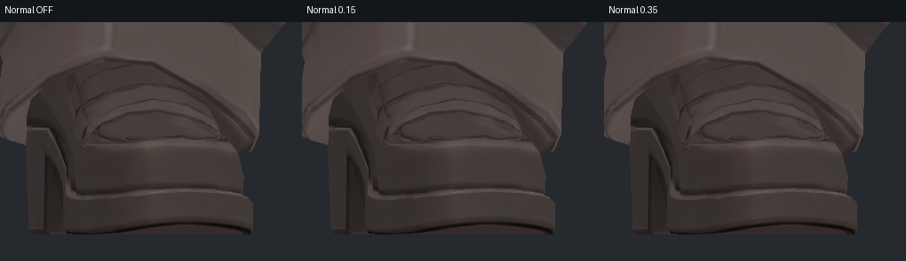
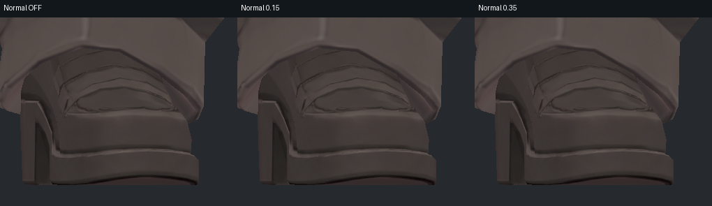
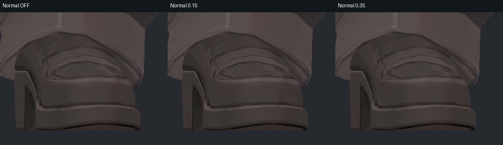
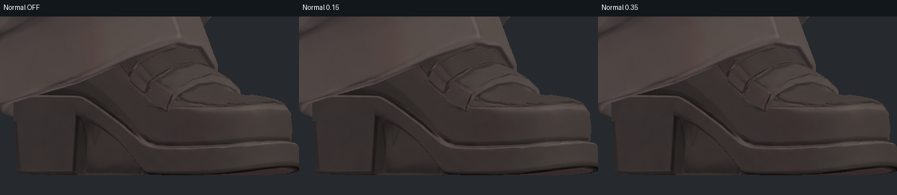
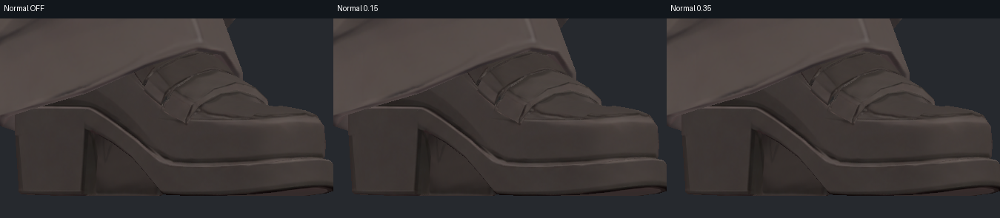
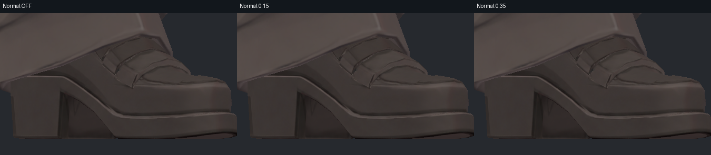
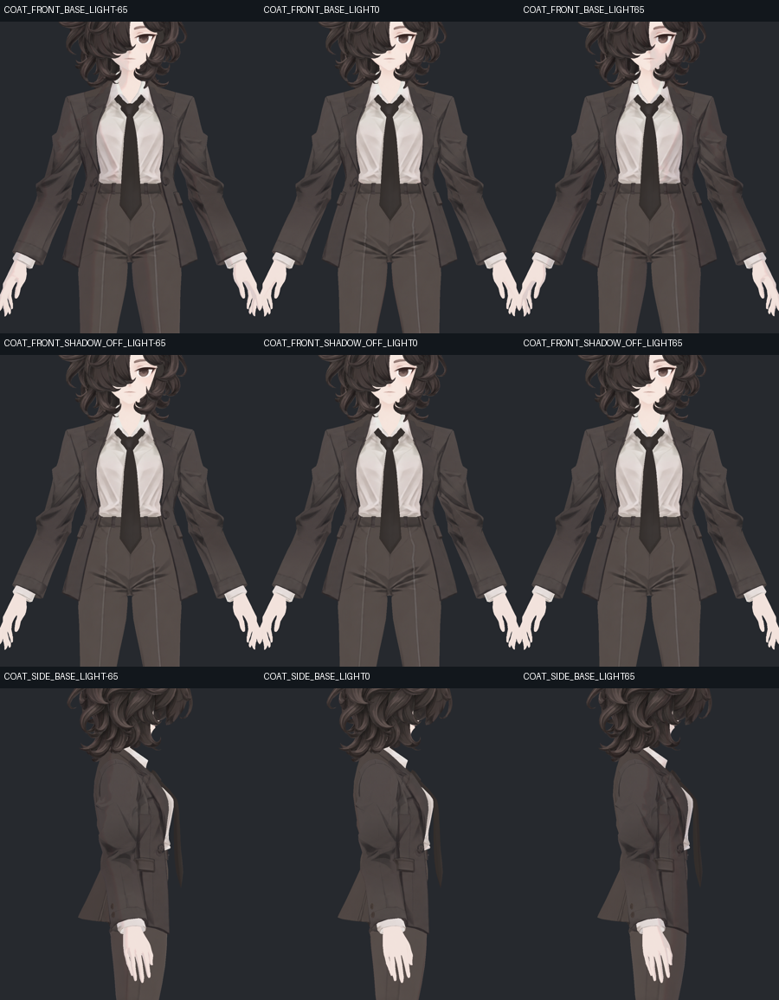
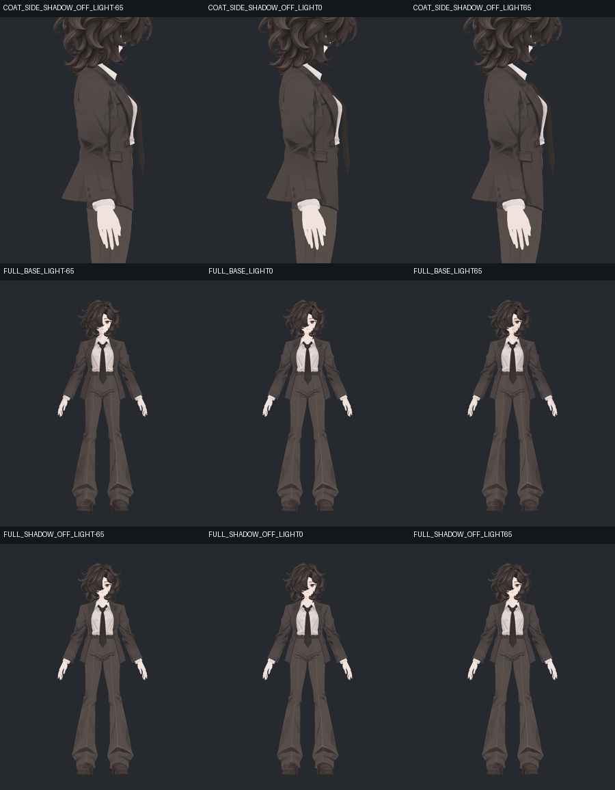
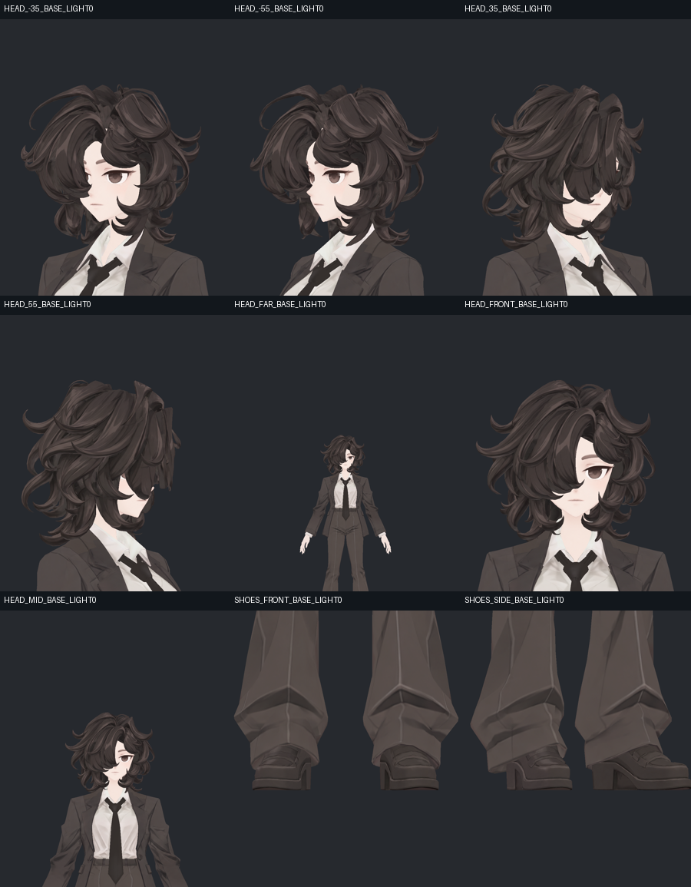

> **기록 시점 안내:** 아래는 해당 단계 당시의 보고서입니다. 후속 결정은 [최신 상태](../../STATUS.md)를 기준으로 읽어주세요. 모델·원본 텍스처·검증 원시 데이터는 이 문서 공유본에 포함하지 않습니다.

# v352 최종 시각·노멀 선택 독립 검토

**최종 코트 Bump OFF / Shadow 0.32, 신발 selective normal 0.15를 유지해도 검토한 범위에서 새 시각 회귀는 보이지 않는다.** 신발 0.35의 추가 이득은 확인하지 못했고, OFF와0.15도 이번 광원에서 거의 구분되지 않는다. 그러므로 노멀을 통해 선명도가 크게 개선됐다는 설명은 근거가 없다.

## 실제 확인 자료

- `images/v352_FINAL2_*` 실제38구도를7개 시트에서 전부 직접 확인했다. 각 시트2550×2100이 도구에서1748×1440으로 축소 표시됐으며, 모든38장을 네이티브 크기로 열었다는 뜻은 아니다.
- `surface_lights_final`57장을7개 동일배율 개요로 모두 확인했다. 코트 앞/옆·전신은 BASE/SHADOW_OFF, 헤어5방향은BASE, 신발 앞/35°는BASE/SHADOW_OFF/SHOE_OFF/SHOE035, 각각 광원 yaw−65/0/+65다.
- `final_details`9장을 개요로 확인했다. 네이티브 전체로 신발 앞/35°, 헤드−35°, FINAL2 손목182R 앞/옆, 코트 측면+65° BASE/SHADOW_OFF를 추가로 열었다.
- 신발 앞/35° × 3광원 × OFF/0.15/0.35는 같은 원본 픽셀을 자른 **네이티브 3안 비교6장**으로 직접 확인했다.
- 실행 코드가 `final_rig_v2/raw/0_*`의 새 SDK 세계 위치·노멀을 읽는 것을 확인했다. 광원·거리 시험은 이 실제V2 중립형상을 재사용한 정적 재질 시험이다. 예전v348 형상 재사용이 아니지만, 이 사진만으로 현재 PhysBone이나 표정을 시험한 것은 아니다.
- 이 문서의 비교 이미지는 실제 모델 렌더의 크롭/배치다. 모델·Unity자산·원시 텍스처는 수정하지 않았다.

## 1. 신발 노멀 — 보이는 이득을 과장하지 않는다

세 안 모두 스트랩 윤곽·솔의 이중선·뒤꿈치 면·밝고 어두운 경계가 유지된다. 0.35에서 새 넓은 얼룩이나 번쩍이는 표면이 생긴 것은 아니지만, 기존 세부를 더 읽기 쉽게 만드는 효과도 직접 비교에서 찾기 어렵다.

원본1000×1200 전체에서 0.15 대비 OFF 또는0.35의 채널 최대차는 **1~2/255**, 차이3초과 픽셀은 모든6조건에서0이다. 차이가 있는 픽셀은157~768개다. 화면 전체의 작은 변화이지 의미 있는 고주파 디테일 복구율이 아니다. 실제 선택 normal은 읽히지만 현재 조명/셰이더에서 시각적 기여가 매우 약하다는 범위로 해석한다.

**선택 판단:** 현재0.15를 유지 가능. 0.35를 채택해야 할 시각적 이득은 확인되지 않아 확대하지 않는다. OFF도 이번 사진에서 큰 선 손실이 없으므로, 다른 환경에서도 노멀을 반드시 유지해야 한다는 결론은 아니다. 최종 작업에서 핵심 개선은 채색·UV 정합이며, 노멀을 추가했다는 사실로 흐림 해결을 설명하지 않는다.

신발 정면은 양쪽 코와 밑창이 모두 화면 안에 들어온다. 35°는 가까운 신발 끝이 오른 화면 경계에 닿아 일부가 잘린다. 앞쪽 전체 확인은 정면이 담당하며, 사선 전체 실루엣 검증 범위를 과장하지 않는다.

## 2. 코트 명암

BASE는 세 광원에서 옷색·봉제선·포켓·라펠·커프의 구분이 유지된다. ShadowOFF와의 차이는 크지 않으며, OFF로 바꾸면 원래 강한 삼각 접힘이나 코트 옆의 선까지 사라지지는 않는다. 현재 코트 Bump는 실제로 OFF이고 ShadowStrength는0.32다. 저장돼 있는 BumpScale0.15를 동작 중 노멀 강도라고 해석하지 않았다.

**선택 판단:** BumpOFF/Shadow0.32 유지 가능. 현재3광원에서 뚜렷한 중복 과음영 회귀는 찾지 못했다. 좁은 접힘 명암은 기본색에 남으므로, 전체 그림자OFF를 표면 문제의 일괄 해결책으로 채택할 근거는 없다.

최종 FINAL2의 ArmsUp·ArmsForward·깊은팔꿈치·TorsoBend에서도 REFINED가 복구한 주요 주름이 유지된다. CLEAN100 때의 넓은 평탄화로 돌아간 회귀는 보이지 않는다. **소매 안쪽의 강한 검은 삼각형 접힘은 여전히 남는 보호된 고정 명암**으로 보고한다.

## 3. 최종 표면과 머리·거리 검수

| 부위 | 최종 자료에서의 관찰 | 판정 |
|---|---|---|
| 커프와 단추 | 182R 측면 네이티브에서 단추 구멍·둘레가 읽히고 흰 커프의 얇은 경계가 유지된다. 회색 톱니 자국이 되돌아오지 않았다. | 현재 국소 정리 유지 가능 |
| 바지 | 196/208와233/294 복합자세에서 다리의 넓은 톤은 정리되고 무릎·밑단 접힘과 길이 방향 선은 남는다. | 새 텍스처 회귀 확인 못함; 승인 무릎 형상 유지 |
| 코트·넥타이 | 큰 몸판과 포켓이 읽히며 넥타이 매듭·길이 방향 윤곽이 유지된다. | 이번 합성에 따른 새 번짐 확인 못함 |
| 손 | 현재 밝고 단순한 피부톤 유지. 강한 손 자세의 국소 압축은 그대로 남는다. | 사용자 보류 사항을 텍스처 오류로 재분류하지 않음 |
| 헤어4K | 35/55° 양방향 및 가까운/중간/원거리에서 컬과 가닥 경계가 유지된다. | 4K 감소로 전반 디테일이 사라지는 회귀 확인 못함 |
| 눈·얼굴 | −35° 네이티브에서 앞 홍채·흰자위 구분과 원래 얼굴 인상이 읽힌다. | 눈 세부 최종 판정은 별도 기술/시각 검토와 합친다 |
| 헤어 접점 | −35° 이미지 약(460,480)에 작은 밝은 삼각 틈이 남는다. | 새 회귀로 단정하지 않음. 기존 표면 노출의 원인 판정과 연결하며 전부 제거됐다는 표현 제외 |

소매 안쪽 강한 접힘·바지의 깊은 접힘·머리 내부의 작은 밝은 접점은 존재한다. 이번 최종사진에서 발견하지 못한 새 문제와, 기존 항목을 모두 해결했다는 것은 다르다. 정확한 마지막 구도는 원본 FINAL2 및 final_details 사진으로 확인할 수 있다.

## 4. 실제 최종 런타임 메모리

최종 `FINAL_TEXTURE_RUNTIME` 기록을 독립 합산했다.

| 항목 | 실제 결과 |
|---|---:|
| 고유 텍스처 | 9개: 기본색8 + 신발선택normal1 |
| 헤어 런타임 | 4096² BC7,13mip |
| 얼굴·바지·코트·신발 | 각각4096² BC7,13mip |
| 손·셔츠·장식 | 각각2048² BC7,12mip |
| 신발 선택normal | 2048² BC5,12mip |
| Read/Write | 9개 모두OFF |
| 전체mip 압축 블록 합계 |128.000229MiB |
| Editor native 객체 메모리 합계 |256.006226MiB |

최종 선택은 첫 비용 시험의 A와 같은 헤어4K 구성이다. 편집용8K 원본파일은 보존했고, 바지·코트·신발2K 후보는 최종 구성에 채택하지 않았다. 따라서 최종 비용을80MiB로 표시하면 안 된다. 위는macOS Editor 실제texture기록과 블록수 합계이며 Windows VRChat GPU 상주량을 측정한 결과가 아니다.

## 검증 범위와 잔여

실제V2 geometry에서 정적표면·NPR·조명3방향·거리·현재 해상도의 시각 결과를 확인했다. 그림자 OFF는 모든 조명 또는 모든 채색을 제거하는 EMIT 진단과 같지 않다. 광원 연속회전·여러 월드의 환경광·미러·스테레오·PC VRChat은 이 사진의 범위 밖이며, 최종 물리는 별도 실제 SDK 자료를 따른다.

검토용 수치와 파일 해시는 `v352_NORMAL_PIXEL_DIFFERENCES.json`, `v352_VISUAL_SOURCE_HASHES.json`에 보존했다. 공개 보고에는 위 실제 렌더를 선별하고 원시자료는 포함하지 않는다.

[전체 보고](v352_WORK_REVIEW.md)
