> **기록 시점 안내:** 아래는 해당 단계 당시의 보고서입니다. 후속 결정은 [최신 상태](../../STATUS.md)를 기준으로 읽어주세요. 모델·원본 텍스처·검증 원시 데이터는 이 문서 공유본에 포함하지 않습니다.

# v352 머리 움직임과 코트 접촉 검토

이번 최종 결합본은 **기존 헤어 리그·웨이트·형상을 유지했다.** 접촉을 해결하려고 시험한 국소 형상 수정과 추가 충돌기는 채택하지 않았다. 텍스처 개선 완료를 머리–코트 접촉까지 해결된 것으로 보고하지 않는다.

뒤가닥이 코트와 만나는 부분을 조사한 결과, 실제 표면과 물리 계산에 쓰이는 본 위치가 떨어져 있었다. 문제 면은 머리 본의 영향을 약79% 받아 형태를 유지하고, 물리 본의 영향은 약21%다. 따라서 충돌기가 본을 밀어도 같은 정도로 표면이 따라가지는 않는다. 단순한 충돌기 누락이나 반경 설정 하나만의 문제로 보기 어렵다.

| 시도 | 확인한 결과 | 미채택 이유 |
|---|---|---|
| 머리 고정 비율 증가 | 일부 접촉은 줄었지만 다른 자세에 새 접촉이 생김 | 움직임 감소와 접촉 회귀 |
| 기존 정점 국소 이동 .3/.6 mm | 알려진 교차가 줄었지만 남음 | 해결 불충분 |
| 국소 이동1.15 mm | 알려진 한 쌍은 분리됨 | 인접 면으로 접촉이 옮겨가고 실제 사진에 새 삼각 경계가 나타남 |
| 해당 헤어 체인 전용10/11 mm 충돌기 | 실제 본 반응과 일부 교차 감소 확인 | 알려진 접촉 발생 시각은 줄지 않음 |

아래는 국소 이동 후보를 미채택한 근거다. 동일 자세의 실제 SDK 스킨을 같은 카메라로 가까이 촬영했다. 색만 표시해 조명·노멀에 의한 새 명암을 배제했다. 오른쪽 후보에서는 중앙 뒤가닥의 오른쪽 경계에 원본보다 긴 삼각 띠와 패임이 드러난다.

| 수정 전 | 미채택1.15 mm 후보 |
|---|---|
| 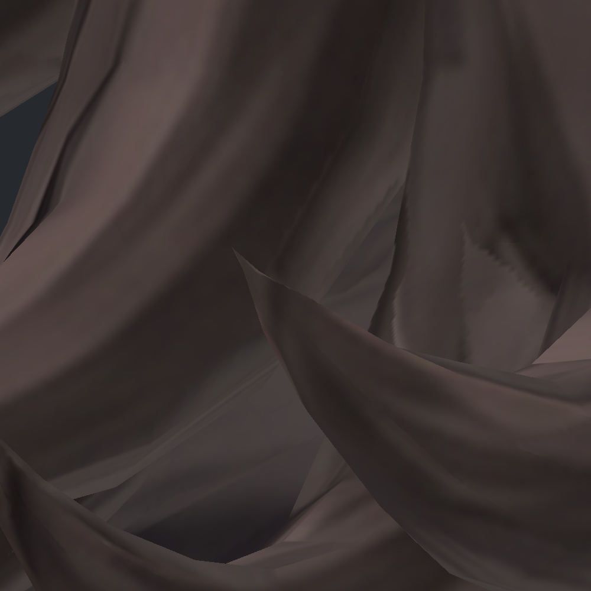 | 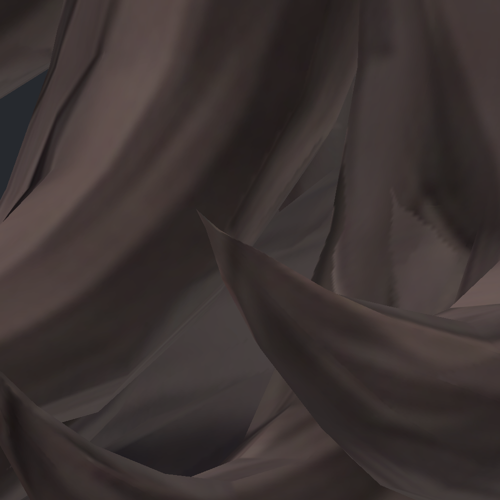 |

추가 충돌기 시험도 원형을 유지한 사본으로 진행했다. 반복 원본을 함께 실행해 실험 순서에 따른 작은 물리 차이와 실제 충돌기 효과를 구분했다. 충돌기가 작동하는 것은 확인했지만, 본 반응을 표면 접촉의 완전한 해결로 해석하지 않았다. 후속 검수에서 이 충돌기 시험의 중립 초기화가 이전 모델과 다른 자세를 읽을 수 있는 문제도 확인했다. 따라서 해당 수치는 같은 시험 내부의 비교로만 사용하고 최종 결합본은 중립 입력을 명시해 다시 검증한다.

**남은 문제는 뒤가닥–코트의 미세 접촉과 일부 자세에서 드러나는 겹침이다.** 이후 수정한다면 가닥 표면·본 위치·웨이트의 관계를 함께 검토해야 한다. 현재 원형에 미채택 실험을 섞지 않았다.

최종 결합본은 올바른 중립 자세를 명시한 뒤 실제 SDK에서 두 번, 각각 4,800프레임 실행했다. 두 실행의 중립 게이트는 통과했다. 머리·넥타이·코트 끝은 입력을 해제하고 1초가 지난 시점에 준비 운동 뒤의 위치로 돌아왔다. Wind 구동에서 끝 위치가 0.1mm 이내로 안정되는 시간은 머리 약 .42초, 넥타이 .52–.53초, 코트 .38초였다. 월드 바람 대신 명시적 바람 파라미터를 입력한 Editor SDK 시험이며 PC VRChat 클라이언트 검증은 아니다.

| 바람 입력 중 | 입력 해제 직후 | 해제 1초 후 |
|---|---|---|
| 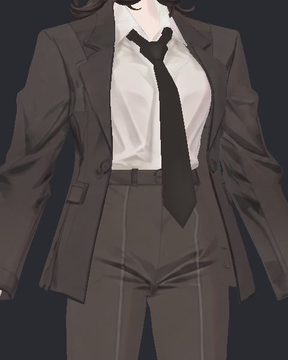 | 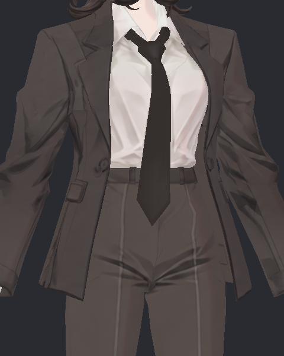 | 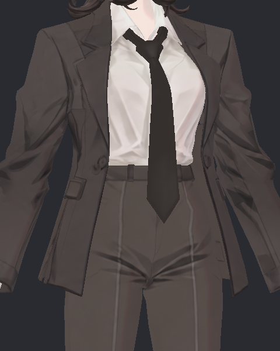 |

최종 스킨 각 167표본을 조사한 결과 뒤가닥–코트 접촉은 각 165표본에 남았다. 알려진 Wind120 위치의 교차선은 3.189/3.196mm다. 넥타이–코트와 코트–바지는 이 표본 범위에서 교차가 없었지만, 몸 굽힘 90프레임에서 넥타이 뒤쪽과 셔츠가 두 실행 모두 교차했다(26삼각형쌍, 최대 교차선 10.653/10.647mm). 이 선 길이는 침투 깊이가 아니다.

| 넥타이–셔츠 기하 교차가 있는 실제 정면 | 같은 시각 측면 |
|---|---|
| 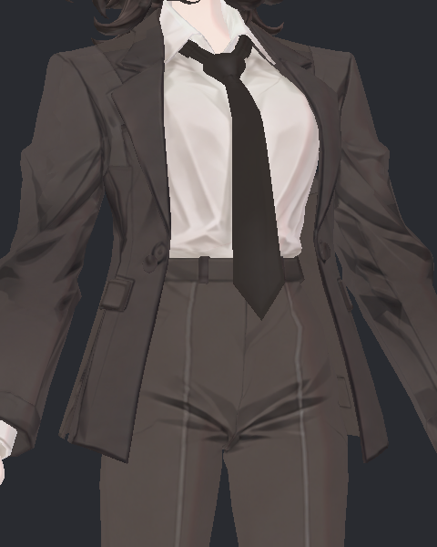 | 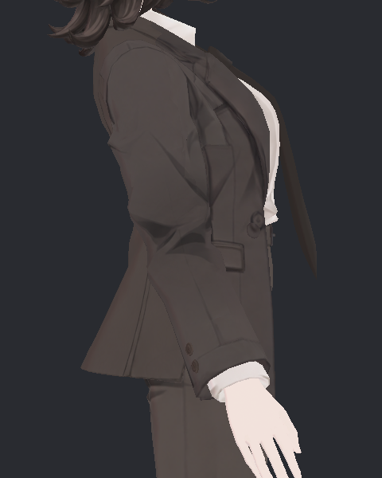 |

위 일반 구도에서는 흰 셔츠가 넥타이를 뚫고 노출되는 뚜렷한 현상은 식별하지 못했다. 따라서 기하 교차와 보이는 관통을 구분하며, 숨은 교차까지 모두 해결했다고 보고하지 않는다. 이동 중 코트 흔들림도 1mm 미만으로 작아 모든 부위의 뻣뻣함 개선 완료로 확대하지 않는다. 이번 최종 검증 수치는 이전 미채택 실험 수치를 재사용하지 않고 실제 최종 재실행에서 계산했다.

사진은 직접 열어 확인했고, 아래 완성 GIF도 디코드하여 이동 머리 18표본·Wind 머리/넥타이 각17표본을 확인했다. 바람 입력 중 움직임과 해제 이후 안정된 상태가 보인다. 독립 검수는 프레임 샘플 확인이며 실시간 재생 완료와 구분한다.

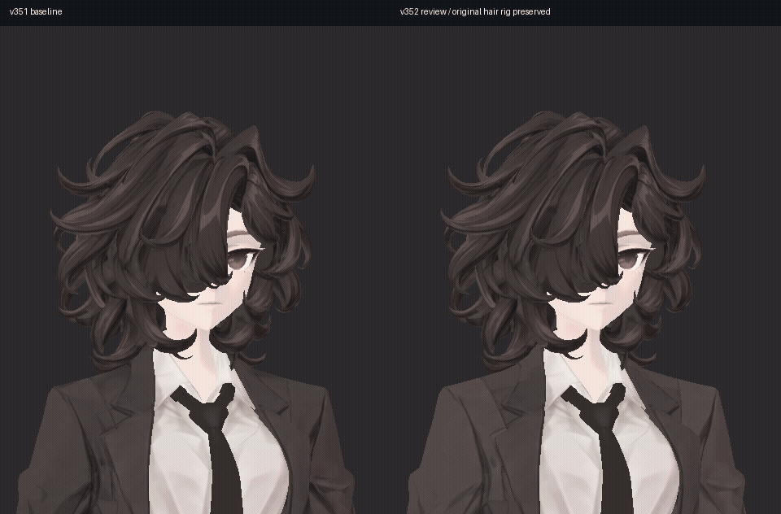

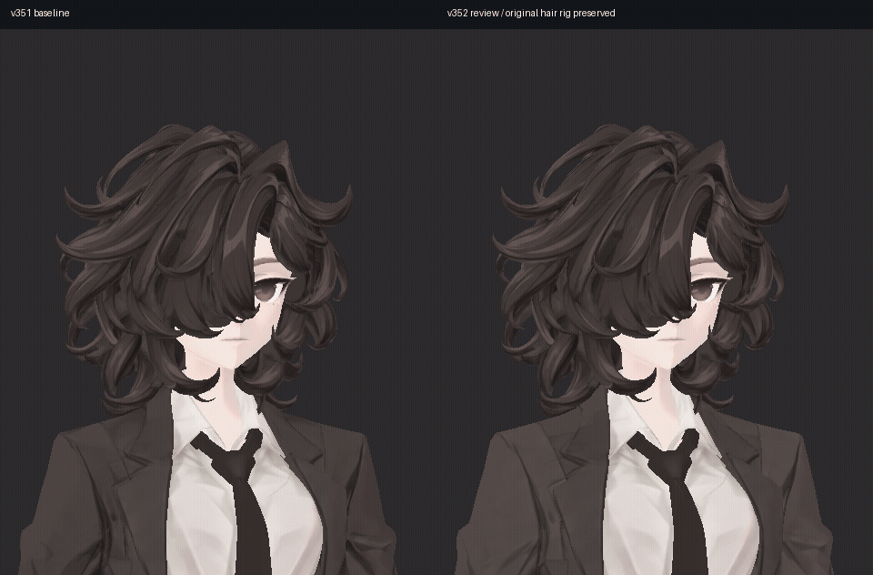

## 같은 입력의 전후 영상

왼쪽은 v351 기준 리그, 오른쪽은 v352 검수본이다. 실패한 헤어 구조 수정을 넣지 않아 움직임이 비슷한 것이 정상이며 새로운 물리 개선으로 주장하지 않는다. 실제 SDK 프레임만 배열했다. Wind는10fps/20초, 이동은10fps/10초, 나머지 회전·숙임은2fps/10초다. 60Hz 전체 본 기록과 영상 표본률은 다르다.

### 바람 입력·해제 — 머리

[MP4](media/v352_Wind_Head.mp4)

### 바람 입력·해제 — 넥타이

[MP4](media/v352_Wind_Tie.mp4)

### 이동 — 머리

[MP4](media/v352_Translation_Head.mp4)

### 이동 — 넥타이

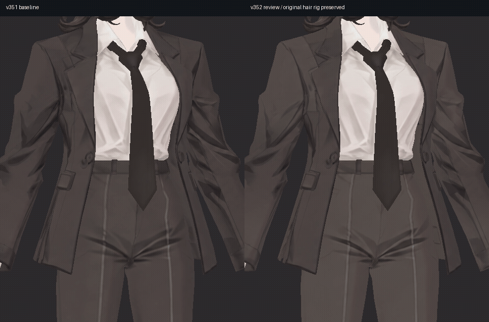

[MP4](media/v352_Translation_Tie.mp4)

### 끄덕임 — 뒷머리

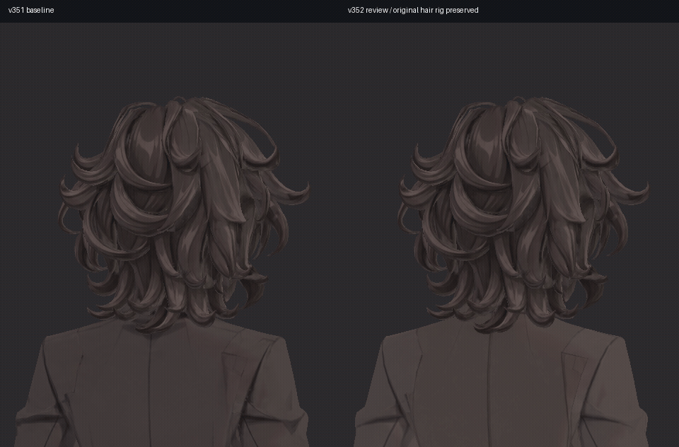

[MP4](media/v352_HeadNod_HeadBack.mp4)

### 회전 — 전신 측면

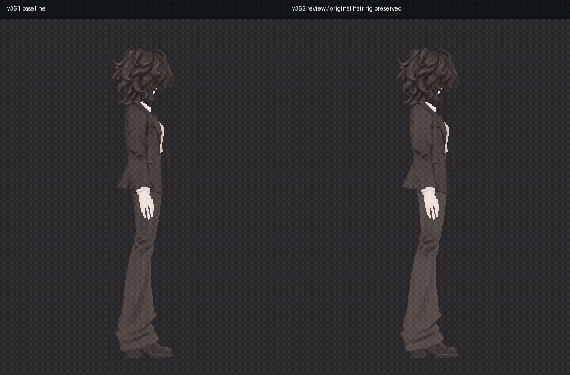

[MP4](media/v352_Turn_FullSide.mp4)

제작자는 GIF 여섯 개의 시작·입력 중·입력 해제·종료 표본 프레임을 열어 확인했다. 독립 물리 검토자는 세 GIF의52표본을 확인했다. 실시간 전체 재생이나 모든 프레임의 시각 검수와는 구분한다.
