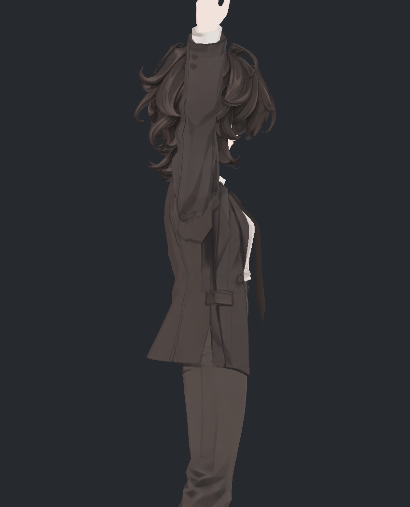

> **기록 시점 안내:** 아래는 해당 단계 당시의 보고서입니다. 후속 결정은 [최신 상태](../../STATUS.md)를 기준으로 읽어주세요. 모델·원본 텍스처·검증 원시 데이터는 이 문서 공유본에 포함하지 않습니다.

# v352 — 실제로 남은 문제

실험을 수행했지만 해결 조건을 충족하지 못한 항목이다. 기존보다 악화된 후보를 자동 통합하지 않았다.

| ID | 부위·근거 | 현재 상태와 후속 |
|---|---|---|
| E04-R | 아래 눈꼬리 작은 피부 조각·부드러운 가장자리 | 중복 홍채는 개선. 원거리1–2px 조각은 남음. 기존 눈꺼풀 경계를 표정 제작과 함께 국소 검토 |
| E05-R | 앞머리 사이 밝은 삼각 흔적 | 재현한 사선에서 실제 이마 면 노출. 헤어 텍스처 흰 점으로 칠해 숨기지 않음 |
| S01/S02-R | 소매 안쪽·겨드랑이 강한 검은 접힘 | 기본색에도 존재. 넓게 지우면 부피가 죽어 보호했으나 원하는 NPR 대비는 아직 추가 조정 여지 |
| P01 | 뒤가닥–코트 접촉 | 최종 각167스킨 중165표본에 기하 접촉. 웨이트/정점/충돌기 시험 미채택. 실제 가닥 표면과 본 위치·웨이트를 함께 조정하는 후속 필요 |
| P02 | 깊은 숙임 넥타이 뒤–셔츠 | Bend90 두 반복26삼각형쌍. 일반 구도에서 노출 미식별, ray가림 검사도 숨은 교차를 지지. 숨은 교차 자체는 미해결 |
| P03 | 이동 시 코트 움직임이 작음 | 코트 끝 약0.69/0.55mm. 헤어·넥타이 구동/복귀 확인과 별개로 전체 뻣뻣함 해소 아님 |

| 눈·헤어 틈 확인 | 소매 고정 접힘 |
|---|---|
|  |  |

| 깊은 숙임 — 넥타이 앞 | 같은 시각 옆 |
|---|---|
|  |  |

현재 PC VRChat 클라이언트 전 단계의 검수본이다. 클라이언트 업로드·월드 바람/접촉·네트워크·iPhone 표정 실기는 별도 미검증이다. ARKit 얼굴표정 세트와 눈·턱 전용 제어는 아직 구현되지 않았다.
