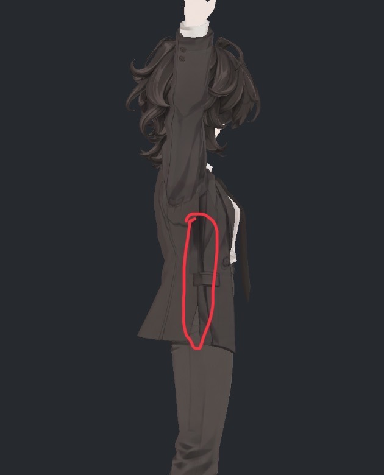
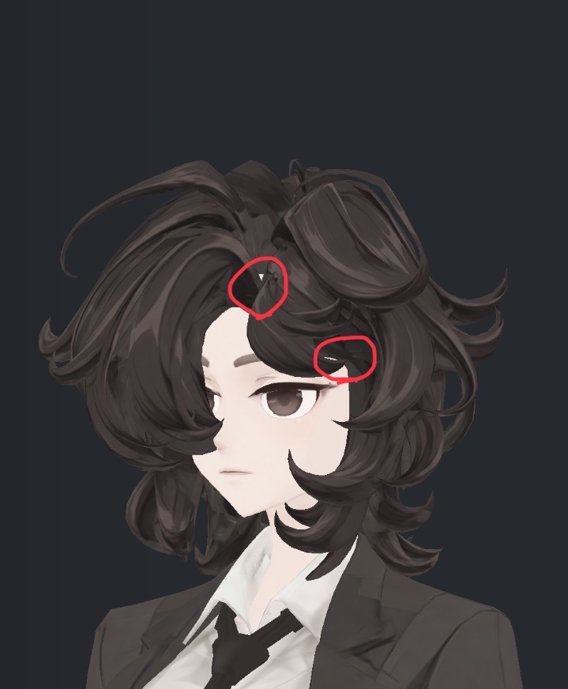
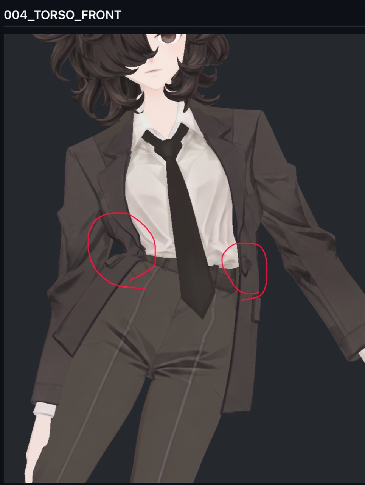
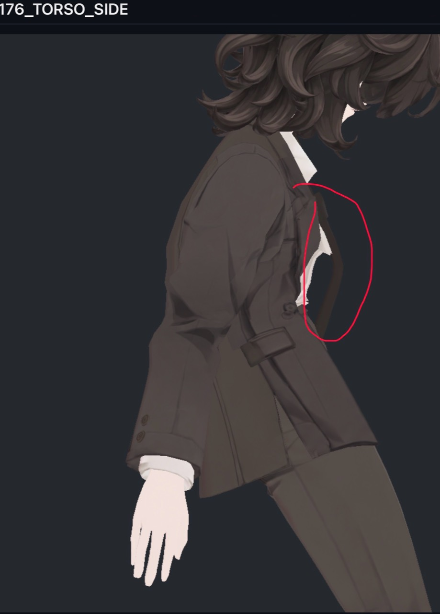
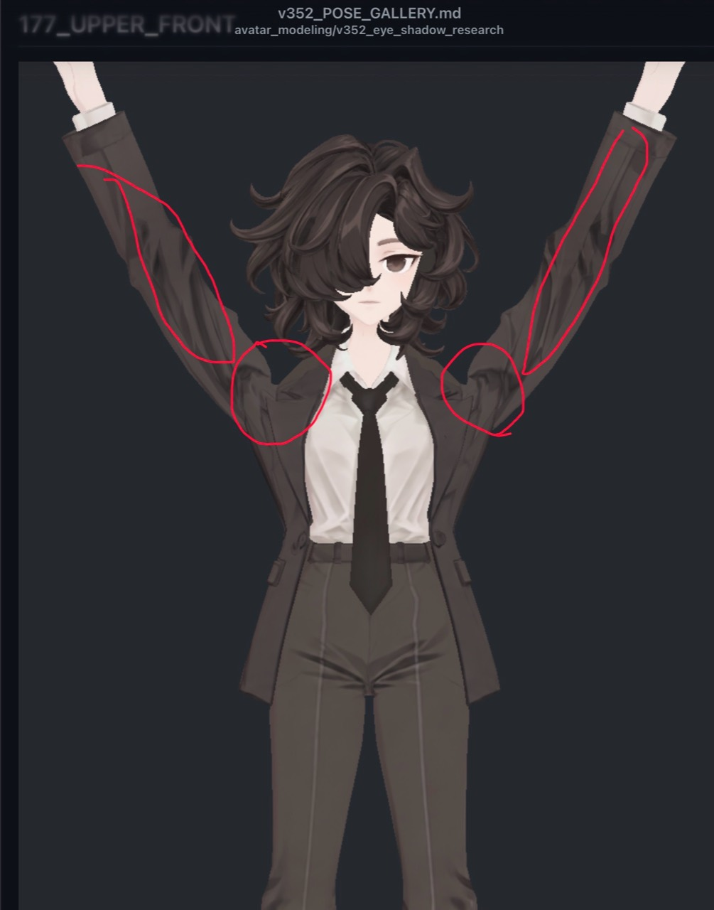

> **기록 시점 안내:** 아래는 해당 단계 당시의 보고서입니다. 후속 결정은 [최신 상태](../../STATUS.md)를 기준으로 읽어주세요. 모델·원본 텍스처·검증 원시 데이터는 이 문서 공유본에 포함하지 않습니다.

# v352 — 실제로 남은 문제

기존 실험 후 남은 문제와 2026-09-14 사용자 추가 지적을 함께 추적한다. 이번 갱신은 사진·대응 목록 등록이며, 새 모델·텍스처 수정은 하지 않았다. 기존보다 악화된 후보를 자동 통합하지 않는다.

| ID | 부위·근거 | 현재 상태와 후속 |
|---|---|---|
| E04-R | 아래 눈꼬리 작은 피부 조각·부드러운 가장자리 | 중복 홍채는 개선. 원거리1–2px 조각은 남음. 기존 눈꺼풀 경계를 표정 제작과 함께 국소 검토 |
| E05-R | 정수리 부근 헤어 묶음 사이 빈 곳 — 사용자 사진2 위쪽 원 | 기존 사선 진단에서 이마 면 노출이 확인됐지만 사용자가 해결을 요구한 시각적 틈이다. 단순한 의도된 피부 노출로 종결하지 않으며 실제 가닥 경계·표면 가림을 다시 대응해 국소 보완 후 비교 |
| E07-R | 눈 윗부분·앞머리 아래 빈 공간 — 사용자 사진2 아래쪽 원 | 눈 위 앞머리 아래의 밝은 틈/가느다란 흔적을 별도 신규 항목으로 등록. 아래 눈꼬리 E04-R과 다르다. 실제 면·겹침·UV/알파/노멀을 확인한 뒤 원인에 맞춰 보완 |
| S07-R | 팔을 올렸을 때 코트 옆면의 세로로 짙은 음영 — 사용자 사진1 | 겨드랑이 아래부터 포켓 옆·자락 안쪽까지 표시된 위치를 별도 추적. 기본색·실제 접힘/면 겹침·노멀·셰이더 기여를 분리하고 긴 얼룩처럼 읽히는 명암을 국소 개선 |
| S01/S02-R | 소매 안쪽·겨드랑이 강한 검은 접힘 | 기본색에도 존재. 넓게 지우면 부피가 죽어 보호했으나 원하는 NPR 대비는 아직 추가 조정 여지 |
| P01 | 뒤가닥–코트 접촉 | 최종 각167스킨 중165표본에 기하 접촉. 웨이트/정점/충돌기 시험 미채택. 실제 가닥 표면과 본 위치·웨이트를 함께 조정하는 후속 필요 |
| P02 | 깊은 숙임 넥타이 뒤–셔츠 | Bend90 두 반복26삼각형쌍. 일반 구도에서 노출 미식별, ray가림 검사도 숨은 교차를 지지. 숨은 교차 자체는 미해결 |
| P03 | 이동 시 코트 움직임이 작음 | 코트 끝 약0.69/0.55mm. 헤어·넥타이 구동/복귀 확인과 별개로 전체 뻣뻣함 해소 아님 |
| P04-R | 몸을 기울이면 자켓 옆몸판·앞여밈이 몸과 함께 안쪽으로 접힘 — 추가 사진004_TORSO_FRONT | 몸에 붙인 표면처럼 따라가는 변형을 해결 대상으로 등록. 어깨·카라의 지지와 옷의 강성/몸과의 접촉을 유지하면서, 아래 몸판·자락은 중력 방향으로 자연스럽게 처지고 여유를 유지해야 함. Blender가 어렵거나 런타임 대응이 필요하면 Unity에서 처리 가능하다는 사용자 지시 반영 |
| P05-R | 몸 기울임 때 넥타이가 중력 방향으로 처지지 않음 — 사용자 사진176_TORSO_SIDE | 매듭 아래 넥타이가 몸의 기울기·굽은 모양을 따라 고정된 듯 보이는 문제를 별도 등록. 매듭의 지지는 유지하고 아래 부분은 중력·옷과의 접촉에 맞게 자연스럽게 처져야 함. 기존 흔들림/복귀 검사 및 P02 관통과 별개로 검증 |
| P06-R | 팔 올림 때 양쪽 어깨가 함몰됨 — 사용자 사진177_UPPER_FRONT의 어깨 원 | 어깨 윗부분·소매 연결부가 꺼지고 벌어진 듯 보이는 변형을 별도 등록. 실제 형상/면 연결·본/웨이트·보정키·노멀을 분리해 조사하고 팔 올림 전 구간에서 어깨와 옷의 부피·연결·실루엣을 검수 |
| S08-R | 팔 올림 때 양쪽 소매 안쪽·어깨의 부자연스러운 명암 — 같은 사진의 긴 소매 표시와 어깨 원 | 기존 S01/S02의 강한 고정 명암과 연결하되 이번 사진 위치를 별도 추적. 기본색의 그림자 표현과 실제 접힘·UV 늘어짐·노멀/셰이더 음영을 구분하고, 필요한 주름/디테일을 보존하며 이상한 명암을 정리 |
| D01-R | 자켓 버튼·장식의 텍스처가 흐릿하고 늘어남 — 추가 사진 양쪽 원 부근 및 전 자켓 | 앞여밈·허리 양쪽 장식과 소매 단추 등 자켓 전체를 확인. 원래 장식 디테일을 지우지 않고 선명도·형태·배치를 정리하며, UV/해상도 문제와 자켓 변형에 따른 늘어짐을 분리 |

## 2026-09-14 추가 대응 — 사용자 표시 사진

| S07-R: 팔 올림 시 코트 옆면 음영 | E05-R / E07-R: 정수리와 눈 위 틈 |
|---|---|
|  |  |

세 항목 모두 **해결 필요·추가 대응 미실행**이다. E05-R은 기존 원인 조사에서 끝내지 않고 보완 대상으로 다시 명시했다. E07-R은 이번에 분리 등록한 위치로, 기존 아래 눈꼬리 수정 결과를 이 부위의 해결 근거로 쓰지 않는다. S07-R은 소매 자체뿐 아니라 표시된 코트 옆몸판까지 확인해야 한다.

| ID | 다음 실행과 비교 | 완료 판단 |
|---|---|---|
| S07-R | 사진과 같은 팔 올림 측면에서 해당 면·UV를 대응. 기본색만/중성 재질/최종 셰이더로 분리해 원인을 확인하고 국소 채색 또는 기존 형상·노멀 보정 사본 비교 | 표시된 세로 음영이 부자연스러운 얼룩으로 남지 않고, 옆선·포켓·주름·부피가 보존됨. 중립/팔 올림/앞으로 뻗기와 양측·여러 광원에서 확인 |
| E05-R | 위쪽 원의 정수리 가닥 접점을 실제 표면에 대응. 노출 피부·가닥 사이 실제 틈·겹침/방향 문제를 구분. 기존 가닥의 국소 범위에서 보완 사본 비교 | 지적한 구도와 인접 각도에서 비어 보이는 접점이 개선되고, 머리 볼륨·가닥 디테일·실루엣 및 움직임이 유지됨 |
| E07-R | 아래쪽 원의 앞머리와 눈 윗부분 사이 공간을 따로 대응. 실제 틈인지 밝은 텍스처/알파 경계인지 확인하고 원인별 보완 사본 비교 | 눈 위 불필요한 틈·밝은 선이 개선되고 눈매·눈썹·원래 홍채/반사 보존. 정면·양 사선·근접/일반 거리 및 향후 눈감기 변형 영역 확인 |

수정 전후는 같은 자세·카메라·광원으로 촬영하고 작업자와 별도 검토자가 다시 확인한다. 단순히 피부를 머리 색으로 칠하거나 전체를 어둡게 처리해 빈 곳을 숨기는 방식으로 종결하지 않는다. 기존 원형·승인 관절과 디테일을 보존하며 새 메시 생성·대체·자동 리메시는 하지 않는다.

## 2026-09-14 추가 대응 — 자켓의 처짐과 장식

**P04-R·D01-R 모두 해결 필요·추가 대응 미실행**이다. 사진 왼쪽 원에는 허리 옆 자켓이 몸 안쪽으로 각지게 접혀 들어가는 모양이 보이고, 양쪽 원에는 앞여밈 주변 장식이 있다. 표시 사진의 외관과 사용자 요구를 기록했으며 원인별 기여는 아직 새로 측정하지 않았다.

### P04-R — 몸 위에 걸친 자켓으로서의 변형

사용자가 원하는 것은 자켓을 몸과 함께 압축시키는 변형이 아니라, 옷이 몸 위에 걸쳐 있고 아래 부분이 중력 방향으로 떨어지는 동작이다. 어깨·카라 등 실제 지지 부위는 따라가되 옆몸판·앞여밈·자락에 필요한 여유와 옷의 강성을 유지해야 한다. 모든 면을 무조건 수직으로 세우는 방식으로 해석하지 않는다. 기존 P03의 작은 흔들림과 연결되지만, 단순히 흔들림 진폭을 키우는 것으로 이 접힘 문제가 해결됐다고 판단하지 않는다.

| 순서 | 다음 작업 |
|---|---|
| 원인 분리 | 실제004 입력과 반대쪽 기울임을 재현. 자켓 해당 면의 본·웨이트·기존 보정키·컨트롤러/물리 기여와 몸·셔츠 접촉을 따로 확인. 과한 몸통 추종, 보정키 압축, 자켓 구조·지지 구간을 분리해 조사 |
| 리서치·후보 | 참고 모델의 자켓 지지/여유/중력 대응을 조사. 기존 메시를 보존한 웨이트·본·보정 비교 사본을 만들고, 필요하면 Unity의 보조 본·제약·물리 처리 방안을 비교. 사용자는 Unity 시점 대응도 허용했으며, PC VRChat에서 실제 지원되는 구동 방식인지 함께 검증 |
| 검수 | 중립·좌우 기울임·전후 숙임·몸통 회전·팔 올림·앉기·복귀를 앞/옆에서 비교. 정적 사진뿐 아니라 연속 기울임/정지/복귀 GIF 또는 영상에서 처짐·몸과의 여유·접촉·떨림·부피·자락 실루엣을 확인 |
| 완료 기준 | 지적한 안쪽 꺾임이 완화되고 자켓이 독립적인 옷으로 읽힘. 어깨/카라가 뜨거나 몸·셔츠·팔·다리를 새로 관통하지 않음. Blender 화면만이 아니라 선택한 Unity 구동 방식의 실제 동작도 확인 |

### D01-R — 자켓 버튼·장식의 선명도와 형태

장식은 없어져야 할 얼룩이 아니라 보존할 디자인 요소다. 흐림·늘어짐·찌그러짐을 일괄 블러나 삭제로 처리하지 않는다. 텍스처에 그려져 있다는 사실 자체를 오류로 단정하지 않고, 장식이 실제 표면과 맞고 선명하게 읽히는지를 기준으로 한다.

| 순서 | 다음 작업 |
|---|---|
| 전수 대응 | 앞여밈·허리/포켓 주변·소매 등 자켓의 버튼과 장식을 원래 텍스처·레퍼런스·실제 면/UV에 대응. 사진의 두 위치를 포함하여 누락·중복·부정확한 배치도 확인 |
| 원인 분리 | 원본 해상도·국소 텍셀 밀도·UV 왜곡/여백·전사·밉/압축에 따른 흐림과, 기울임 때 자켓 면/웨이트 변형에 따른 장식 늘어짐을 분리 |
| 보완 | 원래 버튼의 테두리·구멍·음영·장식선을 유지하며 국소 재작업. 필요성이 확인되면 관련 UV나 재질 분리를 검토하되 의미 있는 연결 차트를 불필요하게 파편화하지 않음. 이번 요청을 새 장식 메시 생성 허가로 확대하지 않음 |
| 완료 기준 | 중립 및 P04-R의 기울임/숙임에서 버튼의 형태·비율·위치와 세부가 안정적으로 읽힘. 좌우·근접/일반 거리·여러 광원·실행용 압축 상태에서 비교하고 다른 자켓 디테일의 새 손실이 없음 |

P04-R과 D01-R은 각각 원인을 조사하되 자켓 변형을 확정한 뒤 장식의 최종 UV·형태를 다시 검사한다. 두 항목 모두 원본/후보 사진과 동작 자료, 시도·미채택 이유를 남기고 작업자 및 독립 검토자의 재검토를 거친다. 기존 무릎·손가락 및 다른 미해결 항목은 그대로 유지한다.

## 2026-09-14 추가 대응 — 넥타이 중력·처짐

**P05-R: 해결 필요·추가 대응 미실행.** 사진176_TORSO_SIDE에서 넥타이가 아래로 늘어지기보다 몸의 기울기와 굽은 형상에 따라 고정된 듯 보인다는 지적이다. 매듭은 카라 부근에 지지되고 그 아래 자유로운 부분은 중력과 재질 강성·셔츠/자켓 접촉에 따라 자연스럽게 처져야 한다. 무조건 뻣뻣한 수직 막대로 만들거나 흔들림 진폭만 키우는 것으로 해결하지 않는다.

기존 최종 정적 관절 검사는 물리를 비활성화한 조건이었다. 따라서 해당 정적 사진만으로 실제 런타임 중력 설정이 없다고 확정하지 않으며, 이 지적을 물리 비활성 사진이라는 이유로 종결하지도 않는다. 물리 활성 상태에서 같은 자세를 재현하고 충분히 안정된 후의 처짐을 반드시 따로 확인한다. 앞서 바람·이동에서 흔들림과 복귀가 확인됐다는 결과도 이 자세의 중력 반응 합격을 대신하지 않는다.

| 순서 | 다음 작업·비교 기준 |
|---|---|
| 같은 자세 재현 | 실제176 입력과 중립·전후 숙임·좌우 기울임을 동일 구도로 비교. 정적 물리OFF와 실제 Unity 물리ON을 명확히 표시하고, 활성 후 준비/안정화 시간을 확보 |
| 원인 분리 | 넥타이 본·웨이트·부모 회전 추종·보정키와 물리의 중력/복귀/각도 제한 및 접촉 기여를 각각 조사. 구조상 고정된 부분과 자유롭게 처질 부분을 실제 면에 대응하며 사진만으로 설정 오류를 단정하지 않음 |
| 후보 비교 | 매듭 지지를 보존하고 아래쪽이 중력 방향으로 처지는 기존 본·웨이트·물리 보완 사본 비교. Blender만으로 표현하기 어렵거나 런타임 계산이 필요하면 Unity 대응을 검토하고 PC VRChat 지원 구동을 확인 |
| 연속 검수 | 몸 기울임→정지·안정화→중립 복귀를 정면/측면 GIF·영상으로 비교. 월드 아래 방향과 몸통 방향을 구분하여 실제 처짐·지연·감쇠·떨림을 확인. 매 순간 초기화해서 중력 반응을 지우지 않음 |
| 완료 기준 | 매듭 위치와 넥타이 길이·두께·NPR 디테일을 유지하면서 아래 부분이 자연스럽게 처지고, 몸/셔츠/자켓을 새로 관통하거나 과하게 늘어나지 않음. 정적 및 동적 회귀와 독립 재검토를 통과 |

P02(넥타이–셔츠 숨은 교차)와 함께 검수하고, P04-R(자켓 처짐)을 수정한 뒤 두 의복의 접촉도 다시 확인한다. 기존 원본과 실패 후보를 보존하고 새 메시 생성·대체 없이 원인별 시도·미채택 이유를 기록한다. 이번 목록 등록으로 물리나 모델을 실제 수정한 것은 아니다.

## 2026-09-14 추가 대응 — 팔 올림 어깨 함몰·소매 명암

**P06-R·S08-R 모두 해결 필요·추가 대응 미실행.** 사진177_UPPER_FRONT에서 양쪽 어깨 윗부분과 소매 연결부가 안쪽으로 꺼지거나 벌어진 듯 보이며, 양쪽 소매 안쪽에는 길고 각진 짙은 명암이 드러난다. 이번은 사용자 지적과 확인 범위의 등록이며 실제 형상 변화량이나 원인별 기여를 새로 측정한 결과는 아니다.

| ID | 다음 작업 | 비교·완료 기준 |
|---|---|---|
| P06-R 어깨 함몰 | 실제177 입력과 중립부터 팔을 올리는 연속 구간을 재현. 양쪽 어깨·겨드랑이·소매 연결부의 실제 면/경계·정점·쇄골/상완 본·웨이트·보정키와 노멀 기여를 분리해 조사. 기존 메시 사본에서 원인별 국소 수정 비교 | 정면·측면·사선에서 어깨가 비거나 꺼지는 모양이 개선되고 어깨/상완/자켓의 부피와 연결이 자연스러움. 팔 내림·앞으로 모음·팔꿈치 굽힘·몸 기울임에서도 새 관통·압축·가슴/카라 당김이 없음. 연속 올림/내림·복귀 영상과 실제 파일 재검수 |
| S08-R 소매·어깨 명암 | 같은 자세/카메라에서 기본색만·중성 재질·최종 셰이더를 비교. 텍스처 그림자·UV 늘어짐/색 혼입·실제 함몰/접힘·면 방향/노멀·동적 명암을 따로 대응. SiuSiu/Lapwing의 유사 소매 표현을 참고해 원인별 정리 후보 비교 | 소매 안쪽과 어깨의 부자연스러운 검은 덩어리/띠가 개선되고 주름 골·봉제선·단추·천의 부피는 보존. 양측·근접/일반 거리·여러 팔 각도와 광원에서 확인. 전체를 밝히거나 디테일을 지워 통과시키지 않음 |

P06-R을 색으로 가려 해결한 것으로 처리하지 않으며, S08-R도 형상만 정상이라는 이유로 완료하지 않는다. 기존 S01/S02(소매·겨드랑이 명암), S07-R(코트 옆몸판 음영), P04-R(자켓 처짐)과 연결해서 관리하되 위치별 판정은 따로 남긴다. 어깨 구조를 바꾼 뒤 소매 UV·명암·장식과 자켓 처짐을 다시 검수한다.

기존 정점/웨이트가 이전과 같거나 새 면적 경고가 없다는 검증은 이번 어깨 문제의 해결 근거가 아니다. 실제 전후 사진·연속 동작·원인/미채택 이유를 남기고 작업자와 별도 검토자가 다시 확인한다. 기존 원형·승인 무릎·손가락을 보존하며 새 메시 생성·부분 대체·자동 리메시는 하지 않는다. 이번 등록으로 모델이나 텍스처를 수정한 것은 아니다.

## 기존 최종 검수 사진

| 눈·헤어 틈 확인 | 소매 고정 접힘 |
|---|---|
|  |  |

| 깊은 숙임 — 넥타이 앞 | 같은 시각 옆 |
|---|---|
|  |  |

현재 PC VRChat 클라이언트 전 단계의 검수본이다. 클라이언트 업로드·월드 바람/접촉·네트워크·iPhone 표정 실기는 별도 미검증이다. ARKit 얼굴표정 세트와 눈·턱 전용 제어는 아직 구현되지 않았다.
