> **기록 시점 안내:** 아래는 해당 단계 당시의 보고서입니다. 후속 결정은 [최신 상태](../../STATUS.md)를 기준으로 읽어주세요. 모델·원본 텍스처·검증 원시 데이터는 이 문서 공유본에 포함하지 않습니다.

# v352 — 가림 해제 표면 확인

원래 모델을 부위별로 가림 해제해 안쪽·뒤쪽을 포함한 여섯 방향에서 확인했다. 모델을 분해한 전달본이 아니다. 눈은 마지막 피부 보호 수정 사진을 사용한다. 나머지11부위는 최종과 동일한 기본색/UV를 확인한 자료다. 본문에 보이는 강한 접힘을 모두 제거 완료했다고 판단하지 않는다.

## coat_back_open

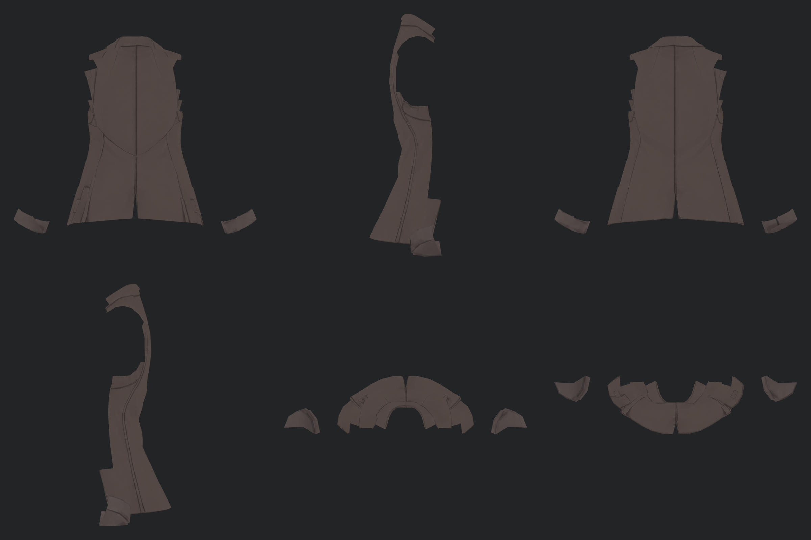

## coat_front_open

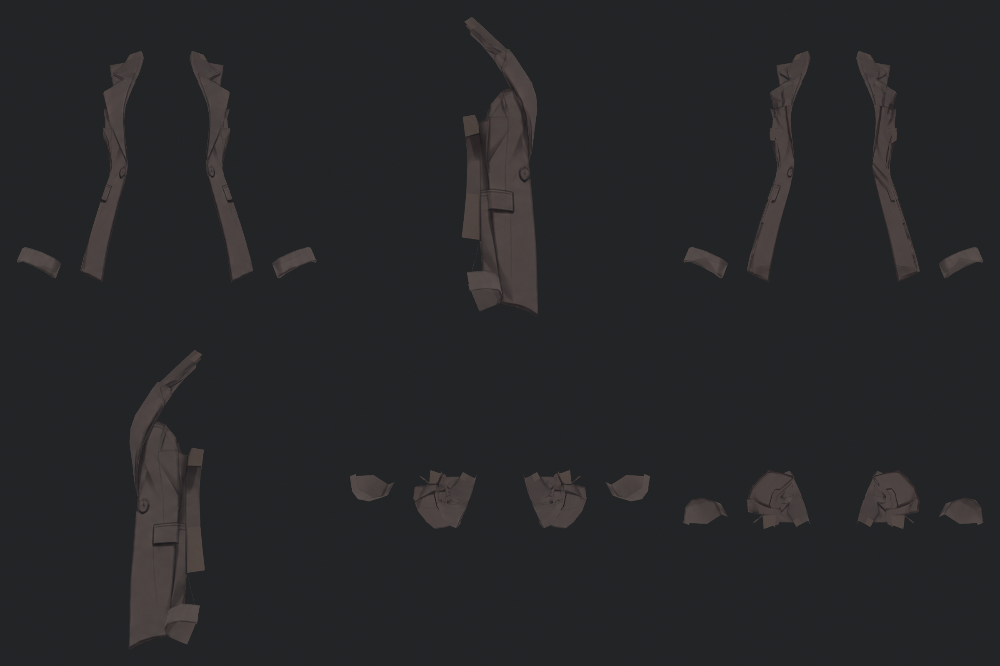

## details

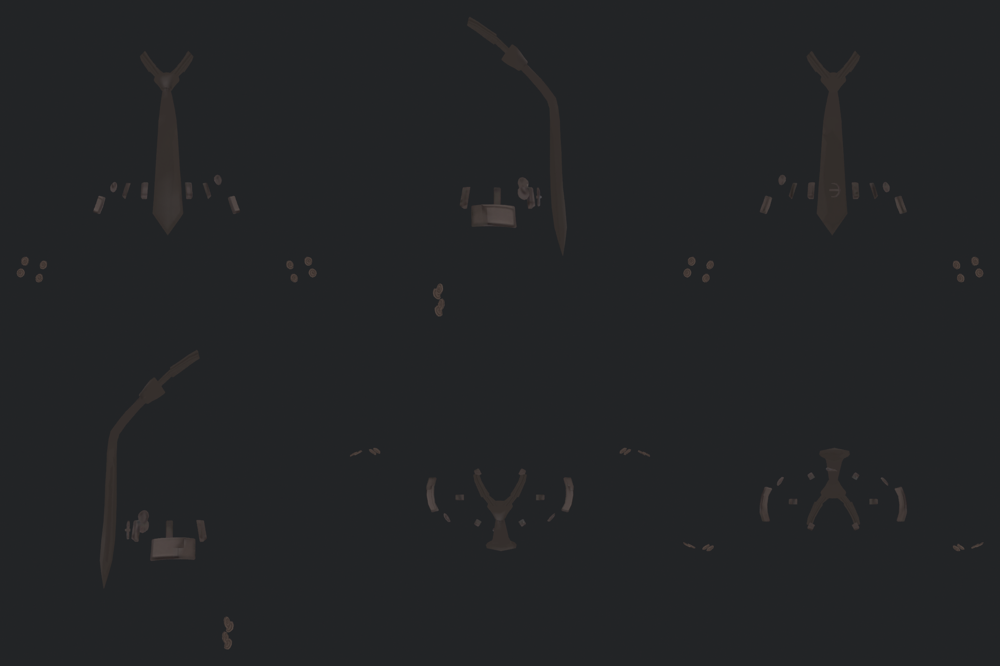

## hair

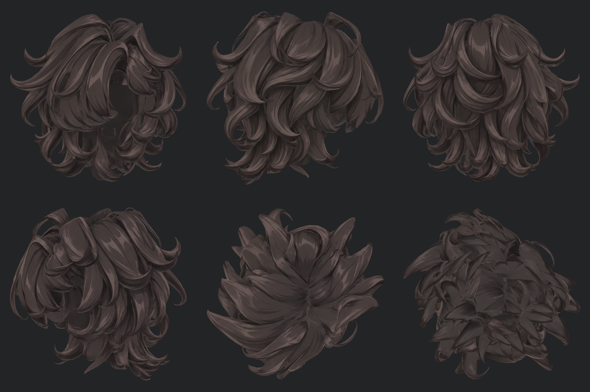

## hand_L

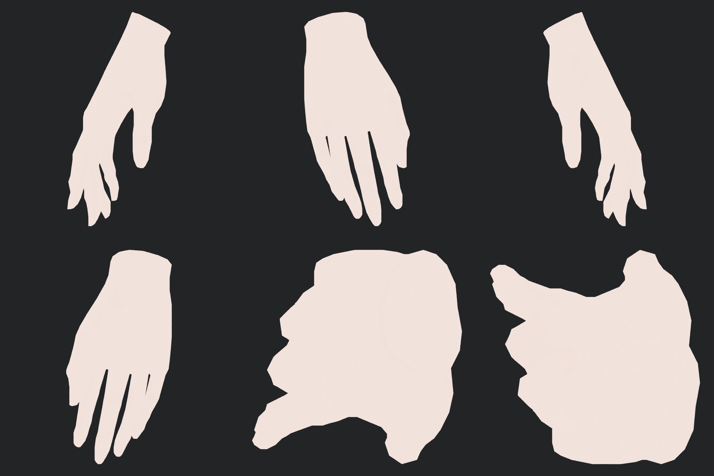

## hand_R

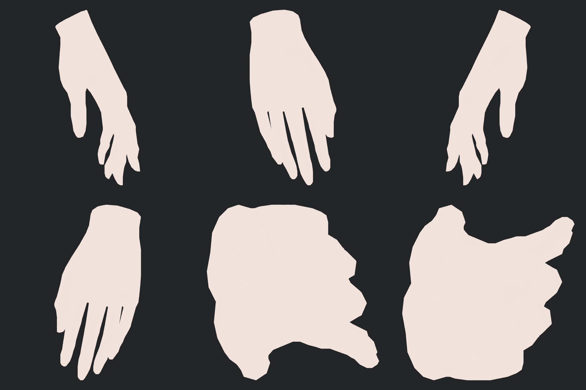

## pants

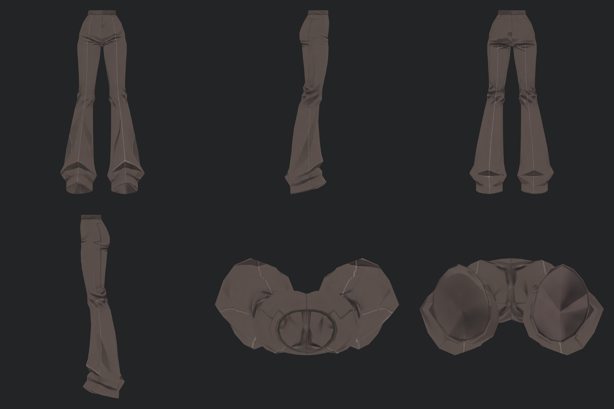

## shirt

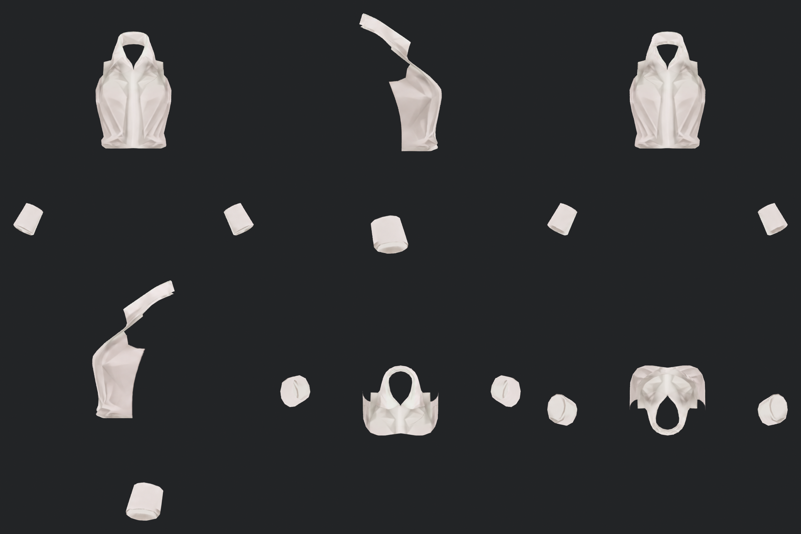

## shoe_L

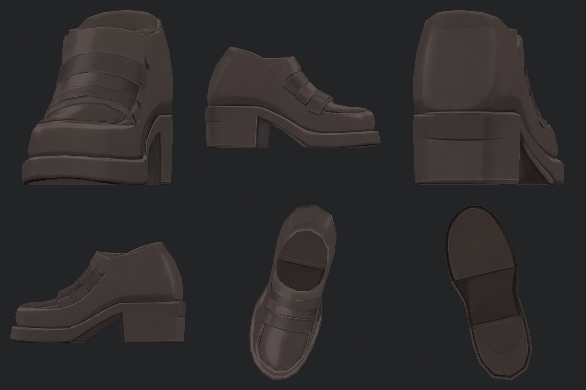

## shoe_R

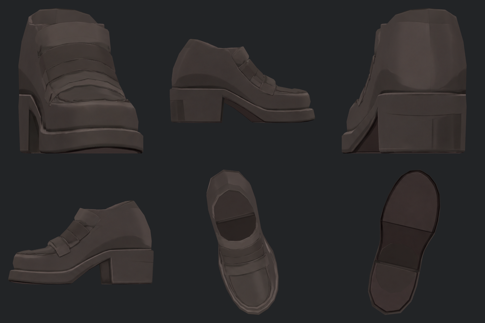

## sleeves

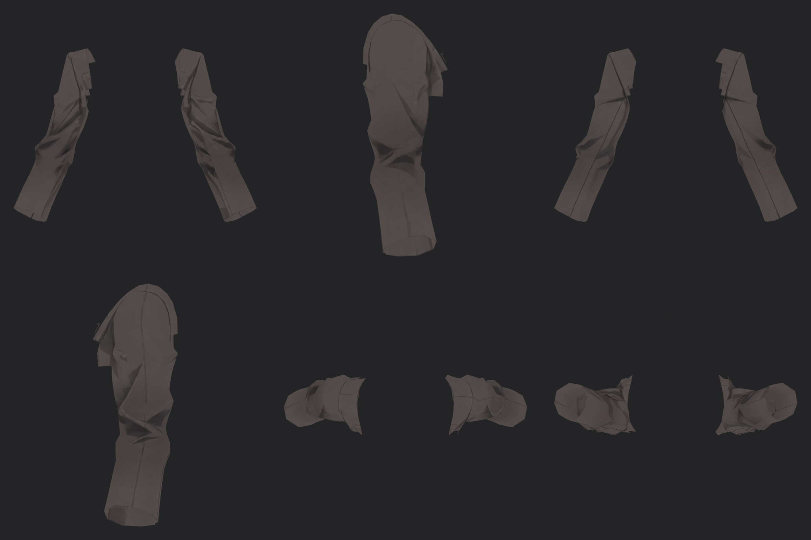

## 마지막 눈 수정

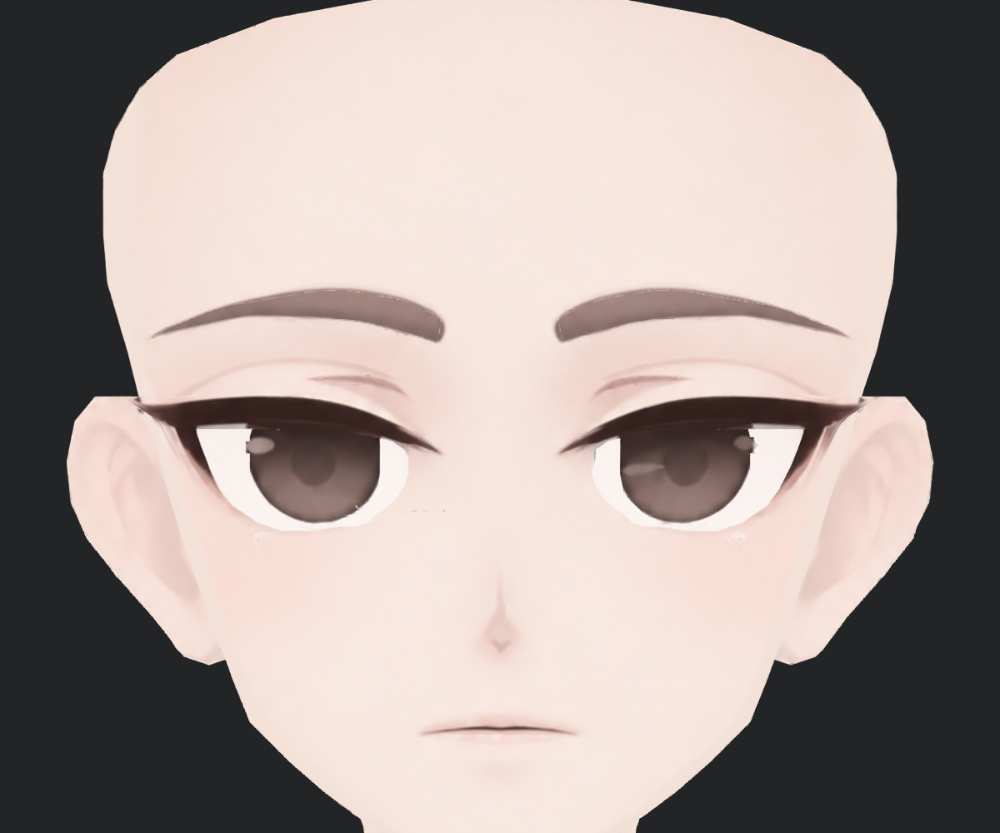
