> **기록 시점 안내:** 아래는 해당 단계 당시의 보고서입니다. 후속 결정은 [최신 상태](../../STATUS.md)를 기준으로 읽어주세요. 모델·원본 텍스처·검증 원시 데이터는 이 문서 공유본에 포함하지 않습니다.

# v352 — NPR 명암·표면·UV·PC 텍스처 비용 검토

참고 모델 조사, 코트·커프·바지의 국소 채색, 가림 해제 표면 검수와 런타임 해상도 비교를 정리했다. 눈은 [눈 작업 보고](v352_EYE_REVIEW.md), 최종 결합·관절·물리는 [전체 보고](v352_WORK_REVIEW.md)에서 별도로 확인한다.

목표는 사진처럼 사실적인 재질이 아니라 고품질 애니메이션·일러스트에서 나온 듯한 NPR 캐릭터다. 큰 색면은 깔끔하게 읽히고, 머리 가닥·눈매·옷의 접힘·단추·신발 장식은 선명하게 남기는 방향으로 진행했다.

## 1. 그림자를 텍스처에 그려도 되는가

**그리는 것 자체가 잘못은 아니다. 다만 원래 그림자가 넓게 번져 있으면 조명이나 노멀을 추가해도 그 색이 사라지지 않는다.** 비앙카의 소매 안쪽·코트 옆면·다리에는 기본색에 그려진 큰 명암이 있어, 먼저 채색 문제와 실제 굽힘·셰이더 명암을 분리했다.

실제 참고 자산은 [SiuSiu — ADPX](https://booth.pm/ja/items/8426340)와 [Lapwing — 久](https://kujishift.booth.pm/items/4993931)다. 아래 설명은 이번에 확인한 로컬 의상·재질과 촬영 결과에 한정한다. 상품의 모든 의상이나 배포 기본 설정을 대표하는 설명은 아니다.

| 참고 대상 | 실제로 확인한 표현 | 비앙카에 적용할 판단 |
|---|---|---|
| SiuSiu 블레이저 | 확인한 재질은 툰 그림자와 노멀맵이 꺼져 있고, 마스크가 있는 MatCap을 사용한다. 큰 어두운 면과 체크·파이핑·버튼을 분리해 읽게 한다. | 모든 주름에 요철을 추가하기보다 큰 색면과 디자인 선을 구분한다. |
| Lapwing 볼레로·오버올 | 채색 명암과 툰 그림자를 함께 사용한다. 의상 노멀맵은 넓은 소매 주름보다 옷깃 자수에 집중돼 있다. | 채색과 노멀을 부위별로 분담할 수 있다. 검은 채색 주름 전체를 높이로 바꾸는 근거는 없다. |
| 비앙카 현재 코트 | 큰 접힘·옆면의 어두운 영역이 기본색에 남고 동적 툰 명암도 더해진다. | 넓고 불필요한 고정 명암을 먼저 줄이고, 핵심 접힘·봉제선·부피를 읽는 요소는 보호한다. |

| SiuSiu 블레이저 — 팔 올림 측면 | Lapwing 볼레로 — 팔 올림 측면 |
|---|---|
| 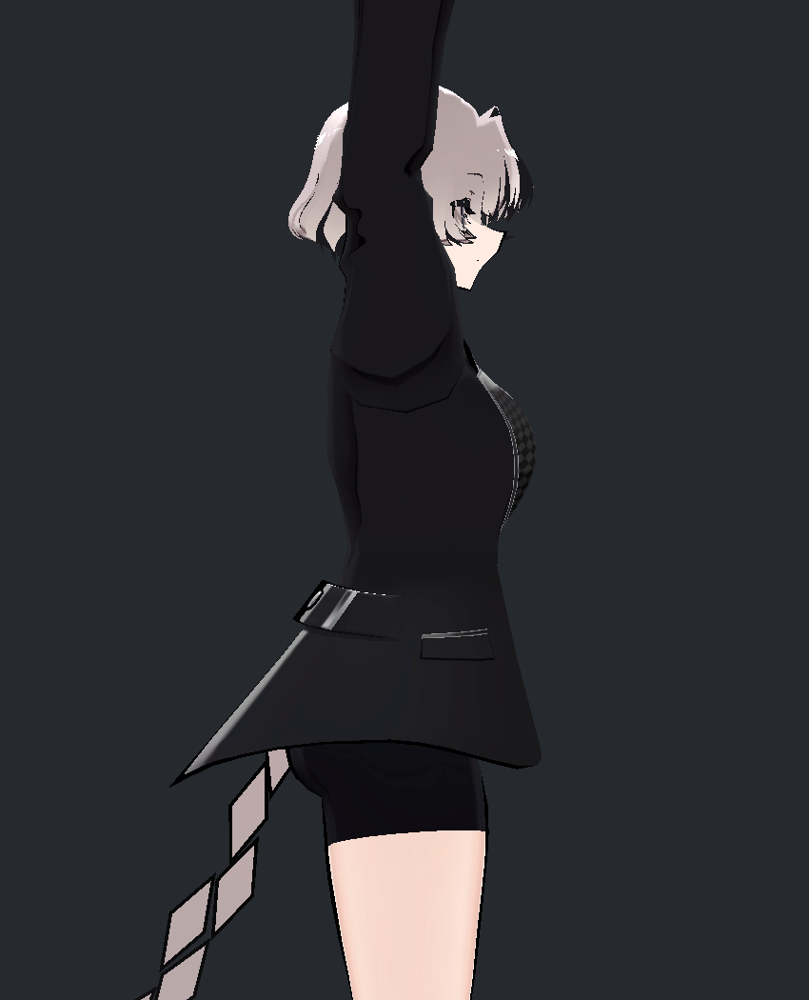 | 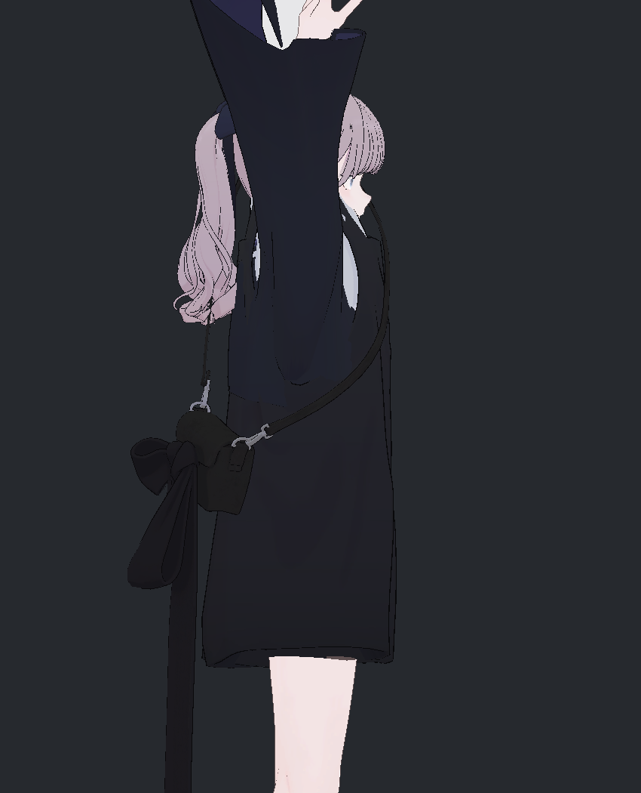 |

이번 참고 촬영은 두 모델 × 팔 올림/앞으로 뻗기 × 앞/옆 × 원래 효과/그림자 해제/주요 조명 효과 해제의 **24장**이다. 위팔·아래팔 방향을 맞췄지만 팔 길이·소매 구조·손가락·비틀림·카메라 조건이 모두 동일한 3모델 품질 시험은 아니다. 참고 모델의 최종 VRChat 동작 품질을 평가한 것도 아니다.

공식 자료에서도 이 역할 분리가 확인된다. lilToon의 그림자 기능은 강도·경계·색을 제어하며, 노멀맵은 그림자나 반사 효과의 반응 방향에 관여한다. MToon도 밝은 색과 그늘 색을 광원에 따라 전환한다. 따라서 NPR에서 채색과 동적 명암을 함께 쓰는 방식은 가능하며, 이번에는 비앙카의 실제 비교 결과로 비율을 조절했다. [lilToon 그림자](https://lilxyzw.github.io/lilToon/ja_JP/color/shadow.html), [lilToon 노멀](https://lilxyzw.github.io/lilToon/ja_JP/reflections/normal.html), [VRM MToon](https://vrm.dev/en/univrm/shaders/shader_mtoon/). 공식 페이지는 2026-09-13 확인했다.

## 2. 코트 — 깨끗하게 만들면서 사라진 주름을 다시 보호

처음에는 넓은 명암을 줄이는 강도를 달리한 COAT40/70을 비교했다. 남은 얼룩을 더 정리한 CLEAN80/100도 만들었지만, 깊게 접힌 팔꿈치에서 중요한 주름 골과 부피감까지 약해지는 문제가 보였다. 얼룩 감소만으로 통과시키지 않고 이 후보들을 그대로 채택하지 않았다.

| 수정 전 | 강한 정리 CLEAN100 — 그대로 미채택 | 주름 보호 REFINED 후보 |
|---|---|---|
| 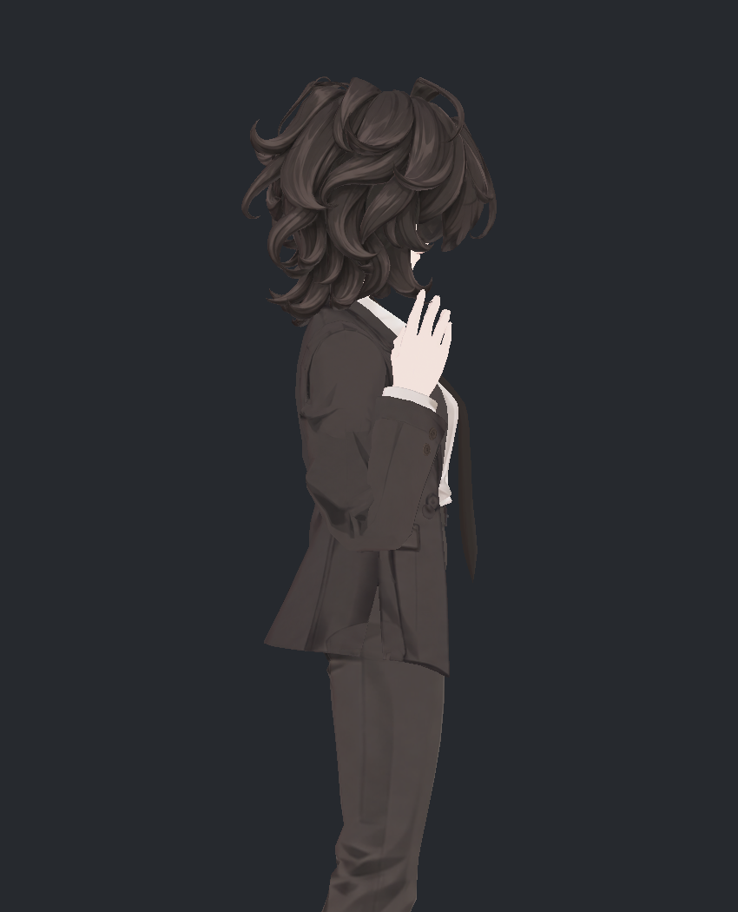 | 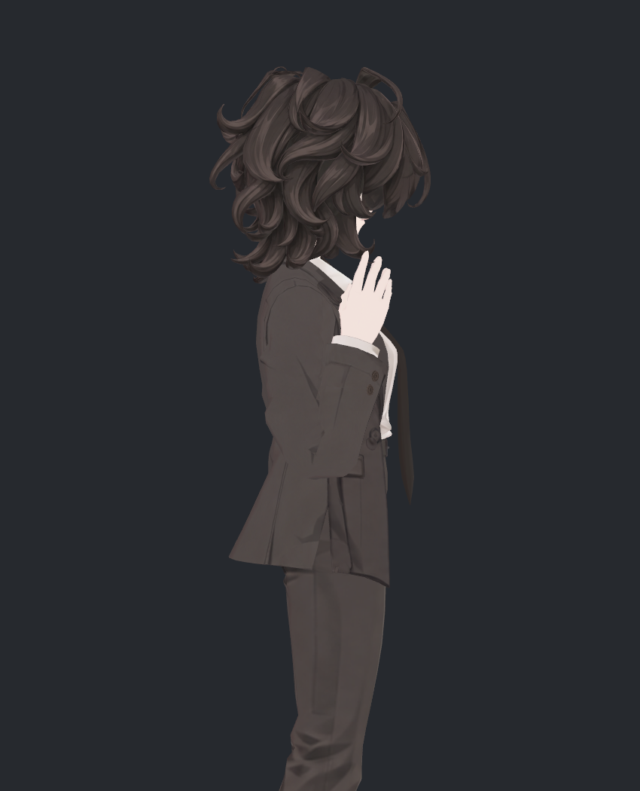 |  |

REFINED에서는 코트 뒤몸판의 넓은 어두운 영역을 정리하고, 팔꿈치 가까운 구간의 원래 주름을 보호하도록 범위를 나눴다. 보호 영역에서 수정 영역으로 천천히 전환해 띠가 생기지 않도록 했다. 깊은 굽힘의 골과 원래 측면 형태를 읽는 요소가 돌아온 것을 독립 검토에서도 확인했다.

| 소매·옆면 수정 전 | REFINED 후보 |
|---|---|
| 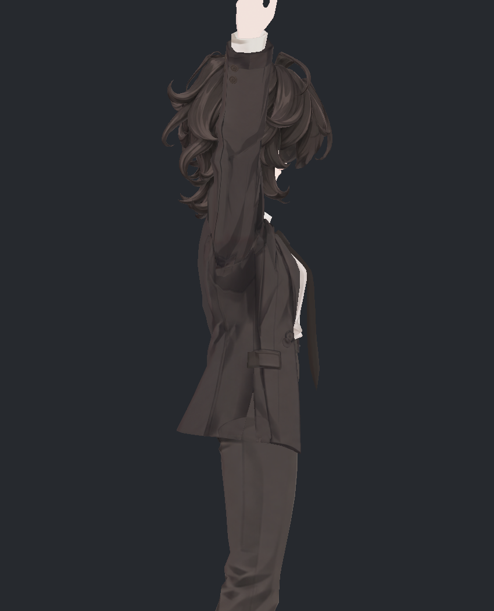 | 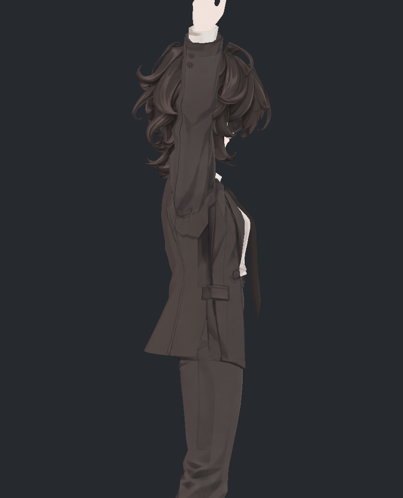 |

아래는 코트 뒤를 다른 부위에서 분리하고 실제 기본색만 보이게 한 전후 비교다. 넓은 U/V자 그림자 띠는 크게 줄었고 중앙선·곡선 봉제선·뒤트임은 남았다. 이 변화는 실제 채색 수정이며 동적 조명을 약하게 한 결과만은 아니다.

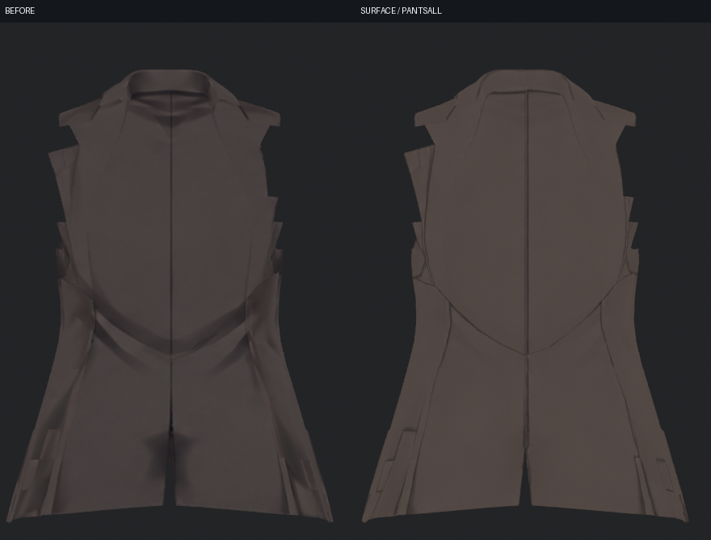

**남은 항목:** 소매 안쪽의 강한 검은 삼각형 접힘은 여전히 기본색에 있다. 주름을 보호하면서 남긴 명암이므로, 모든 과한 페인팅이 해결됐거나 셰이더만의 문제라고 설명할 수 없다. 아래 분리 전후에서도 그 형태를 확인할 수 있다.

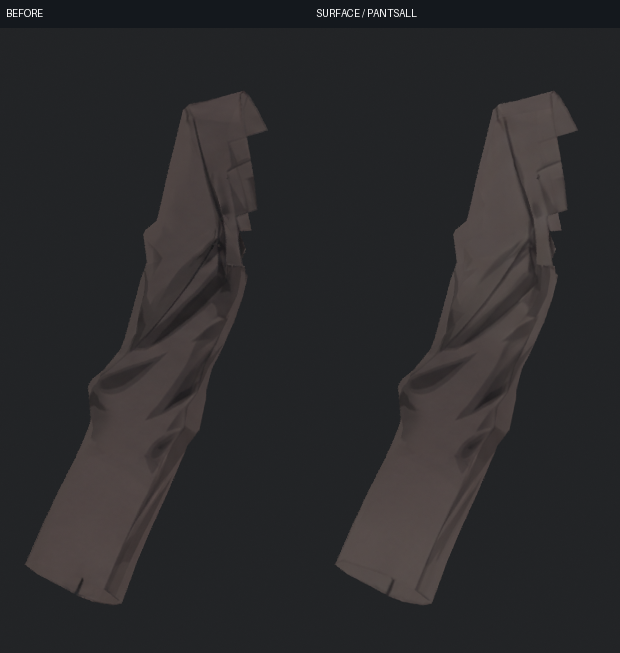

## 3. 커프·손·바지와 가려지는 부위

커프 끝의 회색 톱니 같은 흔적은 실제 텍스처에서 해당 면을 추적한 뒤 국소 정리했다. 단추와 손 피부를 함께 흐리게 처리하지 않고, 커프와 손이 만나는 얇은 경계는 남겼다.

| 커프 수정 전 | 커프 정리 후보 |
|---|---|
| 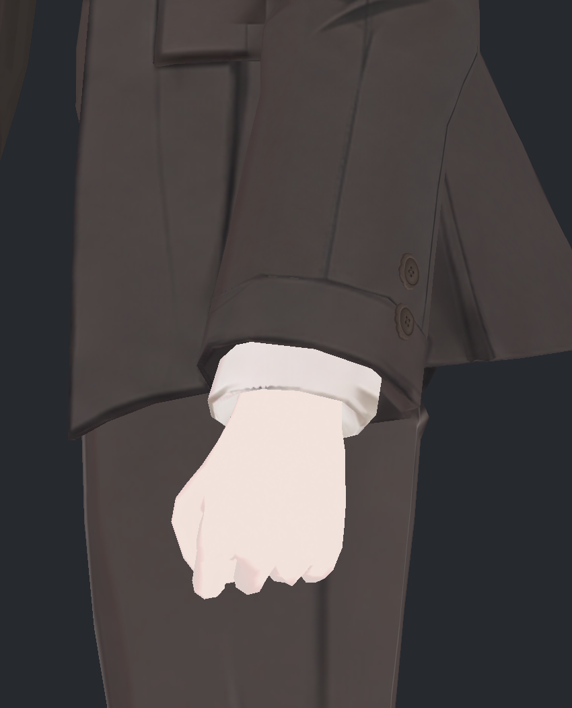 | 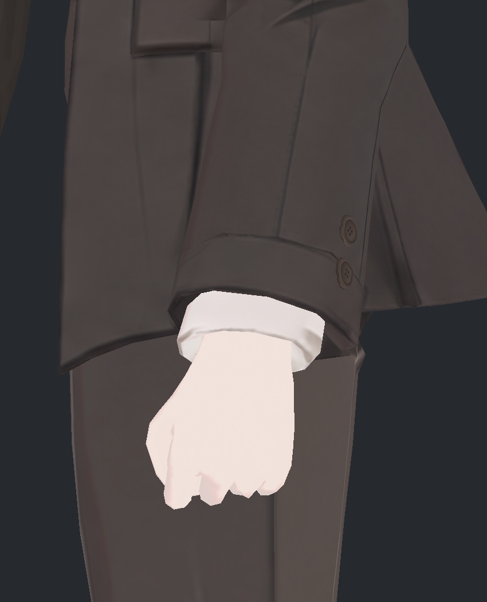 |

바지는 뒤 두 패널만 정리한 후보를 거쳐 좌우 앞뒤 네 패널을 다룬 PANTSALL75까지 비교했다. 무릎·발목 근처의 깊은 접힘과 원래 밝은 선을 보호하면서 다리 중앙의 길게 번진 명암을 줄였다.

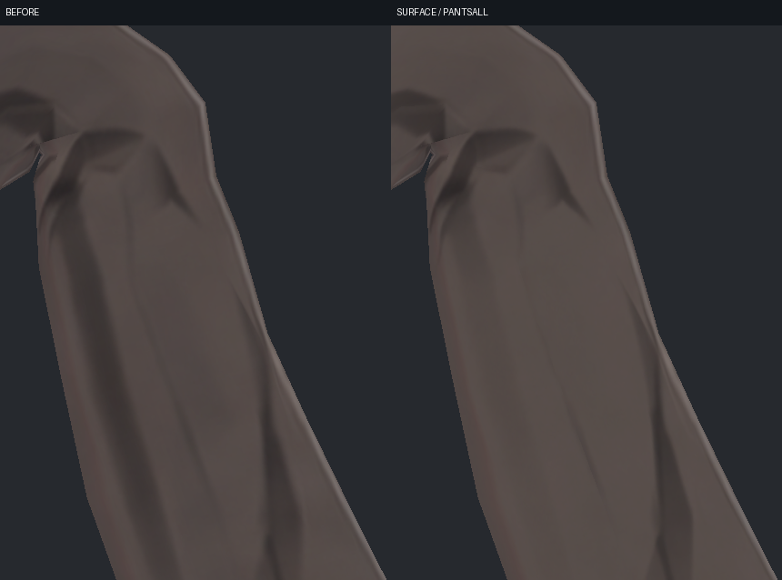

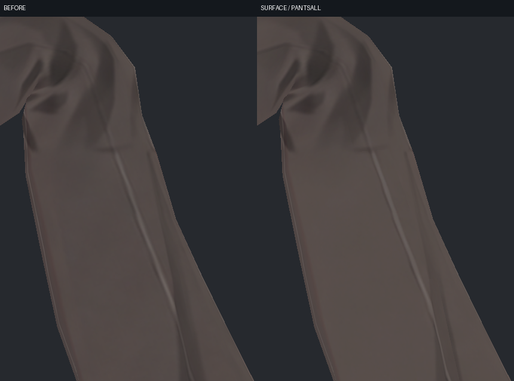

좌우 모두 큰 무릎 접힘과 긴 선이 남았고, 검토한 보호 경계에서 새 수평 띠나 흰 심은 찾지 못했다. 사용자가 허용한 무릎 형상을 다시 바꾸는 작업은 이 텍스처 수정에 포함하지 않았다.

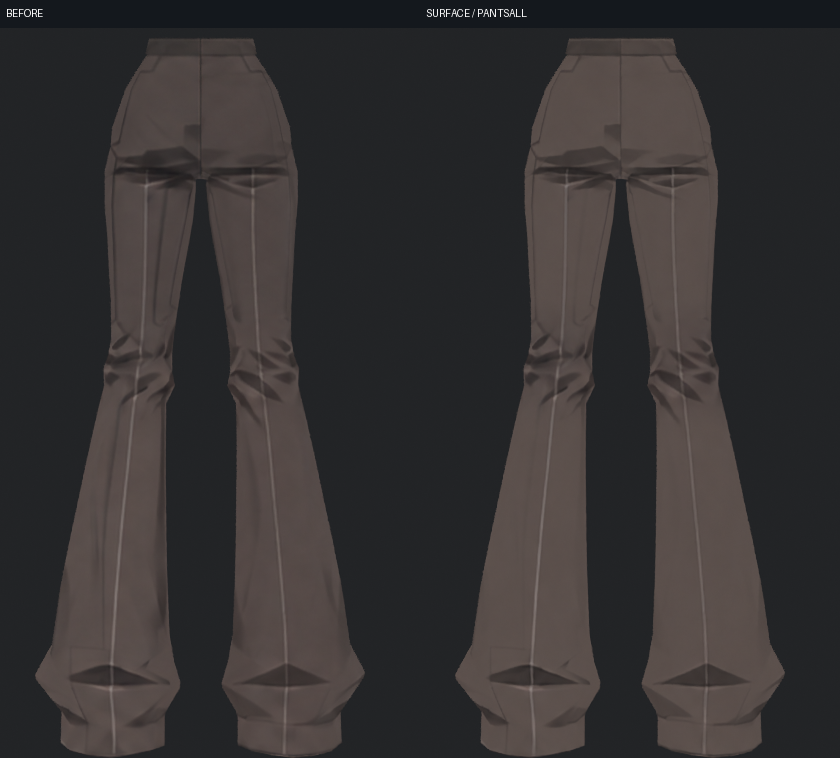

가려지는 부위는 **얼굴·머리·코트 앞/뒤·소매·바지·셔츠·좌우 손·좌우 신발·장식의 12부위 × 6방향**으로 분리해 확인했다. 이는 단일 정면 사진에서 보이지 않던 코트 안쪽·다리 뒤·신발 밑면·손 안쪽·헤어 안쪽을 드러내는 검사다. 공개 사진에는 실제 모델 렌더만 사용했다.

| 부위 | 직접 검수 결과 | 현재 판단 |
|---|---|---|
| 코트 뒤·다리 중앙 | 넓게 번진 명암 감소, 주요 선과 깊은 접힘 유지 | 다음 통합 입력으로 유지 가능 |
| 커프·손 | 커프 끝 회색 흔적 정리, 손 피부의 NPR 톤 유지 | 확인한 근접 구도에서 개선 |
| 셔츠 | 의도된 밝고 어두운 삼각 주름 유지 | 모든 주름을 얼룩으로 지우지 않음 |
| 신발 | 스트랩·솔의 겹선·장식 유지 | 해상도 후보는 별도 근접 시험과 연결 |
| 넥타이·단추 | 원래 형태를 읽는 선과 작은 요소 유지 | 더 가까운 최종 압축 검수 필요 |
| 소매 안쪽·바지 좌골/무릎 뒤 | 강한 고정 접힘 명암이 일부 남음 | 보존한 명암으로 명시, 전체 해결 판정 제외 |
| 얼굴·얇은 헤어 경계 | 별도 국소 검토 대상 | 눈 SKINPROTECTED 최종 판정 대기 |

## 4. UV — 이번 수정이 가능해진 기반과 남은 제한

이번 채색은 v351에서 만든 **부위별 연결 UV와 분리 텍스처**를 기반으로 한다. v352에서 다시 전신 UV를 새로 만들었다고 보고하지 않는다. 앞선 v350의 작은 조각 재배치만으로는 사용자가 원한 편집하기 좋은 UV가 되지 않아, 실제 부위 흐름을 기준으로 다시 편 v351 구성을 사용했다.

| 편집용 이미지 | 해상도 | 구성 |
|---|---:|---|
| 얼굴 | 4K | 큰 얼굴 외피와 실제 분리된 눈·입 부속 |
| 헤어 | 8K | 컬·가닥별 연결 영역 |
| 코트 | 4K | 몸판·소매 등 8개 의미 패널 |
| 바지 | 4K | 좌우 앞뒤 4패널 |
| 손 | 2K | 좌우 손바닥·손등 |
| 셔츠 | 2K | 몸통·카라 |
| 신발 | 4K | 갑피·밑창·장식 |
| 장식 | 2K | 단추·넥타이 부속 등 |

패널 수는 실제 UV 섬 수와 다른 단위다. 작은 독립 부품과 실제 열린 면을 억지로 붙이지 않았고, 원래 얼굴·옷·머리의 디자인을 유지하는 전사를 먼저 검증했다. 코트 몸판과 바지 네 패널을 골라 수정하고 단추·접힘선을 보호할 수 있었던 것은 이 연결 구조 덕분이다.

앞선 UV 검사에서는 겹침 기준을 통과해도 좁은 헤어 면의 간격이 너무 작아 이웃 색을 읽는 문제가 있었다. 해상도만 높이는 방법과 바깥 여백만 늘리는 방법으로 해결되지 않아, 실제 열린 경계 사이의 UV 간격과 면적 제약을 조정했다. **겹침 0은 필터 혼입이나 화면 무손실을 보장하지 않는다.** 이번에는 실제 렌더와 저장 후 재로드를 함께 검사하는 절차를 유지했다.

향후 iPhone 얼굴 트래킹을 고려해 얼굴의 연결 전개와 기존 정점 대응을 보존한다. 다만 현재 UV를 정리한 사실은 눈 감기·시선·입 벌림·표정 조합이나 iPhone 연결을 검증했다는 뜻이 아니다. 눈의 마지막 수정 및 표정 제작 후에는 변형 중 선 끊김과 노출 면을 다시 확인해야 한다.

## 5. 노멀·셰이더 대안의 현재 판단

기본색을 밝히는 후보와 노멀·셰이더 역할을 분리해서 검토했다. 코트의 새 UV에 이전 노멀맵을 그대로 쓰면 기준 방향이 달라지고, 일부 관절 보정에서는 탄젠트 방향의 부호까지 바뀌는 제한이 있다. 단순 재계산이나 노멀 ON만으로 올바른 표시를 보장할 수 없어 **코트의 탄젠트 의존 효과를 켜는 안은 현재 채택하지 않았다.**

따라서 코트에서는 우선 색면과 보호한 주름으로 NPR 표현을 다듬었다. 이것은 노멀 기법이 일반적으로 불필요하다는 결론이 아니다. 최종 UV·재질에서 광원별 비교와 필요한 부위의 효과를 따로 확인해야 하며, 이 부분 보고에는 마지막 통합 셰이더 결과를 포함하지 않았다.

## 6. PC용 런타임 텍스처 크기 비교

편집용 헤어 8K 원본을 유지한 채, Unity에서 실제 사용되는 텍스처 크기만 줄이는 사본을 만들었다. 같은 입력으로 원본/A/B/C 각각 13구도, 총 **52장**을 비교했다. 근접 정면·35도·중간·원거리 헤어, 전신, 팔꿈치, 신발, 무릎을 포함한다.

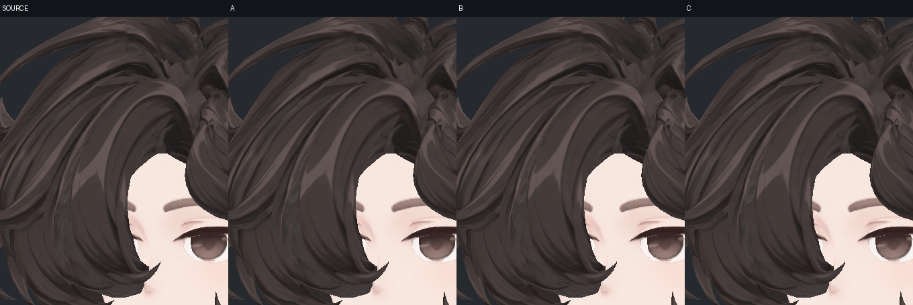

위는 왼쪽부터 원본/A/B/C다. 헤어 4K에서도 작은 컬과 길게 이어지는 가닥선이 유지됐고 전반이 뭉개지는 변화는 확인하지 못했다. 원래 밝은 띠나 접점이 해상도 감소로 해결됐다는 뜻은 아니다.

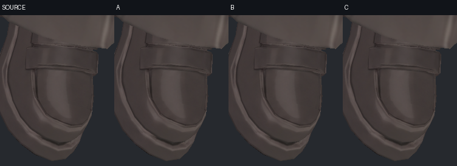

C의 신발 2K에서도 촬영 범위의 스트랩 끝·갑피 경계·솔의 이중선이 남았다. 다만 가까운 신발 코 일부가 사선 화면 밖이고, 팔꿈치 구도의 단추도 작아 최종 판정에는 더 가까운 커프와 양쪽 신발 코 사진이 필요하다.

| 후보 | 해상도 변경 | 전체 mip 압축 블록 합계 | Unity Editor 객체 메모리 합계 | 블록 기준 절감 |
|---|---|---:|---:|---:|
| 원본 | 편집용 크기 기준 | 약 192 MiB | 약 384 MiB | — |
| A | 헤어 8K → 4K | 약 128 MiB | 약 256 MiB | 64 MiB |
| B | A + 바지 4K → 2K | 약 112 MiB | 약 224 MiB | 80 MiB |
| C | B + 코트·신발 4K → 2K | 약 80 MiB | 약 160 MiB | 112 MiB |

각 후보의 9개 고유 텍스처를 합산했다. 기본색은 BC7, 신발의 선택 노멀은 BC5이며 mip을 유지하고 Read/Write는 꺼진 상태다. 파일의 디스크 크기, 압축 블록 합계, Editor 메모리, 실제 VRChat의 GPU 사용량은 같은 값이 아니다. 이번 수치는 Windows 빌드 타깃을 둔 macOS Metal Editor 측정이며 Windows VRChat 실행 측정이 아니다.

**현재 판단:** A는 디테일을 유지한 우선 후보다. B/C도 검토한 구도에서 뚜렷한 새 얼룩·선 소실은 없었지만 최종 수정 텍스처를 연결한 재시험 후 선택한다. 첫 비용 시험은 REFINED 입력이므로 이후 PANTSALL·눈 마지막 수정까지 검증한 결과로 바꾸어 부르면 안 된다.

## 7. 시도와 미채택·보류 이유

| 시도 | 실제 결과와 판단 |
|---|---|
| 넓은 명암 약화 COAT40/70 | 큰 어두운 부분이 남아 정리 강도만으로 완료하지 못함 |
| CLEAN80/100 | 얼룩은 줄었지만 깊게 굽힌 팔꿈치의 주름·부피를 읽는 요소도 약해져 그대로 미채택 |
| 뒤몸판 정리 + 팔꿈치 보호 REFINED | 넓은 띠를 줄이며 깊은 접힘을 되살린 후보. 현재 표면 검토에서 유지 가능 |
| 바지 뒤 두 패널만 수정 | 나머지 면을 포함한 검수가 필요해 네 패널 PANTSALL75로 확대 |
| 생성 결과를 전체 텍스처로 교체 | 사용하지 않음. 선택 부위에만 전사하고 원래 디자인·보호 디테일을 유지 |
| 저장한 새 이미지가 모델에 자동 반영된다고 가정 | PNG는 수정됐지만 모델 내부에 옛 이미지가 남는 문제 발견. 새 파일을 다시 읽어 실제 연결과 저장된 색의 일치를 검사하도록 수정 |
| 이전 코트 노멀을 새 UV에 그대로 적용 | 기준 방향과 관절 변형의 제한 때문에 미채택 |
| 런타임 C까지 즉시 확정 | 현재 구도는 유효하나 마지막 텍스처·단추·양쪽 신발 코 검수가 남아 최종 선택 보류 |

## 8. 독립 검토가 확인한 범위

제작자의 이미지 확인과 별도로, 독립 검토에서 실제 원본·후보 사진을 열어 얼룩 감소뿐 아니라 주름·부피·선·심 경계의 회귀를 확인했다. 초기 CLEAN 후보의 디테일 손실을 지적했고, 이후 REFINED/PANTSALL/커프 정리 결과를 다시 확인했다.

- 표면: 12부위 × 6방향 전체 사진, 좌우 무릎 196/208, 네이티브 전후 크롭 5장 및 앞선 커프·팔꿈치 근접 자료.
- PC 비용: 52장 전체를 동일 배율 개요로 대조하고, 헤어·단추·신발·바지의 네이티브 비교 5장과 일부 전체 원본 사진을 추가 확인.
- 기술 확인: 실제 표시 이미지와 저장된 이미지의 일치, 후보별 가져오기 크기·형식·mip·메모리 및 입력 보존 확인.

분리 전체 사진과 비교 개요에는 화면 축소가 있으므로 모든 텍셀을 네이티브 해상도로 전수 확인했다는 뜻은 아니다. 초기 Unity 텍스처 비교는 같은 과거 SDK 변형 형상을 사용해 UV·색·압축의 차이를 비교했다. **그 사진을 새 최종 모델의 129본·연속 동작·물리 검증 대신 사용하지 않는다.**

현재 표면에서 새 흰 심·피부색 혼입·뚜렷한 새 오염 회귀는 확인하지 못했지만, 소매 안쪽과 깊은 접힘의 강한 고정 명암, 눈 SKINPROTECTED 판정, 마지막 런타임 선명도 확인은 각각 남은 범위로 유지한다.
