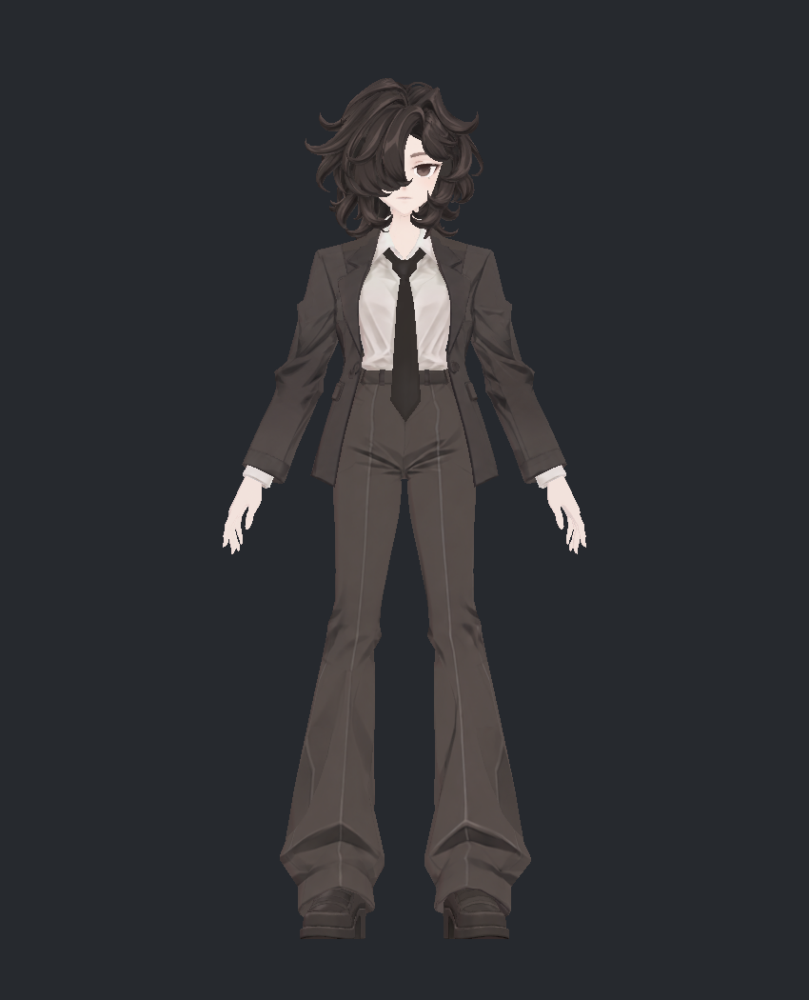
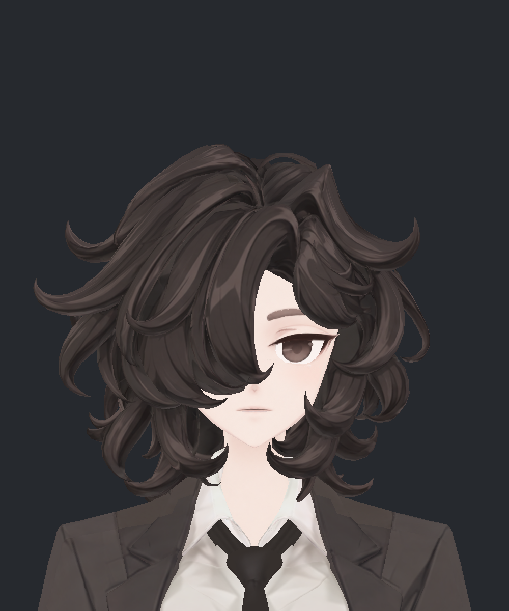

> **기록 시점 안내:** 아래는 해당 단계 당시의 보고서입니다. 후속 결정은 [최신 상태](../../STATUS.md)를 기준으로 읽어주세요. 모델·원본 텍스처·검증 원시 데이터는 이 문서 공유본에 포함하지 않습니다.

# v352 — 눈·NPR 표면 재작업과 최종 관절·물리 검수

v351 작업 플로우의 조사부터 최종 파일 검증까지 실행했다. **눈 중복 채색, 커프 색 혼입, 코트·다리의 넓은 얼룩을 수정한 검수본을 만들었다. 다만 모든 이슈가 해결된 완성본은 아니다.** 작은 눈꼬리 경계, 소매의 강한 고정 명암, 헤어–코트 접촉과 숨은 넥타이–셔츠 교차는 아래에 남겼다. 사용자의 최종 채택 전 검수 전달이다.

## 먼저 볼 결과

| 기존 눈 | 이번 눈 — 실제 형상·기본색 |
|---|---|
|  |  |

| 최종 전신 | 최종 얼굴 — NPR |
|---|---|
|  |  |

- [눈 E01~E06: 구조·UV·채색과 실패 후보](v352_EYE_REVIEW.md)
- [표면·SiuSiu/Lapwing 비교·UV·텍스처 비용](v352_SURFACE_REVIEW.md)
- [노멀·조명 비교와 최종 설정](v352_LIGHT_REVIEW.md)
- [물리 실험·미채택 이유·실제 영상](v352_PHYSICS_REVIEW.md)
- [최종 관절 사진 38장](v352_POSE_GALLERY.md) · [가림 해제 표면](v352_SURFACE_GALLERY.md)
- [남은 문제와 다음 수정 범위](v352_REMAINING.md) · [전달 파일과 재현](v352_DELIVERY.md)

## 플로우별 실제 결과

| 단계 | 실행 | 이번 판정 |
|---|---|---|
| 기준·리서치 | v351/348 보존, 사용자 지적을 실제 면·UV에 대응. 공식 셰이더 자료와 실제 SiuSiu/Lapwing 의상·물리 비교 | 실행, 원본·후보 구분 |
| 눈 | 뒤 흰자 42면의 중복 홍채 제거, 앞 홍채 내부 보존, 피부 보호 눈꺼풀 재작업, 기존 네 정점 최대0.8mm | 주요 중복 채색 개선. 작은 눈꼬리 끝은 잔여 |
| 과한 명암 | 기본색만 표시하여 조명과 분리. 코트 약/강 후보 및 주름 보호 후보 비교 | REFINED 선택. 소매 좁은 검은 접힘은 남음 |
| 가린 면·UV | 12부위×6방향 가림 해제. 커프 88면, 바지 네 패널1035면 국소 재전사. 8개 기본색용 v351 연결 차트·기존 UV층 유지 | 커프·넓은 다리 얼룩 개선. 기존 디테일 보호 |
| 노멀·NPR | 실제 최종 중립 스킨에서3광원, 그림자OFF와 신발노멀OFF/.15/.35 비교 | 코트 BumpOFF/Shadow.32, 신발.15 유지. 강한 노멀 추가 이득 없음 |
| 물리 | 헤어 웨이트2안·정점 이동3안·충돌기2안 비교, 최종본80초×2 실제 SDK 재실행 | 움직임·복귀 확인. 헤어 접촉과 일부 뻣뻣함 미해결, 실패안 미통합 |
| PC 비용 | 원본8K 보존, 실행용4K/2K 후보 시각 비교 | 헤어만 런타임4K. 최종 압축 블록128MiB, Editor약256MiB |
| 통합 검수 | 최종 파일 새로 로드. 정적299+연속121+복귀120, 129본/기존 보정키 보존 검증 | 기존 기하 회귀 없음(아래 범위). 전체 접촉 무결함 판정은 아님 |
| 전달 | 최종 Blender/Unity·스크립트·검증 근거와 사진/GIF 보고를 같은 버전에 묶음 | 작업·선별 문서 main 게시 대상으로 고정 |

## 무엇을 실제로 바꿨는가

얼굴·코트·셔츠 커프·바지 기본색을 기존 연결 UV로 재작업했다. 기존 헤어·손·신발·장식의 의미 있는 가닥, 선, 단추 디테일은 확인 후 보존했다. 흐림을 전역 샤프닝으로 가리는 대신 실제 오염 면과 전사 경계를 대응했다. 생성 참고 채색은 기존 표면에 필요한 범위만 Blender에서 베이크하고 주름·반사·봉제선 보호를 다시 검수했다.

기하 변경은 눈 하단의 **기존 네 정점 최대0.8mm**다. 새 메시·리메시·얼굴 재생성은 없다. 모든 기존 키에도 같은 기본 좌표 이동을 적용하여 상대 변형은 그대로다. 승인된 무릎·손가락·팔꿈치와 본/웨이트를 바꾸지 않았다. 실패한 헤어 정점·웨이트·충돌기 후보는 전달본에 들어가지 않았다.

## 최종 파일을 다시 검사한 근거

가림 해제12부위의 초기 얼굴 사진은 직전 후보이고, 최종 피부 보호 얼굴은 별도 최신 눈·NPR 사진으로 다시 확인했다. 나머지11부위는 동일한 최종 표면이다.

최종 Blender의 활성 기본색8개는 저장된PNG와 packed RGBA가 정확히 일치했다. 기존 UV·토폴로지·웨이트·재질 면 배정·129본·26+32개 키의 상대 변형량을 독립 검사했다.

Unity 최종본은 **정적299·연속121·복귀120 = 540기록**을 새로 생성했다. 이전 정적299자세와 실제 입력이 정확히 같고, 눈 네 점을 제외한 BodyHair33,748점과 Coat3,894점은 모든 정적 자세에서 이전과 위치 차이0mm다. 눈 네 점의 동작 중 최대 차이는 약0.800056mm다. 새 면적 경고는0이며 원래 경고까지 없어진 것은 아니다. 기존 BodyHair98/Coat72 정적 행의 경고가 유지된다.

복귀 첫 표본에서 코트 최대0.411mm의 잔여 변형이 있었고 다음 표본부터0, 마지막 보정키도 모두0이다. 연속 시험은 이번1프레임 간격, 이전2프레임 간격이므로 전 구간 수치를 동일하게 취급하지 않았다. 별도 접촉 검사는43개 선택 자세이며 전체540자세 접촉 전수 검사라고 부르지 않는다.

물리는 최종본을 두 번 각4,800프레임(80초) 실행했다. 중립 입력 검증은 두 번 모두 차이0°다. 60Hz 본 기록과 각167표본의 실제 스킨을 확인했다. 헤어·넥타이·코트 모두 입력 해제1초 뒤 준비 자세의 끝 위치로 복귀했다. 접촉 잔여와 작은 반복 차이는 [물리 보고](v352_PHYSICS_REVIEW.md)에 수록했다.

## 작업 중 만난 문제와 재검증

| 문제 | 처리·미채택 이유 |
|---|---|
| PNG를 바꿔도 Blender packed 데이터가 옛 그림을 유지 | 저장→새 이미지 재로드→pack→실제 재질 연결로 수정. 최종8개 바이트·RGBA 독립 일치 |
| 눈꺼풀 강한 패치/전체 홍채 재채색 | 눈매가 각지거나 홍채 크기·반사가 바뀌어 제외. 피부와 원래 홍채 내부 보호 |
| 코트 강한 정리가 팔꿈치 부피까지 약화 | 보호 범위를 관절 주변으로 분리하여 원래 접힘 회복 |
| 헤어 접촉을 줄인1.15mm 후보 | 인접 삼각 패임이 실제 근접 사진에 나타나 제외 |
| 새 충돌기가 반응해도 표면은 계속 접촉 | 표면–본 거리와 높은 머리 고정 웨이트가 원인에 포함. 단순 반경 변경 미채택 |
| 첫 최종 리그의 Rebind가 잘못된 중립 자세를 읽음 | 첫 결과를 실패 기록으로 격리. 기존 실제 입력·몸 기준을 명시하여 final_rig_v2 전체 재실행. 중립·299입력 일치 검증 |
| 첫 재질 렌더가 빈 화면 | BakeMesh 좌표 조건 수정 후 실제 사진 확인. 최종은 새 V2 스킨에서 재촬영 |

## 독립 검토와 현재 경계

작업자 외 눈·명암/물리·통합 검토3담당이 실제 파일과 그림을 확인했다. 눈 반사 보호·피부 오염·원거리 끝 조각, 소매 잔여, 실제 물리 접촉, 최종 중립 초기화, 메모리 계산을 서로 대조하고 지적 후 재검증했다. 수치 정상만으로 예쁘거나 완성됐다고 판정하지 않았다.

이번은 Blender와 Unity Editor SDK까지다. PC VRChat 업로드/클라이언트/월드/네트워크/실기 메모리, iPhone 입력과 실제 ARKit 얼굴표정 제작은 수행하지 않았다. 기존 보정키를 표정 지원으로 계산하지 않는다. 남은 문제를 기록했으므로 전체 아바타 최종 완료나 사용자 승인으로 읽지 않는다.
