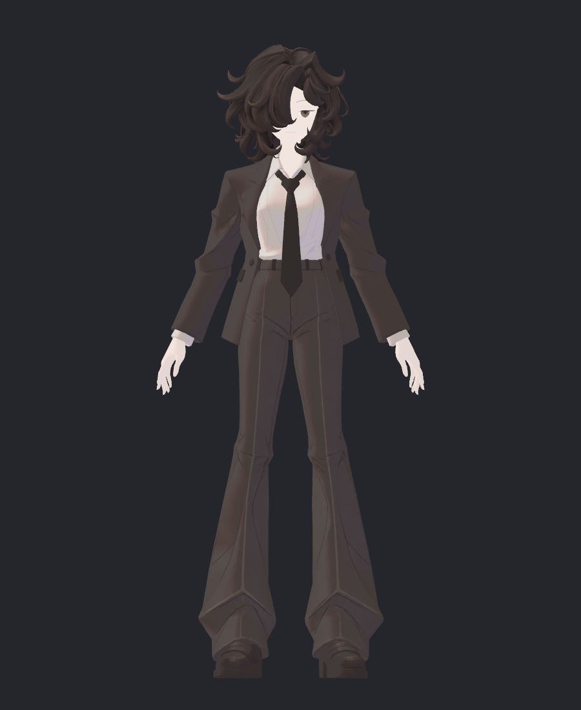
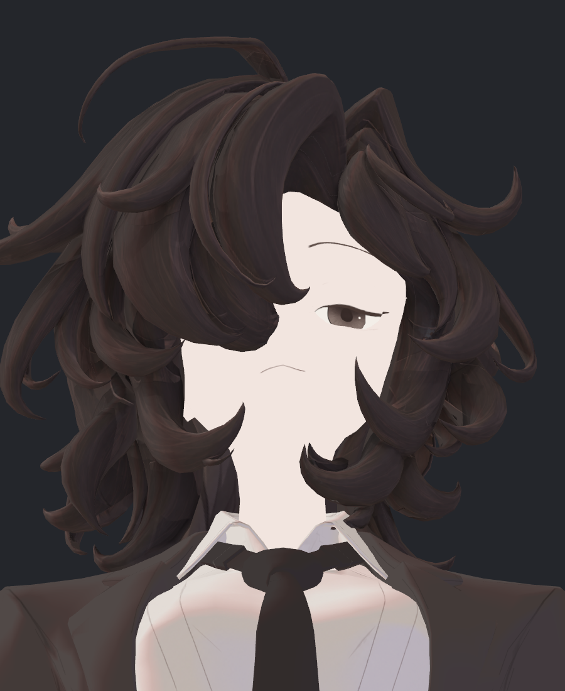
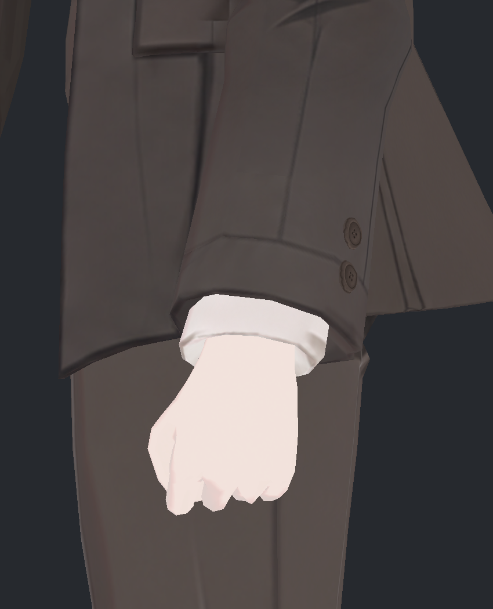
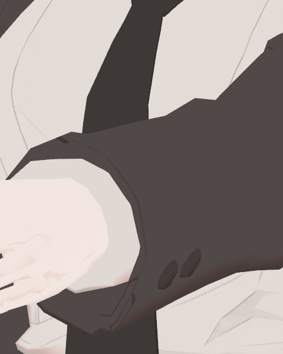
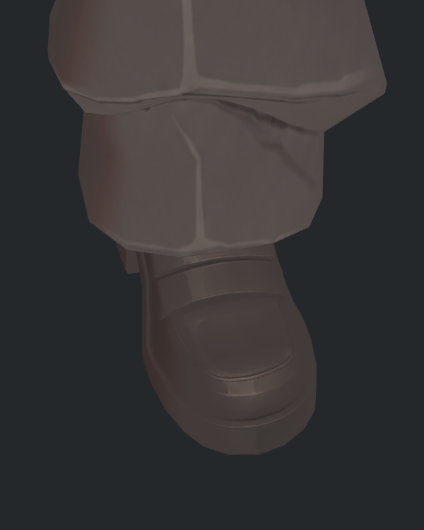
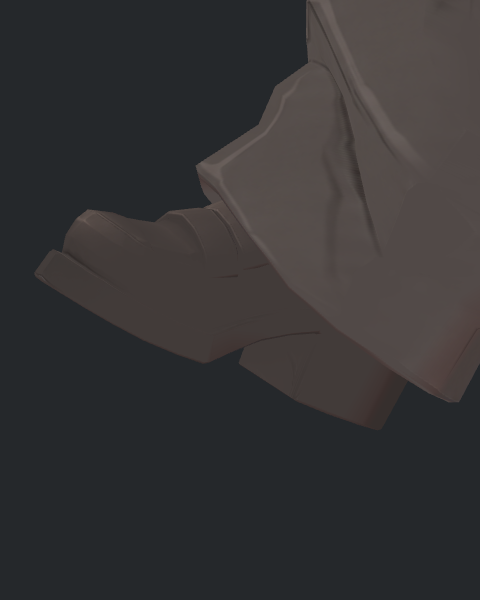
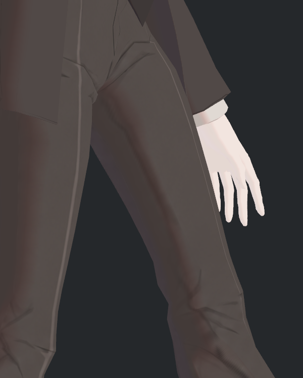

> **기록 시점 안내:** 아래는 해당 단계 당시의 보고서입니다. 후속 결정은 [최신 상태](../../../../STATUS.md)를 기준으로 읽어주세요. 모델·원본 텍스처·검증 원시 데이터는 이 문서 공유본에 포함하지 않습니다.

# v353 옷·신발 디테일 약화 독립 검토

사용자 중간 피드백 후 읽기 전용으로 실제 이미지를 다시 확인했다. **옷과 신발의 세부가 약해졌다는 지적에 동의한다.** 얼룩을 줄인 것은 개선이지만, 소재·부품·접힘을 구분하던 선과 작은 명암까지 충분히 유지하지 못했다. 특히 신발과 소매 단추는 현재 이미지에서 저대비 덩어리처럼 읽힌다. 모델/텍스처/UV/재질 변경 및 Blender·Unity 실행은 이번 검토에서 하지 않았다.

## 비교 범위와 제한

- 재작업 전: v352 `FINAL2` 실제 토르소·손/소매·발 앞/옆 사진 4장.
- 현재: Hair29V2 실제 focused V4의 신발 윗면/바깥면/허벅지, Hair29 목·카라 사진, SOURCE/BC7 실제 NPR 커프스·신발 쌍. `current_surface_focused_v4/REVIEW.json`의 source는 `Assets/BiancaV353HairAlbedo29V2/Bianca_v353_HAIR_ALBEDO29_REVIEW.prefab`이다.
- 보조: Hair20 전신 사진과 앞선 V9 상체 사진, 새 코트/셔츠/신발 원화, 원래 `ref_char.png`를 직접 열었다. Hair20/V9는 정확한 최신 전신 비교 사진으로 대체하지 않고 변화의 경과 자료로 구분한다.
- v352와 현재 사진은 자세·카메라·해상도·조명이 완전히 같지 않다. 따라서 소실률/복구율 수치나 모든 원본 픽셀의 삭제 여부를 주장하지 않는다. 현재 실제 표시에서 디테일을 읽기 어려운 문제와, 해당 정보 자체가 텍스처에서 삭제됐다는 주장은 다르다.
- **SOURCE→BC7 검수는 이미 재작업된 Hair29 표면에 압축을 적용한 비교다. v352→v353 디테일 보존 검사가 아니다.** 압축 전도 같은 저대비여서 현재 문제를 BC7만의 원인으로 돌릴 근거가 없다.

## 부위별 판정

| ID / 우선순위 | 부분 | 직접 본 변화 | 판정 및 복원 방향 |
|---|---|---|---|
| D01 / 높음 | 신발 스트랩 | v352는 겹치는 띠의 위·아래 경계와 작은 밝은 모서리가 구분된다. 현재 윗면에도 띠 선은 남지만 바깥쪽에서는 갈색 면에 묻힌다. | **표시상 약화 확인.** 스트랩 경계/겹침의 좁은 명암과 마감선을 우선 복원. 가려진 위쪽 띠 전부 삭제로 판정하지 않는다. |
| D02 / 높음 | 신발 갑피·앞코 | v352는 앞코 패널과 둘레의 선·면 변화가 구분된다. 현재 윗면에는 이중 윤곽이 일부 남지만, 옆면은 거의 같은 톤이다. | **표시상 약화 확인.** 앞코의 좁은 강조선과 패널 구분을 NPR 면으로 다시 확보. 넓은 얼룩성 광택을 그대로 되살리는 것은 별개다. |
| D03 / 높음 | 신발 밑창·굽 | v352는 갑피–창 사이 층이 읽힌다. 현재는 외곽 형상은 남지만 측면 색이 비슷해 단단한 창과 갑피의 구분이 약하다. | **약화 확인.** 창 윗선·측벽·굽의 제한된 색/명도 차이 복원. 외형이나 굽이 삭제됐다는 뜻은 아니다. |
| D04 / 높음 | 신발 봉제 | v352 둘레에는 가는 경계가 보이고 현재 윗면에도 짧은 점/선이 일부 남는다. 현재 BC7 측면에서 봉제 표현은 잘 읽히지 않는다. | **가독성 부족 확인, 개별 스티치 삭제 여부 미확인.** 원본 대응 봉제선이 UV/베이크 단계에서 유지됐는지 후속 국소 비교 필요. 새 과도한 장식을 임의 추가하지 않는다. |
| D05 / 높음 | 소매·몸판 단추 | v352 소매 확대에서는 구멍과 테두리가 읽힌다. 현재 SOURCE와 BC7 모두 구멍·실 대비가 약하고 어두운 타원으로 보인다. | **가독성 약화 확인.** 구멍/실/테두리 정보가 실제 새 채색에 있다는 과거 기록과 모순되지 않는다. 데이터가 있어도 표시가 부족하다. 단추 정면·같은 조명에서 대비와 작은 면을 회복해야 한다. |
| D06 / 높음 | 소매 세로솔기·커프스 | v352에는 세로솔기, 손목 절개선, 흰 커프스의 접힘 경계가 함께 보인다. 현재 소매의 큰 면과 일부 선은 남지만 잔선·겹침의 층이 적게 읽힌다. | **약화 확인.** 긴 솔기와 커프스 층을 보호 대상으로 지정. 예전 소매 안쪽의 큰 검은 얼룩은 복원 대상과 분리한다. |
| D07 / 중간~높음 | 자켓 라펠·카라·몸판 솔기 | v352 라펠의 얇은 단차 명암, 가장자리, 앞판 분할이 분명하다. 현재도 형상과 윤곽은 있으나 옷 바탕과 비슷해 라펠의 겹침이 덜 읽힌다. 현재 카라에는 선이 남고 단순 통째 삭제는 아니다. | **시각적 약화 확인.** 라펠 뒤집힘 면·가장자리의 좁은 명암/선 복원. 같은 각도의 최신 토르소 확대가 없어 작은 솔기별 삭제 확정은 보류. |
| D08 / 중간~높음 | 포켓·벨트 | v352 포켓 플랩은 테두리와 아래 접촉 그림자가 있어 두께를 읽기 쉽다. 이후 전신/상체 경과 사진에서는 평평한 어두운 사각형에 가깝다. | **경과 사진에서 약화, 최신 국소 확대 미확인.** 포켓 테두리/작은 아래 그림자와 벨트 고리를 우선 대조. Hair29 전신 확대 재촬영 없이 완전 삭제라고 단정하지 않는다. |
| D09 / 높음 | 셔츠 작은 접힘 | v352의 가슴 옆·카라 밑·허리 접힘은 작은 면 변화가 연결된다. 현재는 가는 긴 선과 넓은 가슴 명암이 중심이고, 주름의 작은 면이 현저히 줄어든 인상이다. | **채색 구성 축소 확인.** 동적 명암을 유지하면서 레퍼런스의 제한된 작은 밝고 어두운 접힘 면을 복원해야 한다. 가슴에 넓은 명암 하나만 생긴 것으로 디테일을 대체하지 않는다. |
| D10 / 중간 | 바지 | 세로 프레스 라인·골반/무릎/밑단의 큰 선은 남는다. 예전 골반의 진한 V자와 넓은 그림자가 약해졌고, 현재 허벅지 안쪽은 비교적 깨끗하다. 작은 접힘 면은 단순해졌으나 부위별 편차가 있다. | **잔존 디테일 있음 + 일부 약화.** 프레스 라인/무릎/밑단은 유지, 구조를 설명하는 작은 면을 선별 복원. 예전 진한 골반 V/안쪽 얼룩 전부 복귀는 권장하지 않는다. |

## 직접 확인한 사진

### 옷의 재작업 전과 현재 경과

v352의 라펠·단추·포켓·셔츠·바지 접힘:

이후 Hair20 전신 경과 자료. 최신 Hair29 전체를 새로 촬영한 사진은 아니지만 옷의 큰 빈 면과 작은 디테일 대비 축소를 확인할 수 있다:

현재 Hair29 목·카라 실제 사진. 카라 경계와 선은 남지만, 셔츠는 긴 얇은 선과 넓은 명암으로 읽힌다:

### 단추와 소매

| v352 소매 | 현재 Hair29 비압축 NPR | 현재 BC7 NPR |
|---|---|---|
|  |  |  |

소매 자세가 달라 정량 비교는 하지 않는다. 현재 비압축/압축 모두 버튼 내부가 어둡다는 관찰은 유효하다. 현재 두 후보 사이의 유사성을 원래 버튼 선명도 보존으로 확대하지 않는다.

### 신발

v352 실제 앞면:

현재 Hair29 실제 윗면과 BC7 실제 바깥면:

| 현재 윗면 | 현재 바깥면 |
|---|---|
|  |  |

윗면의 앞코 봉합선 일부는 남아 있지만, 바깥면의 스트랩·갑피·밑창은 한 톤으로 뭉친다. 바지에 가려진 영역은 미관측이다. 이 사진만으로 가려진 부분의 소실을 확정하지 않는다.

현재 바지 안쪽은 비교적 깨끗하지만, 프레스 라인과 일부 주름 면의 선명도는 별도 유지 대상이다:

## 원인: 확인한 것과 아직 가설인 것

**확인한 것**

1. 이번 단계는 이전 기본색을 그대로 보존한 압축 작업이 아니라 새로운 채색 제작이었다. 기존 `v353_WORK_REVIEW.md`에도 기존 픽셀을 채색 원본으로 사용하지 않았다고 명시돼 있다. 이 선택은 큰 고정 명암을 제거하는 데 유리했지만 원래 작은 선·면의 보존을 자동 보장하지 않았다.
2. 직접 확인한 새 `coat_lines_front_v9.png`와 `shirt_lines_front.png` 자체가 얇은 선과 넓은 단색 면 중심이다. 코트 라펠·셔츠 접힘을 작은 색면으로 설명하던 레퍼런스에 비해 정보의 계층이 줄어 있다. `gui_bake_coat_v9.py`는 코트 앞면 원화로 해당 파일을 지정한다.
3. 신발·단추는 SOURCE와 BC7 모두 비슷하게 어둡다. 따라서 현재 모든 가독성 저하가 BC7 양자화로 새로 생겼다고 설명할 수 없다.
4. 현재 코트·바지·셔츠·신발 재질은 `_UseShadow=1`, `_ShadowStrength=.62`, `_AsUnlit=.25`가 같다. 재질 파일에서 확인한 설정이며, 소재마다 최적 표현이 동일하다는 근거는 아니다.

**아직 분리하지 않은 기여**

- 기본색 대비 축소, 투영/베이크에서 작은 선의 축소·손실, 조명과 노멀의 방향, 재질의 동적 명암 중 어느 것이 각 부위에 얼마나 기여했는지는 같은 기하/카메라의 v352텍스처·새텍스처 교차 실험이 없어 미분리다.
- 단추 구멍·실이 없어진 것인지, 남아 있지만 어두운 면에 묻힌 것인지는 현재 사진만으로 데이터 삭제 판정 불가. 과거 단추 정면 검수에서 구멍·실이 존재한다고 기록됐어도 지금 구도의 가독성 문제는 남는다.
- 신발 원화에는 스트랩·봉제·밑창을 구분하는 세부가 보이므로, 새 채색에 애초부터 전혀 없었다고 단정하지 않는다. 실제 옆면 전사/명암/관찰 가림을 나눠 확인해야 한다.

## 원화와 맞춰 복원할 기준

원래 레퍼런스는 단순한 단색 캐릭터가 아니다. **주름과 접힘을 설명하는 선택적인 작은 명암 면, 얇은 외곽·봉제선, 신발의 띠/앞코/창 구분**이 있다. 사진 같은 광택이나 모든 예전 얼룩을 되살리는 방식은 필요하지 않지만, 명암 제거를 평탄화와 동일시하면 목표에서 멀어진다.

원래 캐릭터 원화는 로컬 `avator_references/ref_char.png`를 직접 확인했다. 원본 레퍼런스 이미지는 공유 문서에 재배포하지 않는다.

복원 우선순위는 신발 전체 → 단추·솔기·포켓 → 셔츠 작은 접힘과 라펠 → 바지 선택 면이다. 각 부위에서 보존할 특징 목록을 먼저 고정하고, 새 NPR 채색과 과거 v352의 그 특징을 같은 카메라/광원·무조명으로 비교해야 한다. 첫 비교에서 디테일이 돌아왔는지 실제로 확인하기 전에는 압축·UV·기하 수치 통과를 미관 합격으로 쓰지 않는다.

이번 검토는 이슈를 기록한 것이며 복원 실행·미관 합격·최종 통합이 아니다.
