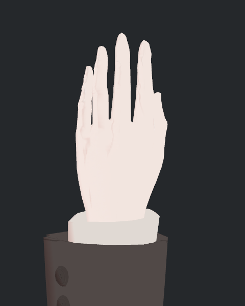
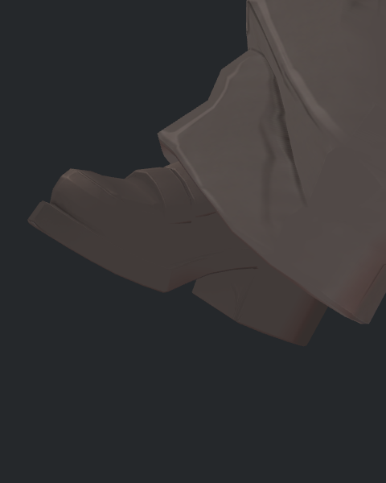
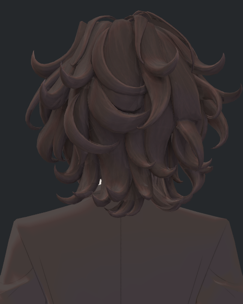
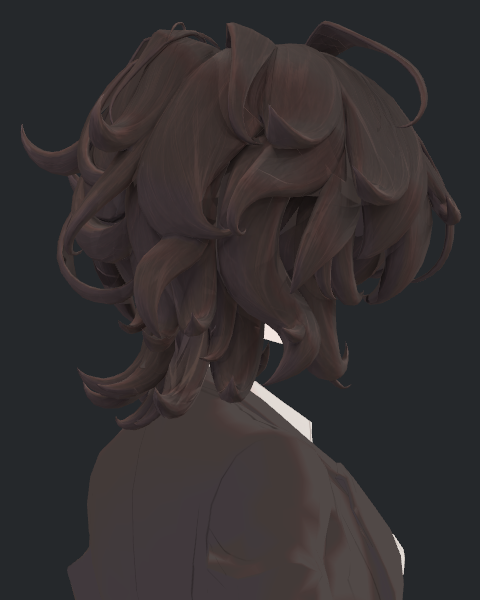

> **기록 시점 안내:** 아래는 해당 단계 당시의 보고서입니다. 후속 결정은 [최신 상태](../../../../../../STATUS.md)를 기준으로 읽어주세요. 모델·원본 텍스처·검증 원시 데이터는 이 문서 공유본에 포함하지 않습니다.

# v353 BC7 실제 NPR 6쌍 독립 판정

현재 Hair29V2 원본과 BC7SurfaceTrialV1의 **표면 통합 사용을 허용할 수 있는 비교 결과**다. 개별 12장과 두 시트를 직접 확인했다. 6쌍 모두 카메라·광원·자세 일치, 원본·후보·장면 보존 통과다. 실행 결과의 자동 visual_accepted=false는 그대로 두고 이 별도 독립 판정에 실제 사진 검수 결과를 남겼다.

눈꺼풀 끝과 홍채 반사, 얇은 손금, 소매 단추와 봉제선, 신발 앞코 선, 헤어 가닥선에서 눈에 띄는 새 번짐·고리·디테일 소실은 확인되지 않았다. 단추와 신발은 두 후보 모두 원래 어두운 저대비이며 압축으로 새로 어두워진 것으로 보이지 않는다. 바지에 덮인 신발 윗부분은 이번에도 가려져 있다.

|원본 NPR|BC7 NPR|
|---|---|
|||
|||
|||
|||
|||
|||

정량 보조값은 화면 전체 8비트 RGB 차이이며 배경도 포함한다. 미관 판정은 위 개별 사진과 GPU 사용 UV/눈/단추 ROI를 함께 근거로 했다.

|구도|화면 RGB 평균 차이 /255|최대 /255|
|---|---:|---:|
|EYELID_CLOSE|0.061147|7|
|HAND_L_BACK|0.008874|3|
|SHOE_L_OUTER|0.018913|2|
|CUFF_L_DETAIL|0.058118|3|
|HAIR_BACK|0.066986|3|
|HAIR_SIDE|0.061478|2|

알파 1/255 차이는 사라졌다고 기록하지 않는다. 현재 8개 Opaque lilToon 재질의 최종 alpha=1 경로에서 표시 손실이 없는 범위로만 판정한다. 투명/컷아웃 변경 시 재검사가 필요하다. 이 판정은 로컬 Metal GPU·현재 표면 후보에 한정하며 최종 물리·관절 병합, 전체 숨은 면, PC VRChat 클라이언트까지 완료했다는 의미가 아니다.
