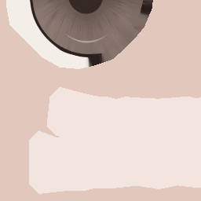
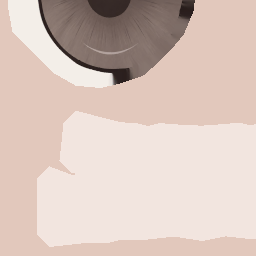
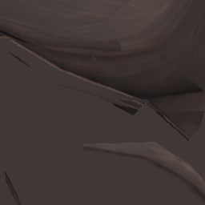
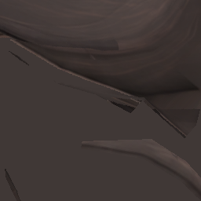
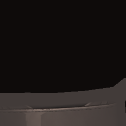
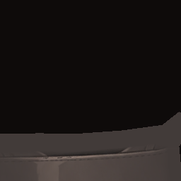

> **기록 시점 안내:** 아래는 해당 단계 당시의 보고서입니다. 후속 결정은 [최신 상태](../../../../../STATUS.md)를 기준으로 읽어주세요. 모델·원본 텍스처·검증 원시 데이터는 이 문서 공유본에 포함하지 않습니다.

# v353 BC7 실제 GPU 국소 검수

실제 GPU V2 실행은 8맵 완료, 원본·후보 의존 파일 및 장면 보존 통과다. 12쌍의 오차 상위 256픽셀 크롭을 직접 비교했으며 눈·홍채·머리카락·신발 선에 명확한 새 고리나 선 소실은 보이지 않았다. **무손실은 아니며 NPR 6구도 비교 완료 전 최종 채택하지 않는다.**

M4 Metal에서 동일 Texture2D.Load mip0를 RGBAFloat로 읽었다. 필터를 쓰지 않는 정수 텍셀 비교이며 크기·sRGB·원본 PNG·필터·mip 설정 동일성 관문과 좌표/색 보정 표본을 통과했다. PC VRChat 실행이나 전체 mip 필터 경계 검사는 아니다.

|맵|사용 UV 평균 RGB 오차 /255|최대 /255|픽셀 최대 오차 >8 수|
|---|---:|---:|---:|
|face|0.00554|10.0473|35|
|hair|0.12015|8.9833|1|
|details|0.00604|4.0661|0|
|hands|0.01346|6.0087|0|
|shirt|0.06515|6.0151|0|
|coat|0.00474|3.9794|0|
|pants|0.05492|3.0946|0|
|shoes|0.01537|7.0316|0|

눈·홍채 ROI 최대 9.0277/255, >8인 픽셀 16개다. 단추 ROI 최대 4.0661/255, >8은 0이다. 선/명암 경계 ROI의 최대는 머리 8.9833, 신발 7.0316/255다. 얼굴 전체 최대 10.0473이 눈 ROI 최대와 다르므로 전체 평균만으로 정밀 선을 판정하지 않는다. ROI 경계는 실제 현재 삼각형/UV와 원래 부품 대응을 사용하지만 모든 예술적 디테일을 자동 식별한 것은 아니다.

|원본 GPU|BC7 GPU|
|---|---|
|||
|||
|||

알파도 따로 확인했다. 사용 UV의 원본은 모두 255, 후보는 254/255이고 최대 차이는 약 1/255다. 이를 0으로 간주하지 않는다. 다만 현재 실제 8재질은 lilToon Opaque, queue 2000, TransparentMode 0, SrcBlend 1/DstBlend 0, AlphaToMask/AlphaMaskMode 0이며 해당 Opaque forward 코드가 최종 alpha=1로 설정한다. 현재 후보에 cutout 구멍이 생기는 경로는 없다. 향후 투명/잘라내기 재질로 바꾸면 재검사해야 한다. 특정 BC7 블록 모드는 읽지 않았으므로 모드 원인까지 확정하지 않는다.

단추 오차 상위 크롭은 작은 차트 가장자리·뒷면이 많아 구멍과 림 전체의 미관 검증으로 충분하지 않다. NPR 소매 단추 구도의 실제 사진을 보완한다. 원본 atlas의 계단·채색 패널 차이 자체를 압축 문제로 오인하지 않는다.

V1 복사 의미 비교 실패 및 V1 GPU 카테고리 분류 실패는 보존했다. 현재 후보의 구조 동일성 근거는 `../../physics/BC7_VALIDATED_EXISTING_V1_V3.json`, GPU 결과 근거는 `actual_gpu_v2/REVIEW.json`이다. V3는 기존 V1 후보를 읽기 전용으로 검증했으며 이전 실패 결과를 성공으로 바꾸지 않았다.

GPU 읽기 방식의 공식 기준: [HLSL Load](https://learn.microsoft.com/en-us/windows/win32/direct3dhlsl/dx-graphics-hlsl-to-load), [Unity RenderTextureReadWrite](https://docs.unity3d.com/2022.3/Documentation/ScriptReference/RenderTextureReadWrite.html).

후속 실제 NPR 6쌍 독립 검수 완료: [현재 표면 통합 사용 판정](actual_npr_v2/v353_BC7_NPR_INDEPENDENT_REVIEW.md). 앞의 NPR 대기는 GPU 단독 판정 당시 상태이며, 실행 JSON은 그대로 보존했다.
