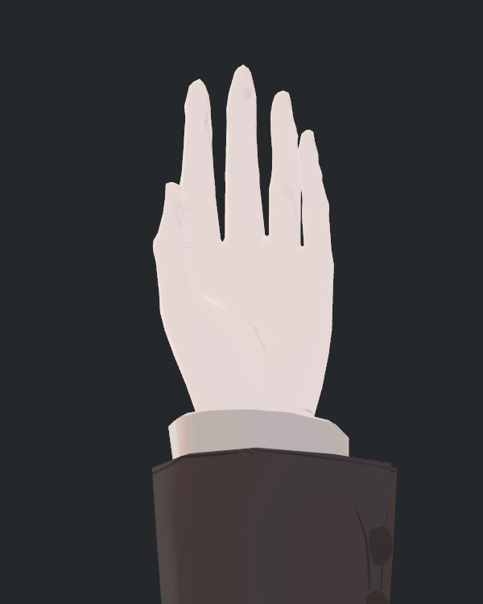
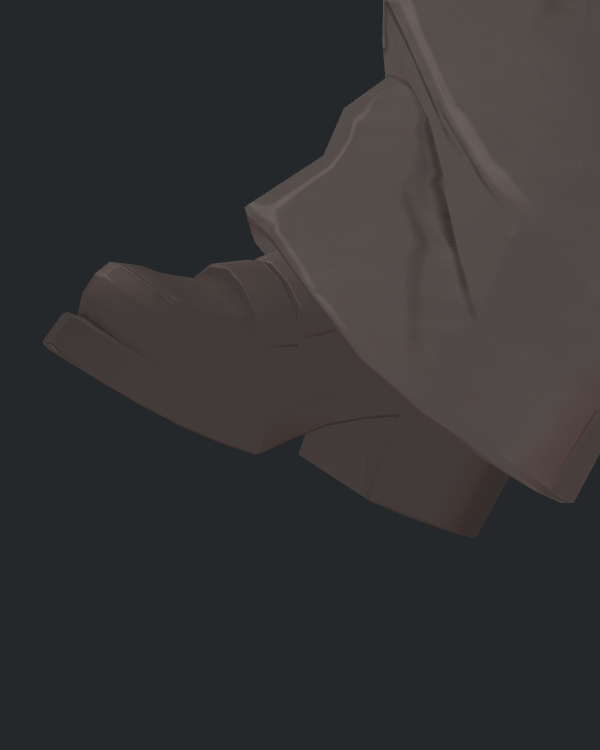
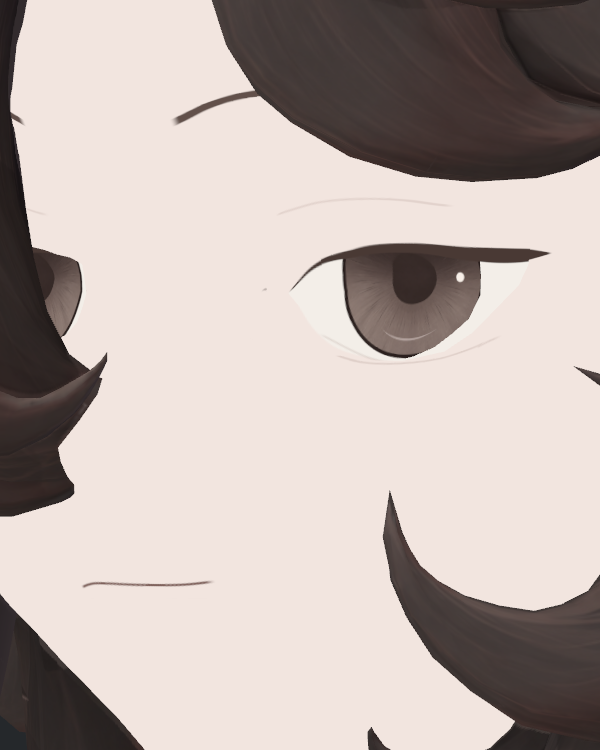
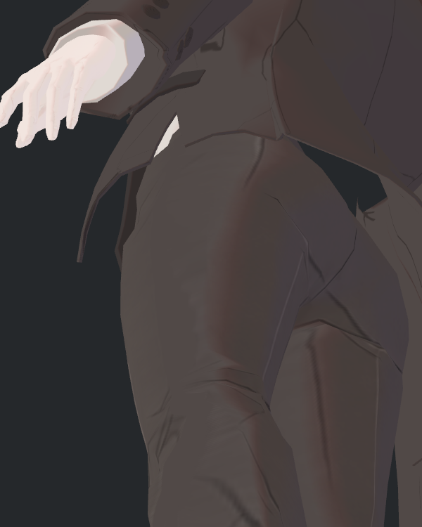
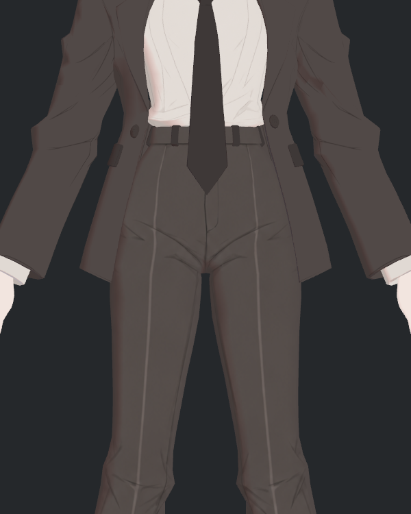

> **기록 시점 안내:** 아래는 해당 단계 당시의 보고서입니다. 후속 결정은 [최신 상태](../../../../../STATUS.md)를 기준으로 읽어주세요. 모델·원본 텍스처·검증 원시 데이터는 이 문서 공유본에 포함하지 않습니다.

# v353 실제 표면 42장 독립 검수

Hair29V2의 실제 NPR 사진 42장을 모두 직접 확인했다. 36장은 해당 표적이 보이며, 코트 밑단 4장은 좁은 안쪽 경계만 보이는 부분 표본이다. 양손 중간 크기 2장은 손이 화면 밖으로 잘려 검수 근거에서 제외한다. 원본 사진 42개 SHA 재검산 불일치 0, 실행의 source/scene exact를 확인했다.

이 결과는 현재 비압축 Hair29V2 표면의 정적 검사다. 최종 물리·어깨 런타임 통합 후보 검사나 가려진 전체 면 합격으로 확대하지 않는다. Animator/PhysBone/Cloth가 꺼진 진단이다.

|표적|사진 수|직접 판단|
|---|---:|---|
|양손 손바닥·손등|8|손가락 끝부터 손목까지 보이고 라벨이 맞다. 얇은 손금·마디 표현 유지. 넓은 새 얼룩은 보이지 않는다.|
|양손 중간 크기|2|양손이 좌우 밖으로 잘림. 미유효, 별도 2장 재촬영 대상.|
|좌우 신발 안·밖·위|12|해당 발 전체 외곽과 앞코·뒤꿈치가 프레임 안이다. 바지가 덮은 갑피는 확인했다고 주장하지 않는다. 스트랩·앞코 선 유지.|
|양 신발 중간 크기|2|양발과 가는 장식선 유지. 바지에 가려진 영역은 동일 제한.|
|좌우 겨드랑이|4|코트·소매 안쪽 국소 표면 확인. 큰 면 명암은 광원에 따라 달라진다. 모든 어두운 면을 채색 얼룩으로 분류할 근거는 없다.|
|좌우 코트 안쪽 밑단|4|주로 허벅지와 코트 끝, 좁은 안쪽 표면. 전체 안감 검사에는 불충분.|
|좌우 안쪽 허벅지|4|표적 대부분 보임. 가랑이 일부 반대 다리 가림은 자연 가림. 주름선과 명암 유지.|
|눈꺼풀 근접·중간·작은 크기|6|눈매·홍채·반사·입선 보존. 이전 큰 흰 조각이나 바깥 벽 단차는 이 구도에서 두드러지지 않는다. 뾰족한 눈꼬리를 결함으로 보지 않는다.|

눈의 크기별 표본은 카메라 위치 이동이 아닌 정사영 화면 점유율 변화다. 정확한 GPU mip LOD를 계측한 결과는 아니다.

신발 위 바지 접힘 주변에는 가는 반복 띠가 일부 보인다. 두 광원에서도 비슷한 위치에 남지만 원화 주름·텍스처 전사·필터·기하·법선 기여를 아직 분리하지 않았다. 비압축 원본에서 관찰되어 BC7로 새로 생긴 현상은 아니다. 단순 블러나 디테일 삭제의 근거로 삼지 않는다.

양손 수정은 기존 40장+새 2장으로 출처를 명시한다. 기존 42장과 실패한 카메라 증거는 보존한다. 실제 수정 사진 확인 전까지 양손 mip 검수 완료로 표시하지 않는다.

후속: [실제 양손 수정 2장 검수 완료](../current_surface_hands_mid_repair_v1/v353_HANDS_MID_INDEPENDENT_REVIEW.md). 최종 표본은 기존 40+수정 2이며 42개 출처 SHA가 일치한다. 위 원래 2장 실패와 코트 안감 부분 표본 제한은 보존한다.
