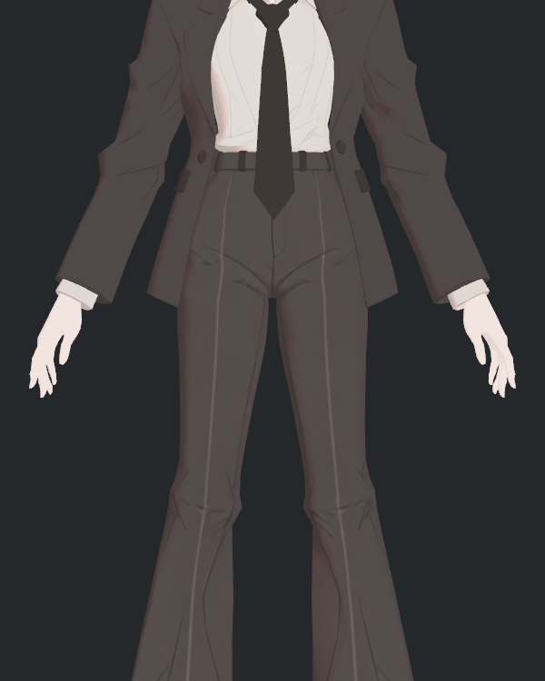
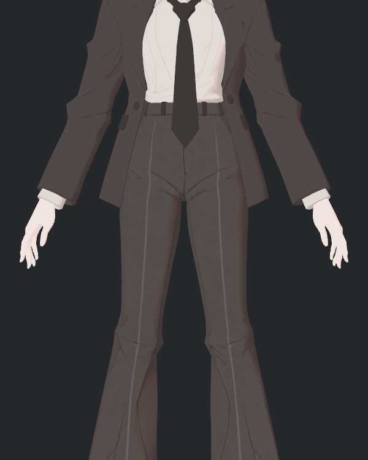

> **기록 시점 안내:** 아래는 해당 단계 당시의 보고서입니다. 후속 결정은 [최신 상태](../../../../../STATUS.md)를 기준으로 읽어주세요. 모델·원본 텍스처·검증 원시 데이터는 이 문서 공유본에 포함하지 않습니다.

# v353 양손 중간 크기 수정 2장 독립 검수

두 광원 사진을 직접 확인했다. 양손과 손가락 끝이 모두 화면 안에 있고 허벅지에 가려지지 않는다. 기존 손 자세와 NPR 재질을 유지한 화면 점유율 표본으로 유효하다. 확대 피부 디테일이나 실제 mip LOD 계측까지 의미하지 않는다.

`FINAL42_PROVENANCE.json`의 기존 40장+수정 2장 모두 SHA 재검산 불일치 0이다. 원본·장면 보존도 통과했다. 이전의 잘린 2장과 원본 보고서는 보존한다. 최종 표본 42장 중 코트 안쪽 밑단 4장의 부분 가시성 제한은 계속 유효하며, 이 손 사진 수정이 전체 안감 검수 완료를 뜻하지 않는다.
