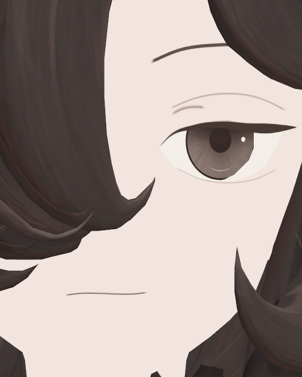
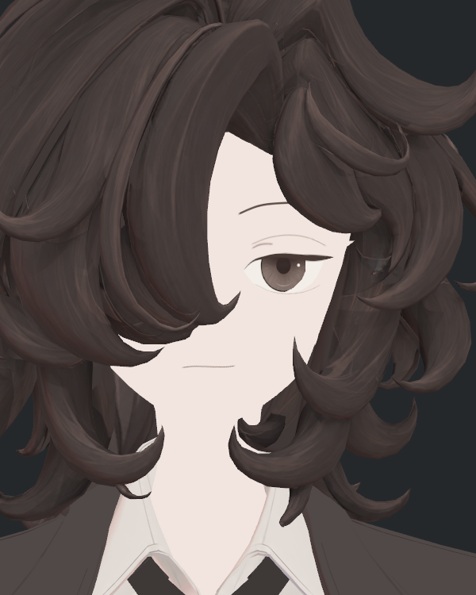
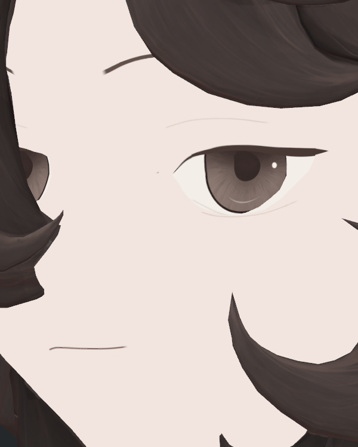
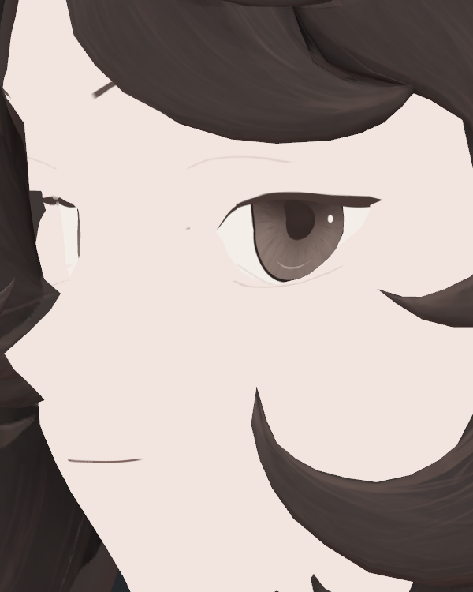
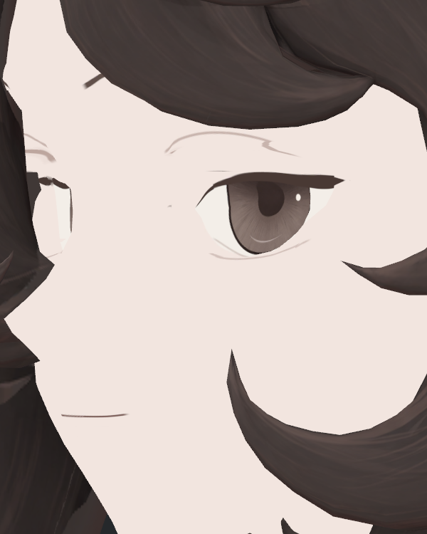
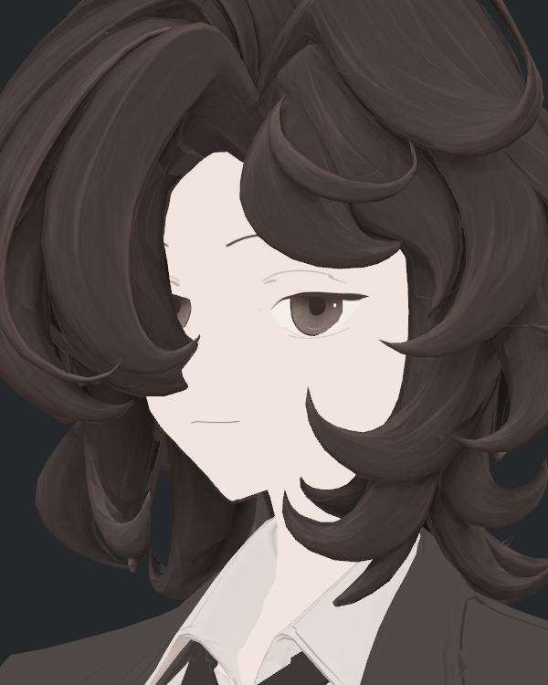
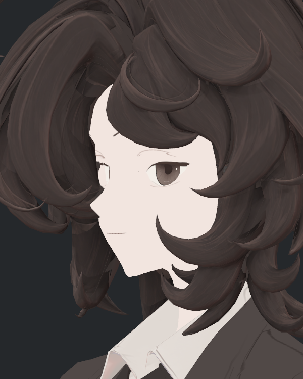

> **기록 시점 안내:** 아래는 해당 단계 당시의 보고서입니다. 후속 결정은 [최신 상태](../../../../../STATUS.md)를 기준으로 읽어주세요. 모델·원본 텍스처·검증 원시 데이터는 이 문서 공유본에 포함하지 않습니다.

# v353 눈꺼풀 복원 face8 독립 검수

**face8은 눈꺼풀 표현을 되살렸지만, 사선에서 새 꺾임·잔선이 보여 미채택이다.** 실제 Unity의 face7/face8 12장 전부를 직접 열어 보았다. 6쌍의 기하·카메라·광원·자세 일치 관문, 원본·후보·장면 보존과 사진 12개 SHA 재검산을 확인했다. 불일치 0이다.

## 복원된 부분

정면 근접과 중간 크기에서 긴 주접힘선과 짧은 안쪽 보조선이 다시 구분된다. v352의 ‘눈꺼풀 구조가 읽히는 요소’는 돌아왔으며 face7처럼 선이 사라져 보이지 않는다. 현재 색은 v352보다 평탄하고 깨끗하며 원래의 번짐 전체를 복원하지 않았다.

주접힘 .62/반폭0.18mm, 안쪽 보조 .74/0.26mm는 사전 최소 제안보다 강하지만, **정면 사진만 보면 눈썹 같은 검정 띠나 과한 이중 아이라인으로 보이지 않는다.** 속눈썹 약25% 보강과 아래선 .48/0.12mm도 이 구도에서 과장됐다고 판단하지 않았다. 홍채·동공·반사·입은 유지된다. 미채택 사유는 강도가 강하다는 추측이 아니라 아래의 실제 사선 결함이다.

|face7|face8|
|---|---|
|||
|||

## 새 사선 결함

35° 근접에서 긴 선 외측 약 **x447/y200**에 꺾인 덩어리가 생겼다. 55°에서는 약 **x375/y204**에서 계단 모양으로 더 뚜렷하며 중간 크기에도 남는다. 좌표는 원본 600×750 사진의 좌상단 기준 대략 위치다. 의도된 눈꼬리 끝은 아래 속눈썹이고, 지금 지적한 것은 그보다 위의 주접힘선이다.

추가로 주속눈썹 바로 위에 **짧고 거의 수평인 분리 잔선**이 있다. 35°에서는 대략 x344~426/y236~243, 55°에서는 x295~327/y237~244다. face7의 같은 구도에는 보이지 않는다. 짧은 안쪽 보조선과 위치·형태가 다르므로 의도된 보조선으로 합격 처리하지 않는다.

|face7|face8|
|---|---|
|||
|||
|||
|||

## 원인과 다음 판정 범위

사진으로 새 결함의 존재와 위치는 확인됐다. 높인 곡선이 기존 분할/깊이층을 가로질러 중복 전사됐다는 설명은 타당한 가설이지만 이 검토에서는 면별 광선/UV 기여를 분리하지 않았다. 기하나 UV 자체가 바뀌어 생긴 회귀라고 단정하지 않는다. 동일 기하에서 새 채색을 연결할 때 발생한 표시 문제다.

후속 face9는 원래 face7의 곡선 경로를 보존하면서 이번에 되살린 읽힘을 유지하는 방향으로 검수한다. 주접힘을 다시 희미하게 지워서 계단이 안 보이게 만드는 것은 사용자 요구 해결이 아니다. **외측 계단뿐 아니라 아래쪽 분리 잔선도 함께 사라져야 한다.** 기존 홍채/눈매, 짧은 안쪽 보조선, 아래눈꺼풀의 과하지 않은 표현을 보호한다.

이번은 한 광원·보이는 주눈 중심 0/35/55의 근접/중간 표본이다. 반대눈 가림 해제, 반대편 사선·두번째 광원·face9 압축·최종 병합/PC 검수는 포함하지 않았다. 모델·Assets 수정은 하지 않았고 실제 실행 PAIR_REVIEW는 그대로 보존했다.
