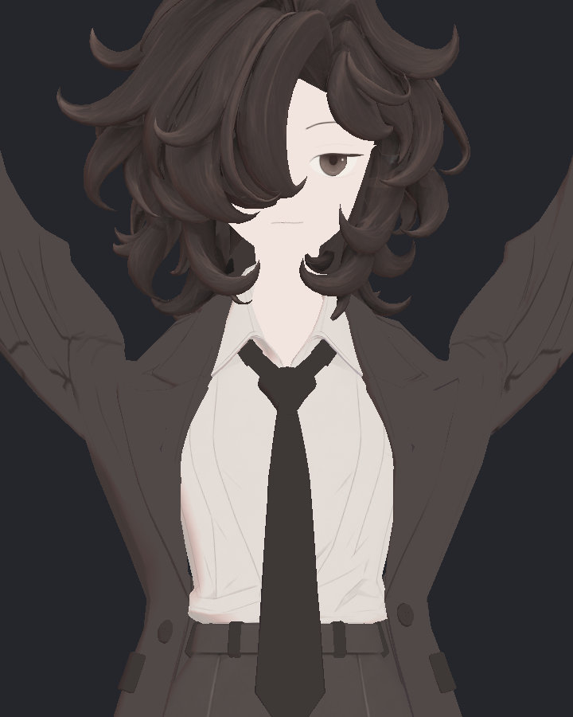
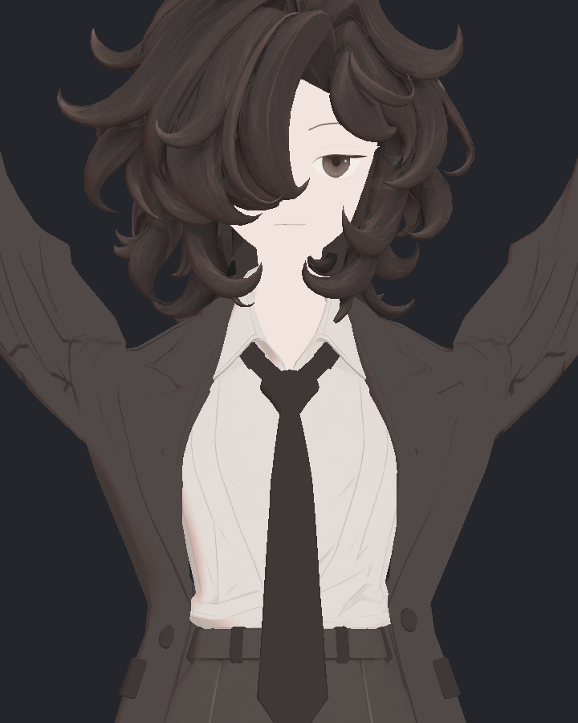
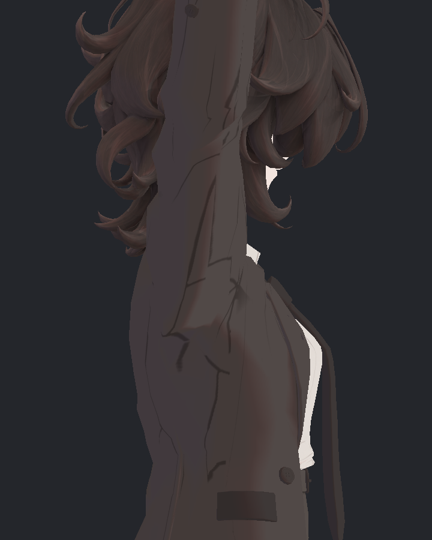
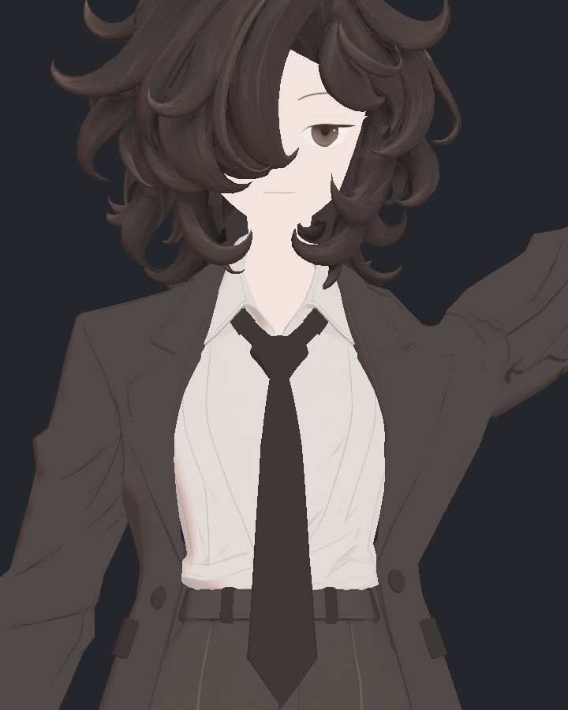
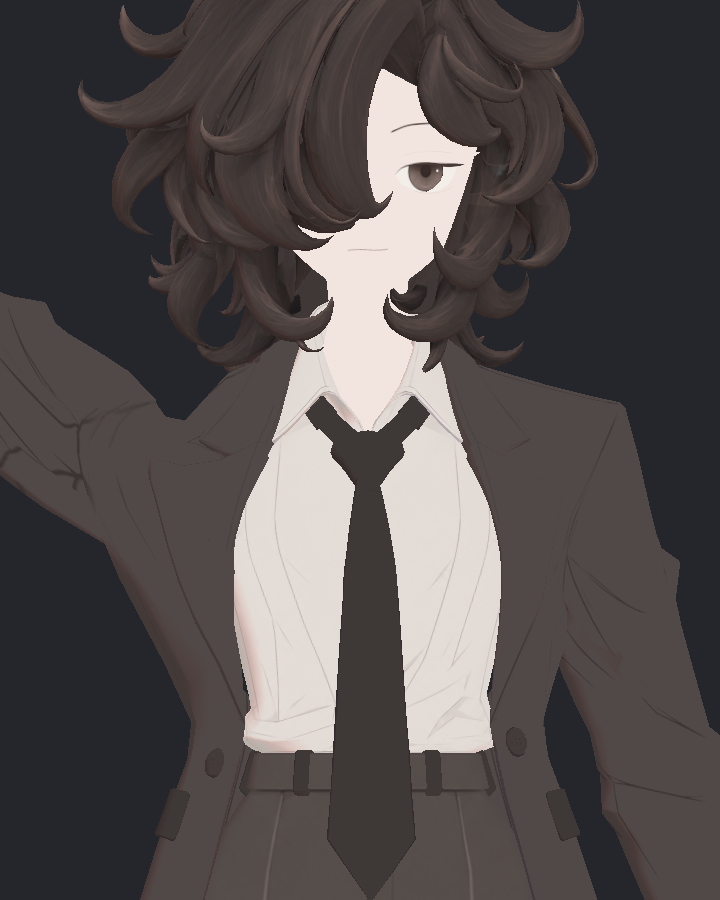
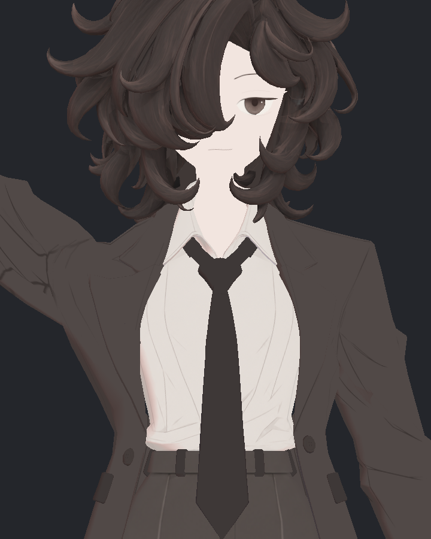

> **기록 시점 안내:** 아래는 해당 단계 당시의 보고서입니다. 후속 결정은 [최신 상태](../../../../../STATUS.md)를 기준으로 읽어주세요. 모델·원본 텍스처·검증 원시 데이터는 이 문서 공유본에 포함하지 않습니다.

# v353 어깨 Packet50 실제 SDK 540 독립 검토

**실제 SDK 기하·접촉 검사와 보완 baked 56장 직접 검토에서 어깨 U자 함몰의 부분 개선을 확인했다. 과도하게 둥글어지는 회귀는 보이지 않는다. 다만 177의 새 음의 반구 normal 8코너가 확인되어, 국소 normal 보완 전 최종 채택은 보류한다.** 자동 runtime 구동도 아직 구현하지 않았다. 같은 프레임 native 56장은 외형 비교 증거에서 제외하고 원본 보존했다.

이 문서는 오프라인 예측의 반복이 아니라 부모 Unity 실행이 완전히 종료되고 scene 보존이 확인된 뒤, 실제 저장된 전후 Binary를 독립적으로 다시 분석한 결과다.

## 실제 적용·원본 보존

- 입력 prefab: `Assets/BiancaV353HairAlbedo20/Bianca_v353_HAIR_ALBEDO20_REVIEW.prefab`.
- 후보: `Assets/BiancaV353ShoulderPacket50V4/Bianca_v353_SHOULDER_PACKET50_V4.prefab`.
- 실제 컨트롤러 형식은 **UnityEditor.Animations.AnimatorController**다. 이전 OverrideController 예상은 잘못됐으며 관련 안내를 정정했다.
- Build·재로드 성공, 원래 32키의 모든 vertex/normal/tangent delta, 모든 UV 채널·weights·base positions·면·normals·재질 유지.
- 새 key0 native rest 차이 0, 원본 dependency와 사용자 scene 동일.
- 실제 Blender 사본은 GUI 적용 결과 (공유본 미포함: `v353_SHOULDER_PACKET50_V4_GUI_APPLY.json`)에서 원본 live 복원과 기존 데이터 보존을 확인했다.

## 실제 SDK 측정과 분석

`OnFrameCompleteLate`에서 299 정적 + 121 연속 + 120 복귀 = **540개 실제 입력**을 저장했다. 각 같은 프레임에서 기존 본·Animator 32키는 유지하고, 새 좌우 2키만 0/해당 입력값으로 바꿔 native BakeMesh했다.

기존 보정키는 꺼두지 않았다. 실제 100개 사례에서 기존 16채널의 값이 0이 아니었고 최대 99.99956이었다. 전후 기존 32개 key 값이 전부 같은지도 재검증했다.

| 실제 검증 항목 | 결과 |
|---|---:|
| SDK 저장 완료 | 540 / 540 |
| 중립 hip/knee/elbow 각도 차이 | 좌우 모두 0° |
| 새 키가 켜진 입력 | 62, 80, 177 |
| 변경 raw / Unity 정점 | 123 / 315 |
| 영향 Coat 삼각형 | 335 |
| actual177 최대 이동 | 8.665442 mm |
| 새 비공면 교차 사례 / 쌍 | 0 / 0 |
| 새 90° 초과 면 방향 회귀 | 0 |
| 새 퇴화 삼각형 | 0 |
| 315점 밖 Coat 변화 | 0 mm |
| 현재 BodyHair 변화 | 0 mm |
| key0 rest 변화 | 0 mm |
| 원본·입력·사용자 scene 보존 | 전부 통과 |

현재 BodyHair의 실제 27,850삼각형을 사용했다. 기존 눈 100면 정리 후의 geometry를 옛 v352 BodyHair index로 잘못 대조하지 않았다.

actual177의 최소 면적비는 같은 원래 자세 대비 0.268344, 최소 법선 방향 dot은 0.339484다. 회귀 관문은 통과했지만 일부 전이 면의 압축·회전은 크므로 실제 조명과 근접 외형 검토가 필요하다.

## 실제 처짐 개선과 남은 정도

actual SDK frame2493의 저장 좌표를 사용했다. 수치는 경로 양끝 chord 아래의 최대 Y 처짐이며 화면상의 전체 실루엣 점수는 아니다.

| 연결 경로 | 실제 전 | 실제 후 | 감소 |
|---|---:|---:|---:|
| Unity R 뒤 | 17.331 mm | 8.665 mm | 50.0% |
| Unity L 뒤 | 16.339 mm | 8.170 mm | 50.0% |
| Unity R 앞 | 16.487 mm | 11.293 mm | 31.5% |
| Unity L 앞 | 16.626 mm | 11.362 mm | 31.7% |

앞쪽 좁은 접힘을 같은 이동으로 보존했기 때문에 앞 경로의 실제 감소는 약 32%다. ‘양쪽 모든 처짐을 절반으로 해결했다’고 쓰면 안 된다. 뒤 경로의 전체 선분 길이는 오른쪽55.076→43.056 mm이므로 눌림이 남는지 확인해야 한다.

## 기존 native 56사진을 제외한 이유

56장이 생성됐지만 전후 키를 **같은 Unity 프레임에서 같은 renderer에 연속 적용**했다. actual177 Binary에서는 315점이 8.665 mm까지 변하는데, 정면 확대 PNG는 전후 66픽셀만 다르고 최대 RGB 차이가 3이었다. 측면 확대는 23픽셀/최대1이었다. 두 이미지의 실제 형상 변화가 저장 좌표의 변화와 맞지 않는다.

177 정면/측면 확대 4장을 직접 보고 이 문제를 확인했고, 전체 28쌍의 픽셀 차이도 읽기 전용으로 계산했다. **동일 프레임 GPU skinned rendering cache가 의심되며 정확한 내부 원인은 별도다.** 이 이미지들을 보고 ‘수정 효과가 없다’거나 ‘외형이 좋아졌다’고 결론 내리지 않는다. Binary 좌표는 실제로 다르므로 수치 검증과 사진 실패를 구분한다.

기존 56사진 차이 기록 (공유본 미포함: `v353_NATIVE_PHOTO_CACHE_CHECK.json`)에 파일별 SHA와 차이를 보존했다. 원본 사진은 덮어쓰지 않는다.

보완 도구 MacV353ShoulderPacketBakedViews.cs (공유본 미포함: `MacV353ShoulderPacketBakedViews.cs`)는 실제 SDK 저장 world 정점·world normal을 그대로 넣은 두 개의 별도 static mesh를 쓴다. transform은 identity이고 현재 UV·원래 재질·현재 삼각형을 유지한다. **이 사진은 static baked 비교이며 native GPU skinning 사진이라고 부르지 않는다.** 새 buffer를 별도로 만들고 177 확대 픽셀 변화 관문을 넣었다. 부모가 실제 실행해 56장과 source/scene 보존을 기록했고, 리뷰어는 7자세 × 4구도 × 전후의 56장을 전부 직접 열었다. 아래 판단은 이 새 사진에만 근거한다.

## 보완 baked 56장 직접 판단

177 정면 확대에서 목 옆–소매 위의 깊은 U자 바닥이 올라가고 양쪽 경사가 더 연속적으로 보인다. 62/80 한 팔 올리기에서도 같은 쪽 함몰이 얕아진다. 어깨를 둥근 덩어리로 부풀리거나 소매 전체 굵기를 바꾸는 회귀는 이 구도에서 보이지 않는다. 다만 U 바닥의 짧은 평평한 구간과 작은 모서리는 남는다. 완전한 곡면 해결로 표현하지 않는다.

| 실제 SDK 표면을 고정해서 촬영 | 전 | 후 |
|---|---|---|
| 177 양팔 올리기 정면 확대 |  |  |
| 177 측면 확대 |  |  |
| 62 한 팔 올리기 |  |  |
| 80 반대 팔 올리기 |  |  |

177 정면 확대는 RGB 차이 8 초과 2,257픽셀, 최대45로 실제 형상 변화가 나타난다. 177 측면 확대는 21픽셀만 차이 8을 넘는다. 측면 소매 두께와 기존 주름선이 거의 같은 것은 현재 보정 방향·가림 관계와 맞는다. 62 측면은 반대쪽 팔에 가려져 효과 판단 구도로 적절하지 않다.

0/178/180/539는 새 키0으로 원래 표면과 같은 자세다. 사진에서도 새 어깨 변화나 팔꿈치 회귀는 보이지 않는다. 기존 측면의 넓은 음영판·강한 주름 선은 양쪽에 똑같이 남아 있으며 이 보정의 신규 결함으로 분류하지 않았다. 픽셀 차이 0~8은 별도 static renderer의 작은 raster 차이로, Binary 기하는 정확히 같다.

촬영 결과 (공유본 미포함: `REVIEW.json`)는 실제 SDK world 좌표/normal을 고정한 **static baked** 표면 검수다. GPU native skinning, 다른 조명·뒤/사선·연속 움직임 및 물리 검수로 확대하지 않는다.

## 추가 normal 진단: 새 8코너 보완 필요

면의 전후 방향 dot 양수는 삼각형이 뒤집히지 않았다는 관문이다. **기존 shading normal과 새 기하 normal의 관계는 별개**다. 실제 저장된 source/candidate world normal을 영향335삼각형에 대조하니 177에서 8코너가 양수→음수로 넘어갔다. 62/80은 신규 음수0이다.

- actual triangle/Unity vertex: 94/1797, 97/1802, 309/1936, 314/1946, 1058/921, 1764/2707, 1784/1158, 2579/3180.
- 가장 큰 새 변화는 tri97/vertex1802: +0.4980→−0.4863이다.
- 기존 음수 코너도 원래 존재하므로 전체 최저 음수값을 전부 이번 회귀로 세지 않았다.
- 이번 재질·광원 사진에 새 큰 얼룩이 뚜렷하지 않아도 합격으로 무시하지 않는다. 새 키의 normal delta=0인 상태를 국소 fan/키 normal 보완 후보와 비교해야 한다. 기존 key0 normal·다른 키·UV·형상은 보존한다.

실제 normal 반구 진단 (공유본 미포함: `v353_PACKET_ACTUAL_NORMAL_HEMISPHERES.json`). 이 보충 JSON은 raw 아카이브 입력 열거 후 생성됐으므로 아래 아카이브 안의 파일이라고 주장하지 않는다.

## 검증 한계와 다음 판정

- 기존 앞판 R9/L10 패킷은 같은 세계 이동이며, 바깥 123 raw 범위는 연결 보간이다. 기존 base vertices를 바꾸거나 새 면을 만든 것은 아니다.
- 뒤목 고정 28 raw는 이동0. 전체 코트 체적·모든 단면 두께를 보존했다는 뜻은 아니다.
- 교차 검사는 영향335삼각형 대 전체 현재 Coat/BodyHair의 비공면 교차 선분 0.05 mm 초과 기준이다. 같은 welded 점을 공유하는 면은 제외했다.
- 공면·공유점을 가진 비정상 인접 면·연속 swept collision·관통 깊이·임의 키 조합은 미검증이다.
- 540개 가운데 새 키는 3입력에만 켜진다. 다른 537개는 0이며 그때 원래 표면과 동일하다. 모든 어깨 각도에서 광범위하게 효과를 검증한 것은 아니다.
- 새 key normal/tangent delta는 0이다. 기존 normals 보존이 새 변형에서의 조명 품질 합격을 뜻하지 않는다.
- 새 키 값은 측정 도구가 명시적으로 넣었다. 실제 automatic controller/Contacts 방향 gate/VRChat 클라이언트 완료가 아니다.

형상 후보는 개선 방향으로 보존한다. 다음은 새 8코너 normal의 국소 보완과 실제 재촬영이다. 수치 통과나 평탄한 조명이 문제를 덜 드러낸다는 이유만으로 자동 통합하지 않는다.

## 실제 증거

- actual540 독립 분석 코드 (공유본 미포함: `analyze_packet50_native_v1.py`)
- actual540 기하·접촉 결과 (공유본 미포함: `v353_PACKET_ACTUAL_GEOMETRY_REVIEW.json`)
- 실제 교차 상세 (공유본 미포함: `v353_PACKET_ACTUAL_CONTACTS.json`)
- 실제 경로 좌표 측정 (공유본 미포함: `v353_PACKET_ACTUAL_PATHS.json`)
- actualSDK 실행 완료 (공유본 미포함: `v352_RUN.json`)
- 원본·영역 밖 보존 (공유본 미포함: `v353_PACKET_ACTUAL_GATES.json`)
- 사용자 scene 보존 (공유본 미포함: `SCENE_PRESERVATION.json`)
- 실제 Build와 controller 형식 (공유본 미포함: `v353_SHOULDER_PACKET50_V4_UNITY_BUILD.json`)

검사 종료 raw와 당시 JSON 4,524항목을 8파트로 압축 보관했다. 압축 내부 전 항목 SHA와 압축 후 원본 SHA 4,524개가 모두 같고, 원본 삭제는 0이다. 원본 합계 1,065,030,267바이트, 압축 합계 694,259,540바이트이며 각 파트는 90,000,000바이트 이하이다. 아카이브 검증 결과 (공유본 미포함: `v353_ARCHIVE_REPORT.json`), 복원 안내 (공유본 미포함: `v353_README.md`). 새 normal 보충 JSON과 나중 촬영된 baked 사진은 이 raw 아카이브 대상 밖이며 별도로 보존한다.
