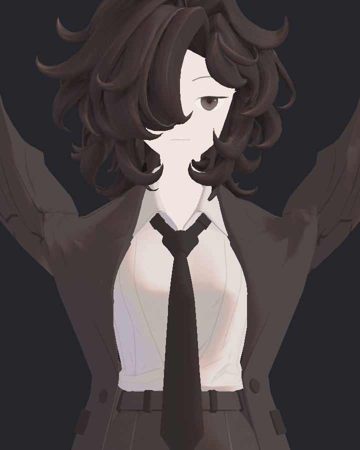
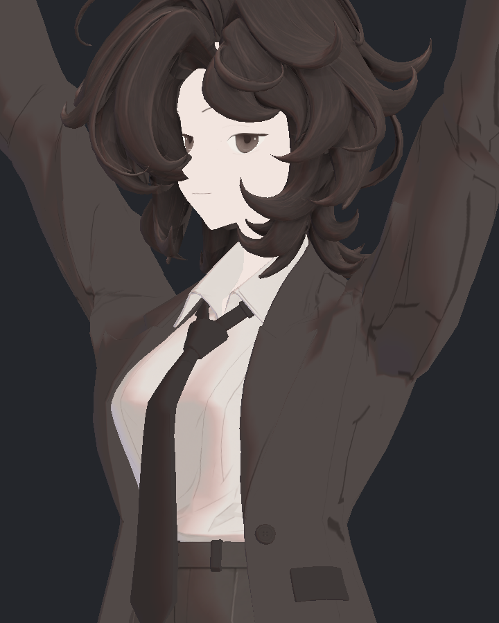
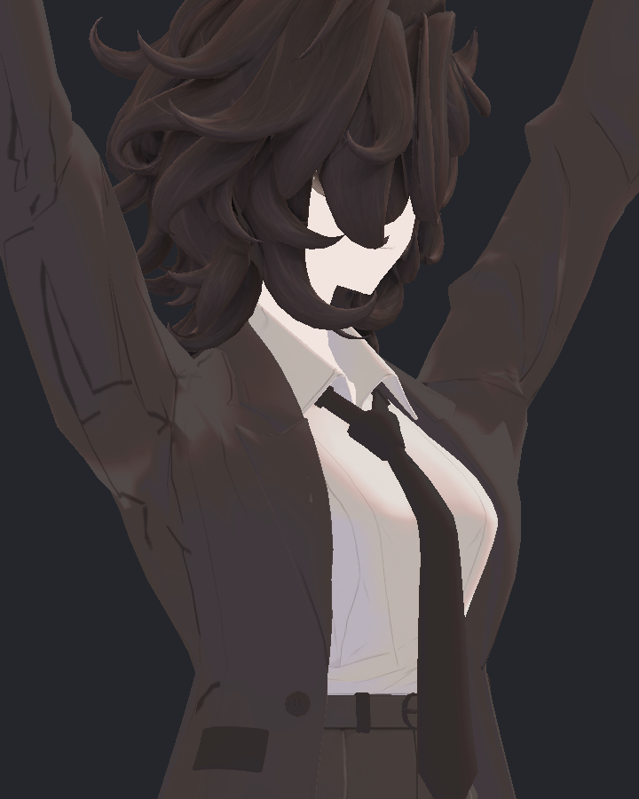

> **기록 시점 안내:** 아래는 해당 단계 당시의 보고서입니다. 후속 결정은 [최신 상태](../../../../../STATUS.md)를 기준으로 읽어주세요. 모델·원본 텍스처·검증 원시 데이터는 이 문서 공유본에 포함하지 않습니다.

# v353 Packet50 국소 normal 보완 후보

**형상 보정은 유지하고, 새로 음의 반구에 들어간 8코너의 shading normal을 기존 분리점 27개에서 보완하는 후보를 준비했다.** 실제 540 저장 기하를 사용한 오프라인 예측을 통과했고, V2 Unity Build·재로드·원본 보존·key0 native P/N/T exact도 실제 확인했다. 새 SDK540 및 조명사진 검수는 진행 중이다. 원래 base normal과 기존 32개 보정키는 수정하지 않는다.

## 원인과 실제 위치

기하의 전후 normal dot이 양수여도, 기존 shading normal이 변형 후 면에 맞지 않을 수 있다. Packet50은 원래 키·normal을 보존한 채 위치 delta만 추가했으므로 연결 띠가 회전하는 177에서 이 문제가 생겼다. 기존 4-weight LBS와 실제 본 행렬로 native normal을 다시 계산한 오차는 최대 2.074e−7이었다. 축/단위/노멀맵 착오가 아니라 새 위치 변형과 기존 N의 불일치가 근거다.

| 실제 삼각형 / Unity 점 | 원래 raw / polygon | 전 dot | 위치만 보정 후 dot |
|---|---|---:|---:|
| 94 / 1797 | 97 / 94 | .3104 | −.1040 |
| 97 / 1802 | 155 / 97 | .4980 | −.4863 |
| 309 / 1936 | 390 / 310 | .3100 | −.1047 |
| 314 / 1946 | 491 / 315 | .5041 | −.4527 |
| 1058 / 921 | 921 / 745 | .9281 | −.0161 |
| 1764 / 2707 | 136 / 1100 | .0904 | −.0420 |
| 1784 / 1158 | 1158 / 1110 | .2336 | −.0294 |
| 2579 / 3180 | 1487 / 1509 | .9278 | −.0325 |

UV, 원래 위치, 모든 alias와 인접 삼각형은 정확 대응 자료 (공유본 미포함: `v353_PACKET_NORMAL_CORNER_PROVENANCE.json`)에 있다. 이 숫자는 Coat의 실제 현재 Unity 삼각형 순서이며 BodyHair index와 혼용하지 않는다.

## 시도와 미채택 사유

1. **V1/V2: 같은 위치·N·weight alias 모두 공통 회전.** 새 음수 제거와 기존 음수 비악화를 함께 제약했다. raw97/390에서 해를 찾지 못했다. V2는 결정적 seed의 49 시작점으로 재시도했으나 통과 후보가 없었다. 최적화 실패를 수학적 불가능 증명으로 확대하지 않는다. 로그와 별도 fan 결과를 보존했다.
2. **V3: 모든 alias 공통 회전, 기존 음수 비악화 조건 제거.** 새 음수8→0이나 raw97의 원래 안쪽면 dot −.2521→−.3758, raw390 −.2849→−.3951로 악화했다. 새 음수의 수만 줄였다고 채택하지 않는다.
3. **V4: 실제 접힌 안쪽·외피의 기존 분리점을 구분.** 바깥 연결 표면의 UV alias를 함께 보정하고, 반대쪽으로 접힌 안쪽 N은 유지한다. 새 정점/면/컷 없이 기존 Unity 분리점의 새 키 N/T delta만 사용한다. 이 후보를 실제 검수 대상으로 준비했다.

raw97의 Unity97은 원래부터 음수인 안쪽 5삼각형이다. 외피의 1797/1799/2237/2325는 같은 delta를 쓴다. raw390은 외피 1934/1936/2997만 함께 보정하고 390/1933/1938/1940은 유지한다. 이 분리는 원래 접힘 경계에서 약6.8°의 새 N 차이를 만들므로 해당 경계의 조명 이음 검수가 필요하다. UV 이음이라는 이유만으로 임의로 서로 다르게 칠한 방식은 아니다.

## V4 변경 범위와 예측 관문

- 기존 raw 8위치, Unity 27분리점(왼10/오른17), 인접46삼각형.
- 원래 base 위치/N/T, 모든 UV, 면, weight, 129본, 기존 32키 P/N/T 변화0.
- Packet50 두 키의 **위치 delta도 그대로**다. 새 키의 normal/tangent delta만 추가한다.
- N은 실제 62/80/177의 기존 fan 제약 안에서 최소 회전 후보를 찾았다. 새로운 음수였던 코너에는 dot .025 여유를 둔다.
- UV 방향마다 다른 tangent는 각각 원래 N→새 N의 같은 짧은 회전으로 운반한다. tangent handedness `w`는 유지한다. 전체 tangent/normal 재계산은 하지 않는다.
- local N 회전: raw155 약32.01°, raw491 29.84°, 나머지2.32–6.84°. ‘전부 미세 조정’이라고 표현하면 안 된다.
- float32 저장값으로 실제540 기하를 다시 평가했다. 새 음수0, 기존 음수 추가악화0, 범위 밖 N delta0. 537입력은 새키0이라 원래 normal이 정확히 같다.
- active3개에는 원래32키 값이0이었다. 다른100입력에 나타나는 원래 키는 모두 그대로이며 새키가0이다. 원래 키와 새 키의 임의 동시 혼합까지 검증한 것은 아니다.

예측 JSON (공유본 미포함: `v353_PACKET_NORMAL_KEY_PROPOSAL_V4.json`), 계산 코드 (공유본 미포함: `prepare_packet_normal_v4.py`), V2 실패 (공유본 미포함: `v353_PACKET_NORMAL_FAN_SOLVER_V2.json`), V3 비교 (공유본 미포함: `v353_PACKET_NORMAL_KEY_PROPOSAL_V3.json`).

## 부모 GUI 실행 순서

1. `MacV353ShoulderPacketNormalBuildV2.cs`를 설치하고 `MacV353ShoulderPacketNormalBuildV2.Build()` 실행. 기존 normal Build 파일도 Audit 상수 참조용으로 함께 설치하되 실행 진입점은 V2를 쓴다. 별도 `Assets/BiancaV353ShoulderPacket50NormalsV4`를 만들며 source Packet50을 수정하지 않는다. 기존 32키·새2키 위치를 sparse 저장부터 재로드까지 대조하고 native key0 rest P/N/T exact를 검사한다.
2. `MacV353ShoulderPacketNormalAudit.cs` 설치 후 `MacV353ShoulderPacketNormalAuditViews.Begin()`. 새 `native_normal_v4_540`에 실제 SDK 540을 저장한다. 원래 AnimatorController는 유지하고 새키는 제공된 수치로만 구동한다. runtime controller 구현이 아니다. 실패한 같은 프레임 native사진 경로는 비활성화했다.
3. SDK 종료·scene exact 확인 후 `analyze_packet_normal_actual_v1.py` 실행. 실제 새 키 N/T 저장값, 기존 키, 영역 밖 N, 신규 음수·기존 음수 악화, 계산 N과 native N의 일치를 판정한다.
4. `MacV353ShoulderPacketNormalBakedViews.Run()`은 실제 새 SDK의 동일한 keyON 위치를 양쪽에 쓰고, 같은 프레임 key0 N / keyON N만 다르게 써서 비교한다. 정면·좌우45° × 광원3방향 × 활성3자세 × 전후 = 54장. **static baked N 비교**이며 GPU native사진으로 부르지 않는다. 머리·피부를 숨기거나 재질을 평탄화해 문제를 가리지 않는다.

원본 자료·실행 파일의 SHA는 helper manifest (공유본 미포함: `v353_PACKET_NORMAL_HELPERS_MANIFEST.json`)에 있다. 전달 뒤 helper를 수정해야 하면 새 파일로 버전을 올린다. 실제 결과는 기존 예측 문서를 덮어쓰지 않고 별도 actual JSON과 사진으로 보완한다.

## 실행 전 API 수명 검토

부모의 API 검토 지적에 따라 아직 실행하지 않은 Build/Audit의 `GetBonesPerVertex`·`GetAllBoneWeights` 반환값에 대한 `Dispose()`만 제거하고 SHA를 다시 동결했다. 반환 배열은 메시 소유 메모리를 참조한다. Unity2022.3 공식 설명과 해당 버전 참조 소스에서 `Allocator.None`을 직접 확인했다. 과거 실행 helper는 증거 보존을 위해 고치지 않았다. [공식 GetBonesPerVertex 설명](https://docs.unity3d.com/2022.3/Documentation/ScriptReference/Mesh.GetBonesPerVertex.html), [Unity2022.3 Mesh 구현](https://github.com/Unity-Technologies/UnityCsReference/blob/2022.3/Runtime/Export/Graphics/Mesh.bindings.cs).

실행 전 sparse 저장 판별도 V2로 보완했다. Unity의 `Vector3 != zero` 근사 비교를 성분 exact `Equals`로 바꾸어 아주 작은 기존 위치 delta도 누락하지 않는다. 원래 전달 Build는 수정하지 않고 별도 V2 파일을 만들었다.

이후 확인된 실제 GUI 실행에서는 V1 Build가 `Key geometry changed 32`로 저장 전 거부됐다. 오프라인으로 같은 근사zero 선택식을 대조하면 좌31점·우23점의 작은 위치 delta가 누락돼 원인이 일치한다. 출력 폴더가 생성되지 않은 것도 읽기 전용 확인했다. 실제 실패 기록 (공유본 미포함: `v353_PACKET_NORMAL_BUILD_FAILURE_V1.json`). V2는 이를 성분 exact 비교로 해결하는 별도 실행 파일이며, 위치 동일성 관문을 완화하지 않는다.

실제 V2 Build는 성공했다. 새 N 사본 Build 결과 (공유본 미포함: `v353_PACKET_NORMAL_UNITY_BUILD_V4.json`)에서 원래32키 P/N/T·새2키 위치·원래 base/UV/weights·source hash·재로드와 native key0 rest P/N/T exact를 확인했다. 실제 controller는 AnimatorController로 유지됐다. posed SDK540 통과는 별도 후속 결과로 판정한다.

## 실제 SDK 첫 실행 실패와 178기록의 검증 범위

새 normal 사본의 첫 실제 SDK 실행은 178기록에서 `No SDK callback for 20 seconds`로 종료됐다. 원본·장면 보존은 확인됐지만 **전체540 통과가 아니다.** 실패 폴더와 실행 helper는 그대로 보존했다. 실패와 파일 시각 근거 (공유본 미포함: `v353_NORMAL_WATCHDOG_FAILURE_REVIEW.json`).

이미 저장된 178기록에는 새 키가 켜지는 62·80·177이 모두 포함된다. 실제 native N을 독립 계산과 대조하면 세 자세 모두 신규 음수0·기존 음수 추가악화0·27점 범위 밖 N 변화0이다. 177의 보정 코너 최솟값은 dot .0249999, 예상 N과 실제 N의 최대 오차는 2.1e−7 미만이다. 원래32키 P/N/T와 새2키 위치도 정확히 유지됐다. 이것은 **부분 실제 검증**이며 나머지362기록 또는 조명 사진 검수를 대체하지 않는다. 178기록 결과 (공유본 미포함: `v353_PACKET_NORMAL_PARTIAL178_REVIEW.json`).

기존 watchdog는 SDK 함수 진입과 같은 프레임 조건을 만족한 Capture를 구분하지 않았다. 자체 동기식 저장과 Editor 정지 시간도 벽시계 차이에 들어갔다. 다만 마지막177 raw파일의 관측 저장 간격은 약1.74초이므로, 파일 저장만으로20초를 썼다고 단정할 근거는 없다. 종료 뒤 장면 복원 비용도 종료 전 SDK 중단의 원인으로 사용할 수 없다.

별도 V2는 실제 SDK 진입, 프레임 조건을 만족한 이벤트, 자체 Capture 시간, 긴 Editor Update 간격을 각각 기록한다. 자체 작업 시간을 제외하고 응답 가능한 Update 시간20초 관문을 유지한다. SDK 이벤트를 타이머로 대신 만들거나 샘플을 복제하지 않는다. 새로운 `native_normal_v4_540_v2`를 사용하며 실패 폴더는 덮어쓰지 않는다.

후속 실행 파일은 NormalAuditV2 (공유본 미포함: `MacV353ShoulderPacketNormalAuditV2.cs`)의 `MacV353ShoulderPacketNormalAuditV2Views.Begin()`, 완료 뒤 분석은 actual_v2 (공유본 미포함: `analyze_packet_normal_actual_v2.py`), 실제 기하/N 기반54장 조명 비교는 NormalBakedViewsV2 (공유본 미포함: `MacV353ShoulderPacketNormalBakedViewsV2.cs`)의 `Run()`이다. 새 helper는 문법 구조/경로만 오프라인 점검했고, 실제 엔진 컴파일과 실행은 별도 확인한다.

## 새 V2의 실제540 검증

V2는 실제 SDK540기록을 완료했고 원본·장면 exact를 확인했다. 실제 SDK 진입과 qualified 이벤트는 각각4427회로 일치했으며, 계측된 긴 Editor 정지 구간은0이었다. 이는 새 실행의 결과이고 과거178 중단의 정확한 원인을 소급 확정하지 않는다.

원래 base/UV/weights·32키 P/N/T와 새2키 위치가 정확히 유지됐다. 활성62·80·177 모두 새 음수 N0·기존 음수 추가악화0, 나머지537기록은 새키0이며 N이 정확히 같았다. 수정범위 밖 N 변화0, native N과 독립 계산 최대오차2.1e−7 미만이다. actual540 normal 결과 (공유본 미포함: `v353_PACKET_NORMAL_ACTUAL_REVIEW.json`).

새 normal 실행의 전후 코트/BodyHair 위치 배열2160개도 이전 실제 geometry-only540과 모든 성분이 정확히 일치했다. 따라서 이전 새교차0·면적/기하방향 관문에 사용한 실제 기하가 바뀌지 않았다. 실제 위치 동일성 (공유본 미포함: `v353_NORMAL_RUN_POSITION_EQUIVALENCE.json`). 조명 미관과 실제 runtime controller의 자동 구동은 여전히 별도 검수다.

## 실제 조명54장 직접 검토

62·80·177의 정면/좌우45°와 세 광원, 전후54장을 모두 직접 열어 확인했다. 기하는 동일하며, N 보정으로 어깨 연결부의 국소 명암만 조금 달라진다. 새 큰 검은 쐐기, 둥글게 부풀어 보이는 조명, 새로 도드라지는 외피 UV 이음은 이 구도들에서 발견하지 못했다. 정면 평탄한 광원에서는 차이가 거의 보이지 않으므로 사진만으로 normal 보정을 증명하지 않고 앞의 실제 N 반구/범위 검증을 함께 사용한다.

옆구리와 셔츠에 보이는 넓은 명암 및 기존 접힘은 전후 모두 남는다. 이27점 국소 N 작업으로 전신 셰이딩이 해결됐다는 뜻은 아니다. 어깨 U자 기하 완화는 이전 geometry-only 사진으로, 이번 명암 변화는 동일 기하의 N-only 사진으로 구분한다. **현재 N_V4를 runtime 통합 검수 후보로 권고**한다. 실제 자동 구동과 임의 복합자세는 후속이다. 54장 검수/픽셀/해시 기록 (공유본 미포함: `v353_NORMAL_VISUAL_REVIEW.json`).

| 실제177·왼쪽 광원 | normal 보정 전 | normal 보정 후 |
|---|---|---|
| 정면 |  |  |
| 왼45° |  |  |
| 오른45° |  |  |

사진은 실제 SDK 저장 위치·N을 사용한 static baked 표면이다. GPU SkinnedRenderer 연속 표시 검증으로 부르지 않는다.
