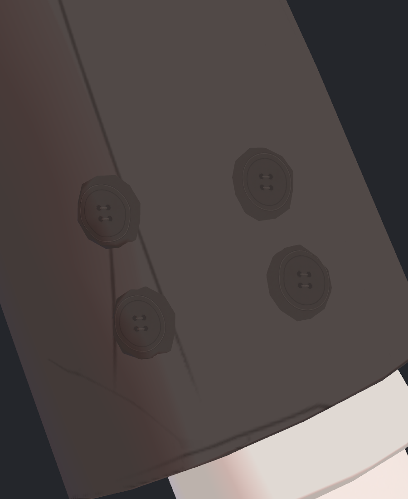
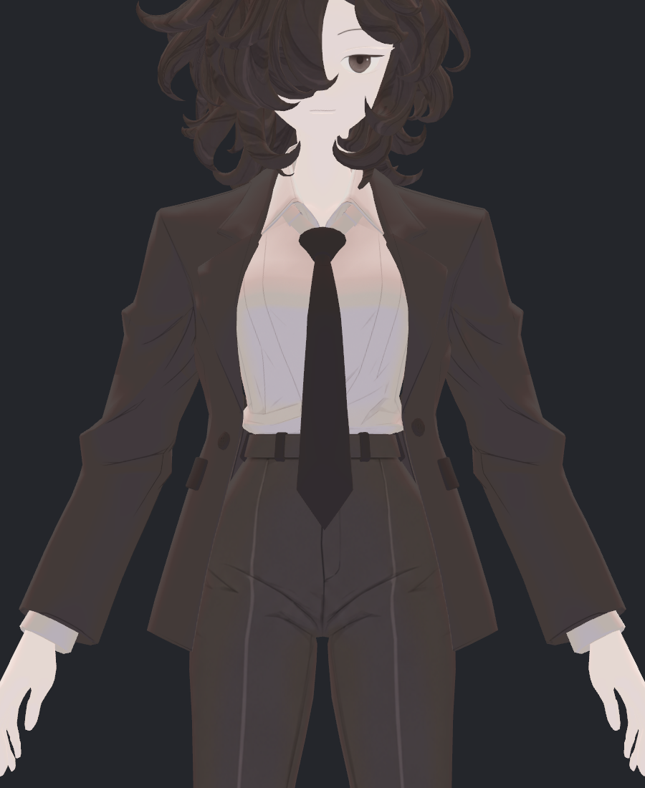
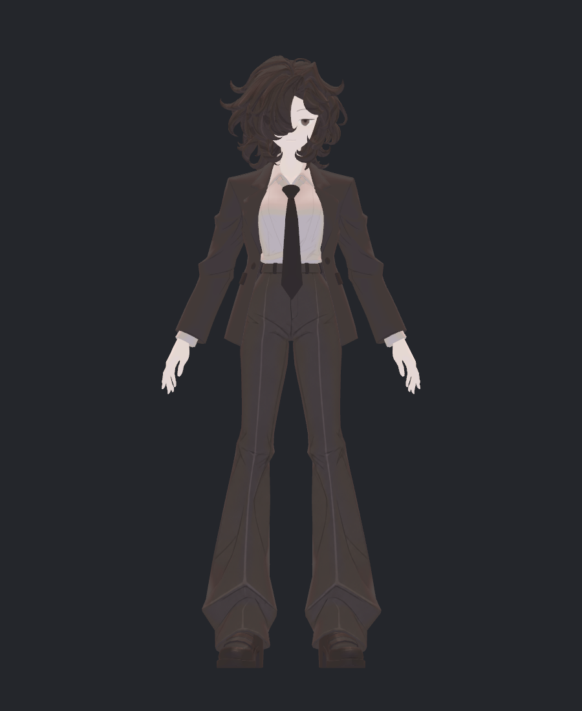
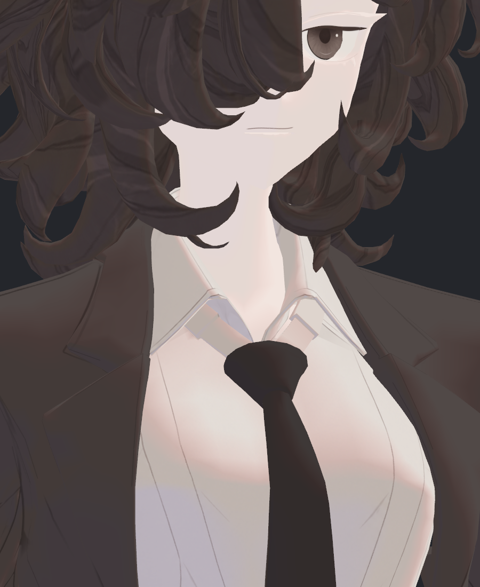

> **기록 시점 안내:** 아래는 해당 단계 당시의 보고서입니다. 후속 결정은 [최신 상태](../../../../STATUS.md)를 기준으로 읽어주세요. 모델·원본 텍스처·검증 원시 데이터는 이 문서 공유본에 포함하지 않습니다.

# v353 단추 노멀32장 독립 재검토

**기본 통합은 FIXED_N_NO_MAP을 권고한다.** 실제 단추 표면을 향한 근접3광원, 목깃3광원, 코트·전신의 네 후보32장을 모두 직접 확인했다. .35 노멀맵은 근접 옆광에서 고리와 구멍 가장자리에 아주 작은 깊이감을 더하지만, 기존 원화의 네 구멍·연결 실·이중 원형 디테일은 맵을 꺼도 유지된다. .35/.65는 선택 비교본으로 보존할 가치가 있고 현재 기본값으로 필요한 개선은 아니다.

## 실제 촬영 조건

CAPTURES.json (공유본 미포함: `CAPTURES.json`)의 단추 구도는 실제 버튼 삼각형 좌표를 기준으로 향한다. 앞선 단추가 충분히 드러나지 않았던 구도를 품질 검증으로 재사용하지 않았다. 실제 SkinnedRenderer, MSAA4, 같은 포즈·재질·텍스처를 사용했다. 이 비교의 기하 출발점은 원래 MONO65 사본이다. 이후 EYE_ONLY268 통합 기하의 전신 검수 사진으로 혼동하지 않는다.

| 같은 좌광: 국소 N수정, 맵 OFF | .35 | .65 |
|---|---|---|
|  |  |  |

단추의 실제 다각형 바깥 실루엣은 네 후보 모두 같다. 노멀맵은 그 외곽을 원형으로 재설계하지 않는다. 원형 고리와 네 구멍은 채색 디테일이고 맵 OFF에서도 선명하다. 이 범위에서 새로 크게 꺾인 색 쐐기나 얼룩이 생긴 것은 보이지 않았다. 왼쪽광 .35는 고리의 일부 밝기만 약하게 달라져 원본 이미지 토글 비교에서도 효과가 작다.

## 거리와 비용 대비 판단

| 코트 거리 OFF | 코트 거리 .35 |
|---|---|
|  |  |

| 전신 OFF | 전신 .35 |
|---|---|
|  |  |

실제 픽셀 비교 (공유본 미포함: `PIXEL_COMPARISON.json`)에서 .35와 OFF 차이는 단추 좌광 최대7/255·우광3/255·정면1/255다. 코트와 전신은 최대1/255이며 직접 검수에서 새 깊이감의 이득을 구별하기 어렵다. .65는 좌광 최대10/255지만 비용은 .35와 같다. 픽셀 차이의 크기만으로 미관을 점수화하지 않았다.

BUILD.json (공유본 미포함: `BUILD.json`)은 실제 노멀맵4096², BC5/RG_BC5_UNorm,13mips, linear, green flip false, 높이맵 자동변환 false를 기록한다. BC5 4×4 블록16byte로 계산하면 전체13mip의 압축 텍셀 저장량은 약21.33MiB다. 이는 GPU 할당·정렬·CPU복사·스트리밍을 포함한 실측 VRAM이 아닌 포맷에서 계산한 양이다. 단추·얕은 봉제선의 매우 작은 시각 이득을 위해 기본 4K 한 장과 추가 노멀 샘플링을 상시 넣을 근거는 약하다. 실제 최종 전달에서 맵 OFF뿐 아니라 해당맵 참조도 제외해야 불필요한 의존성을 줄일 수 있다.

## 국소 N수정과 노멀맵을 구분

원래 N과 수정 N의 차이도 이번 일반 재질에서는 작다. 이는 인접 면의 잘못 향한 N을 보정한 객관 검사와 별개이며, 사진에서 큰 품질 향상이 있었다고 확대하지 않는다. 수정 N을 유지하고 맵만 끄는 것이 현재 제안이다. 텍스처의 단추 원화나 details8 정합을 되돌리는 제안이 아니다.

| 목깃 우광 맵 OFF | .35 |
|---|---|
|  |  |

넥타이 양옆 카라 안쪽에 보이는 기존 회색 판과 큰 명암 면은 네 후보 모두 남는다. 이 노멀맵의 새 회귀가 아니고 맵을 추가해 해결된 것도 아니다. 얼굴의 흰 아크도 이 그림에서는 이전 local shadow 설정을 사용한 별도 항목이다. 따라서 이32장으로 카라·얼굴·머리 전체나 전체 아바타의 최종 품질을 합격 처리하지 않는다.
