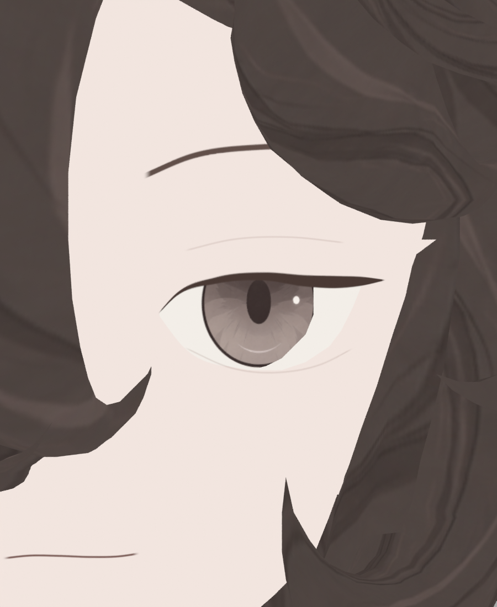
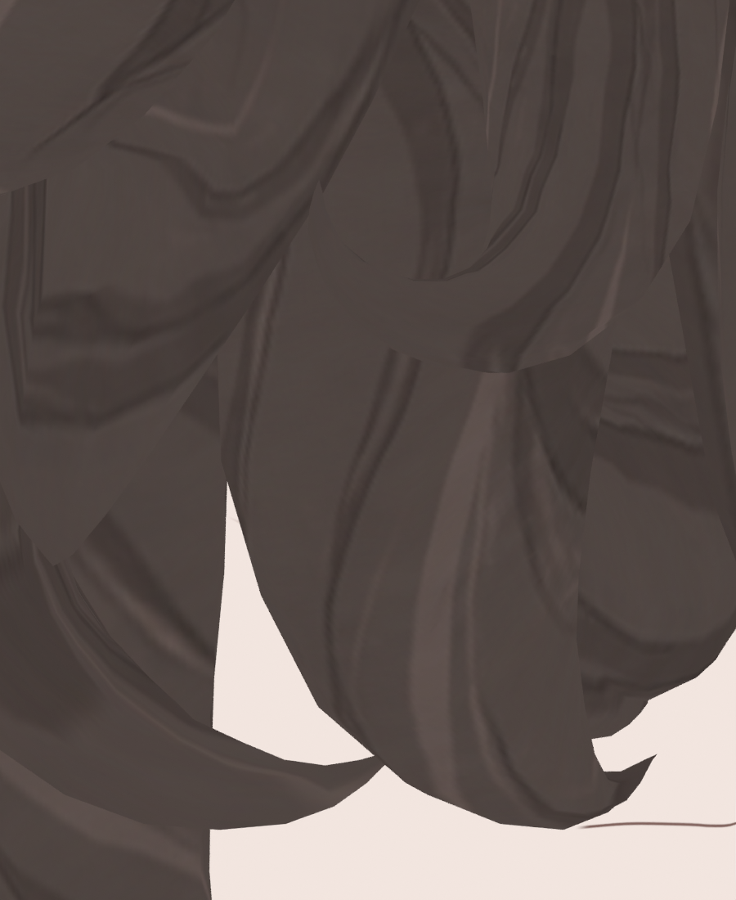
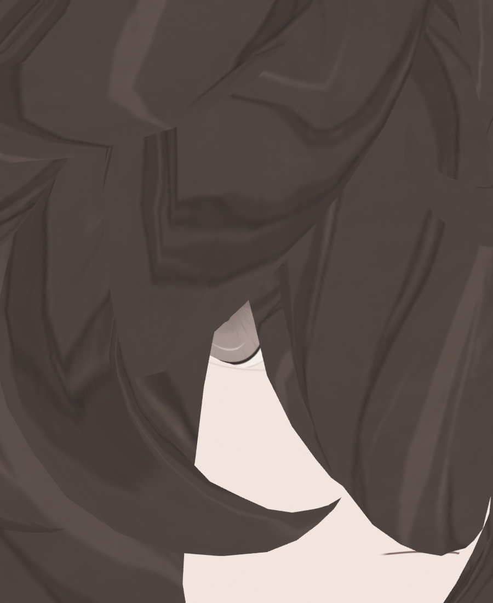

> **기록 시점 안내:** 아래는 해당 단계 당시의 보고서입니다. 후속 결정은 [최신 상태](../../../../STATUS.md)를 기준으로 읽어주세요. 모델·원본 텍스처·검증 원시 데이터는 이 문서 공유본에 포함하지 않습니다.

# v353 기존 눈 세부 면 정리와 V6 채색 검토

**임시 베이크 얼굴을 제외한 CLEAN V6 실제5장을 다시 확인했다. 바깥 눈꼬리의 수평 단차와 레퍼런스 대비 동공 인상 차이가 남아 최종 미합격이다.** 기존 V6·벽 HALF 사진의 구조 개선 판정은 임시 프록시 중복 표시 때문에 보류하고, 현재 미관 판단은 아래 CLEAN 사진을 기준으로 한다.

## 실제 표시 문제 발견과 정정

`v353_WALL_ACTUAL_SCENE_V2.json`의 실제 장면 목록에서 `v353_face_v6_disposable_proxy`가 `hide_render=false`, `visible_get=true`로 남아 있었다. 이는 아바타 원래 눈 부품이 아니라 얼굴 베이크용 임시 객체9189정점/3063면이다. 눈 영역780삼각형 중778개가 실제 아바타와 정점 거리1µm 이내로 겹쳤다. 아바타 벽을 뒤로 움직인 HALF에서 원래 선이 그대로 보인 이유에 이 중복 얼굴이 포함된다.

따라서 이전 `v353_V6_EYE_NEUTRAL_*`와 `outer_wall_trial/`의 미관·구조색 비교를 깨끗한 단일 아바타 검사로 사용할 수 없다. 부모가 임시 프록시를 제외한 뒤 `v353_V6_CLEAN_EYE_NEUTRAL_*`5장을 촬영했고 이 문서의 주 사진을 교체했다. V5 단계의100면 삭제 사진도 당시 장면 목록을 확인하기 전까지 프록시가 없었다고 단정하지 않는다.

## CLEAN V6 실제 근접 확인

| 정면 | 35° | 55° |
|---|---|---|
|  |  |  |

내안각은 현재 닫힌 눈 모양으로 보이며 큰 사각형 흰 영역이 드러나지 않는다. 그러나35°/55°의 바깥 윗선은 두꺼운 수평 부분이 갑자기 좁아져 작은 삼각형 끝으로 이어진다. 프록시를 제외해도 남으므로 중복 프록시만으로 발생한 결함은 아니다. 실제 앞 C79 벽과 뒤 C79 눈 표면의 깊이 및 선 폭 좌표를 함께 다뤄야 한다. 선을 넓게 덮어 해결했다고 처리하지 않는다.

현재 세로타원 동공은 밝은 홍채 중앙에서 독립적으로 강조된다. 직접 다시 연 `ref_char.png`의 눈은 상부의 깊은 홍채/눈꺼풀 음영 안에서 동공이 부드럽게 읽힌다. 현재 인상은 그 기준과 차이가 있다. 새 iris_v4 제작은 별도 후속이며 이 CLEAN V6 사진에는 아직 적용되지 않았다.

| CLEAN−35° | CLEAN−55° |
|---|---|
|  |  |

반대눈은 대부분 머리에 가려졌다. 이 사진으로 양쪽 눈 채색·눈꼬리 합격을 주장하지 않는다. 머리 품질도 별도 미해결이며 눈 검토에서 합격으로 확대하지 않는다.

## 기존100면 정리의 확인 범위

C90만19면을 삭제한 후보와6개 eye_detail 부품100면을 삭제한 후보는 모두 기존31037정점·모든 키좌표·웨이트·남은 모든UV값을 유지했다. 남은 loop normal 최대차이0, 면 수15704/15623, unused 정점 유지도 실제 파일 검증에 기록됐다. 면 정리 검증 (공유본 미포함: `v353_EYE_FACE_REMOVAL_TRIALS.json`)

기존14장에서는 C90 제거 후 홍채 중간 블록이 줄고100면 제거 후 작은 상하 조각이 더 줄어 보였다. 다만 **해당 V5 촬영 당시 렌더 객체 목록을 재확인하기 전에는 깨끗한 전후로 확정하지 않는다.** 이 비교를 근거로 '양쪽 원래 반사 기능까지 검증 완료' 또는 '삭제 후 눈 전체 합격'이라고 주장하지 않는다. 현재 CLEAN V6는100면 정리된 상태의 새 근접 자료이지, 삭제 효과만 따로 검증한 새 전후 쌍은 아니다.

C89/90/91/92/94/96을 순수 '반사조각'이라 단정한 이전 용어도 정정했다. 원래 목록은 eye_detail이고 원래 색 표본은 대부분 갈색이다. 앞으로 **별도 전면 눈 세부 조각**으로 표기한다. 원래 기능과 새 홍채 투영의 중복을 구분하며, 새 원화 디테일을 보존한 정리인지 깨끗한 비교로 판단한다.

## 벽 깊이 후보의 미채택 근거

기존 HALF는123raw 정점을 최대1.724mm Y 이동했고 XZ·상대키·모든UV·웨이트·남은 면/ancestry 유지 검사에 통과했다. 그러나 별도 자기교차 수치 검사에서 변경영역의 삼각형 쌍이 양쪽 기준6→HALF23으로 늘었다. 실제 evaluated 오른쪽 얼굴로 다시 계산해도 해당영역0→8쌍(원래면4쌍)이다. **임시 프록시를 제외하더라도 HALF 자체의 교차 회귀가 있어 미채택이다.** 법선 반전0만으로 정상 변형이라고 판단하지 않는다.

FULL3.447mm는3개 법선 방향 반전과 더 많은 교차로 GUI 실행하지 않았다. 원래 벽의 여러 깊이층을 서로 다른 양으로 밀면서 앞뒤가 통과하는 것이 문제다. 후속은 같은XZ의 층 순서를 보존하는 양의 두께 변화와 유한 구간 전이를 수치 비교하는 단계다. 아직 새로운 후보의 시각 합격은 없다.

`gui_outer_wall_trial.py`에 실행 후 추가된 실제 삼각분할 gate는 이미 끝난 HALF 실행에서 검증된 항목이 아니다. 실제 JSON에 없는 `actual_triangulation_exact`를 이번 실행 실적으로 소급하지 않는다. 이후 실행용 파일은 새 버전 이름으로 고정하고 실행 시점의 바이트 해시를 남긴다.

현재 문서는 Blender 중립 눈 근접 검토와 별도 수치 진단이다. Unity 표시·표정·눈깜박임·시선·연속 동작·VRChat클라이언트 합격은 포함하지 않는다.
