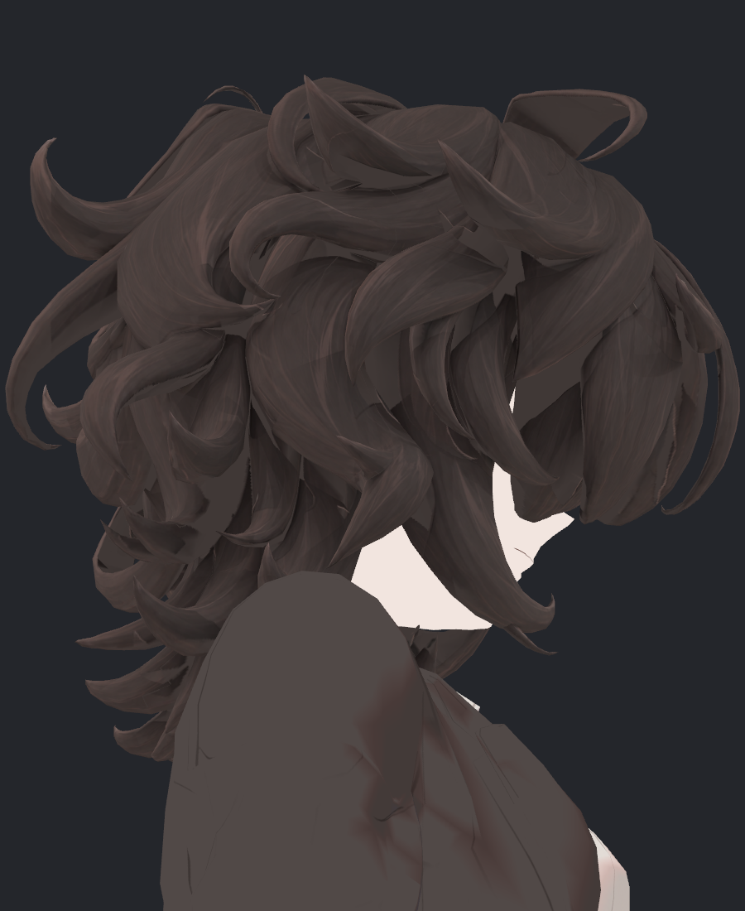
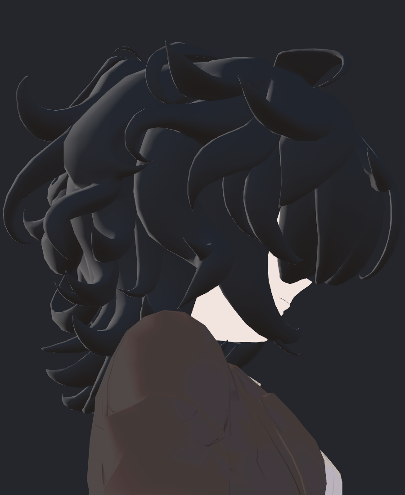
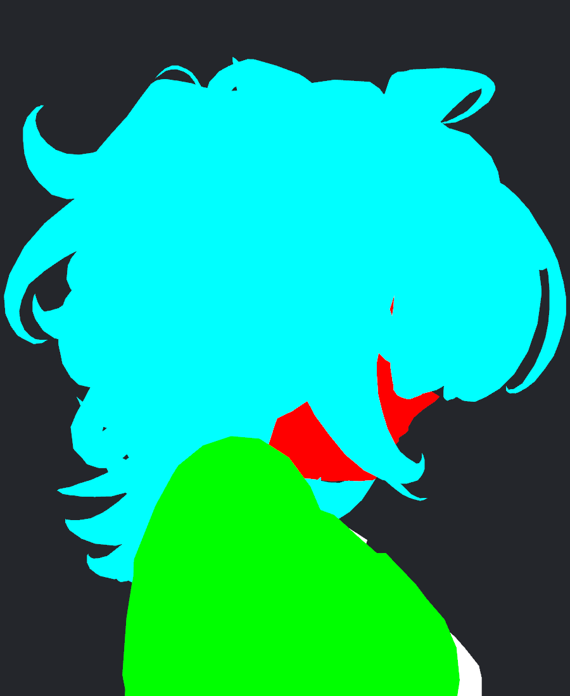
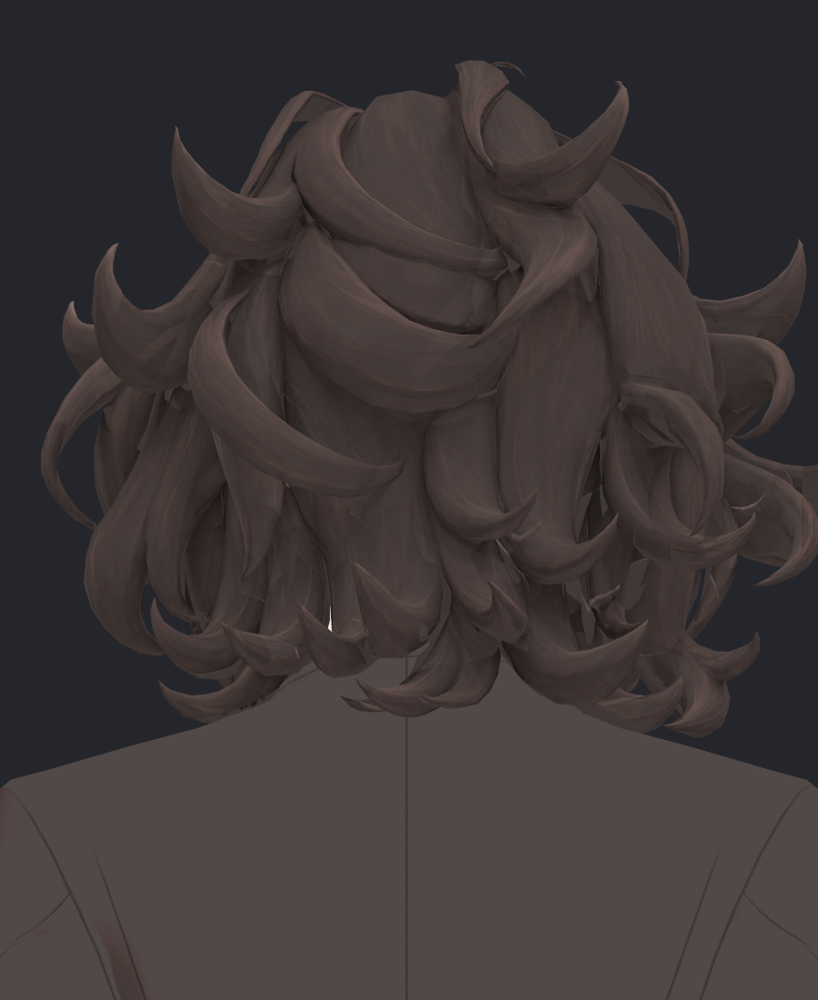
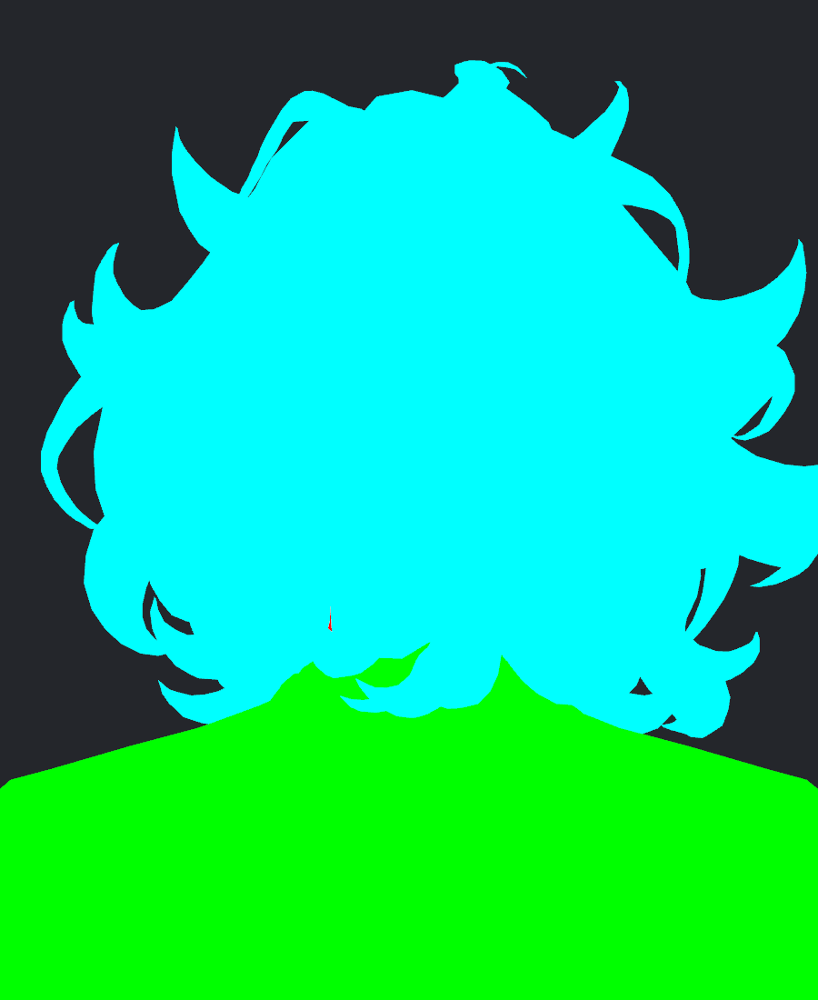
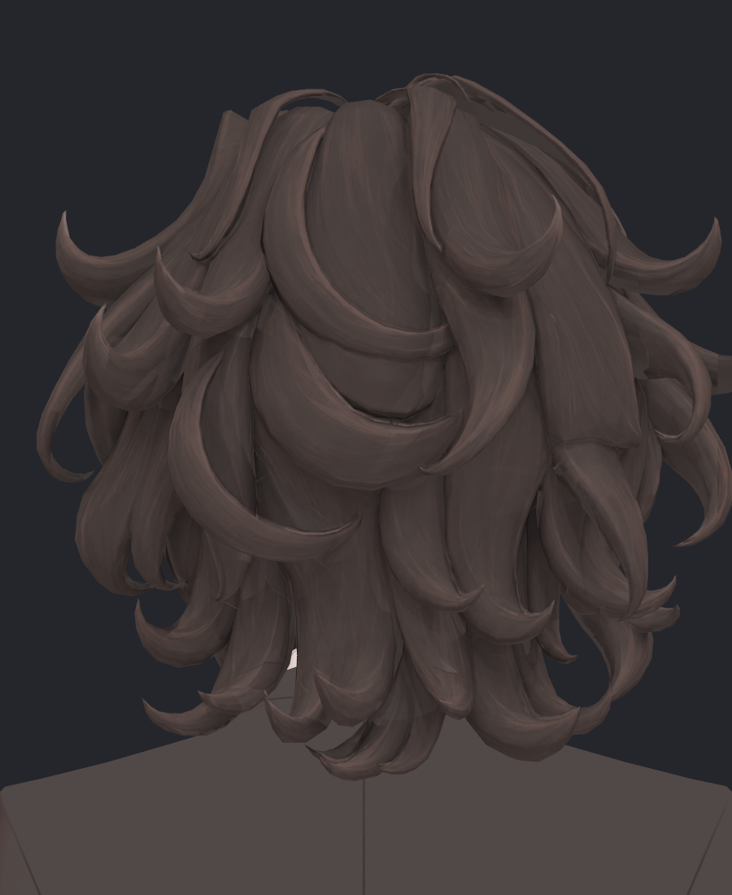
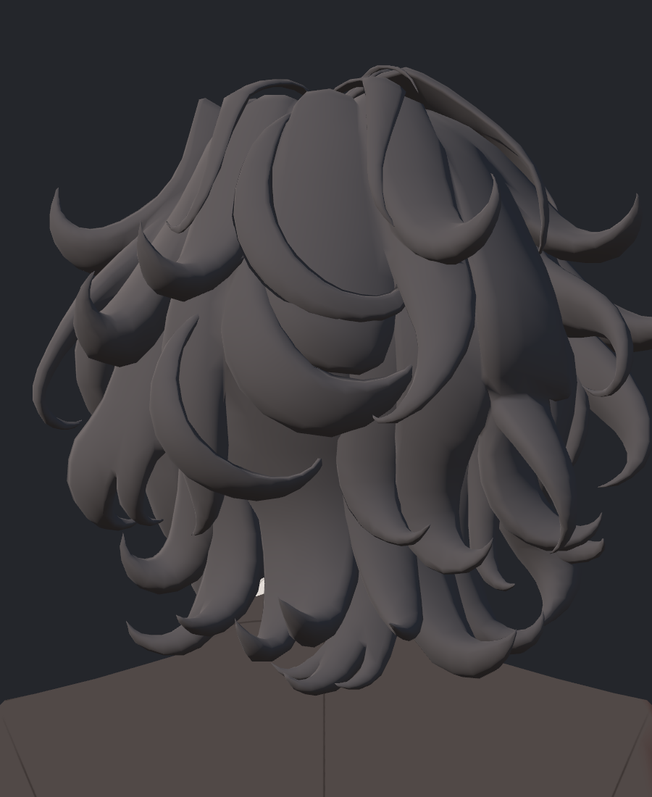

> **기록 시점 안내:** 아래는 해당 단계 당시의 보고서입니다. 후속 결정은 [최신 상태](../../../../STATUS.md)를 기준으로 읽어주세요. 모델·원본 텍스처·검증 원시 데이터는 이 문서 공유본에 포함하지 않습니다.

# v353 헤어 안쪽 40장 원인 분리 독립 검토

실제 Unity 40장(5조건×4구도×양쪽 광원)을 모두 직접 열어 비교했다. 넓은 회색 띠는 **hair 기본색의 디테일 누락/전사 범위 부족**으로 우선 처리하는 것이 맞다. 하지만 뒤쪽의 작은 밝은 조각은 hair가 아닌 피부·셔츠 노출도 있으므로 같은 문제로 묶어 칠하면 안 된다.

실행 기록 (공유본 미포함: `REVIEW.json`)은 completed·sources_preserved·scene_preserved 모두 true다. 실제 source는 `Bianca_v353_HAIR_ALBEDO19_REVIEW.prefab`, 의존 해시 `e8d0321a2e7137832626d32d6da4aef9`다. 이번 독립 검토는 새 문서만 작성하며 자산·기하·노멀·픽셀 수정은 하지 않았다.

## 원인별 판정

| 위치 | 실제 비교 결과 | 판정·후속 |
|---|---|---|
| LOW_90 중앙 오른쪽 넓은 회색 띠 | CURRENT19와 PURE_ALBEDO19 양쪽 광원에서 같은 위치·색으로 남음. CATEGORY는 cyan. 단색 Unlit에서는 주변과 하나의 hair 색으로 합쳐짐 | **hair albedo 문제 확정**. 노멀 조정이나 그림자 OFF로 해결하지 말고 실제 해당 표면의 신규 원화 전사 범위를 보완 |
| LOW_90 안쪽 하단·컬 뒤의 비슷한 무늬 없는 띠 | cyan 영역에 같은 RGB의 넓은 연결 구간들이 여러 곳 존재 | 보이는 한 패널만 아니라 현재 가려진 면의 투영 후보 선택/커버리지 확인 필요 |
| HEAD_BACK 중앙의 넓고 평평한 패널 | 순수 기본색에서도 주변보다 결이 약하고 큰 면 분할이 보임. 단색 Lit에서도 실제 넓은 표면과 모서리 구조가 남음 | **채색의 약한 결 + 기존 넓은 기하 면**의 결합. 전체가 미채색인 것은 아님. 완전 평활화/더 진한 일괄 그림자로 덮기보다 실제 부품 곡률에 맞는 결 보완 |
| LOW_BACK 좌하단 작은 흰 세로 조각 | 모든 hair 재질 교체에서 흰색 유지. CATEGORY 빨강 | **face 재질 표면 노출**. hair 누락 텍셀 아님. 필요하면 기존 면과 가림 구조를 별도로 조사 |
| HEAD_BACK 좌하단 비슷한 흰 조각 | 모든 hair 재질 교체에서 그대로. CATEGORY 흰색 | **shirt 재질 노출**. LOW_BACK의 face 조각과 구도가 비슷해도 실제 역할이 다름 |
| LOW_0 얼굴·눈·목, LOW_90 얼굴 옆 작은 흰 틈 | CATEGORY 빨강과 실제 흰색이 대응 | hair 원화를 전사하지 않을 영역. 눈·피부 보존 |

## LOW_90 — 기본색 누락과 조명을 분리

| 현재 LEFT | 동일 텍스처 Unlit LEFT |
|---|---|
|  |  |

| 단색 Lit RIGHT | 부위 ID |
|---|---|
|  |  |

900×1100 원본의 `(650,460)`과 `(606,345)`는 모두 CURRENT19/PURE_ALBEDO19 RGB `(64,56,54)`, CATEGORY `(0,255,255)`다. 조명을 제거해도 같은 hair 기본색이 남는다. 실제 샘플된 기본색이 단색이므로 커스텀 노멀 오류로 이 색 자체가 만들어진 것은 아니다.

더 넓은 읽기 전용 픽셀 검사에서도 PURE_ALBEDO19_LOW_90_LEFT의 cyan 영역 안에 **정확히 RGB(64,56,54)**인 픽셀이 23,528개 있다. 가장 큰 연결 구간 두 개는 3,949px(대략 x619–722/y406–518)와 3,604px(x230–301/y512–677)다. 이는 표시된 픽셀 수이며 UV 면적·원화 누락률은 아니다. 균일 기본색 또는 기본색 대체값이 넓게 남았다는 근거다. 정확한 베이크 탈락 조건은 해당 면의 view 후보·가림 검사·UV 샘플 기록으로 확인해야 한다.

## LOW_BACK — 흰 조각은 별도 원인

| 순수 기본색 | 부위 ID |
|---|---|
|  |  |

작은 세로 조각 `(363,684)`은 모든 hair 조건에서 RGB `(242,229,223)`이고 ID는 정확히 빨강 `(255,0,0)`이다. 이 부위는 **face 표면이 보이는 것**이다. 헤어의 하이라이트나 잘못된 흰 패딩을 제거하는 작업으로 처리하지 않는다. 사진만으로 정상적인 가림 틈인지 비정상 침투인지까지 단정하지 않는다.

## HEAD_BACK — 약한 채색과 실제 큰 면

| 기본색 | 단색 Lit |
|---|---|
|  |  |

중앙 가로 컬 안쪽 패널의 `(470,466)`은 기본색 `(74,63,60)`이며 주변 25×20px에는 41종 RGB가 있다. LOW_90의 큰 균일 띠와 달리 이 부분을 **완전 무채색/무전사**라고 부르면 부정확하다. 약한 명암과 결은 있으나 주변 원화의 선명한 곡선 흐름에 비해 큰 면이 밋밋하게 읽힌다. 단색 Lit에서도 그 넓은 면과 경계는 남으므로 채색만 바꾸면 기하 경계까지 사라진다고 기대하지 않는다.

같은 사진 아래쪽 `(360,810)`의 흰 조각은 CATEGORY `(255,255,255)`로 **shirt**이며, 모든 hair 조건에서 RGB `(224,207,202)`가 같다. LOW_BACK의 흰 face 조각과 분리해서 기록한다.

## 기하·재질·노멀 판정의 한계

FLAT_LIT은 현재 lilToon이 아니라 금속/광택을 0으로 둔 **Standard**다. 여기서 보이는 어두운 면·밝은 테두리를 현재 NPR 재질의 결함으로 그대로 판단하면 안 된다. 두 광원에 따라 넓은 머리 면의 밝기가 이동하는 것은 확인했으나 이 실험만으로 해당 corner normal이 수치상 잘못되었다고 확정할 수 없다.

PURE_ALBEDO19는 실제 같은 hair 텍스처를 `Unlit/Texture`로 보여 준다. CATEGORY_ID는 hair cyan, face red, coat green, details yellow, shirt white다. 이 비교에서 우선 입증된 것은 **렌더된 표면의 재질 범주와 기본색 기여**이며 exact polygon ID·UV 왜곡·자기교차 전수까지는 아니다.

## 후속 제작 기준

1. 낮은 측면·안쪽 신규 원화를 실제 cyan hair 면에만 전사한다. 방향별 가림 때문에 선택되지 못한 면, UV 샘플 밖으로 나간 면, 후보가 없어서 기본색으로 남은 면을 구분해 기록한다.
2. 기존 잘된 앞머리·외측 컬의 결은 보존한다. 빈 안쪽 표면을 채우는 작업 때문에 머리 전체의 선을 지우거나 기본색을 다시 평탄화하지 않는다.
3. HEAD_BACK 중앙은 완전 재생성보다 같은 실제 컬의 흐름을 따라 약한 결을 정리한다. 기존 부품 경계와 교차된 위아래 컬을 하나의 그림처럼 잘못 이어 붙이지 않는다.
4. 같은 네 구도에서 CURRENT/순수 기본색을 다시 비교하고 두 광원에서 새 밝은 띠·직선 절단·피부 혼입이 없는지 검수한다. 이번 source19의 기본색 미완성을 새 후보의 완료 판정으로 넘기지 않는다.

이번 판정: **낮은 측면 albedo 전사 보완 진행 적합, source19 헤어 전체 최종 합격은 아님.** 피부·셔츠 노출 조각은 이번 hair 채색에서 제외한다.
