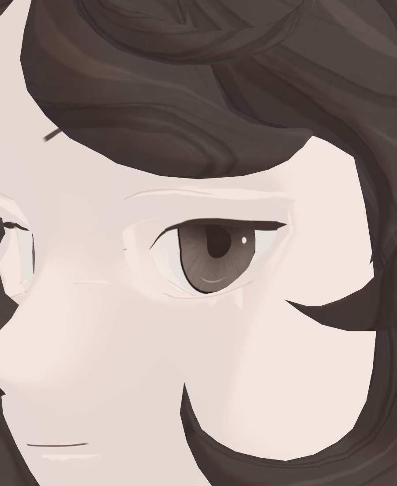
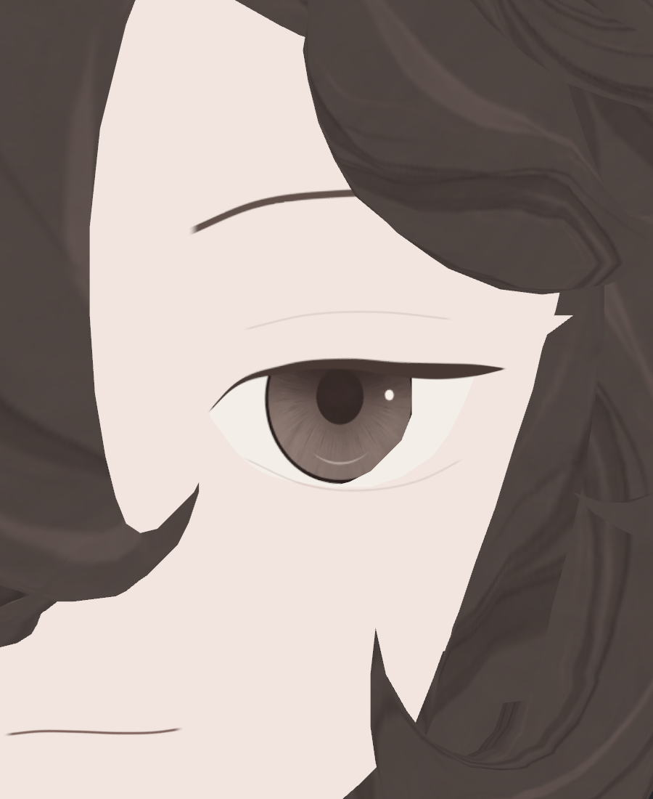
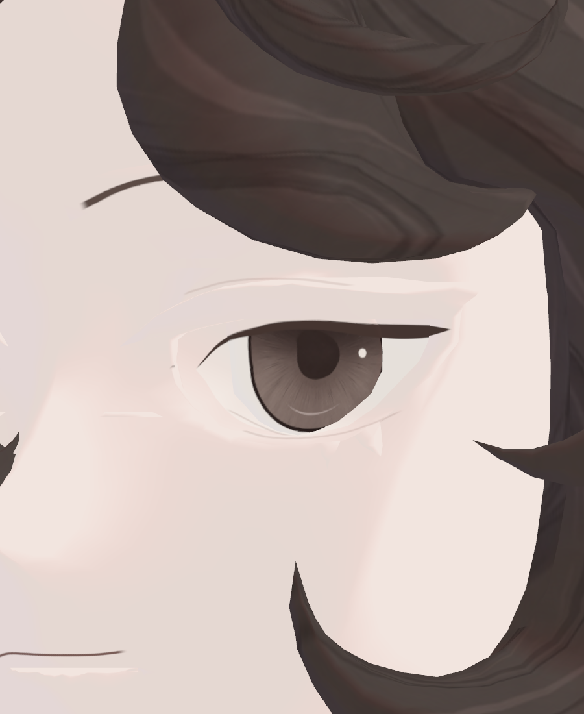
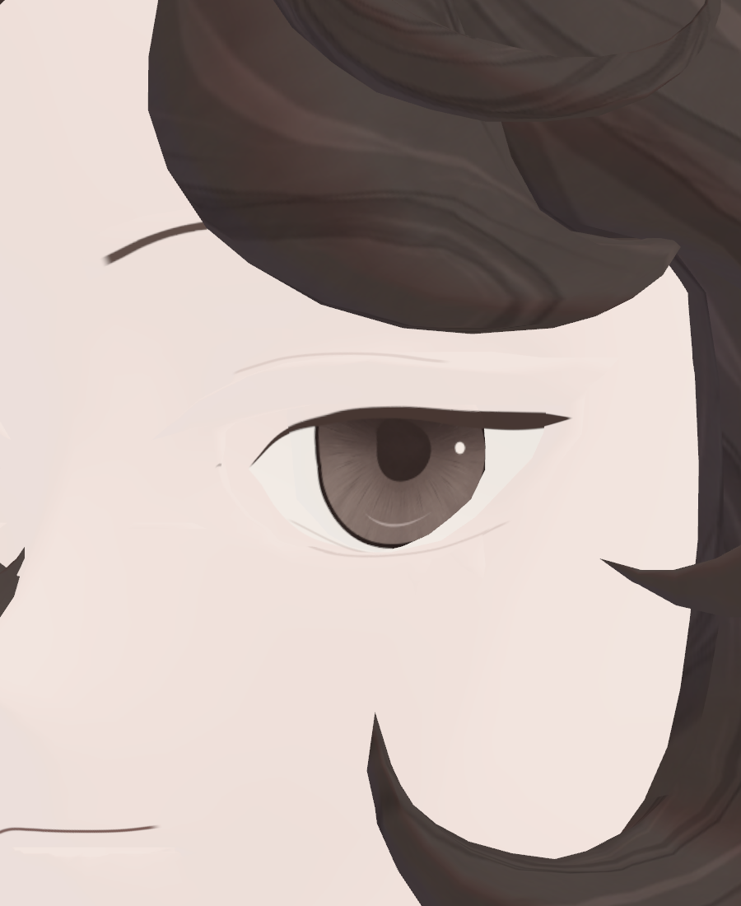
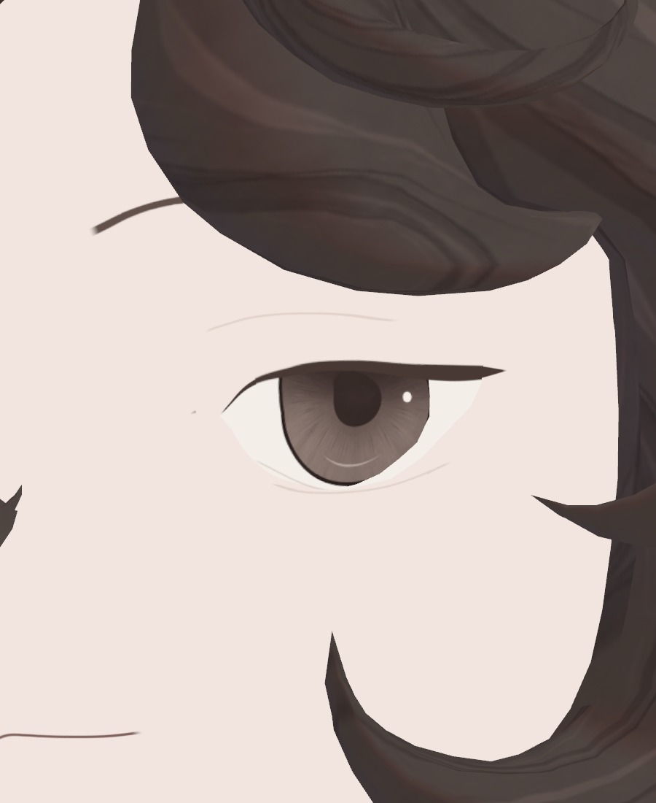
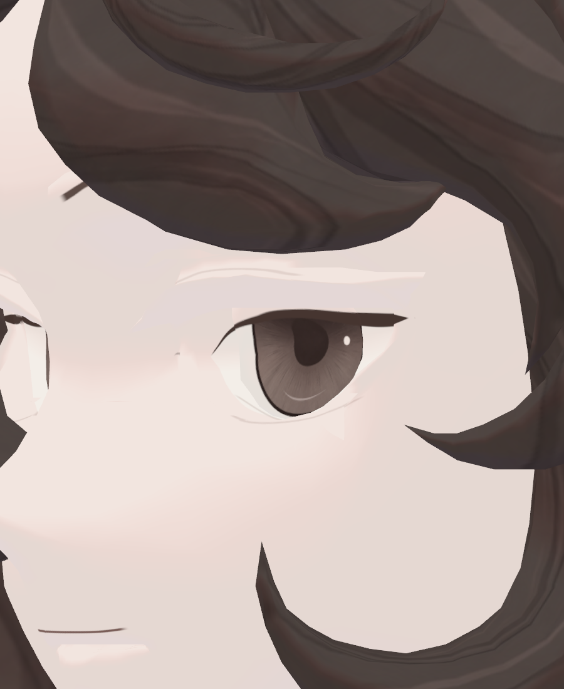
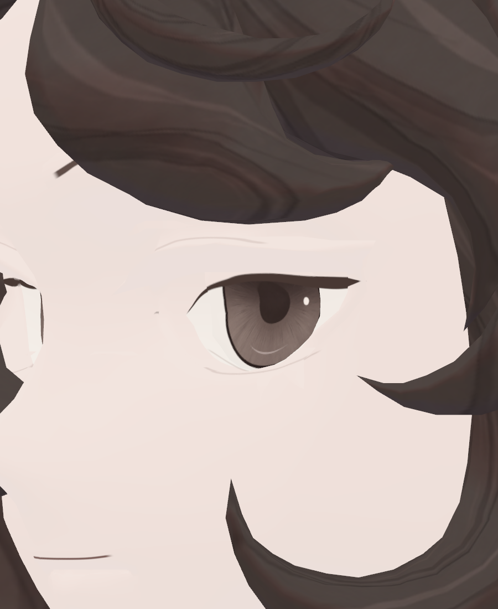
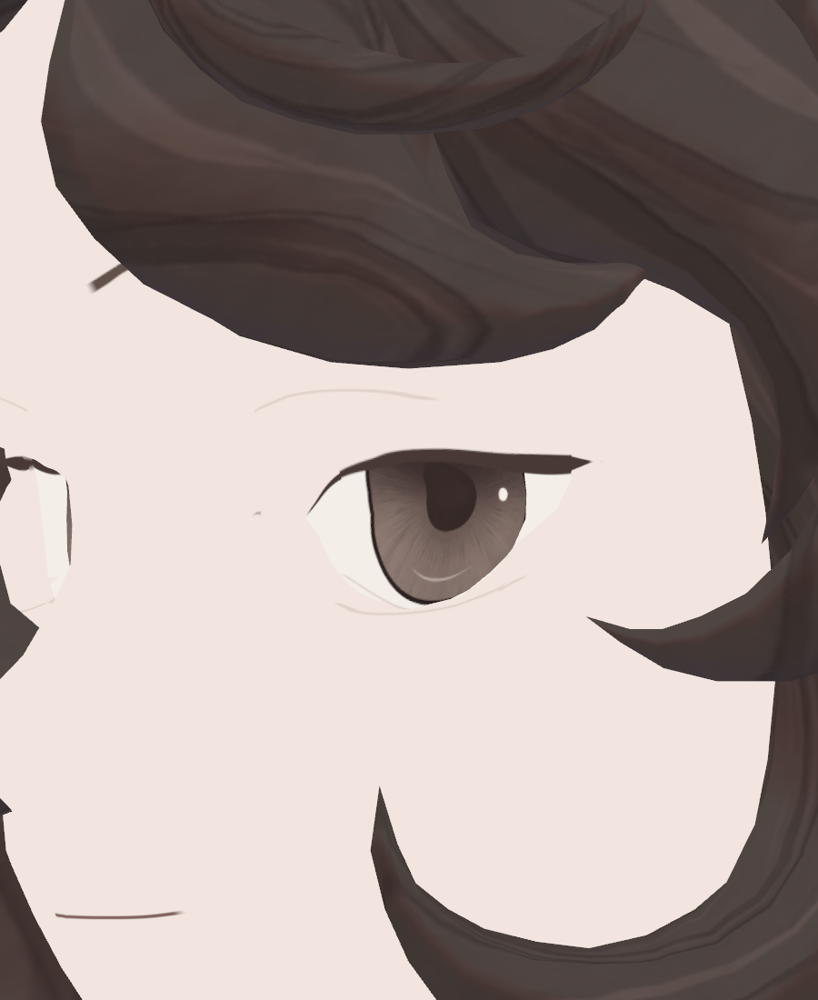
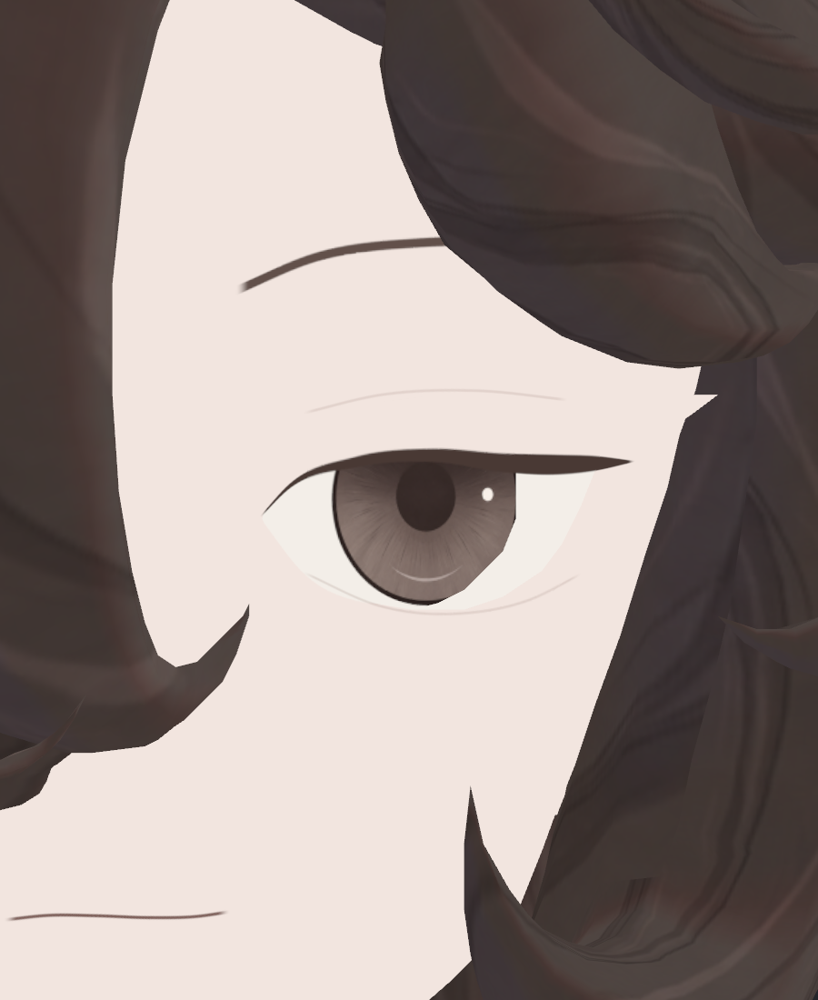
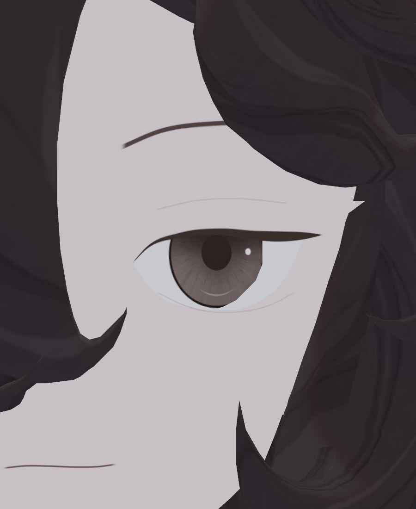

> **기록 시점 안내:** 아래는 해당 단계 당시의 보고서입니다. 후속 결정은 [최신 상태](../../../../STATUS.md)를 기준으로 읽어주세요. 모델·원본 텍스처·검증 원시 데이터는 이 문서 공유본에 포함하지 않습니다.

# v353 눈 노멀27장·얼굴 그림자36장 실제 비교

**통합 권고는 EYE_ONLY268 + NEW4 국소 노멀 + 얼굴 UseShadow0, AsUnlit .45 유지다.** 노멀27장과 얼굴 그림자36장을 원본 PNG로 모두 직접 확인했다. NEW4는 변경 기하에서 새로 뒤를 향한 코너만 바로잡는 최소 수정이다. 얼굴의 넓은 흰 얼룩은 그 국소 노멀 수정으로 사라지지 않으며, 얼굴의 국소 툰 그림자 응답을 끈 후보에서 제거된다. 이 판정은 중립 눈 근접 구도의 판정이며 전체 아바타·표정·거리·VRChat 합격이 아니다.

## 같은 기하에서 노멀만 비교

ORIGINAL_N / NEW4_N / ALL7_N은 EYE_ONLY268 기하, UV, 삼각형, 탄젠트, face7, V9 재질 속성이 같다. 실제 SkinnedMeshRenderer의 scale100을 유지했다. 각0/35/55도 × 무조명/좌광/우광을 촬영했다. 원본 프리팹 해시가 보존됐다.

| 후보 | 변경 Unity N | 원래 Unity N 대비 최대각 | 실제 사진 판단 |
|---|---:|---:|---|
| ORIGINAL_N | 0 | 0° | 넓은 흰 아크·입 밑 띠가 조명에서 나타남 |
| NEW4 | 4 | 16.55093° | 눈매·홍채·외측 선의 새 회귀는 보이지 않음. 넓은 얼룩은 잔존 |
| ALL7 | 7 | 81.70505° | NEW4보다 넓은 수정의 가시적 이득 없음 |

Blender의 현재 decoded N에서 계산한 약7.03°/70.34°와 위 원래 Unity N 대비 각도는 출발 방향이 달라 서로 대체할 수 없다. 실제 Blender 저장 시 지정 밖 N오차0, 기하·UV·키·웨이트 보존 및 양 엔진의 인접 면 양의 반구 검사를 통과한 결과는 국소 후보 보고 (공유본 미포함: `v353_EYE_NORMAL_CANDIDATES_REVIEW.md`)에 있다.

| 55° 우광 원래 N | NEW4 | ALL7 |
|---|---|---|
|  |  |  |

**가시적 효능을 과장하지 않는다.** PNG 픽셀 비교에서 NEW4와 ALL7은9조건 전부 완전히 같다. ORIGINAL_N과 NEW4도7조건 완전히 같고,55°좌광은160픽셀에서 최대1/255,55°우광은688픽셀에서 최대10/255다. 1/255를 초과한551픽셀은 화면 왼쪽 반대눈 가장자리 x37–51/y538–628에만 있다. 주로 보이는 눈의 넓은 흰 아크 개선 증거가 아니다. 해당 수치는 이미지 코드값 차이이며 미관 점수가 아니다.

NEW4는 새 기하가 만든 N 문제의 최소 수정으로 유지할 수 있지만, ALL7의 기존 큰 방향 변화까지 확대할 이유는 이번 사진에 없다. 반대눈 전체를 노출한 추가 구도나 표정에서 효능·회귀가 나타날 가능성은 아직 검증하지 않았다.

## 얼굴 그림자 응답 분리

EYE_ONLY268 + NEW4의 같은 파일에서 face7·N·UV·기하를 유지했다. AsUnlit은 세 후보 모두 원래 .45다. 변경은 얼굴의 local toon shadow 속성뿐이다. 실제0/35/55도 × 좌광/우광/상광/어두운 광원36장이다.

| 후보 | 바뀐 속성 | 실제 결과 |
|---|---|---|
| 현재 | 기존 ShadowStrength .22 | 윗눈꺼풀 전체에 두꺼운 흰 아크, 아래쪽 밝은 삼각 조각, 입 밑 흰 띠가 보임 |
| 약하게 | ShadowStrength .10, ShadowBlur .45 | 대비는 줄지만 같은 형태가 흐리게 남음 |
| 국소 그림자 끔 | UseShadow0, AsUnlit .45 유지 | 흰 아크·입 밑 띠가 제거되고 원래 채색의 얇은 선이 유지됨 |

| 35° 우광 현재 | .10 soft | local shadow OFF |
|---|---|---|
|  |  |  |

| 55° 상광 현재 | .10 soft | local shadow OFF |
|---|---|---|
|  |  |  |

현재 얼굴 UseBumpMap0이고, 위 비교는 MainTex를 다시 칠하거나 노멀맵을 바꾸지 않았다. 같은 얼룩이 UseShadow만 끈 조건에서 사라지므로 이 표시의 직접적인 경로는 얼굴의 툰 그림자 응답이다. 기존 미세 기하와 split normal 방향이 그 응답의 모양을 만드는 기여는 남지만, 모두 잘못된 노멀이라고 단정하거나 얼굴 전체 N을 재계산할 근거는 아니다. 정상적인 애니메이션 얼굴 표현을 위해 실제 미세 면 하나하나의 명암을 강하게 드러낼 필요도 없다.

## 환경광·인상·남은 범위

| local shadow OFF 우광 | local shadow OFF 어두운 광원 |
|---|---|
|  |  |

DIM에서 피부·눈도 어두운 환경에 맞춰 변한다. UseShadow0을 완전 무조명으로 표현하지 않는다. 얼굴 채색의 눈썹·눈꺼풀 선·동공·홍채 반사·입선은 유지되고, 넓은 밝은 다각형을 줄인 쪽이 조용한 일러스트형 눈매에 더 가깝다. .45는 기존값을 고정해 원인을 분리하기 위한 조건이므로 최종 조명 통합에서 .0/.45를 같은 밝은·어두운·색광 조건으로 비교할 가치는 있다. 밝기 보존과 몸/얼굴 조화 판단이며 이 단계에서 .0을 자동 채택하지 않는다.

이번36장에는 거리 변화가 없다. 4K/mip13은 설정 확인이고 거리별 선 보존 검증을 대신하지 않는다. 주로 보이는 눈 안쪽의 아주 작은 회색 점과 극사선 반대눈의 노출 경계는 별도 잔여다. 정면 눈 위 헤어와 피부의 뾰족한 접촉 실루엣도 UseShadow0에서 남아, 넓은 흰 아크와 다른 항목이다. 이것들을 자동으로 재채색하거나 정상적인 뾰족한 눈꼬리를 결함으로 판정하지 않는다.

## 증거와 기록 한계

- Unity N27 실제 기록 (공유본 미포함: `v353_NATIVE_EYE_NORMAL_V2_REVIEW.json`)
- N27 원본 PNG 픽셀 비교 (공유본 미포함: `v353_NATIVE_EYE_NORMAL_PIXEL_AUDIT.json`)
- 얼굴 그림자36 실제 기록 (공유본 미포함: `v353_NATIVE_FACE_LIGHTING_REVIEW.json`)
- 실행된 얼굴 비교 코드 (공유본 미포함: `MacV353FaceLightingViews.cs`)

얼굴36 JSON의 materials 배열은 shot override **전**의 재질을 기록하므로 OFF도 UseShadow1로 남아 있다. 실행 코드36행에서 매 촬영 직전 OFF에0, soft에.10/.45를 적용했다. 기존 실행 증거를 수정하지 않고 이 문서에 차이를 명시한다. 다음 실제 통합에서는 촬영 직전 값을 별도 스냅샷으로 남겨야 한다. 기존 기록을 수정해 나중에 기록된 값을 실행 당시 값처럼 만들지 않는다.
