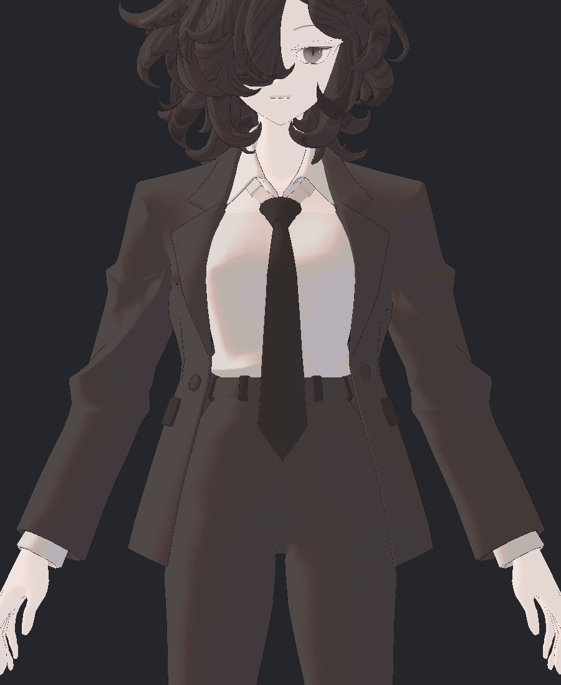
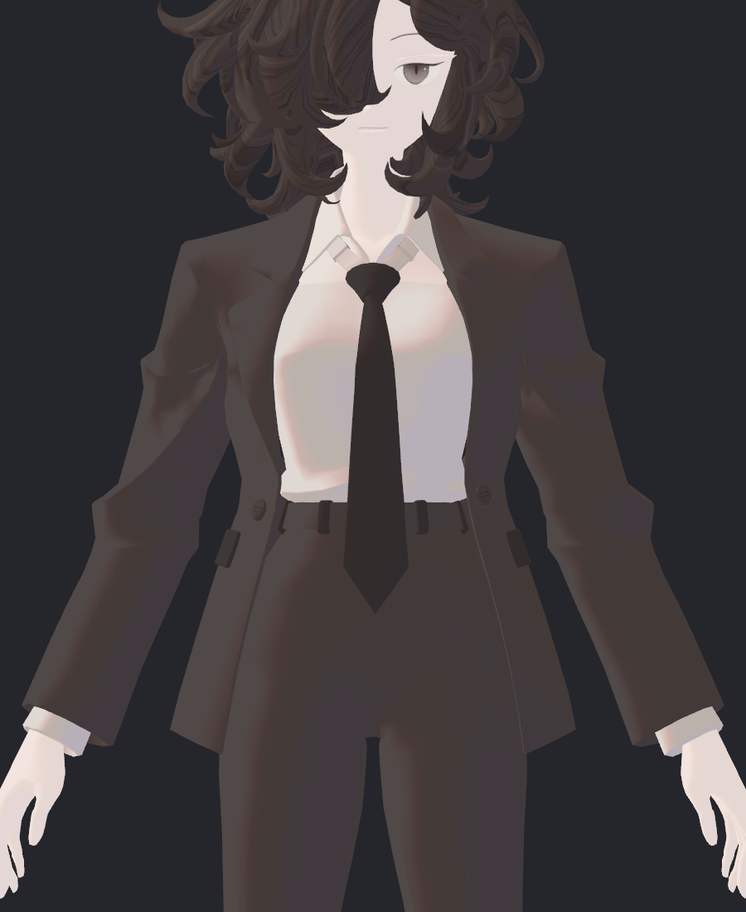
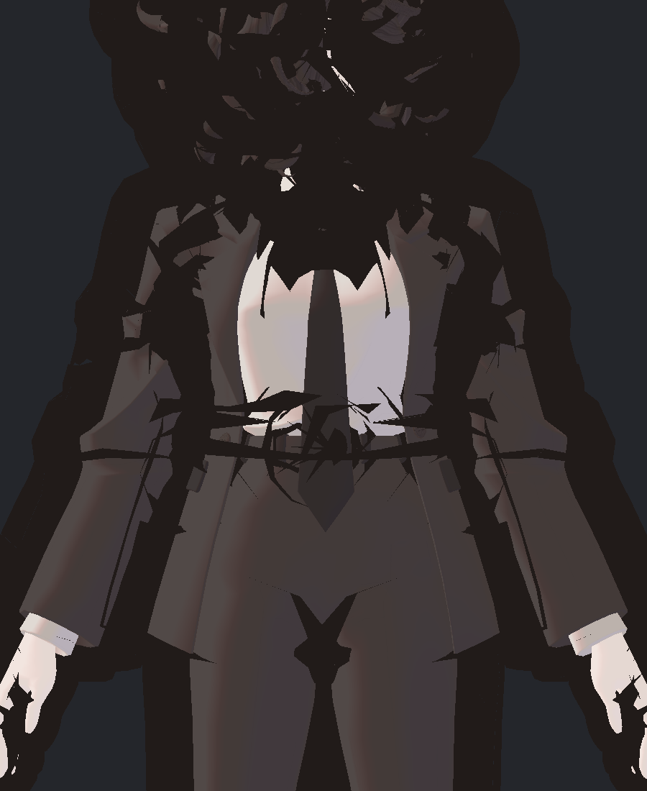
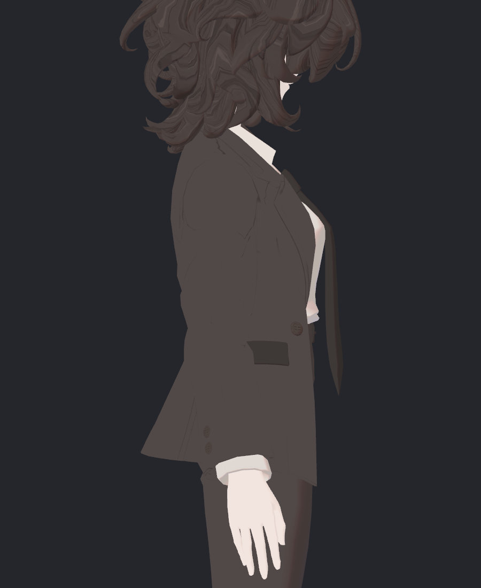
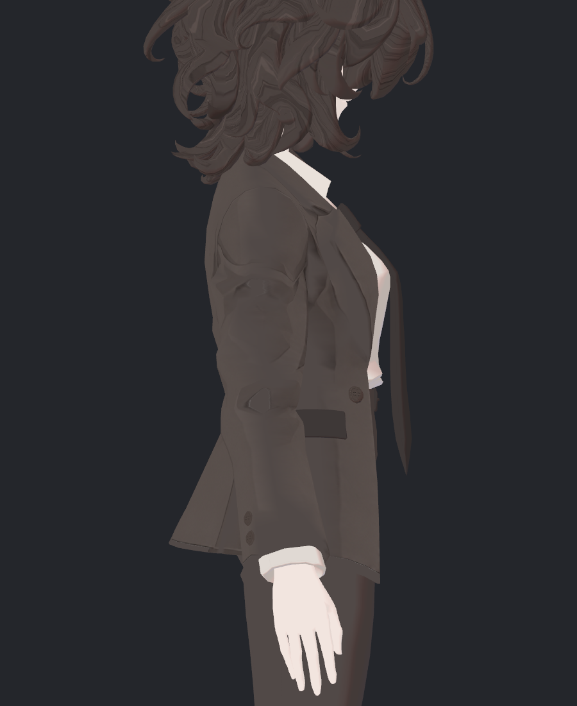
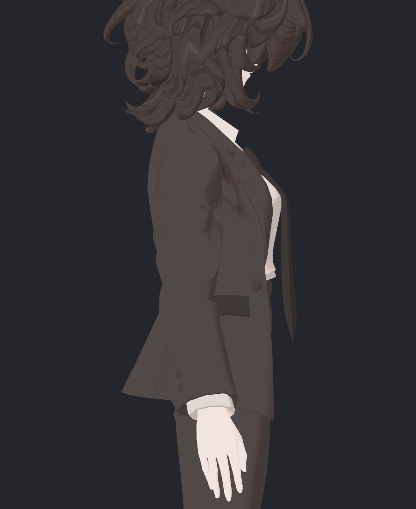
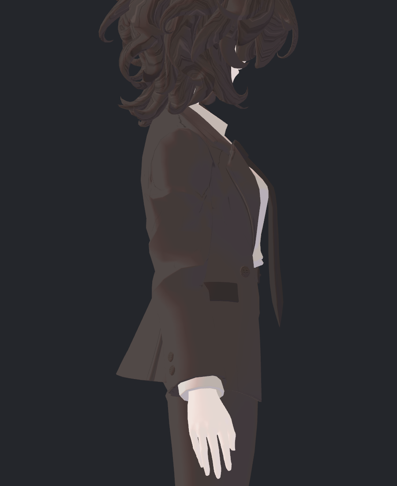
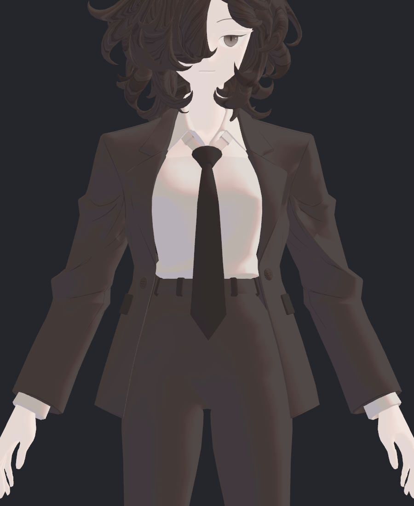

> **기록 시점 안내:** 아래는 해당 단계 당시의 보고서입니다. 후속 결정은 [최신 상태](../../../../STATUS.md)를 기준으로 읽어주세요. 모델·원본 텍스처·검증 원시 데이터는 이 문서 공유본에 포함하지 않습니다.

# v353 실제 SkinnedRenderer 코트·Outline 비교 결과

**검은 점선은 Outline 패스가 만든 표시다. 다음 제작은 실제 SkinnedMeshRenderer + 일반 lilToon(noOutline) + 새 line6 코트를 기준으로 진행하는 것이 타당하다.** 다만 line6의 어깨·라펠 선 정합은 아직 수정해야 하며 전체 텍스처 합격은 아니다. 부모가 실행한 30장과 JSON을 독립적으로 읽고, 아래 비교 사진을 직접 확인했다. 이 검토자는 Blender/Unity를 실행하거나 Assets를 수정하지 않았다.

## 1. 점선의 실제 원인과 해법

| 기존 static, Outline, MSAA1 | 실제 SkinnedRenderer, noOutline, MSAA4 |
|---|---|
|  |  |

텍스처가 같고 Outline 유무만 달라진 비교에서 라펠·자락·머리·손의 검은 점선이 제거된다. MSAA1 noOutline도 같은 점선이 없다. 따라서 텍스처를 흐리게 만들거나 노멀을 전역 재계산해서 해결할 대상이 아니다.

| 조건 | 정확한 Outline RGB8 (33,27,25) 픽셀 | 라펠 ROI |
|---|---:|---:|
| 기존 static / MSAA1 | 9,054 | 1,035 |
| 기존 static / MSAA4 | 243 | 60 |
| native 기존 폭 / MSAA1 | 407,105 | 25,231 |
| native 폭÷100 / MSAA1 | 9,047 | 1,032 |
| native 폭÷100 / MSAA4 | 241 | 60 |
| native noOutline / MSAA1 | 0 | 0 |
| native noOutline / MSAA4 | 0 | 0 |

ROI는 x240–379, y300–899다. MSAA4는 중간색으로 선을 적분하므로 정확한 RGB 개수 감소를 그대로 선 제거율로 읽으면 안 된다. 실제 사진에서 MSAA4는 점선의 래스터 계단을 완화하지만 Outline 자체는 남는다. 요청값뿐 아니라 실제 RT sample1/4도 JSON에서 확인했다. [Unity 공식 RenderTexture MSAA](https://docs.unity3d.com/2022.3/Documentation/ScriptReference/RenderTexture-antiAliasing.html)

| native 기존 폭 .03 | native 폭 .0003, MSAA4 |
|---|---|
|  |  |

원래 두 Renderer의 균일 scale100을 보존하면 .03이 매우 두꺼운 검은 shell이 된다. scale1 static 그림에서만 정상처럼 보였던 폭을 실제 prefab에 그대로 채택할 수 없다. 설치된 lilToon은 object-space normal 방향으로 폭을 적용한다. 이번 문제에서는 일반 lilToon 선택으로 해당 패스를 제거하는 것이 적절하다. 참고 SiuSiu Cloth2도 현재 로컬 일반 lilToon이며 Outline 패스가 없다. 저장된 OutlineWidth 속성이 남아 있어도 실제 패스 활성과 다르다. [lilToon Outline 문서](https://lilxyzw.github.io/lilToon/ja_JP/advanced/outline.html)

## 2. 고정 채색과 동적 명암 분리

| 새 line6 / 그림자 OFF | ART4 / 그림자 OFF |
|---|---|
|  |  |

ART4의 넓은 어두운 주름·얼룩은 그림자 OFF에서도 남는다. line6는 이를 제거하면서 얇은 선과 단추를 남긴다. 이 비교는 양쪽 모두 실제 noOutline Renderer와 새 원본 PNG를 직접 불러온 같은 조건이다.

| line6 / 왼쪽 광원 | line6 / 오른쪽 광원 |
|---|---|
|  |  |

line6에서 남는 넓은 명암은 광원 변경에 따라 바뀌고 그림자 OFF에서는 사라진다. 따라서 기존 페인팅 얼룩과 구분된다. 다만 오른쪽 광원에서 어깨·위팔의 큰 구획이 강하게 읽힌다. 이는 실제 표면/노멀과 툰 임계값의 조합이며, 지금 검토만으로 잘못된 custom normal이라고 확정하지 않는다.

| line6 정면 / 왼쪽 광원 | line6 정면 / 오른쪽 광원 |
|---|---|
|  |  |

남은 제작 항목:

- 측면 어깨에 원형으로 둘러진 선과 라펠에서 끊기거나 겹치는 얇은 선이 기본색에서도 보인다. 실제 봉제/접힘 위치에 맞춰 해당 투영선만 정합해야 한다.
- 얇은 주름선·단추를 지우는 전역 평탄화는 피한다. 현재 단추가 남은 것은 확인되지만, 단추 전체 품질·뒷면·숨은면 합격으로 확대하지 않는다.
- line6 동적 명암은 유효한 후속 기준이다. 광원이 바뀔 때의 구획이 너무 강하면 우선 coat 전용 ShadowStrength/Blur/색을 비교하고, 그 뒤 특정 면의 원래 노멀 연속성만 조사한다.

## 3. Bake/노멀 의심의 실제 판정

초기 진단에서 `BakeMesh(true)` 뒤 TransformPoint의 scale 중복을 의심했으나, 이번 실제 결과는 **기하 100배 오류라는 주장을 뒷받침하지 않는다.** 이 자산의 coat Bake(false) bounds는 약 .4073×.3446×.1749이고 Bake(true)는 .004073×.003446×.001749다. BodyHair도 정확히 약 100배 차이다. 기존 legacy 경로의 Bake(true)+원래 TransformPoint는 직접 Renderer와 같은 크기의 외형을 만든다. scale 제거가 **object-space Outline 폭의 의미를 바꾼 것**과 기하 변환 오류를 분리해야 한다. [Unity BakeMesh API](https://docs.unity3d.com/2022.3/Documentation/ScriptReference/SkinnedMeshRenderer.BakeMesh.html)

노멀 변환 비교에서 TransformDirection 대 inverse-transpose 최대 각도는 coat 0°, BodyHair 약 0.0198°였다. 현재 균일 양의 scale100에서는 실질적인 방향 불일치 근거가 없다. 이 검사는 원래 custom normal의 미술적 품질 검사가 아니라 **두 변환 방식의 비교**다. 기존 모든 면의 smoothing을 바꾸거나 전체 RecalculateNormals를 적용할 이유가 없다. [Unity TransformDirection](https://docs.unity3d.com/2022.3/Documentation/ScriptReference/Transform.TransformDirection.html)

현재 BumpMap/2nd BumpMap은 OFF다. shader는 여전히 vertex normal을 사용한다. 설치 코드의 `_ShadowNormalStrength`는 `lerp(fd.origN, fd.N, strength)`로 normal map 적용 전/후 노멀을 섞는다. 지금처럼 Bump가 없으면 이 값을 낮추는 것만으로 원래 custom smoothing을 개선할 수 없다. NPR에 normal map이 필수도 아니다. 현재 source normal을 유지하고, 새선 정합과 동적 명암 조절 후에도 특정 면만 이상할 때 그 면의 노멀·삼각분할·광원 관계를 진단하는 순서가 타당하다.

## 4. 재현과 검증 한계

- 실제 자료: 30장/실행 JSON (공유본 미포함: `v353_NATIVE_SURFACE_AUDIT.json`), 읽기 전용 픽셀 결과 (공유본 미포함: `v353_NATIVE_PIXEL_CHECK.json`), 실행 helper (공유본 미포함: `MacV353NativeSurfaceAudit.cs`).
- 이번 실제 coat_NEW는 4096² RGB24/mip13이다. 새 line6와 ART4 직접 로딩은 4096² ARGB32/mip13/Trilinear이며 **압축 없는 비교 텍스처**다. 최종 importer의 압축/밉/다른 거리 검사는 별도다. 모든 슬롯이4K인 것은 아니며 details는 실제2048²/mip12였다.
- 기본 DYNAMIC prefab의 coat_NEW는 초기 coat.png에 연결되어 있었다. line6 비교만 명시적으로 coat_v6 원본 해시를 기록해 교체했다. 최신 파일 존재와 prefab 실제 연결을 구분한다.
- 이 자료는 기존 source prefab으로 찍은 코트 진단이다. 최종 C+D+E 눈 기하·최신 얼굴/머리 통합 검수, 새 관절 자세, 바람/물리, VRChat 클라이언트 결과가 아니다.
- 최종 V7은 실제 native SkinnedRenderer로 촬영하고, 원본 Renderer/bones/localScale을 유지한 상태에서 실제 새 texture hash와 적용 geometry JSON을 확인해야 한다.

**선택 권고:** noOutline 실제 Renderer를 채택할 제작 경로로 삼고, line6의 국소 선 정합을 끝낸 뒤 동적 NPR 명암을 조절한다. ART4의 큰 고정 그림자 복구, Outline으로 끊긴 선을 가리기, 전체 노멀 평활화는 현재 증거상 미채택이다.
